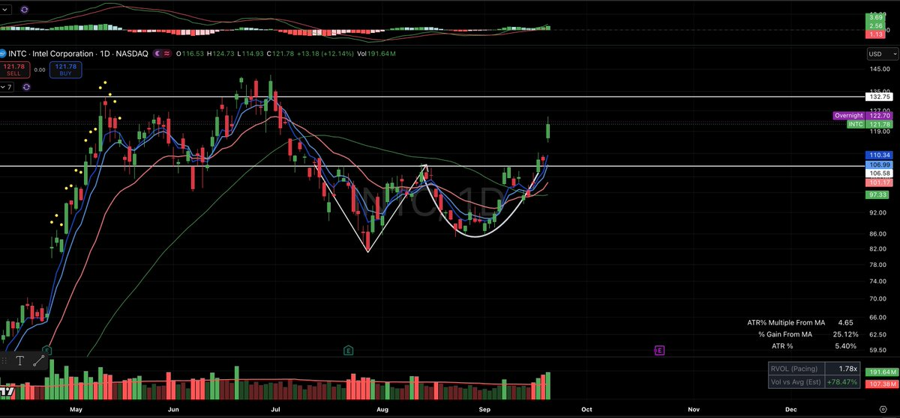
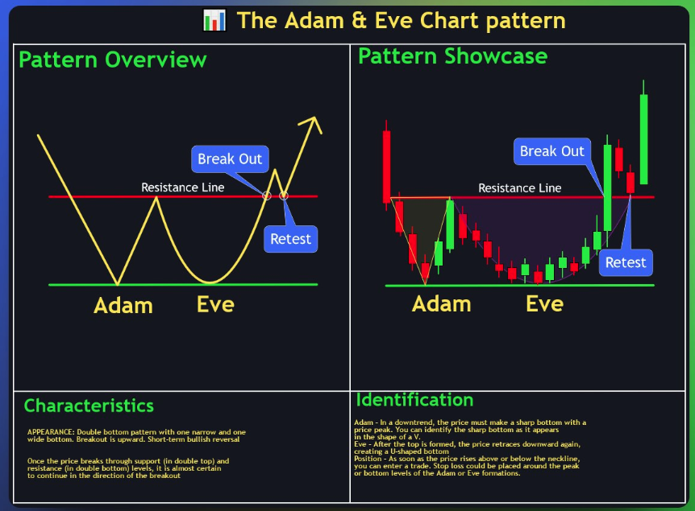

# Adam与Eve双底识别：INTC颈线突破、圆弧确认与假突破风险

## 原文信息

- 作者：TraderGoku（@tradergoku）。
- 原文：[Adam & Eve 反转形态讲解](https://x.com/tradergoku/status/2102219507129332019)。
- 发布时间：北京时间 2026-09-22 10:12。
- 引用前帖：[INTC 形态测试压力位](https://x.com/tradergoku/status/2100582559696461955)，北京时间 2026-09-17 21:48。
- 类型：技术形态 / 观察框架，不是完整策略回测。
- 归档：[正文、引用前帖与 8 条可见相关回复](sources/tradergoku-2102219507129332019-adam-eve-reversal/original.md)；[元数据](sources/tradergoku-2102219507129332019-adam-eve-reversal/meta.json)。共保存 5 张图：主帖 2 张、引用前帖 2 张、读者问询图 1 张。

## 主题

作者用 INTC 说明 Adam & Eve 双底：第一次下跌快速形成尖锐 V 底，反弹后再次回落，第二次筑底更慢、更圆，最后越过两底之间的反弹高点，即颈线，才按其定义确认形态。

这套观察区分了“候选双底”“第二个底形成”和“突破颈线”三个阶段。评论中的两次答复进一步强调：其他股票即使外观相似，也要先等圆弧底走出来。

## 形态结构与作者解释

| 阶段 | 图形条件 | 作者的解释 |
|---|---|---|
| Adam | 快速下跌后迅速反弹，形成较窄的 V 底 | 恐慌下杀后市场暂时砸不动 |
| 中间反弹 | 第一次低点之后反弹，形成两底之间的高点 | 此时还不能认定反转完成 |
| Eve | 第二次回落较慢，形成较宽的圆弧底，波动通常收敛 | 卖压逐渐耗尽 |
| 颈线突破 | 价格向上越过中间反弹高点对应的阻力区 | 作者据此确认形态 |

“砸不动”和“卖压耗尽”是作者对价格结构的解释。单凭 K 线无法直接观察所有参与者的卖出意愿，不能把这些表述当成订单流或筹码数据已经证实的事实。

## 配图与前帖如何对应

主帖使用 INTC 日线图，白色标注勾出先尖后圆的两个底，中间阻力水平大致在 **106—107 美元**区域。图中最新价格标签约 **121.78 美元**，已处在该水平上方；上方另画出约 **132.75 美元**的水平线。原文没有把这条高位线明确规定为止盈目标，不宜自行补成作者交易计划。

[9 月 17 日引用前帖的图](sources/tradergoku-2102219507129332019-adam-eve-reversal/assets/quoted-1.jpg)显示约 106.42 美元、接近中间压力位，与“测试压力位”的文字一致；[另一张截图](sources/tradergoku-2102219507129332019-adam-eve-reversal/assets/quoted-2.jpg)显示作者此前已分享过候选形态。它们提供先观察、后讲解的时间顺序，但没有给出真实下单、持仓成本或完整损益。

这里的价格全部是作者截图上的历史标签，并非归档日行情；截图最右侧 K 线也不应未经核对就认定为已收盘确认。

概念图画出突破阻力后回踩（Retest）再上涨。主帖文字将突破颈线作为确认，并未要求每次必须等回踩。回踩是图中展示的一条可能路径，不能把“会回踩、且回踩后必涨”补成保证。

概念图小字还包含突破后几乎肯定继续的强表述，并给出宽泛入场、止损说明；未附统计样本或来源。应把它作为作者所附教学图的一部分保留，而非已验证胜率。作者正文也没有给出完整的止损、仓位和目标参数。

## 评论区的关键补充

读者附上 Flex Ltd 日线图询问是否相似，作者答复“像，需要先把圆弧底走出来”。[该图](sources/tradergoku-2102219507129332019-adam-eve-reversal/assets/reply-2102462651045658935.jpg)仍在低位整理，说明这条回复是在讨论候选结构，而不是宣布已突破。

另一位读者提到 Rocket Lab，作者同样要求看到圆弧底形成。两条回复与主帖放在一起，可形成更完整的判断顺序：先形成第二个底，再观察是否突破颈线；不能把“像”直接转换成交易确认。

“等回调到 110 附近再入”是另一位读者的计划，不是作者给出的买点，本次可见回复没有作者认可该价位的记录。

## 风险与限制

1. **形态识别主观。** 原文没有定义 V 底多窄、圆弧多长、波动收敛多少、颈线如何画；不同观察者可能选择不同拐点。
2. **突破标准未明确。** 盘中越线、日线收盘越线、连续站稳或回踩成功并非相同条件，原文没有统一规则。
3. **假突破与失效。** 越过阻力后仍可能重新跌回区间，或圆弧底继续下破。确认形态不能消除亏损可能。
4. **追价改变交易质量。** 突破附近观察与价格已经远离颈线后买入，潜在回撤和退出距离不同；不能把同一形态标签视为相同入场条件。
5. **示例不等于优势。** 两张不同日期的截图没有证明策略长期正期望，缺少失败样本、交易成本和完整回测。
6. **附加指标非必要条件。** 截图含均线、成交量和其他指标，但作者未指定它们的阈值或组合规则，不能据图自行补写成多指标系统。

## 扩散分析 / 延展思路

以下为归档者延展。若要将图形观察转为可检验方法，可以事先固定时间周期、低点间隔、两底深度容差、颈线取值与突破条件，分别记录“形成中”“已突破”“回踩”“失效”的时点，禁止用后续走势重新挑选低点。

研究应比较突破进入与回踩进入各自的成交率、失败率、最大不利波动及成本，而不是只比较成功案例的涨幅。止损与仓位也应独立定义：形态名字本身不会自动给出能承受的风险。

## 一句话结论

Adam & Eve 的核心是“先尖底、后圆底、再破颈线”的分阶段识别，外观相似和突破出现都不能替代明确的失效规则与统计验证。
