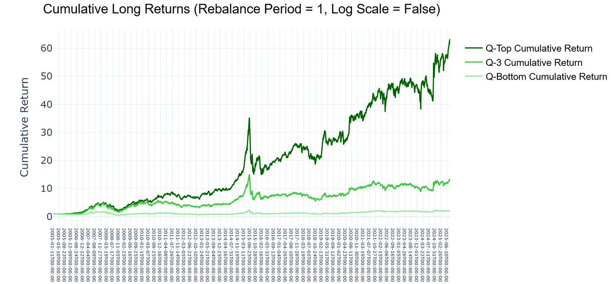
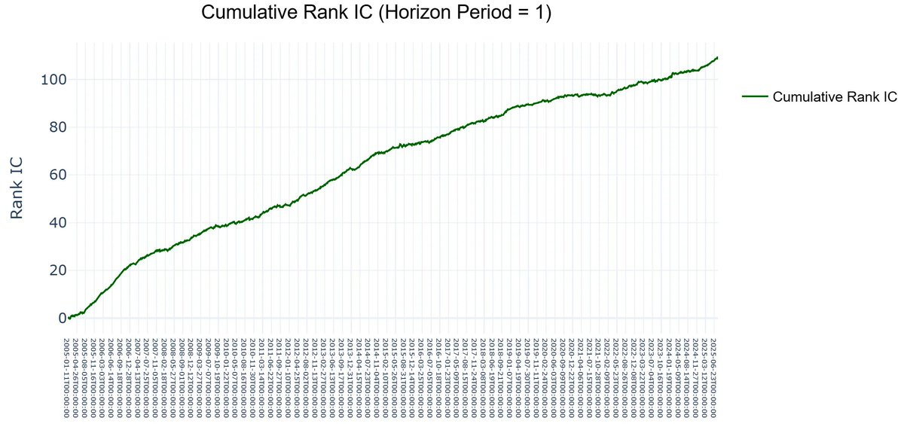

# Alpha13价量秩协方差：横截面排名、回测分层与复现边界

## 原文信息

- 作者：套利豪仔🗽（@pritipatelcut）；回复文本使用其另一账号称呼 @pritipatelfgoo，按同一返回线程保留。
- 原文：[价量协同失效反转因子测试](https://x.com/pritipatelcut/status/2099689112630653260)。
- 发布时间：北京时间 2026-09-15 10:37。
- 类型：量化因子 / 工具演示；不是完整交易系统。
- 外链：[AlphaPurify 代码库](https://github.com/eliasswu/AlphaPurify)。
- 归档：[正文、2 张图与 7 条可见相关回复](sources/pritipatelcut-2099689112630653260-alpha13-rank-covariance/original.md)；[元数据](sources/pritipatelcut-2099689112630653260-alpha13-rank-covariance/meta.json)；[公式核对记录](sources/pritipatelcut-2099689112630653260-alpha13-rank-covariance/verification.md)。

## 主题

作者把价格和成交量排名的短窗口协方差解释为“价量协同失效”，展示分组多头累计曲线与累计 Rank IC，并推荐用 AlphaPurify 快速测试。

评论指出它对应已有 Alpha #13。核对 Zura Kakushadze 的《101 Formulaic Alphas》后可确认：忽略原帖 `COVIANCE` 的拼写差异，表达式与附录 A.1 的 Alpha #13 一致；附录 A.2 将 `rank` 定义为横截面排名，协方差则沿时间窗口计算。[原论文](https://arxiv.org/pdf/1601.00991)

## 公式到底计算什么

原帖写法：

```text
-1 * RANK(COVIANCE(RANK(CLOSE), RANK(VOLUME), 5))
```

按原论文约定理解，可拆为：

1. 同一天，在资产池中分别对收盘价和成交量排序。
2. 对每个资产，计算最近 5 天这两条排名序列的协方差。
3. 当天再对各资产的协方差做横截面排序，然后乘以负一。

因此信号偏好的是**相对较低的价量排名协方差**。内外层 rank 的方向、并列值、缺失值及标准化方式仍须在实际实现中确认。

这不是直接计算价格涨跌与成交量增减的协方差，也不是把某只股票自己的五天收盘价做时间序列排名。正文给出的“涨价但不放量”等直觉只能作为作者解释，不能代替实际运算含义。负号也不等于已经定义好买卖规则：连续分数怎样转成分组、权重和多空组合，是后续步骤。

原帖拼成 `COVIANCE`，论文是 `covariance`；在代码中必须使用具体库支持的函数名，不能默认原式逐字复制即可运行。

## 两张图支持到哪一步



图一标题为 Cumulative Long Returns，Rebalance Period = 1，Log Scale = False。横轴约从 2005 年到 2025 年，Q-Top 曲线末端约在 60 以上，Q-3 和 Q-Bottom 明显更低。它展示的是三个分组的**多头累计表现**，没有展示一条明确的多空净值曲线。

纵轴仅写 Cumulative Return，截图没有标清比例、百分数或净值定义，因此不能直接宣布“赚了六十倍”。资产池、基准、分组总数、权重、手续费和成交条件也未写在图上；分层良好是研究线索，不等于独立超额收益已经确认。



图二为 Cumulative Rank IC，Horizon Period = 1，曲线末端超过 100。**累计值可以超过 1，单期相关系数不可以**；不能把末端数值读成单期 IC 或百分比收益。向上累计说明样本内的排名关系在汇总后偏正，但图中没有给出单期均值、波动、ICIR、显著性或分阶段衰减情况。

两图中的周期参数为 1，论文公式窗口为 5 天，但作者没有附数据频率与执行配置，不能直接把所有“1”都解释为同一交易日规则。

## 原文解释与实现之间的距离

“上涨放量、下跌缩量才正常”是作者使用的经验叙事，不是因子的数学前提。市场也会出现放量下跌和缩量上涨；公式衡量相对排名的共变，不能仅凭名称判断市场发生了结构性失衡。

收盘价绝对水平的横截面排序，还会受到复权、拆股和资产池选择影响。成交量单位、停牌处理、流动性过滤和历史成分也会改变排序。因此同一简短公式，在不同数据集与预处理中可能产生不同结果。

## 代码库提供什么，还缺什么

原帖外链是通用因子研究库。归档时 README 描述了预处理、IC 分析及分组多空回测功能，也要求输入带日期、标的、价格和因子的 DataFrame。其示例使用 `alpha_003`，不是本帖 Alpha #13 的完整复现脚本。[项目 README](https://github.com/eliasswu/AlphaPurify/blob/main/README.md)

“两行源代码跑完整回测”指的是框架调用可以简短，不等于数据获取、因子计算、交易时序和成本设定只需两行。库声称支持费用与滑点，也不能证明作者这两张图已启用它们。本次仅保存 README 快照，未安装或运行代码；归档日 main 分支也不能当作原帖使用版本。

## 评论区与风险限制

读者分别提出过拟合、此前测试无效、rank 是否是时间序列排名、是否已有论文等问题。作者对“以前发过、测试不行”的回复是“不一样的”，未提供参数或数据对照；可见回复也未解释本次实现的 rank。另一位读者指出 Alpha #13，公式出处可由论文核对，但其进一步声称必须结合大量股票和弱信号才能利用，并未提供本次因子的容量测算。

复现时仍缺以下关键证据：

- 使用哪一市场、哪一历史资产池，是否剔除退市或保留了幸存者。
- 复权、停牌、成交量单位、缺失值、去极值、中性化与排序方向。
- 收盘价和成交量何时可知、何时形成持仓；用当天最终数据按同一收盘价成交可能引入前视或不可成交假设。
- 分组权重、换手、买卖价差、冲击成本、融券条件与容量。
- 参数选择过程、样本外区间、基准和风格暴露。多头曲线增长可能包含市场或风格收益，不能单独归功于这个信号。

## 扩散分析 / 延展思路

以下为归档者延展。复核可先做逐日小样本计算，明确内层横截面 rank、五日协方差和外层 rank 的中间值，再与框架输出比较。随后用当日可得信息形成信号、在后续可成交时点执行，并同时报告多头、多空、基准和成本后结果。

对“协同失效反转”的解释也应单独检验：比较信号与短期反转、成交量、价格水平等暴露，观察控制这些因素后是否还有增量信息。对已有窗口做样本外检验，比不断换参数寻找更平滑的累计曲线更能回答它是否有用。

## 一句话结论

这条材料展示了已有 Alpha #13 的分层测试线索，但其价值取决于横截面与时间维度实现正确，并在明确数据、执行和成本后仍保留样本外优势。
