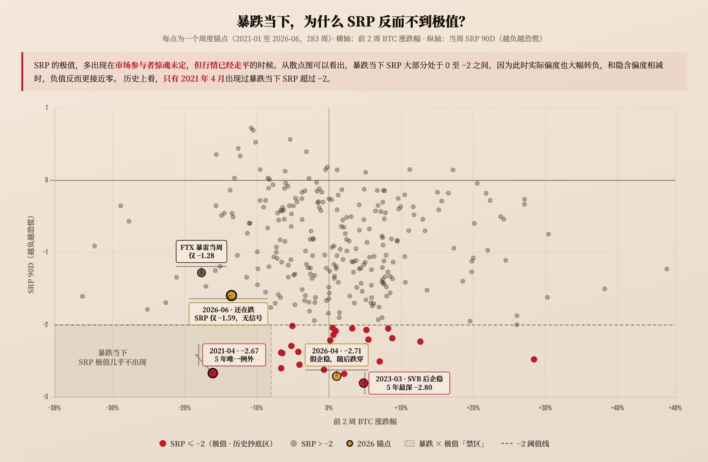
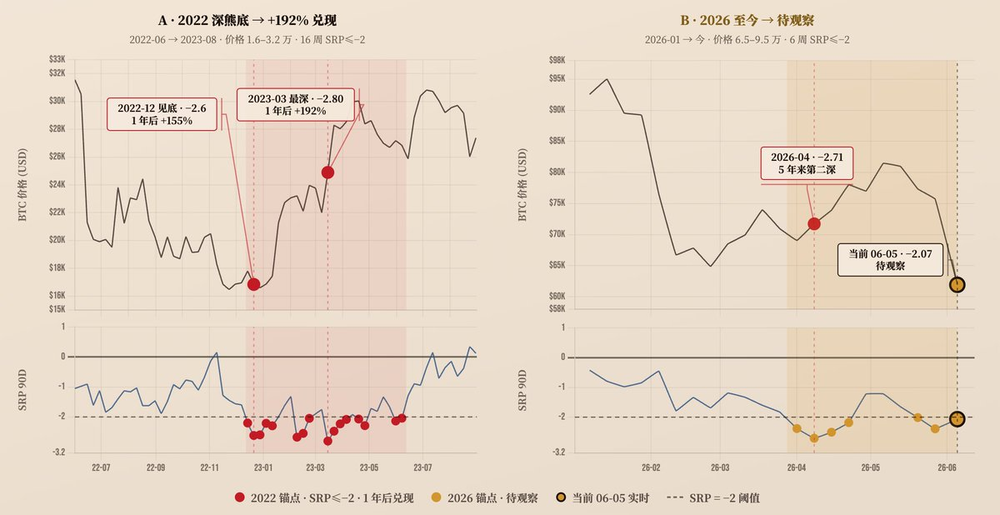
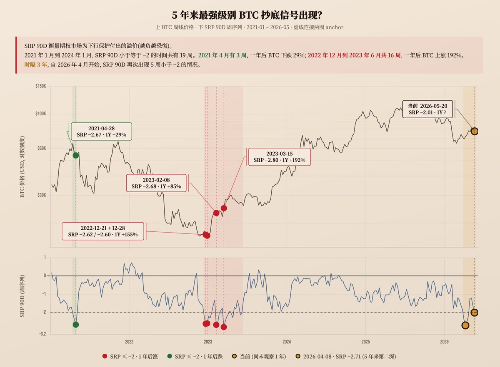

# BTC偏度溢价抄底信号为何失效：SRP极值、实际偏度与企稳确认

## 原文信息

- 作者：`@leifuchen`（leifu _/）
- 原文链接：`https://x.com/leifuchen/status/2063928356047843577?s=20`
- 被引用的上一篇：`https://x.com/leifuchen/status/2060260742926914042`
- 发布时间：`2026-06-08 18:17`
- 内容类型：`期权指标解释 + 抄底信号失效复盘`
- 是否有配图：本帖 2 张，上一篇 1 张，均已归档
- 原文归档：`sources/leifuchen-2063928356047843577-srp-bottom-signal-failure/`

## 原文附图

### 图 1：`SRP 90D` 与此前两周 BTC 涨跌幅



### 图 2：`2022-2023` 与 `2026` 的价格及 `SRP 90D` 对比



### 图 3：上一篇使用的五年 `SRP 90D` 历史图



## 主题

这篇是作者对上一篇“`SRP 90D` 出现五年来第二大负极值，可能是 BTC 抄底信号”的主动复盘。

上一篇的判断是：

- `2026-04-08`，`SRP 90D` 达到 `-2.71`；
- 这是过去五年第二大负极值；
- 期权市场对下行保护的需求已经接近 `FTX / SVB` 阶段；
- 极端恐慌可能对应现货中长期买点。

随后 BTC 确实反弹，但 `2026` 年 6 月初再次急跌，说明 4 月极值并没有确认最终底部。

作者这次修正的重点是：

**`SRP` 不是单纯的期权恐慌指数。它衡量的是隐含偏度和实际偏度的差，因此最极端的负值往往不是出现在暴跌当下，而是出现在期权市场仍然害怕、但实际行情已经企稳的时候。**

所以 `SRP` 更像“预期与现实之间的偏度差”，而不是一个看到极值就立刻抄底的机械信号。

## 核心机制

### 1. `SRP` 是隐含偏度减去实际偏度

作者使用的定义是：

```text
偏度溢价（SRP） = 隐含偏度 - 实际偏度
```

其中：

- 隐含偏度来自期权价格，反映市场对未来下跌尾部相对上涨尾部的定价；
- 实际偏度来自已经发生的价格序列，反映近期真实收益分布是否存在更大的下行尾部。

当投资者愿意为下行保护支付更高价格时，隐含偏度通常会更负。

但 `SRP` 取决于两个变量之间的差，而不只取决于隐含偏度。

### 2. 暴跌时实际偏度也会转负，反而压缩 `SRP`

这是本次复盘最关键的解释。

假设：

```text
隐含偏度 = -3
实际偏度 = -2
SRP = -3 - (-2) = -1
```

期权市场虽然很恐慌，但实际行情也已经出现猛烈下跌，两者相减后的差值反而不极端。

如果行情企稳，实际偏度回到 `0`，而期权市场仍然惊魂未定：

```text
隐含偏度 = -3
实际偏度 = 0
SRP = -3
```

此时才容易出现极端负 `SRP`。

所以作者观察到：

- 暴跌当下，`SRP` 常在 `0` 到 `-2` 之间；
- 2026 年 6 月急跌时，`SRP` 一度回到 `-2` 以上；
- `2023-03` 的历史极值 `-2.80`，反而出现在底部反弹和行情企稳阶段；
- `2026-04` 的 `-2.71` 也发生在一轮反弹过程中。

### 3. 极端负 `SRP` 需要“期权仍恐慌，价格已企稳”

作者对极值形成条件的修正可以写成：

```text
期权市场仍在高价购买下行保护
                    +
实际收益分布已经不再持续向下偏
                    =
隐含偏度与实际偏度出现巨大负差
```

这意味着 `SRP` 极值更像一种背离：

- 预期层：期权市场仍然悲观；
- 现实层：价格已经停止以同等强度下跌；
- 差值层：`SRP` 变得非常负。

从这个角度看，`SRP` 不是“恐慌有多大”，而是“恐慌定价比实际行情悲观多少”。

### 4. 4 月信号落空，不代表公式错误，而是企稳假设被破坏

2026 年 4 月的条件一度符合历史极值模式：

- 行情从低位反弹；
- 实际偏度修复；
- 期权市场仍然购买下行保护；
- `SRP 90D` 达到 `-2.71`。

当时可以合理推断市场可能已经进入“价格企稳、情绪滞后”的阶段。

但 6 月初的新一轮急跌说明：

- 4 月反弹只是阶段性企稳；
- 实际偏度再次转负；
- 原先的预期与现实背离被新的价格下跌破坏；
- “情绪底”没有自然等于“价格最终底”。

所以问题不在于 `SRP` 算错了，而在于把“阶段性企稳后的恐慌溢价”过度解释成了“最终底部确认”。

## 历史样本

### 1. 2021 年 4 月：极端值后继续大跌

上一篇统计：

- `2021-04-28` 起连续三周 `SRP <= -2`；
- 局部极值约为 `-2.67`；
- 随后经历 `519` 急跌；
- 一年后 BTC 回报约为 `-29%`。

这是最直接的反例：极端负 `SRP` 并不保证一年后正收益，也不保证附近就是底部。

### 2. 2022 年末至 2023 年中：持续极值对应熊市底部区域

作者统计：

- `2022-12` 至 `2023-06` 共有 `16` 周 `SRP <= -2`；
- `2023-03-15` 达到约 `-2.80`；
- 一年后 BTC 回报约为 `+192%`。

这个阶段支持 `SRP` 的中长期逆向价值，但需要注意：

- 信号持续了几个月；
- 不是单个点位触发；
- 极值期间仍经历 `SVB` 等冲击；
- 真正收益来自现货长期持有，而不是精准择日。

### 3. 2026 年 4 月：阶段反弹正确，最终底部尚未确认

作者统计：

- `2026-04-01` 至 `04-22` 连续四周出现极端负值；
- `04-08` 达到 `-2.71`；
- 随后出现明显反弹；
- 6 月初急跌打破了“已经最终企稳”的判断。

因此这次信号不能简单归类为完全无效。

更准确的说法是：

- 它识别到了阶段性反弹和恐慌定价差；
- 但没有能力确认中长期下跌已经结束。

## 图表应该如何解读

### 1. 图 1 解释的是极值形成环境，不是未来收益预测

图 1 的横轴是“此前两周 BTC 涨跌幅”，纵轴是当周 `SRP 90D`。

作者发现，过去五年 `SRP < -2` 时，此前两周 BTC 平均微涨约 `1%`。这支持他的机制解释：

**极端负 `SRP` 往往发生在行情已经停止急跌甚至略有反弹，但期权市场仍然悲观的时候。**

但要注意，横轴不是信号出现后的未来收益。

因此这张散点图不能单独证明：

- `SRP < -2` 后价格会继续上涨；
- 两周或一年后的期望收益为正；
- `-2` 是稳定有效的交易阈值。

它证明的是极值与近期价格状态的关系，而不是完整的预测力。

### 2. 图 2 更像案例对照，不是统计检验

图 2 把 `2022-2023` 和 `2026` 两段历史并列：

- 左侧最终兑现了约 `+192%` 的一年回报；
- 右侧仍处在待观察状态。

这种对照有助于理解路径，但样本只有少数几个周期，不能排除：

- 周期选择偏差；
- 阈值事后选择；
- 市场结构变化；
- 信号持续时间不同。

## 判断方法

### 1. 先判断是“正在暴跌”还是“价格企稳、期权仍恐慌”

观察 `SRP` 时，不能只看数值，还要拆开状态：

| 状态 | 隐含偏度 | 实际偏度 | `SRP` 特征 | 含义 |
| --- | --- | --- | --- | --- |
| 暴跌进行中 | 很负 | 同样很负 | 未必极端 | 恐慌与现实同步 |
| 初步企稳 | 仍很负 | 回升 | 容易极端负 | 预期落后于现实 |
| 情绪修复 | 回升 | 稳定 | 向零回归 | 恐慌溢价消退 |
| 再次急跌 | 很负 | 再次转负 | 可能反而回升 | 企稳假设失效 |

这张状态表比“低于 `-2` 就买”更接近作者本次修正后的逻辑。

### 2. 把极值理解成候选底部区域，而不是单点买入

历史样本显示，`SRP <= -2` 可能持续数周甚至数月。

所以更合适的用途是：

- 标记情绪与价格出现背离；
- 开始分批研究现货买点；
- 允许提高长期风险预算；
- 等待价格确认，而不是直接加满杠杆。

### 3. 区分交易周期

上一篇引用的研究关注的是一年累计回报，而本次图 1 使用的是此前两周价格变化。

因此必须先明确：

- 这是两周反弹信号；
- 还是一年期现货配置信号；
- 或者只是期权风险溢价状态指标。

不同周期不能混在一起解释。

## 风险与限制

### 1. BTC 只有五年左右可用期权样本

作者自己反复强调，BTC 期权数据很短。

五年内只有少数 `SRP <= -2` 阶段，而且大致只覆盖：

- 2021 牛市末段；
- 2022-2023 熊市底部；
- 2026 当前周期。

这不足以稳定估计命中率、平均回报或最佳阈值。

### 2. ETF 上市后 `SRP` 的均值可能已经下移

作者统计：

- ETF 上市前，`SRP` 大约 `12%` 的时间高于零；
- ETF 上市后，只有约 `2%` 的时间高于零。

这说明参与者结构和下行保护需求发生了变化。

如果分布整体下移，固定使用 `-2` 阈值可能产生结构性偏差。更稳妥的方法是观察：

- 滚动分位数；
- 当前周期均值和标准差；
- 不同到期期限的偏度曲线；
- ETF 期权与原生加密期权之间的差异。

### 3. 隐含偏度和实际偏度的估计方式会影响结果

不同的：

- 到期期限；
- 行权价范围；
- 插值方法；
- 实际偏度回看窗口；
- 数据清洗规则；

都可能改变 `SRP` 数值。

因此 `-2` 不是跨数据源、跨方法天然通用的绝对刻度。

### 4. 情绪底不等于价格底

极端下行保护需求只能说明市场很害怕。

如果新的基本面或流动性冲击继续出现：

- 实际偏度会再次恶化；
- 价格可以继续创新低；
- 期权恐慌也可能维持数月。

2021 年样本和 2026 年 6 月急跌都说明，单指标不能确认最终底部。

### 5. 原帖散点图没有提供前瞻回报检验

图 1 使用的是信号当周之前两周的收益，不是信号出现后的收益。

如果要检验交易价值，至少还需要比较：

- 信号后一周、一个月、三个月和一年收益；
- 最大不利变动；
- 与随机入场或其他恐慌指标的差异；
- 交易成本和持有期间回撤；
- 不同阈值与窗口是否存在数据挖掘。

## 扩散分析 / 延展思路

### 1. 把 `SRP` 拆成两阶段信号

可以把策略拆成：

**阶段一：恐慌形成**

- 隐含偏度显著转负；
- 实际偏度仍然很负；
- 市场处于急跌，不急于判断底部。

**阶段二：恐慌滞后**

- 隐含偏度仍然很负；
- 实际偏度回升；
- `SRP` 进入极端负值；
- 市场进入候选企稳区域。

这比只看 `SRP` 数值更容易解释，也更符合本次复盘。

### 2. 再增加价格确认层

即使进入阶段二，也可以等待：

- 价格不再创新低；
- 反弹突破前一轮局部高点；
- 实际波动率开始下降；
- 现货成交量和资金费率不再恶化。

这样会牺牲最低点，但能减少把阶段反弹误判成最终底部。

### 3. 用滚动分位数替代固定 `-2`

ETF 上市后分布可能下移，固定阈值未必稳定。

可改为：

- 当前 `SRP` 在过去一到两年的分位数；
- 当前值偏离滚动均值多少个标准差；
- 不同期限 `SRP` 是否同时极端；
- 极端状态持续了多少周。

这能降低市场结构变化造成的阈值失真。

### 4. 明确它更适合现货配置，不适合高杠杆抢反弹

上一篇引用的研究逻辑是中长期风险溢价，而不是分钟级择时。

因此更合理的表达方式是：

- 分批配置核心现货；
- 限制仓位；
- 接受信号后仍可能继续下跌；
- 用更长持有期等待风险溢价兑现。

如果拿它直接做高杠杆抄底，指标周期和仓位工具就会错配。

## 一句话结论

**`SRP` 极端负值真正表示的是“期权市场仍在为下跌付高价，但实际行情已经开始企稳”，它可以标记候选底部区域，却不能绕过价格确认、样本不足和市场结构变化去证明最终底部。**

