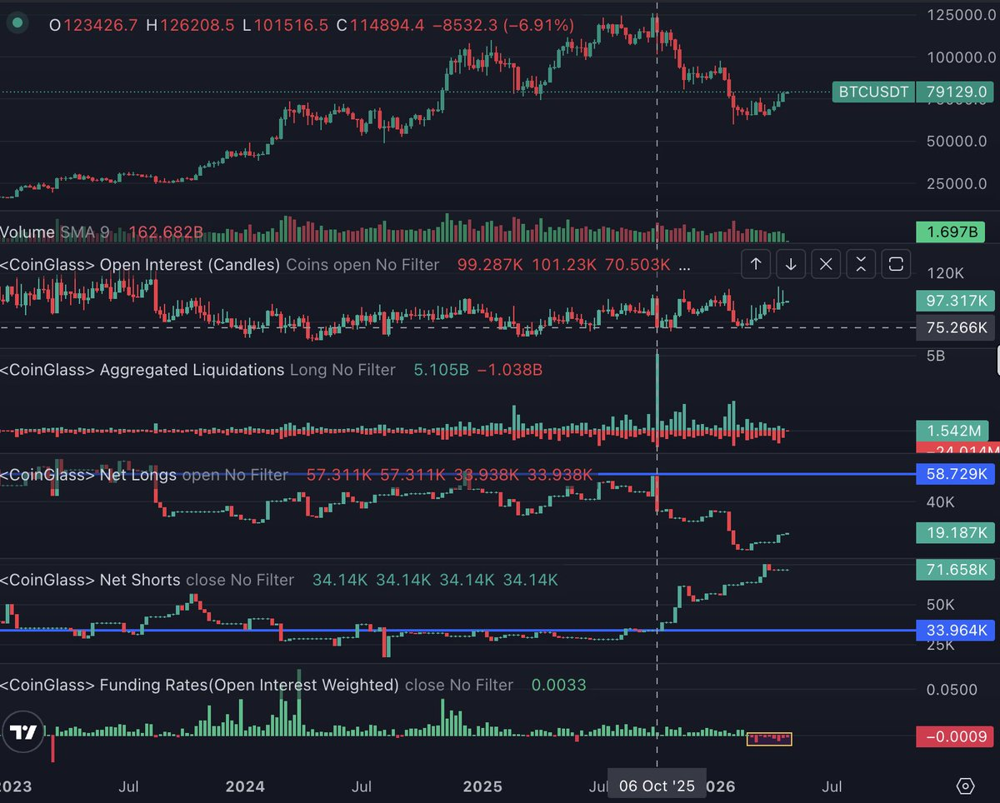

# BTC暴力反弹的衍生品驱动结构：OI、空头爆仓与历史级负费率

## 原文信息

- 作者：`@bc1qDave`（Dave.𝟎𝐱U）
- 原文链接：`https://x.com/bc1qdave/status/2048590979830292561`
- 发布时间：`2026-04-27 10:32`
- 内容类型：普通 `X` 推文 + 评论区作者补充
- 是否有配图：有，1 张图，已保存到 `sources/bc1qdave-2048590979830292561-btc-derivatives-rally/assets/`
- 原文归档：`sources/bc1qdave-2048590979830292561-btc-derivatives-rally/original.md`

## 原文附图

### 图 1

## 主题

这篇内容在讲：**这轮 BTC 从 6 万出头拉到 8 万的暴力反弹，作者认为更像是衍生品市场驱动的挤空与仓位清理，而不是现货基本面自然转强后的顺滑牛市。**

作者真正想表达的是：

- 价格上涨本身不等于趋势已经健康反转；
- 这波反弹里最异常的不是价格，而是 `OI`、爆仓分布和资金费率三件事同时偏向同一个方向；
- 空头在仓位和情绪上都变得拥挤，反而成了被持续清理的一侧；
- 但这并不自动等于牛市确认，因为熊市里的空头往往顽强，多头最终仍需要新的流动性承接；
- 真正值得盯的确认信号，不是这一波涨了多少，而是**负费率何时结束，并稳定翻回正值。**

所以这篇内容本质上不是“看多 BTC”的情绪帖，而是一篇**用衍生品持仓结构解释熊市反弹为何能走得这么凶、却又为什么还不能草率当成趋势反转**的市场结构判断。

## 作者的判断方法

### 1. 先把反弹问题改写成“谁在推动价格”

作者没有从宏观叙事或现货买盘讲起，而是先假设：

- 这波反弹未必是现货资金主动追价；
- 更可能是合约市场内部的仓位错配，迫使价格不断向上清算。

也就是说，他先问的不是“BTC 为什么值得涨”，而是“这一段价格上行的主发动机是谁”。

### 2. 用 `OI` 和净多空头变化识别仓位失衡

作者给出的第一组证据是：

- 自 `10/11` 之后，净多头明显下降；
- 净空头明显增加；
- `3` 月初以来，净多头又重新回升，而净空头在最近四周被压制；
- 美元本位合约持仓量重新抬到约 `90` 亿，接近去年 `11` 月的水平。

这套观察的含义是：

- 市场并不是简单减杠杆后轻装上涨；
- 反而像是在高持仓背景下，空头逐步变得拥挤，而新的多头又重新进入场内。

### 3. 再看爆仓方向，确认这不是 BTC 常见的“杀多行情”

作者认为第二组更关键的数据是爆仓结构：

- 近四周主爆空头；
- 而 BTC 历史上更常见的，是多头成为主要爆仓对象。

这一步很重要，因为它把“上涨”进一步细化成了“上涨过程中是谁在被动出清”。

如果反弹主要伴随空头持续被打掉，那么它就更接近：

- 空头拥挤后的清算式上行；
- 而不是市场自然进入一个大家都愿意追多的健康状态。

### 4. 用长期负费率把异常推到极致

作者认为第三个、也是最反常的证据，是资金费率：

- 自 `2026-03-02` 起，BTC 连续两个月保持负费率；
- 这意味着空头持续向多头支付费用；
- 更反常的是，这种负费率竟然发生在最近四周的持续上涨里。

作者把它定义为历史级异常：

- BTC 历史上从未出现过这么长时间的连续负费率；
- 本轮极值约 `-0.0065%`，也处在历史前列。

这说明问题不是“偶尔有人做空”，而是：

- 市场在价格上行时，空头仍然愿意持续付钱站在错误的一侧；
- 这是一种兼具仓位拥挤和情绪惯性的结构。

### 5. 把三个信号合并成“衍生品清扫不干净”的结论

作者把 `OI`、爆仓和费率合并后，得到一个核心判断：

- 合约市场没有完成干净出清；
- 空头没有被顺畅洗干净；
- 多头的新增仓位也没有真正找到长期均衡出口。

也就是说，这波反弹虽然凶，但更像是衍生品市场内部的清扫工程还没结束，而不是一个已经完成切换的顺趋势牛市。

### 6. 再区分“挤空反弹”和“下一轮趋势前兆”

作者没有把当前反弹直接升级成趋势反转，而是提出一个更严格的条件：

- 只有当资金费率转正；
- 且能够持续维持；
- 才更接近下一轮趋势真正展开的前兆。

这一步的意义在于：

- 价格可以被清算推动；
- 但持续趋势需要仓位结构和支付意愿一起翻转。

### 7. 最后用结构形态给出条件式价格判断

在衍生品信号之外，作者又补了一个技术结构判断：

- 这里形成了双底圆弧；
- 价格不排除去摸 `85,000`；
- 如果之后回落仍能在 `60,000` 一带获得放量支撑，那么本轮周期的底部区间可能比市场此前臆想的更高。

这里的关键不是点位本身，而是作者把它写成条件句：

- 不是“已经确认底部”；
- 而是“若回落后仍守住关键区间，再提高对更高底部的置信度”。

### 一句话总结判断方法

作者的判断链条是：**先用 `OI` 和净多空头变化识别空头拥挤，再用主爆空头的爆仓分布确认这波上涨带有明显清算特征，随后用历史级持续负费率证明空头在价格上行中仍长期付费站错边，最后把“资金费率转正并维持”设为真正趋势切换的确认条件。**

## 作者的应对策略

### 策略 1：不要把强反弹直接等同于健康牛市

作者最重要的隐含建议是：

- 看到价格强，不要立刻默认趋势已经顺滑翻多；
- 先看这波上涨是谁在出钱、谁在被动平仓。

如果上涨主要依赖挤空和清算，它的性质就和现货主导的趋势行情不同。

### 策略 2：密切盯住资金费率，而不是只盯价格

作者明确给出了他最重视的观察变量：

- 负费率何时结束；
- 翻正后能否持续。

因为在他的框架里，费率比价格更能说明：

- 多空哪一边在付钱坚持；
- 当前行情到底是短期清算，还是更长期的仓位翻转。

### 策略 3：对空头惯性保持警惕，不要在极端拥挤时继续机械追空

作者连续强调：

- 熊市里空头通常顽强；
- 但当前这轮空头已经开始承受集中打击；
- 当空头成了拥挤交易，它们本身就可能变成反弹燃料。

这条建议不是让你反手无脑看多，而是让你意识到：

- 顺着熊市惯性做空，并不总是低风险动作；
- 尤其当费率、爆仓和持仓结构都已经开始出现异常时。

### 策略 4：把 `85,000` 和 `60,000` 看成条件节点，不当成结论

作者给的价格判断是：

- 上方有机会摸 `85,000`；
- 下方若回落仍守住 `60,000` 并放量支撑，则要上修对周期底部的判断。

这更像一个条件式路径图，而不是直接给出方向性押注。

### 策略 5：保持耐心，等待空头惯性消失和多头情绪真正重燃

作者最后落在一句很朴素的话上：

- 等做空惯性消失；
- 等多头情绪重燃。

换成执行语言，就是：

- 不要急着抢结论；
- 让衍生品结构自己给出进一步确认。

## 关键补充

### 1. 主帖本身其实延续了作者更早对“极端负费率”的警惕

在主帖引用的更早一条推文里，作者已经说过：

- 历史上的极端负费率出现后，下跌往往不会走得很流畅；
- `2023-03` 那次最大负费率之后，下一周甚至涨了 `27%`。

但他当时也没有一口咬定反转确认，而是保留了“BTC 历来更擅长杀多，而不是专门为了爆空拉盘”的警惕。  
这说明这次主帖不是突然翻多，而是在把先前的异常信号继续往下验证。

### 2. 评论区里最有价值的质疑，是负费率未必只说明空头拥挤

有读者问：

- 会不会是 `ETF / MSTR` 这类现货集中买盘造成了基差扭曲；
- 从而使负费率并不完全等于空头太挤。

作者的回答是：

- 这种可能性存在；
- 但他认为合约面的异常证据更明显。

这条补充很重要，因为它说明作者的判断是：

- 偏向衍生品主导；
- 但不是排除其他解释的教条式定论。

### 3. 作者次日的情绪观察，可以看作仓位数据的软验证

作者第二天补充说，自己连刷几条推特，几乎全是继续看空和等崩盘的内容。

这不是硬数据，但它和主帖结论互相印证：

- 价格在涨；
- 但市场认知和仓位可能仍停留在空头惯性之中。

## 风险与限制

### 1. 这套框架更擅长解释结构，不擅长给出精确时点

`OI`、爆仓和费率可以说明：

- 这一段行情的主动力更像什么；
- 哪一边更拥挤；
- 哪些风险在累积。

但它们并不能精确告诉你：

- 反弹哪一天结束；
- 资金费率哪一个小时翻正；
- 市场会先冲高还是先回踩。

### 2. 负费率的成因不一定单一

评论区里的质疑是合理的：

- 负费率可能来自空头拥挤；
- 也可能部分来自现货集中买盘、基差交易或其他结构性资金流。

如果把所有异常都单线归因给“空头太多”，容易过度简化。

### 3. “历史首次”这类表述要默认带有样本和口径约束

作者说两个月持续负费率是历史首次，这个判断通常依赖：

- 具体数据源；
- 费率口径；
- 时间分辨率；
- 交易所覆盖范围。

方向上它很有参考价值，但不适合被当成完全无误差的绝对统计事实。

### 4. 熊市里的挤空反弹，最终仍可能演化成新多头接盘

作者自己就提醒：

- 净空头未必一定减少；
- 累积的净多头终归要找到流动性出口；
- 更可能的剧本，是吸引新多头入场接盘。

所以这篇文章不是单纯看多，而是提醒你：

- 反弹可以很强；
- 但强反弹本身并不能消灭熊市里的结构性卸货需求。

## 扩散分析 / 延展思路

### 1. 这篇文章最大的启发，是“先分清是现货驱动还是衍生品驱动”

以后再看大涨大跌时，可以先问：

- `OI` 是上升还是下降；
- 爆仓主要打哪一边；
- 资金费率和价格方向是否一致；
- 基差是扩张还是收敛。

这比只盯 K 线更能看出行情在靠谁推进。

### 2. 对 BTC 这种主流资产，费率往往比小币更有解释力

因为 BTC 的流动性和参与者更复杂，单一操纵难度更高，所以：

- 持续极端负费率；
- 且伴随上涨；

这种组合本身就更值得重视。  
如果换到小币，同样的费率异常可能更容易被个别资金或交易所机制扭曲。

### 3. 更实用的迁移方法，是把它做成“拥挤交易识别框架”

这条推文可以抽象成一套更通用的模板：

- 价格在涨；
- 主爆空头；
- 费率仍负；
- 社交情绪仍偏空。

当这四件事同时发生时，说明你面对的可能不是简单上涨，而是一场拥挤仓位的逆向清理。

### 4. 更保守的版本，不是提前押趋势，而是等费率翻正再提高仓位

如果不想赌结构推演的中间过程，一个更保守的做法就是沿用作者的框架：

- 先承认这里存在异常挤空结构；
- 但把真正的加仓或趋势确认，留给费率翻正并稳定之后。

这样会错过一部分前段利润，但逻辑上更一致。

## 一句话结论

这篇内容的核心不是“BTC 为什么涨”，而是：当 `OI` 抬升、空头持续被爆、价格上行中费率却仍深度为负时，这轮反弹更像是衍生品市场在清理拥挤空头，而不是一个已经完成确认的健康牛市；真正值得等的，不是更高的价格本身，而是费率何时稳定翻正。
