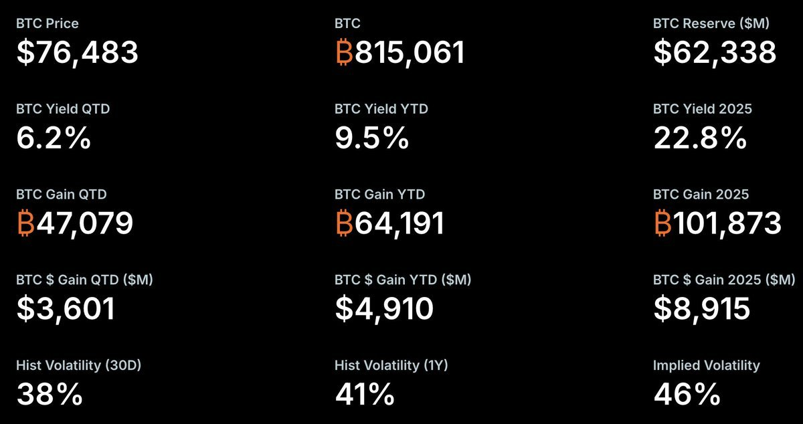

# BTC熊市别只看币价：MSTR融资机器、成本线与保护性Put策略

## 原文信息

- 作者：`@Maxandzero`（马克斯Max）
- 原文链接：`https://x.com/Maxandzero/status/2046940784902164845`
- 发布时间：`2026-04-22 21:14`
- 内容类型：普通 X 推文
- 是否有配图：有，1 张图，已保存到 `sources/maxandzero-2046940784902164845-mstr-financing-btc-rebound/assets/`
- 原文归档：`sources/maxandzero-2046940784902164845-mstr-financing-btc-rebound/original.md`

## 原文附图

### 图 1

## 主题

这篇内容在讲：**当前判断 BTC 熊市节奏，不能只盯币价本身，更应该盯 `MSTR / Strategy` 这台融资买币机器能否继续顺畅运转，因为它正在改变熊市下跌和反弹的路径。**

作者真正想表达的是：

- `SPY` 与 `MSTR / IBIT` 的期权结构出现了明显分化；
- 宏观资金还在给美股买保护，但加密相关代理资产却更偏向 call 交易和上行押注；
- 只要 `BTC` 稳定站在 `Strategy` 的平均持仓成本线之上，这套融资买币叙事就能延续；
- 这会让熊市本身没有结束，但让真正底部确认之前，先出现一段由轧空和融资扩张推动的强反弹；
- 对交易者而言，更好的姿势不是盲目看空或追涨，而是等待 `IV` 回落后用分批、定额 `put` 做保护。

这条内容本质上是一个**结构观察框架**：

- `BTC` 现货价格只是表象；
- `MSTR` 的融资能力、股息成本、ATM 发股空间、期权仓位结构，才是当前影响熊市节奏的重要变量。

## 作者的判断方法

### 1. 先看期权分化：宏观在买保护，加密代理在追上行

作者一上来就拿三组期权数据做对照：

- `SPY 30D IV = 15.75%`
- `SPY put/call 成交量比 = 1.54`
- `SPY put/call 未平仓比 = 2.11`

与之相对：

- `MSTR 30D IV = 68.99%`
- `MSTR put/call 成交量比 = 0.41`
- `MSTR put/call 未平仓比 = 0.85`

以及：

- `IBIT` 的 put/call 成交量比和未平仓比更低，分别约 `0.26` 和 `0.65`

作者从这组数据读出的不是简单“看涨”或“看跌”，而是：

- 宏观资金还在对股票组合买保险；
- 但 BTC 相关代理资产上，市场仓位却更偏向 call、偏向继续反弹；
- 这说明资金对宏观风险和对加密交易机会的定价，已经出现了不同步。

也就是说，**宏观没有进入安心状态，但加密链条里已经有人在押一个结构性反弹。**

### 2. 再用 MSTR 的平均持仓成本线做融资叙事的锚点

作者给出的关键锚点是：

- 截至 `2026 年 4 月 20 日`
- `Strategy` 持有约 `81.5 万枚 BTC`
- 总成本约 `615.59 亿美元`
- 平均成本约 `75,527 美元 / 枚`

而当时 `BTC` 价格大约在 `77,000 美元` 附近，略高于成本线。

作者真正关心的不是“成本线本身有多神”，而是：

**只要 BTC 没重新跌破这条平均成本线，Strategy 就更容易继续融资、继续买币、继续讲“每股 BTC 增厚”和 `BTC Yield` 的故事。**

也就是说，这条线不是技术分析意义上的支撑，而是：

- 融资叙事是否还成立；
- 市场是否愿意继续给 MSTR 更高估值和融资通道；
- 机构是否还能用“持续增持 BTC”讲故事的心理锚。

### 3. 再看融资机器本身：熊市里它并没有停

作者回顾了 `2025` 年的一些融资数据：

- `MSTR / Strategy` 已融资约 `253 亿美元`
- `STRC` 规模从 `34 亿` 快速扩到 `63.6 亿美元`
- 当前股息率约 `11.5%`
- `2026 年 3 月` 又新增了 `420 亿美元 ATM` 额度

这说明一个关键事实：

**它并没有等底部确认后再出手，而是在熊市或偏弱阶段也逆势融资、逆势买币。**

所以这家公司的存在，本身就在改变 BTC 的传统熊市节奏：

- 原来熊市更像被动去杠杆、等出清；
- 现在多了一台会在价格没有彻底企稳前，持续尝试融资接盘的机器。

### 4. 但融资成本会被波动率“机械化”抬高

作者没有把 MSTR 当成永动机。

他明确指出，风险也藏在融资结构本身里。一个例子是 `STRC` 的分红调整机制：

- 如果参考价低于 `95 美元`
- 下一期股息至少上调 `50bp`

作者借这个机制想说明：

**只要宏观波动放大，MSTR 的边际融资成本就会上升。**

这意味着融资机器并不是只由 BTC 决定，而是会受到：

- 股票自身波动；
- 宏观风险偏好；
- 资本市场对高股息、高波动工具的承接能力；
- 股价与参考价位置

的共同影响。

换句话说，熊市并没有结束，只是它被“机构化”和“融资化”之后，下跌路径不再那么线性。

### 5. 由此推出一个更细的结论：熊市未完，但底部前可能先有强反弹

这是全文的核心落点。

作者认为：

- 熊市本身还没有结束；
- 但因为 `Strategy` 这台融资机器仍可能继续运作；
- BTC 在真正底部确认之前，很可能先出现一波交易性的、由轧空推动的强反弹。

也就是说，作者不是在说“熊市提前结束了”，而是在说：

**底部确认和交易性反弹，可能被拆成两个阶段。**

先有：

- 结构性融资接力
- 空头回补
- 情绪改善
- 期权仓位向上拥挤

再决定后面能不能进入真正的趋势反转。

### 6. 最后把交易判断落到几个可观察条件上

作者给了五个条件，作为这类强反弹可能出现的观察点：

1. `SPY` 止跌企稳；
2. `VIX` 不再继续抬升；
3. `ETF` 重回净流入；
4. `MSTR call OI` 持续扩张；
5. `BTC` 稳定站在 `Strategy` 成本线之上。

这五个条件实际上对应五个不同层面的确认：

- 宏观风险停止恶化；
- 波动率不再加速抬升；
- 现货资金重新回流；
- 杠杆 / 期权端开始追上行；
- 融资叙事没有被现货跌破。

这是一个非常典型的多层确认框架，而不是只看一根 K 线。

### 一句话总结判断方法

作者的判断链条是：**先用 SPY 与 MSTR / IBIT 的期权结构分化识别资金定价差异，再用 Strategy 的平均持仓成本线判断融资叙事能否延续，随后观察融资成本是否被波动率抬升，最终把 BTC 的反弹机会理解为“熊市未完，但融资机器仍可能先制造一段轧空式强反弹”。**

## 作者的应对策略

### 策略 1：判断 BTC 节奏时，不要只看币价本身

作者最直接的策略建议，就是把观察对象从 `BTC` 本身切换到更上游的结构变量：

- `MSTR` 融资是否顺畅；
- `BTC` 是否还站在 `Strategy` 成本线之上；
- `MSTR / IBIT` 的 call 仓位是否继续累积；
- `SPY / VIX` 是否停止恶化；
- `ETF` 流向是否重新转正。

也就是说，现货价格本身只是结果，不是最领先的信号。

### 策略 2：不要把这轮反弹误读成熊市结束

作者非常克制，他没有说“反转确认”，而是明确说：

- 熊市本身还没结束；
- 只是节奏被机构化改变；
- 真正底部前可能先有强反弹。

这意味着实战上更合理的姿势是：

- 把它当作交易性机会，而不是长期牛市确认；
- 做多可以更战术化；
- 风险管理仍然要以“熊市框架”去做，而不是全面改成追牛市。

### 策略 3：如果后续 IV 回落，分批、定额买 Put 做保护

作者最后的执行建议很明确：

- 如果后面 `IV` 回落；
- 那么分批、定额配置 `put`，会变得性价比很高；
- 既能提供组合保护，也能在高波动环境下创造超额收益。

这背后的逻辑是：

- 当前高 `IV` 下直接买保护偏贵；
- 但如果反弹先走出来，波动率回落；
- 此时去买保护，赔率会更好；
- 一旦后续熊市重新发力，保护性 Put 会重新变成高凸性的仓位。

这比“现在立刻重仓买 Put”要更讲时机。

## 关键补充

### 1. 相关上下文进一步强化了“熊市中的反弹”这个定位

抓取结果里还带出作者当天稍早的一条相关引文，里面引用了 `JackYi` 的看法：

- 当前更像熊市中的反弹；
- 相对美股和微策略的强势，币圈反弹仍偏弱；
- 微策略融资买币短期有效，中期可能有风险；
- 尤其要警惕宏观金融风险时刻。

这和主帖是一致的：

- 作者不是在写“宏大反转”；
- 而是在写“结构性反弹 + 中期风险未解”。

### 2. 评论区最值得保留的一句：资金机器本身就是 alpha

虽然这条下面没有展开太多技术讨论，但有一条评论点出了很关键的事：

**资金来源和融资能力，本身就是这一轮 BTC 交易结构的一部分。**

这和作者整条的核心高度一致：

- 真正影响节奏的，不只是底层资产；
- 还包括谁能持续融资、谁能持续接盘、谁能在高波动中继续讲故事。

## 风险与限制

### 1. 期权偏度只是快照，变化可能非常快

作者引用的 `put/call` 比、`IV` 和 `OI` 都是当前时点快照。

这类数据的问题是：

- 变化很快；
- 会被短期交易和单日仓位调整影响；
- 不一定都代表长期看法；
- 某些低 put/call 比也可能只是 call 投机很旺，而非真正看空保护消失。

所以它更适合做结构提示，而不是单独当作方向判决器。

### 2. 平均成本线不是硬支撑，更不是清算线

`75,527` 美元 / 枚这个数字，只是截至 `2026 年 4 月 20 日` 的平均持仓成本。

它不代表：

- BTC 跌破就一定出问题；
- 站稳就一定安全；
- 这是某种机械止损线；
- 或者这是全市场都会承认的技术支撑。

它更像融资叙事和市场心理的锚。

### 3. MSTR 融资机器是否运转，取决于的变量比 BTC 更多

即便 BTC 价格站在成本线之上，融资机器也未必一定顺畅。

还要看：

- `MSTR` 股价相对 BTC 资产净值的溢价是否还在；
- 资本市场是否愿意继续承接增发和高股息工具；
- `STRC` 这类工具的成本是否继续抬高；
- 宏观流动性是否恶化；
- 股票和信用市场是否进入更深压力区。

所以“看 MSTR 融资机器”这件事，本身也是多变量问题。

### 4. IV 回落后买 Put 也不是无脑正解

作者最后给的是方向性建议，但具体执行仍有很多难点：

- 什么时候算 `IV` 真的回落到合理水平；
- 选多远的期限；
- 选多深的虚值；
- 是买裸 Put、Put spread，还是别的保护结构；
- 如果反弹继续拖很久，时间价值会持续流失。

所以这更像一个方向框架，而不是已经细化好的交易手册。

### 5. “机构化改变熊市节奏”不等于“机构化消灭熊市”

这是作者最克制也最容易被误读的一点。

融资接力可以延后出清、制造反弹、改变路径，但并不天然消灭周期和风险。

如果宏观和融资环境一起恶化，MSTR 本身也可能从支撑器变成放大器。

## 扩散分析 / 延展思路

### 1. 这其实是在用“影子资产负债表”研究 BTC，而不是只研究币价

作者这条很有启发性的一点是：

它把 BTC 的周期研究，从“币圈内部筹码”扩展到了“谁在资本市场上替 BTC 扩张资产负债表”。

这意味着未来研究 BTC，除了看链上、ETF 和期货外，还可以看：

- `MSTR` 的增发和可转债能力；
- 高股息优先股工具是否还能扩张；
- 股票市场是否愿意继续给这类 BTC proxy 高溢价；
- 其他上市 BTC treasury 公司会不会复制这套路径。

### 2. MSTR 可能在某些阶段更像 BTC 的“信用乘数”

如果把框架再往前推一步，可以把 `MSTR` 看成一个把 BTC 转换成融资故事的信用乘数：

- BTC 站在成本线之上，叙事继续；
- 叙事继续，融资继续；
- 融资继续，继续买币；
- 继续买币，强化现货支撑和情绪；
- 情绪改善，又反过来支持股权和期权市场。

这是一种很强的反身性结构。

它的正面是可以制造强反弹，它的反面是一旦反身性翻转，下行也可能被放大。

### 3. 这套框架可以迁移到其他高杠杆 BTC 代理资产

虽然作者重点写的是 `MSTR`，但方法可以外推：

- 看矿企；
- 看高杠杆 BTC Treasury 公司；
- 看现货 ETF 流入和期权仓位；
- 看谁有持续再融资能力、谁只是被动暴露。

这样就能把 BTC 市场拆成：

- 直接现货持有者；
- 被动 ETF 资金；
- 主动融资买币的代理资产；
- 高波动高 beta 的信用化持币平台。

### 4. 更保守的执行版本，不是追反弹，而是等 IV 回落后做组合保护

如果觉得“先抓反弹”太难，一个更保守的版本其实就是作者最后提到的那一步：

- 允许市场先弹；
- 等波动率回落；
- 再慢慢买保护。

这适合：

- 本身有现货或多头敞口的人；
- 不想在高 IV 时硬买保险；
- 但也不想放弃后续熊市再下杀时的凸性收益。

### 5. 真正值得持续跟踪的，是融资成本曲线而不是单个价格点

如果把这条思路系统化，后续最值得研究的可能不是“成本线本身”，而是：

- `STRC` 的股息 / 收益率变化；
- `ATM` 使用进度；
- `MSTR` 股价对 BTC 净值的溢价；
- 期权 skew 与 call OI 的变化；
- ETF 流向和宏观波动的联动。

这样会比单纯盯住 `75,527` 这个点位更有信息量。

## 一句话结论

作者真正的观点不是“BTC 熊市结束了”，而是：只要 `Strategy / MSTR` 这台融资买币机器还没熄火，BTC 就可能在真正底部确认前先走出一段由融资扩张和轧空推动的强反弹；而更稳的做法，是等 `IV` 回落后用分批、定额 `put` 把保护重新买回来。
