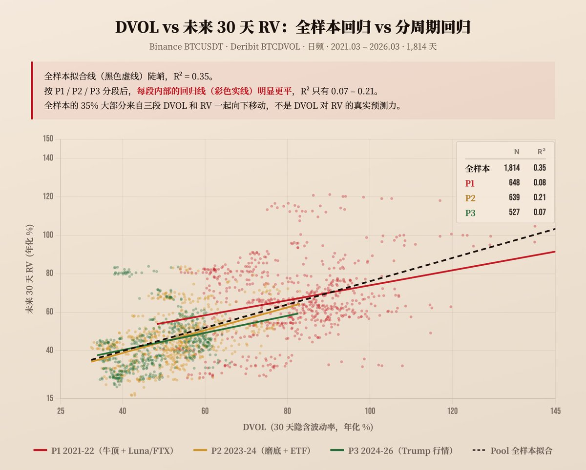

# DVOL预测BTC实际波动率：全样本有效、分周期失灵与VRP压缩

## 原文信息

- 作者：`@leifuchen`（leifu _/）
- 原文链接：`https://x.com/leifuchen/status/2044072902715224396`
- 发布时间：`2026-04-14 23:18`
- 内容类型：普通 X 推文 + 评论区作者补充
- 是否有配图：有，1 张图，已保存到 `sources/leifuchen-2044072902715224396-dvol-rv-vrp/assets/`
- 原文归档：`sources/leifuchen-2044072902715224396-dvol-rv-vrp/original.md`

## 原文附图

### 图 1

## 主题

这篇内容在讲：**DVOL 作为 BTC 30 天隐含波动率指数，看起来对未来 30 天实际波动率有不错的全样本预测力，但这种预测力很大程度上是跨市场周期均值变化造成的聚合假象；真正更稳定存在的，是 DVOL 系统性高于后续 RV 所体现出来的 VRP。**

作者真正想表达的不是“DVOL 没用”，也不是“卖波动率已经失效”，而是：

- 如果只看全样本回归，DVOL 对未来 RV 的解释力很强；
- 但拆开不同市场周期后，这种解释力显著衰减；
- 说明 DVOL 对周期内短中期 RV 的方向预测，其实没有全样本结果看上去那么可靠；
- 不过 DVOL 仍然包含比“过去 30 天 RV”更强的信息量；
- 更重要的是，DVOL 长期高于后续 RV 的 VRP 仍为正，只是这个溢价在持续压缩。

评论区里作者又补了两个有交易含义的点：第一，像高盛这类收益增强型 BTC ETF 可能让卖波动率赛道更拥挤；第二，VRP 压缩到 `3-5` 波动率点附近时，可能已经接近成熟市场水平。

## 作者的判断方法

### 1. 先做全样本比较：DVOL vs 历史 RV 基准

作者先拿最直观的问题开刀：

**DVOL 能不能预测未来 30 天 RV？**

他用 `2021-03` 到 `2026-03` 共 `1,814` 天日线数据，比较两种简单预测器：

- `DVOL` 预测未来 30 天 `RV`
- “过去 30 天 `RV`”预测未来 30 天 `RV`

结果是：

- `DVOL -> 未来 30 天 RV` 的 `R² = 0.35`
- `过去 30 天 RV -> 未来 30 天 RV` 的 `R² = 0.15`

这一步先说明一件事：

**如果只拿一个单变量去做粗预测，DVOL 明显比纯历史波动率外推更有信息量。**

### 2. 再提醒统计陷阱：30 天前瞻窗口高度重叠

作者没有把 `R² = 0.35` 直接当成结论，而是先加了一个方法论警告：

- 日频数据下，未来 30 天窗口和前一天的未来 30 天窗口有 `29` 天重叠；
- 因此所有 `R²` 的统计显著性都会被高估；
- 文中数字更适合看结构差异，不适合过度解读显著性。

这一步很重要，因为它说明作者知道：

**这个测试更像结构识别，而不是严格的可交易 alpha 显著性证明。**

### 3. 再按市场周期拆分：看全样本效果是不是稳定

作者随后把样本拆成三个阶段分别回归：

- `2021-03` 至 `2022-12`：牛顶 + 暴雷，`R² = 0.08`
- `2023-01` 至 `2024-09`：熊市磨底 + ETF 通过，`R² = 0.21`
- `2024-10` 至 `2026-04`：Trump 行情，`R² = 0.07`

这一步是全文最关键的检验。

因为一旦拆周期，DVOL 的解释力就从全样本的 `0.35` 大幅掉到 `0.07-0.21`。当前周期甚至只剩 `0.07`。

作者由此得出的判断不是“DVOL 完全没用”，而是：

**DVOL 的全样本预测力并不稳健，尤其不能简单外推为‘当前市场里 DVOL 很能预测未来 RV’。**

### 4. 最后找原因：Simpson 聚合效应

作者进一步解释为什么会这样。

他观察到，不同市场周期里：

- `DVOL` 均值从 `81` 降到 `48`
- `RV` 均值从 `67` 降到 `44`

两者在不同周期之间是同向下移的。

于是全样本回归里，“DVOL 高对应 RV 高”的关系，很大程度上不是来自每个周期内部的强预测，而是来自周期间均值整体一起往下挪。

这就是他点名的 `Simpson 聚合效应`：

- 合起来看，关系显著；
- 分开看，关系大幅衰减。

也就是说：

**全样本的高 R²，混入了很强的 regime shift 信息，而不只是 DVOL 对未来 RV 的细粒度预测能力。**

### 5. 额外看一个更稳定的性质：VRP 始终为正

在否定“DVOL 精准预测未来 RV”之后，作者并没有停在否定，而是转向另一个更有交易意义的量：

`VRP = DVOL - 后续 RV`

他发现：

- 全样本 VRP 均值为 `+8.8` 波动率点；
- 各周期内部也都为正：
  - `2021-03` 至 `2022-12`：`+14.7`
  - `2023-01` 至 `2024-09`：`+6.5`
  - `2024-10` 至 `2026-04`：`+4.4`

这一步意味着：

**DVOL 可能不擅长精确预测未来 RV 的高低，但它长期高估后续实现波动这个现象仍然存在。**

也就是卖方在为承担波动风险持续收取溢价。

### 一句话总结判断方法

作者的判断链条是：**先比较 DVOL 和历史 RV 基准的全样本预测效果，再按市场周期拆分回归，识别 Simpson 聚合效应，最后把关注点从“DVOL 能不能精确预测 RV”转移到“VRP 是否稳定为正、是否持续压缩”。**

## 作者的应对策略

### 策略 1：不要把 DVOL 当成当前周期内的强预测器

作者用分周期回归说明，DVOL 在单个市场阶段里对未来 30 天 RV 的解释力并不强，当前周期尤其弱。

所以实战上更合理的用法不是：

- 看到 `DVOL` 高就断言未来 `RV` 一定高；
- 看到 `DVOL` 低就断言未来 `RV` 一定低。

而应该理解成：

**DVOL 有信息量，但不足以单独支撑方向性或波动率水平预测。**

### 策略 2：把 DVOL 作为相对基准，而不是终局信号

作者指出，哪怕拆周期后 DVOL 的 `R²` 变弱，它仍然显著好于“过去 30 天 RV”这种极弱基准。

这意味着 DVOL 更适合做：

- 波动率框架里的输入变量；
- 结合 regime、期限结构、偏度、宏观事件来判断；
- 而不是单独当作是否买卖波动率的开关。

### 策略 3：真正更稳的交易含义在 VRP，而不在 RV 点预测

作者最明确的策略结论是：

- 卖出波动率仍然是正期望策略；
- 但“印钞机”时代快结束了。

这里的逻辑是：

- VRP 仍为正，说明卖方依然在拿风险补偿；
- 但这个补偿从 `14.7` 压到 `4.4`，越来越薄；
- 因此卖波策略未必失效，但边际赔率明显下降。

### 策略 4：把市场成熟和机构拥挤纳入卖波框架

评论区里提到高盛拟推“比特币溢价收益 ETF”，作者认同这说明赛道更拥挤。

这条补充把主帖的研究结论落到执行层：

**不是只有统计上看到 VRP 压缩，产品供给和机构参与本身也会继续压缩卖波溢价。**

也就是说，卖波动率不再只是“发现便宜保险并卖出”，而是在和越来越多机构资金竞争这份保险费。

### 策略 5：接受 VRP 可能向成熟市场底部收敛

作者在回复中进一步说，`3-5` 波动率点差不多就是底了，和成熟市场类似。

这意味着他的隐含判断是：

- 未来未必还有很高的波动率风险溢价可收；
- 卖波收益可能更像成熟市场里的薄利生意；
- 要靠更精细的择时、仓位和结构设计，而不是吃大水漫灌式的风险补偿。

## 关键补充

### 1. 高盛的收益增强型 ETF 代表卖波赛道拥挤化

如果只看主帖，会知道 VRP 在压缩，但不一定知道这种压缩的现实驱动力。

评论区里 `CryptoRounder` 提到高盛申请推出“比特币溢价收益 ETF”，作者随后补充，这类基金目标是获取当前收益，同时保留比特币上涨资本增值，可能通过卖出看涨期权等收益增强结构实现。

这等于把主帖里的统计结论翻译成市场现实：

- 更多机构开始包装并分发卖波 / covered call 类产品；
- 卖方供给变多；
- VRP 被进一步压缩是很自然的结果。

### 2. VRP 的长期底部可能在 3-5

另一条评论区补充更偏长期判断。

当有人说 BTC 被机构接受后，波动率必然会下降，但卖波交易仍能做时，作者回应：

**3-5 差不多就是底了，跟成熟市场差不多。**

这句话的价值在于，它给 VRP 压缩提供了一个更长期的参照区间。

也就是说，作者并不是说 VRP 会归零，而是认为：

- 卖波溢价可能仍存在；
- 但会向成熟市场那种更薄、更稳定的风险补偿水平收敛。

## 风险与限制

### 1. 30 天滚动窗口重叠会抬高统计显著性

这是作者自己已经提醒过的问题。

因为未来 30 天 RV 序列高度重叠，回归结果不适合被当成严格独立样本上的高置信度证据。结构上可以参考，统计上不能过度包装。

### 2. 市场周期划分本身带有事后解释色彩

把 `2021-03` 到 `2026-04` 划成三个阶段是合理的，但本质上仍是事后划分。

如果未来实时交易时无法提前识别 regime 切换，那么“分周期回归更弱”这个结论在交易上还需要进一步转化成可实时检测的 regime 识别方法。

### 3. DVOL 来自 Deribit，不等于全市场隐含波动率

DVOL 反映的是 Deribit BTC 期权市场的定价，而不是整个加密市场所有期权、永续、现货参与者的统一预期。

如果 Deribit 参与者结构、流动性或做市习惯变化，DVOL 与 RV 的关系也会变化。

### 4. VRP 为正，不等于卖波必赚

正的平均 VRP 只能说明长期均值上有风险补偿，不代表每一段时间卖波都能赚钱。

卖波策略真正面对的是：

- 跳空和尾部事件；
- 波动率上升阶段的 mark-to-market 压力；
- gamma 风险；
- 流动性与保证金风险；
- 赛道拥挤后收益不足以覆盖尾部损失。

### 5. “印钞机时代结束”意味着收益更依赖执行

当 VRP 从两位数压到个位数后，手续费、滑点、结构选择、行权价、期限选择和对冲质量的重要性都会显著上升。

以前可以靠宽厚风险补偿容错，现在更像做薄边际、高纪律的生意。

## 扩散分析 / 延展思路

### 1. 用去均值后的 DVOL 看周期内预测力

既然作者指出全样本高 `R²` 有很强的跨周期均值驱动，那么更好的下一步不是直接用原始 `DVOL` 回归，而是：

- 按 regime 去均值；
- 或者用 rolling z-score；
- 或者直接回归 `DVOL - 当期均值` 对未来 `RV - 当期均值`。

这样更能检验 DVOL 在单个市场环境里的真实预测能力。

### 2. 把关注点从 DVOL 水平切到 VRP 水平

如果交易目标是卖波而不是预测 RV 点位，那么一个更直接的框架是：

- 看 `DVOL - 预期 RV` 是否足够厚；
- 看这个溢价是否高于本周期历史分位数；
- 看是否值得承担尾部风险。

这比单纯问“DVOL 能不能预测未来 RV”更贴近交易。

### 3. 引入期限结构和偏度

作者现在只看了 `30` 天 ATM 近似指数。

更进一步可以加：

- 近月与远月的 IV 期限结构；
- skew / risk reversal；
- realized vol 的不同窗口；
- jump risk 指标。

这样能区分：

- 是整体波动率溢价在压缩；
- 还是只是某一段期限、某一侧尾部保护需求在变化。

### 4. 更保守的卖波方式：定义风险而不是裸卖

既然 VRP 在变薄，继续裸卖波的性价比会越来越差。

更保守的升级版本可以是：

- Iron Condor；
- Call / Put Credit Spread；
- Covered Call；
- Delta-hedged short vol with hard risk limits。

这样做的代价是收益上限更低，但更符合“成熟市场薄利卖波”的结构。

### 5. 迁移到 ETH 或其他期权市场时要先看成熟度

这套研究框架可以迁移到 ETH、SOL 或传统市场指数期权，但不能直接照搬结论。

真正要比较的是：

- 市场成熟度；
- 机构参与度；
- 产品供给；
- 做市深度；
- 卖方拥挤程度。

换句话说，作者真正给的是一个研究框架，不是一条只适用于 BTC 的结论。

## 一句话结论

这篇帖子的核心是：**DVOL 在全样本里看起来很能预测 BTC 后续 RV，但拆开市场周期后预测力明显变弱，真正更稳定成立的是 VRP 长期为正却持续压缩，因此卖波动率仍有风险补偿，但边际优势已经越来越像成熟市场里的薄利生意。**
