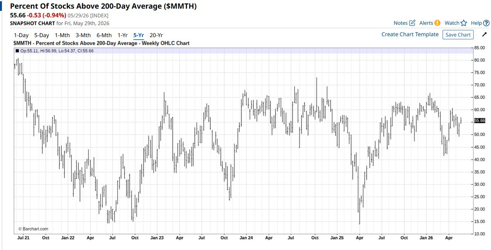
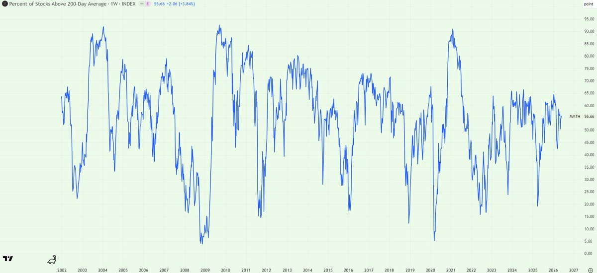

# MMTH市场宽度择时：200日均线上方占比、逆向加仓与杠杆边界

## 原文信息

- 作者：`@belouga2000`（李翠芬）
- 原文链接：`https://x.com/belouga2000/status/2060729156921589865/photo/1`
- 发布时间：`2026-05-30 22:24`
- 内容类型：`X 短帖 + 配图 + 评论区关键修正`
- 是否有配图：有，主帖 1 张；评论区关键反驳 1 张，均已归档
- 原文归档：`sources/belouga2000-2060729156921589865-mmth-breadth-timing/`

## 原文附图

### 图 1：主帖使用的 5 年 `MMTH` 图



### 图 2：评论区补充的 20 年 `MMTH` 图



## 主题

这条内容讲的是：**用 `MMTH` 这类市场宽度指标判断美股整体过冷或过热，而不是只看少数明星股的价格表现。**

`MMTH` 指的是 `Percent Of Stocks Above 200-Day Average`，也就是“价格位于 200 日均线以上的股票占比”。它衡量的是市场内部有多少股票仍处在长期趋势线上方。

作者给出的核心阈值是：

- `MMTH < 30%`：可以考虑买入；
- `MMTH < 20%`：可以更积极买入；
- `MMTH < 15%`：作者用很激进的表达说“必须全仓杠杆”；
- `MMTH > 60%`：再考虑去杠杆；
- `MMTH > 70%`：可以考虑卖出；
- `MMTH > 80%`：可以考虑做空；
- `MMTH > 90%`：通常只在 `2009` 和疫情大放水这种超级泡沫行情中出现。

但这条真正值得保存的点，不只是阈值本身，而是它暴露出一个更实用的问题：

**市场宽度指标可以提醒你哪里可能是大级别逆向机会，但它不能替你解决仓位、杠杆和持有纪律。**

作者自己也复盘了一个典型执行问题：去年用这个框架抄了 `VRT / NVDA / TSLA / AAPL` 的 `Call`，但因为想做短线 `T`，在高波动中全部卖飞。

## 判断框架

### 1. `MMTH` 看的是市场内部健康度，不是指数点位

只看指数容易被少数权重股误导。

作者在补充里说：当前半导体看起来飞得很高，但股市整体均线指数反而在下降，所以泡沫并没有蔓延得很厉害。

这句话背后的逻辑是：

- 如果只是少数半导体或科技权重股在上涨，而大多数股票没有站上 200 日均线，市场并不是全面亢奋；
- 如果 `MMTH` 持续走高，说明上涨从少数龙头扩散到更广泛资产，泡沫或过热风险才更明显；
- 如果 `MMTH` 很低，说明多数股票已经跌破长期趋势，市场可能进入恐慌或深度出清区。

所以 `MMTH` 更像是一个市场内部温度计：

- 低位用于观察恐慌后的逆向机会；
- 高位用于观察泡沫扩散后的风险释放。

### 2. 低于 `30%` 是“开始看机会”，不是马上梭哈

作者说 `MMTH < 30%` 就可以考虑买入，这个阈值比较合理的用法是：

- 开始筛选强势资产；
- 开始分批恢复风险暴露；
- 开始观察是否有恐慌卖盘衰竭；
- 开始为期权或杠杆仓位预留预算。

但它不应该被机械理解成“低于 `30%` 立刻满仓”。

原因是 `MMTH` 低位可能持续一段时间，尤其在系统性熊市中，市场宽度可以很差，但价格仍继续下跌。

### 3. 低于 `15%` 是极端信号，但不是天然杠杆信号

主帖最刺激的表达是：`MMTH < 15%` 必须全仓杠杆。

从反向投资角度看，这种低位确实说明市场已经非常惨：

- 多数股票跌破 200 日均线；
- 风险偏好被严重压缩；
- 很多优质资产也可能被流动性一起砸下去；
- 未来一旦反弹，弹性可能很高。

但从风险管理角度看，`MMTH < 15%` 只能说明市场很极端，不能自动说明杠杆安全。

一个更稳的理解是：

**低于 `15%` 是提高研究密度和风险预算的信号，不是无条件加杠杆的信号。**

### 4. 高于 `60% / 70% / 80%` 是逐步降温，而不是精确逃顶

作者给出的高位阈值是：

- `60%` 以上再考虑去杠杆；
- `70%` 以上可以考虑卖出；
- `80%` 以上可以考虑做空。

这套高位框架的价值在于：它不会因为少数热门板块上涨就过早看空，而是等上涨扩散到足够多股票后，才考虑泡沫蔓延。

但它同样不是精确择顶工具。

在强流动性环境里，宽度高位可以持续更久。作者也提到，`90%` 以上只在 `2009` 和疫情大放水后这种超级流动性行情里出现过。

所以高位阈值更适合做：

- 降杠杆；
- 减少高 beta 暴露；
- 做保护；
- 降低追涨频率。

不适合直接当成“一到就裸空”的机械信号。

### 5. 作者自己的失败点在执行，而不是指标判断

作者复盘说，去年已经告诉朋友这个指数的低位买入意义，自己也抄了 `VRT / NVDA / TSLA / AAPL` 的 `Call`。

问题在于：

- 当时上下波动很大；
- 作者想做短线 `T`；
- 最后这些仓位无一例外卖飞。

这说明原文真正隐含的教训是：

**如果你拿的是大周期宽度指标，就不要用短线高波动里的交易冲动去管理它。**

`MMTH` 给的是市场宽度层面的周期信号，而 `Call` 是高波动、高衰减、容易被短线价格摆动影响的工具。两者可以配合，但前提是你先定义清楚：

- 买入后计划持有多久；
- 哪种反弹才减仓；
- 最大亏损是多少；
- 是否允许中途做 `T`；
- 做 `T` 的仓位和核心仓位是否分开。

## 关键补充

### 1. 指标可以在 TradingView 里看

评论区有人问 `MMTH` 在哪里看，作者回复：不是所有软件都有，`TradingView` 里面有。

结合主帖配图，指标名称是：

```text
Percent Of Stocks Above 200-Day Average ($MMTH)
```

作者另一个回复写的是“价格 200 日均线以上商家比例”，从上下文和图名看，应理解为“价格在 200 日均线以上的股票比例”。

### 2. 20 年视角对“低于 15% 全仓杠杆”提出了关键反驳

评论区最重要的反驳来自 `@maitian99`。

他指出，如果只看 5 年图，很容易产生近因偏见；但拉到 20 年看，`2008` 年熊市里 `MMTH < 15%` 曾经持续接近一年。

这个补充非常关键，因为它把原文的激进表达拉回了可执行边界：

- `MMTH < 15%` 确实罕见；
- 罕见不等于马上反转；
- 可以做多，但不应该自动“全仓杠杆”；
- 小概率状态真正出现时，交易者仍然会面对同样的恐惧、亏损和持有困难。

换句话说，指标越极端，越需要预案，而不是越可以省略风控。

## 风险与限制

### 1. 固定阈值有样本依赖问题

`30% / 20% / 15% / 70% / 80%` 这些阈值有参考价值，但不能脱离样本周期。

如果只看最近 5 年，会更容易得出“低于 `15%` 很快反弹”的结论；如果看 20 年，就会看到金融危机中宽度低位可能持续很久。

所以阈值最好配合：

- 信贷压力；
- 流动性环境；
- 利率周期；
- 指数估值；
- 市场是否已经出现强制卖盘结束迹象。

### 2. 市场宽度无法告诉你买哪一个资产

`MMTH` 是整体指标，不是个股选择器。

即使它提示市场进入低位，也不能直接回答：

- 买指数还是买个股；
- 买正股还是买期权；
- 买龙头还是买跌得最惨的板块；
- 分几次买；
- 是否使用杠杆。

作者去年买的是 `VRT / NVDA / TSLA / AAPL` 的 `Call`，这本身已经叠加了个股选择、期权期限、波动率定价和执行纪律等多个变量。

### 3. `Call` 会放大卖飞问题

宽度指标可能给出的是几个月到一年级别的修复机会，但短期期权的价格波动很剧烈。

如果使用 `Call` 表达这个观点，就要面对：

- 标的波动；
- 隐含波动率变化；
- 时间价值衰减；
- 盈亏曲线非线性；
- 反弹途中频繁想止盈的心理压力。

所以如果没有明确持有规则，`Call` 很容易把正确的大方向变成错误的短线操作。

### 4. 高位做空比低位买入更难

作者说 `MMTH > 80%` 可以考虑做空，但高宽度市场往往对应流动性宽松和风险偏好上升。

这类环境下，做空可能很早看对“贵”，但很久都等不到“跌”。

因此高位更适合作为：

- 减仓信号；
- 去杠杆信号；
- 加保护信号；
- 不再追高信号。

直接做空需要额外确认价格结构和催化剂。

## 扩散分析 / 延展思路

### 1. 把口号式阈值改成仓位阶梯

更可执行的版本，不是“低于 `15%` 全仓杠杆”，而是仓位阶梯。

例如：

- `MMTH 30%-40%`：开始准备买入清单；
- `MMTH 20%-30%`：分批恢复指数或优质资产仓位；
- `MMTH 15%-20%`：提高风险预算，但限制杠杆；
- `MMTH < 15%`：只在流动性和价格结构同步确认时增加弹性仓位；
- `MMTH > 60%`：停止新增高 beta 仓位；
- `MMTH > 70%`：再平衡和减仓；
- `MMTH > 80%`：只考虑有保护的看空表达。

这样做的好处是：指标仍然有用，但不会把所有判断压缩成一个危险的二元动作。

### 2. 区分核心仓位和交易仓位

作者卖飞的核心原因是想做 `T`。

可以把仓位拆成两层：

- 核心仓位：跟随 `MMTH` 大周期信号，不轻易动；
- 交易仓位：允许短线做 `T`，但不影响核心敞口。

这样即使短线卖飞，也不会完全错过大级别修复。

### 3. 用多指标确认极端状态

`MMTH` 可以作为市场宽度主指标，但如果要上杠杆或买期权，最好再叠加其他确认：

- 指数是否重新站回关键均线；
- `VIX / VXX` 是否从恐慌高位回落；
- 信用利差是否停止扩张；
- 领涨板块是否从防御切回成长；
- 跌破 200 日均线的股票是否开始批量修复。

这样可以降低“还在熊市主跌段就过早加杠杆”的风险。

### 4. 把 `MMTH` 用作风险预算开关，而不是万能预测器

最稳的迁移方式是：不让 `MMTH` 决定具体买卖，而让它决定风险预算。

例如：

- 低位时允许更高风险预算；
- 中位时维持正常仓位；
- 高位时降低杠杆和集中度；
- 极高位时增加保护或减少追涨。

这样它就从“预测器”变成“仓位调节器”，更适合长期使用。

## 一句话结论

**`MMTH` 的价值在于用市场宽度识别过冷和过热，但真正决定收益的不是阈值喊得多激进，而是能否把低位信号转化成分批仓位、杠杆边界和足够长的持有纪律。**

