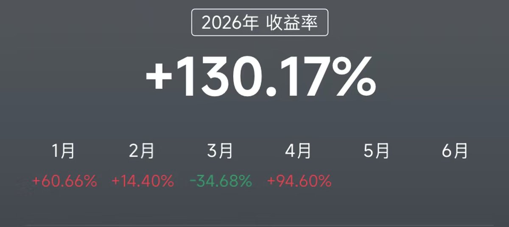

# Polymarket亏损复盘：负偏度、Kelly错用与把预测市场当望远镜

## 原文信息

- 作者：`@polymaster`（polymaster）
- 原文链接：`https://x.com/polymaster/status/2046751975115837484`
- 发布时间：`2026-04-22 08:44`
- 内容类型：普通 `X` 推文
- 是否有配图：有，1 张图，已保存到 `sources/polymaster-2046751975115837484-polymarket-losses-signal/assets/`
- 原文归档：`sources/polymaster-2046751975115837484-polymarket-losses-signal/original.md`

## 原文附图

### 图 1

## 主题

这篇内容在讲：**作者在 Polymarket 上两次较大的亏损，不是因为“状态不好”或“交易时间不对”，而是因为自己同时踩中了负偏度策略、硬性离场规则缺失、心理锚定和反向加仓这几类典型错误；最后得出的结论也不是放弃预测市场，而是把它从直接猎场降级成一个用于捕捉地缘和政治流程信号的 7x24 望远镜。**

作者真正想表达的是：

- 亏损很多时候不是情绪问题，而是结构性错误；
- 第一笔亏损本质上是长期捡小钱、单次尾部事件归零的负偏度暴露；
- 第二笔亏损本质上是明知 Kelly 纪律却在概率剧变时反向加仓，属于教科书式 loser’s trade；
- Polymarket 价格和事件实时性本身仍然很有价值，但这种价值未必要在 Polymarket 上直接兑现；
- 更好的用法可能是：**拿预测市场当 7x24 的事件信号源，再去其他市场寻找更适合表达的交易工具。**

所以这篇内容本质上不是“预测市场避坑帖”，而是一篇**从两次亏损里反推交易结构错误，再把 Polymarket 重新定义为信号基础设施**的复盘文章。

## 作者的判断方法

### 1. 先排除“状态借口”，把问题归因到策略和纪律

作者一开头就主动切掉一个最常见的借口：

- 两笔亏损都发生在上午、头脑最清楚的时候；
- 所以不能归因给疲劳、情绪差或错过盘感；
- 真正的问题在于策略结构和纪律执行。

这一步很重要，因为它把复盘对象从“当天状态”转成了：

- 自己到底在跑什么收益分布；
- 有没有硬性退出规则；
- 有没有在概率变化时违背原有仓位逻辑。

### 2. 第一笔亏损：用负偏度视角重写“手滑”

表面上第一笔亏损像是操作失误：

- 长时间埋伏美伊冲突市场，持续买 `No`；
- 真正开打那天，本来有机会退出；
- 结果关键时刻把“卖 `No`”点成了“买 `No`”。

但作者明确说，“手滑”只是表层原因。

更深层的判断是：

- 自己运行的是典型负偏度策略；
- 平时不断捡小额收益；
- 一次尾部事件就足以抹平一个月利润。

这和 Taleb 的“压路机前捡硬币”是同一类结构：

- 盈利频率高；
- 赔率难看；
- 只要没有硬性离场规则，最终一定会以别的形式把尾部账补回来。

### 3. 第二笔亏损：把 Kelly 工具和心理锚定放在一起看

作者第二笔亏损更有启发性。

问题不在于简单看错，而在于：

- 自己本来就是做 Kelly 仓位工具的人；
- 却把第一笔入场价变成了心理锚；
- 在市场概率发生剧烈变化后，不是减仓重估，而是反向加仓。

这说明作者对第二笔的判断是：

- 不是“我再给自己一次机会”；
- 而是典型的 loser’s trade；
- 本质上是在拿原来的判断替自己背书，而不是让新概率重新给仓位定价。

### 4. 从亏损里抽出来的，不是“别做 Polymarket”，而是“别执着于在它上面兑现”

作者没有因为亏损就否定预测市场，而是重新定义它的用途：

- Polymarket 的定价往往很快；
- 7x24 实时性经常领先于美股开盘；
- 某些地缘和政治事件的深层逻辑，甚至可能领先传统金融新闻和部分区域市场的反应。

这意味着作者最终不是得出“这地方不能用”，而是：

- 它未必是最好的赚钱场所；
- 但可能是更早、更灵敏的信号发现器。

### 5. 用“地缘趋势形成与骤然反转”去提炼跨市场框架

作者后面开始做的事情，不是继续在 Polymarket 上扛回本，而是把观察沉淀成：

- 地缘政治趋势形成；
- 地缘政治预期突然反转；
- 市场筹码结构的相应切换。

然后把这些信号迁移到：

- 美股；
- 资源股；
- 贵金属；
- 油运；
- AI 基础设施相关标的。

这里的核心判断是：

- Polymarket 的价值不一定在 payout；
- 而在它帮你更早看见“某类事件预期正在重排”。

### 6. 最后把“Polymarket 是望远镜”落到联储主席相关市场

作者点名提到，联储主席相关市场值得继续看。

原因不是题材热，而是这类市场具备一个完整链条：

- 政治流程信号先动；
- 宏观定价随后调整；
- 宏观定价再影响一整串金融资产的趋势波动。

也就是说，作者最终的判断方法已经从单点预测，走向：

- 先找事件预期重排；
- 再找这个预期能传导到哪些交易市场；
- 最后选择更适合表达的工具。

### 一句话总结判断方法

作者的判断链条是：**先把两次亏损从“操作失误”上升为负偏度暴露、离场规则缺失和概率剧变中的反向加仓，再把 Polymarket 从直接交易场所重新定位为 7x24 的事件信号源，最后围绕地缘政治趋势形成与反转，把预测市场价格迁移成美股和其他资产的前置观察工具。**

## 作者的应对策略

### 策略 1：对负偏度策略必须设置硬性离场规则

作者第一笔亏损给出的最直接教训是：

- 只要你在持续捡小钱；
- 就不能把退出建立在“到时候再看”上；
- 必须提前定义什么情况下无条件离场。

否则哪怕不是手滑，也会被其他形式的尾部风险清算。

### 策略 2：概率大幅变化时，不要拿旧价格当心理锚

第二笔亏损的核心教训是：

- 市场概率发生剧烈变化后；
- 应该重估，而不是拿旧入场价证明自己没错；
- 更不能用“加仓摊成本”这种方式把纪律工具反过来打脸。

对做结果市场的人来说，这几乎是第一原则。

### 策略 3：把 Polymarket 当成信号层，而不是一定要在上面完成交易

作者后面采取的做法是：

- 继续看预测市场；
- 但不执着于必须在预测市场上实现 `PnL`；
- 而是把其中领先的政治 / 地缘 / 情绪信号拿去其他市场表达。

这本质上是在做工具分工：

- Polymarket 负责看；
- 其他市场负责打。

### 策略 4：结合更成熟的工具做风险对冲

作者提到自己一月盈利时，做的是：

- 跟踪 `INTC` 期权异动；
- 再用自己写的期权期货数据技能；
- 去做一些更可控的期权组合对冲。

这说明他最终偏向的，不是单点 all-in 事件票，而是：

- 让信号和表达工具分离；
- 用更适合风险控制的工具来承接事件观点。

## 关键补充

### 1. 这篇文章最重要的不是亏损金额，而是两种错误的可迁移性

作者踩的坑并不只属于 Polymarket：

- 负偏度策略捡小钱；
- 没有硬性离场；
- 被旧入场价锚定；
- 在概率变化时反向加仓。

这些错误放到期权、商品、宏观事件交易里都一样会出问题。

### 2. “望远镜”这个比喻比“交易平台”更值得记住

作者最后对 Polymarket 的重新定义非常有价值：

- 它可能不是你最好的猎场；
- 但可以是你的一台性能很好的望远镜。

这实际上在提醒：

- 某个市场未必适合直接赚钱；
- 但可能很适合作为信息收集和事件预警层。

### 3. 联储主席相关市场的提醒，说明作者已经在寻找下一类可迁移场景

作者提到未来可以继续关注联储主席相关市场，是因为这类事件有完整的传导链。

这说明他复盘的终点不是“少亏一点”，而是：

- 找更稳定的、能传导到更多资产的事件信号源。

## 风险与限制

### 1. Polymarket 的定价很快，不代表天然能转化成 alpha

作者自己也承认：

- 预测市场价格可以很准确；
- 也可能领先传统新闻；
- 但这种领先并不完全自动转化为可交易收益。

从信号到收益，中间还隔着工具选择、时点、流动性和仓位管理。

### 2. 把信号迁移到美股或其他市场，本身也有映射风险

即使预测市场先动了，也还要解决：

- 这个信号对应哪类资产；
- 哪个资产最纯；
- 表达周期有多长；
- 市场已经预期了多少。

如果映射错了，信号再对也不一定赚钱。

### 3. 负偏度和 Kelly 误用，本质上都是收益分布管理问题

这篇文章里最危险的，不是看错，而是：

- 习惯了高胜率的小额收益；
- 把仓位模型工具化了却没有真正内化纪律；
- 在新信息出现时仍然用旧故事管理仓位。

这种问题不会因为换市场而自动消失。

### 4. 作者对自己新框架的正面结果，仍然需要更长样本验证

作者提到新的地缘政治框架在美股斩获颇丰，但也承认：

- 还需要更长时间测试。

这一点必须保留，因为短期有效不等于框架稳健。

## 扩散分析 / 延展思路

### 1. 这篇文章最大的启发，是把“交易市场”和“信号市场”分开

以后再看一个市场时，可以先问：

- 这个市场适合我直接赚钱；
- 还是更适合我拿来观察别人怎么给事件定价。

很多时候，后者的价值更稳定。

### 2. 对事件驱动交易者来说，预测市场很适合做 7x24 雷达层

尤其是：

- 地缘政治；
- 政治流程；
- 宏观预期转折；
- ETF 或监管事件。

这类事情往往在传统市场休市时也在变化，而预测市场恰好能持续反映。

### 3. 更保守的做法，不是直接下注事件本身，而是等传导到更深更液的市场后表达

如果不想承担预测市场本身的流动性和结算风险，一个更保守的版本是：

- 用 Polymarket 看预期转向；
- 再去更深的股票、期权或商品市场做表达。

这样可能少赚一段最前面的赔率，但会换来更成熟的执行条件。

### 4. 对自己最有用的 checklist，可能不是“我看对了吗”，而是“我在赚哪种分布的钱”

作者两次亏损其实都指向同一个问题：

- 你在赚高胜率小钱；
- 还是低胜率大钱；
- 还是在新信息面前用旧仓位自我说服。

这个问题比单次方向判断更值得长期追踪。

## 一句话结论

这篇文章的核心不是“Polymarket 亏了两次”，而是：作者用两次亏损把自己的问题从手滑和情绪上升成负偏度、离场纪律和概率重估失败，最后把 Polymarket 从直接下注的平台重新定义成一个 7x24 事件信号望远镜，再去更适合表达和对冲的市场里兑现观点。
