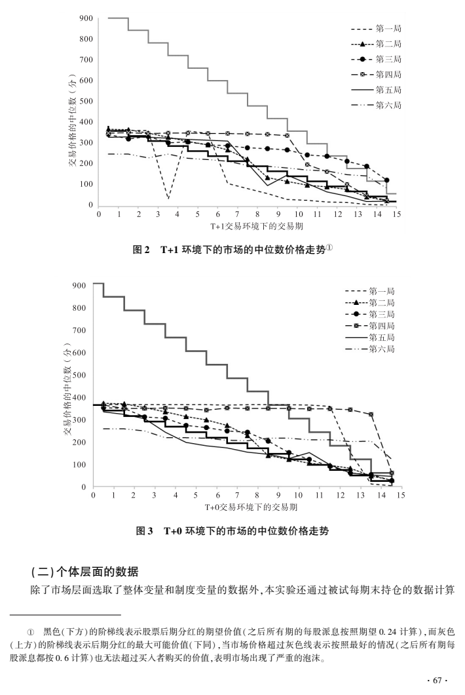
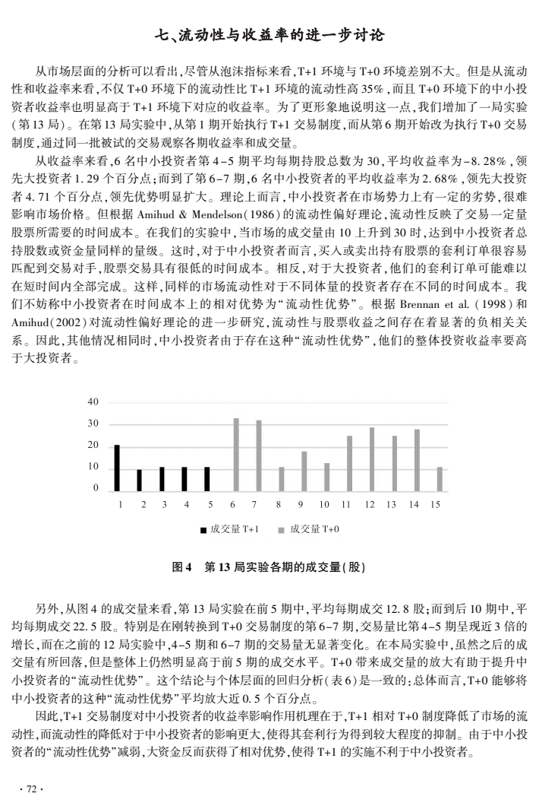

# T+1投资者保护实验：小资金流动性优势、交易限制与风险偏好

## 原文信息

- 作者：周耿、姜雨潇、范从来、王宇伟（南京大学经济学系）。
- 论文：《T+1制度对中小投资者保护效果的实验研究》，《中国经济问题》2018年第6期（总第311期），第60–75页；DOI：`10.19365/j.issn1000-4181.2018.06.06`。
- 实验时间：2017年3月；归档时间：2026年9月5日。
- 内容类型：市场微结构 / 交易制度的实验经济学研究，兼具研究方法论属性。
- 材料：用户提供的16页 PDF，含4幅图、7张表及参考文献；未提供底层交易数据或实验程序。
- [原始 PDF](sources/zhougeng-201811-t1-investor-protection-experiment/original.pdf) · [逐页原文与图表](sources/zhougeng-201811-t1-investor-protection-experiment/original.md) · [归档元信息](sources/zhougeng-201811-t1-investor-protection-experiment/meta.json)。

本文仅整理这份历史论文。文中的中美账户规则与交割周期是作者写作时的描述，不作为现行交易规则说明；实验参与者操作说明属于研究材料。

## 主题

这篇论文研究的是：限制当天买入的股票当天卖出，究竟保护了谁？作者在实验室中构建不同资金规模的投资者市场，比较 T+0 与 T+1 的成交量、价格偏离以及个人超额收益。

核心发现有两个方向：T+1 降低成交量，削弱小资金快速完成交易的相对优势；但限制交易也可能减轻高风险偏好者的过度交易损失。因此，“中小投资者”和“高风险偏好者”不能被当成同一类人，取消限制也不是作者给出的无条件答案。

## 实验如何识别制度差异

| 项目 | 设计与口径 |
|---|---|
| 交易机制 | SSW实验资产市场、连续双向拍卖，使用Z-tree；只有一种股票 |
| 制度处理 | T+1：本期买入股票下一期才能卖出，卖出所得现金可继续买入；T+0：没有该回转限制 |
| 参与者 | 每局9人，3名大投资者、6名中小投资者；初始禀赋按约13倍区分 |
| 时长 | 正式实验每局15期、每期120秒；正式交易前有两个回合的练习 |
| 价值锚 | 表3股息集合为0、0.08、0.28、0.60，等概率抽取，期望为0.24；剩余期数×0.24为剩余预期分红价值，终局股票归零 |
| 激励 | 按最终收益率排名决定现金报酬，并非简单按最终财富同比例兑换 |
| 主样本 | 12局、180个市场期；两局缺问卷，个体回归采用10局×9人×15期＝1350个人期观测 |
| 个体变量 | 初始资金规模、问卷风险偏好、认知水平、参加同类实验次数，以及价格、分红等市场控制变量 |
| 补充实验 | 第13局前5期执行T+1，第6期起改为T+0，观察同一批被试的变化 |

这里的“中小投资者”是实验中被分配较少初始资产的人；“经验”是参加同类实验的次数。它们不等同于现实中的散户身份或职业投资年限。1350是重复观测数，不是1350名独立投资者。（PDF第5–9页）

## 核心机制：统一限制为什么产生不同影响

作者把小资金的优势称为“流动性优势”：同样的市场成交能力，小账户的一笔订单更容易完成，大账户要调整相同比例的仓位则需要更多对手盘和时间。

这条解释链是：

1. T+1限制买入股票再次流通，减少可连续成交的机会。
2. 市场成交量下降，小账户原本能迅速买卖、利用价格偏离的机会减少。
3. 小资金相对于大资金的收益优势收窄，因此形式相同的限制未必产生相同的保护效果。

另一条机制来自行为约束：风险偏好高的人可能交易过于频繁，限制回转可抑制这种行为。论文的回归支持风险偏好与制度之间存在交互关系，但“通过减少过度交易而改善收益”主要是作者的机制解释，不宜当作已经独立识别的中介效应。（PDF第10–14页）

## 实验证据：成交量最明确，波动结论较弱

### 市场层面

以下采用表5原始数值。平均收益按作者正文解释为百分数口径，不将其扩写为22%或8.8%的收益。

| 指标 | T+0均值 | T+1均值 | 证据与解读 |
|---|---:|---:|---|
| 每期换手数量 | 14.210 | 10.467 | T/U/K-S检验p值分别为0.024/0.004/0.0000（表内舍入值），成交量下降证据较一致 |
| 中小投资者平均收益 | 0.220 | 0.088 | 三项检验均报告0.0000；作者正文写作约0.22%与0.09% |
| 泡沫持续期数 | 8.0 | 9.4 | 三项检验均不显著，未显示泡沫持续时间缩短 |
| 市场波动指标 | 0.598 | 4.848 | T检验p=0.363，U检验p=0.079，K-S检验p=0.100；仅部分检验达到或接近10%阈值 |

按表5计算，T+1成交量比T+0低约26.3%；反过来说T+0比T+1高约35.8%。两者分母不同，不能都写成“下降35%”。

泡沫指标总体缺少一致、稳健的下降证据。但正文“所有泡沫指标在10%水平都不显著”不完全符合表5：收盘偏离的T检验p=0.060，U与K-S检验则不显著。波动指标均值虽高很多，统计证据较弱，也不能直接等同于常见的年化收益率波动率。（PDF第7、10页）

### 个体层面

论文用混合效应模型分析超额收益率，即个人收益超过市场收益的部分，并报告异方差稳健性检验。关键是交互项，而不是单看T+1变量。

| 项目 | 表6结果 | 合理解释 |
|---|---|---|
| 小投资者×T+1 | 模型2为−0.4984，5%显著；模型5为−0.4027，仅10%显著 | T+1下小资金的相对收益优势收窄，完整模型的显著性较弱 |
| 风险偏好×T+1 | 模型5为+0.3059，1%显著 | 制度效应随风险偏好变化；不能解释为每位高风险者固定多赚0.306% |
| 经验 | 模型5为+1.4108，1%显著 | 实验经验与超额收益正相关 |
| 经验×T+1 | 模型5为+0.4156，无显著性标记 | 未发现足够证据证明经验的作用因制度而改变 |

模型2中，小投资者系数为0.7096，叠加交互项后为0.2112；按作者的收益率解释口径，约对应相对优势从0.7个百分点收窄到0.2个百分点。模型5对应0.6867与0.2840，不能将“0.7→0.2”描述为所有模型的统一结果，更不能年化。

T+1主效应在表6中不显著。含交互项时制度效应取决于资金规模、风险偏好和经验；“大投资者相对获益”不自动等于“大投资者绝对收益显著提高”。（PDF第9、11–12页）

### 第13局补充观察

制度在第6期切换后，前5期平均成交量12.8股，后10期22.5股；中小投资者在第4–5期相对大投资者领先1.29个百分点，在第6–7期领先4.71个百分点。

这支持作者关于交易机会与小资金优势的解释，但只是一局固定顺序的切换实验，可能同时受剩余期限、学习和市场路径影响，不能单独排除所有其他原因。（PDF第13页）

## 原文图表说明

- 图1（PDF第6页）：实验软件界面，展示实验中的下单与信息环境。
- 图2、图3（PDF第8页）：两种制度各局的价格中位数走势；黑色阶梯为剩余分红期望，灰色阶梯为剩余最大分红。两种制度都出现价格高于基本价值的阶段，个别期甚至高于最大可能分红；图形本身不能代替显著性检验。
- 图4（PDF第13页）：第13局成交量，直观展示切换到T+0后的放量。
- 表1–7：覆盖初始禀赋、指标定义、变量相关性、制度对比和回归结果；完整表格保留在PDF中，关键表格另存原页图供核对。

## 风险与限制

1. **实验外推有限。** 单资产、短期限、确定终局和排名奖励，与真实市场的多资产、长期持有及盈亏激励有明显差异。作者也承认没有引入大投资者的信息优势和公司决策影响力。
2. **统计独立性需审慎。** 市场处理发生在实验局层面，个人期和市场期存在共同环境及重复观测；论文报告异方差稳健估计，但不能据此自动认定已充分处理局内相关性。原始数据未提供，本次不做回归复现。
3. **指标口径有缺口。** 表2部分指标说明与取值存在疑点，例如正文将开盘偏离解释为绝对值，但表中最小值为负。市场波动由期内最大价差除以开盘价计算，小分母可能放大极端值。不能据表内均值直接推断常见风险指标。
4. **原文数值存在不一致。** 第5页正文股息写0.8，表3为0.08，后者与0.24期望一致；表1大投资者禀赋写339.1，正文写339.3，按表内现金及股票×3.6计算为339.3。本笔记说明差异，原文归档不擅自修改。
5. **保护效果是条件性的。** 小资金优势被削弱，与高风险偏好者可能获保护，可以同时成立。不能把论文压缩为“T+1对所有散户都有害”或“T+0必然更公平”。
6. **历史制度对比需另行核验。** 论文的美国账户、交易限制、交割周期等介绍不作为当前规则依据；当日回转权与证券结算周期也是不同问题。

## 扩散分析 / 延展思路

以下为归档者基于论文提出的延展，不是作者已经验证的结论。

评估投资者保护时，可以把“账户规模×风险偏好”作为两个维度，分别观察制度改变后的净收益、交易成本、尾部损失和成交完成时间。这样能区分哪些收益改善来自更容易成交，哪些来自更少的冲动交易。

若做后续实验，可增加手续费、信息不对称以及不同深度，并让不同组采用相反顺序切换制度，同时按实验局处理统计相关性。这样更有助于区分流动性机制、学习效应和过度交易机制。

作者自身的政策启示是考虑差异化账户限制与教育处罚，而不是简单用统一T+0替换统一T+1。至于具体差异化规则是否有效，需要额外检验，不能由本实验直接确定。

## 一句话结论

这项实验提示，T+1可能以削弱小资金流动性优势为代价约束高风险交易行为，评价“投资者保护”必须区分资金规模、行为特征及证据强度。
