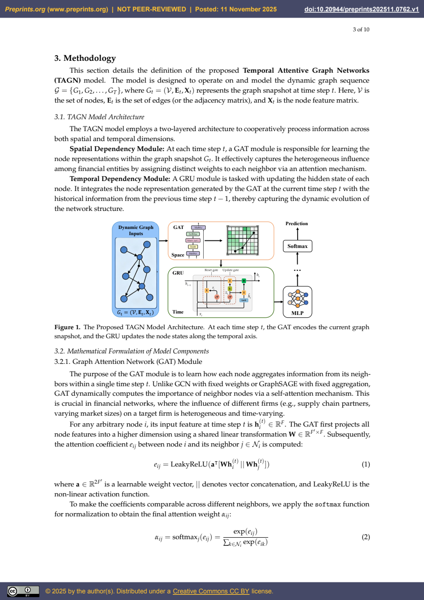

# TAGN金融风险预警：多关系动态图、GAT与GRU及复现边界

## 原文信息

- 原题：*Temporal Attentive Graph Networks for Financial Surveillance: An Incremental Multi-Scale Framework*。
- 作者：Wei Zhang、Yimin Shen（通讯作者）、Hang Zhou、Bo Zhou、Xianju Zheng、Xiang Chen；机构为成都工业学院及中山大学。
- 发布：Preprints.org，2025年11月11日，v1；所提供版本明确标注 **NOT PEER-REVIEWED（未经同行评审）**。
- 原文链接：[DOI：10.20944/preprints202511.0762.v1](https://doi.org/10.20944/preprints202511.0762.v1)。
- 内容类型：量化研究框架 / 金融风险监控模型；不是完整交易策略。
- 材料：11页PDF（1页封面、10页正文），1幅架构图、5张表；封面标注CC BY 4.0许可。归档日期：2026年9月9日。
- [原始PDF](sources/zhang-20251111-tagn-financial-surveillance-v1/original.pdf) · [逐页正文与原页图](sources/zhang-20251111-tagn-financial-surveillance-v1/original.md) · [元信息](sources/zhang-20251111-tagn-financial-surveillance-v1/meta.json)。

本笔记依据用户提供的v1整理，未查询后续发表状态，也未取得数据、程序或复现实验。下文分别标明作者报告的结果与归档者对证据边界的判断。

## 主题

作者试图回答：一只股票未来出现极端波动的风险，能否通过“它自身的状态、与其他公司的关系、这些关系随时间的变化”共同预测？

其方法是把股票作为图节点，以价格相关性、供应链和机构共同持仓构建关系，再用图注意力网络（GAT）聚合邻居信息、门控循环单元（GRU）累积历史状态。论文报告该组合在测试集取得0.89的AUC，并尝试把模型输出与网络指标结合成风险预警指数。

值得收录的是这条建模路径。性能、领先VIX和情景预测仍属于作者报告，所给材料不足以独立确认它们能在实时环境中复现。

## 先明确预测的到底是什么

论文第4.3节的标签是：**未来三个月内，是否至少出现一天日收益率的绝对值超过15%**。（PDF第6页）

它不是三个月累计涨跌超过15%，不是年化波动率超过15%，也不是专门预测崩盘。上涨和下跌都会触发标签，输出也不提供具体发生日期。高风险分类因此不能直接翻译为做空信号。

摘要与结论称样本为50只NASDAQ上市股票，覆盖2018–2023年；正文未列出完整股票名单、选样时间、正负样本数量或每个样本的输入序列长度。

## 数据与图是怎样搭起来的

### 节点特征与公司关系

| 层次 | 输入 | 在模型中的位置 | 论文披露的来源 |
|---|---|---|---|
| 个股交易 | 日收益率、滚动波动率、Amihud非流动性指标 | 随时间变化的节点特征 | Yahoo Finance |
| 新闻 | 每日公司新闻情绪 | 节点特征 | RavenPack、Reuters |
| 宏观 | VIX、利率等 | 全局特征或复制到各节点 | FRED |
| 价格联动 | 60日滚动价格相关性 | 动态关系矩阵 | 由行情计算 |
| 公司关联 | 供应链、机构共同持仓 | 相对静态关系矩阵 | Bloomberg、Refinitiv |

需要保留一个区别：原文表1的列名是 **Suggested Source（建议来源）**，没有说明各供应商实际使用了哪些数据集、字段和历史版本。因此，上表是论文给出的来源方案，不是已核验的数据采购与处理记录。表1还提到董事会重叠，但实际图融合公式没有单列该关系。（PDF第6页）

### 多关系先融合，再进行图学习

论文使用：

```text
A_t = w1 × A_corr(t) + w2 × A_supply + w3 × A_ownership
```

其中价格关系按60日滚动窗口更新，供应链与共同持仓被视作相对静态；三个融合权重通过验证集网格搜索确定，具体取值和搜索范围未给出。

这不是分别训练三类关系的完整异构图模型。文中先把它们加权合成邻接矩阵，再送入GAT；关系方向、负相关如何处理、边的筛选阈值、各矩阵尺度如何对齐，以及融合权重如何进入GAT的注意力计算，均未充分展开。

特别要区分两种“权重”：`w1–w3`决定关系层如何组合，`α_ij`是GAT在邻居间学习的注意力。公式1–3主要描述后者，不能自行补写成已实现了带边特征的注意力模型。

## 模型机制：先看邻居，再看历史

1. **GAT处理当期图。** 将每个节点与邻居的特征作变换，计算邻居注意力并归一化，再加权聚合，得到包含关系信息的节点表示。
2. **GRU更新节点状态。** 把当期GAT输出与上期隐藏状态结合，以门控机制决定保留多少过去信息、加入多少新信息。
3. **MLP与Softmax输出分类概率。** 利用最终隐藏状态判断未来三个月是否出现极端单日波动，以交叉熵训练。

例如，在作者的设想中，下游公司的风险表示可以受到供应商价格与新闻变化影响，并保留这一变化此前的演化过程。但注意力高只表示模型在预测中使用了该邻居的信息，不足以证明真实的因果传染路径。



图1说明的是动态图快照→GAT→GRU→分类输出的流程。标题中的“Incremental”没有对应完整的在线学习或增量训练方案；GRU逐时更新隐藏状态不等于模型参数能在线持续更新。作者在结论中也把实时数据流部署列为未来工作。（PDF第4–5、10页）

## 实验设置与报告结果

### 时间切分与参数

| 项目 | 原文设置 |
|---|---|
| 训练集 | 2018–2021年 |
| 验证集 | 2022年，网格搜索调参 |
| 测试集 | 2023年 |
| 预处理 | Z-score标准化，未说明拟合统计量的样本范围 |
| 训练 | Adam，学习率0.001，200轮 |
| 网络 | GAT隐藏维度128、4个注意力头；GRU隐藏维度128 |
| 正则化 | Dropout 0.5 |

按年份切分是有用的起点，但三个月前瞻标签会跨越年度边界。论文没有说明如何剔除跨界标签、处理2023年末标签所需的后续行情，以及避免相邻样本未来区间大量重叠。（PDF第6–7页）

### 主模型对比

下表为论文表3原始报告值，不是本次复现结果。

| 模型 | Accuracy | F1 | AUC |
|---|---:|---:|---:|
| XGBoost，仅节点特征 | 0.76 | 0.74 | 0.78 |
| GCN，静态图 | 0.79 | 0.78 | 0.82 |
| GCN-LSTM，时序图 | 0.81 | 0.80 | 0.85 |
| TAGN | 0.83 | 0.82 | 0.89 |

作者据此强调关系信息、时序信息和注意力的重要性。但AUC的绝对增量0.11、0.07、0.04不能直接换算成收益提升；AUC 0.89也不是“预测正确率89%”。论文没有提供置信区间、多随机种子重复结果或差异显著性检验，不应沿用正文“显著优于”来表示已经检验过统计显著性。

GCN-LSTM与TAGN同时改变了图模块和时序模块，所以两者比较本身不能把全部提升归因于注意力。下面的替换消融更接近针对该组件的比较。（PDF第7页）

### 消融结果

| 变体 | AUC | 相比完整模型下降 |
|---|---:|---:|
| 完整TAGN | 0.890 | — |
| GAT替换为GCN | 0.852 | 0.038 |
| 移除GRU，只用静态GAT输出 | 0.831 | 0.059 |
| 移除新闻情绪 | 0.875 | 0.015 |
| 移除供应链关系层 | 0.868 | 0.022 |

这些结果在作者的设置下显示，去掉时序模块损失最大，新闻和供应链也有增益；但不能由此判断其他市场一定需要同样的模型或付费数据。消融同样缺少重复实验波动范围，也没有单独移除宏观/VIX输入的结果。（PDF第9页）

## 历史事件、预警指数与压力情景应分别理解

### 历史网络变化是事后描述

| 事件窗口 | 平均边权变化 | 社区Jaccard相似度 |
|---|---|---:|
| 2020年3月疫情冲击 | +45%，达到0.78 | 0.31 |
| 2021年1月Meme行情 | 相关子群内部+150% | 0.55 |
| 2023年3月SVB事件 | +38%，达到0.72 | 0.34 |

作者将边权上升解释为联动加强，将Jaccard下降解释为社区结构重组；另称Meme子群边权0.75，为同期全网平均0.30的2.5倍。这些是表4及正文报告的统计，前两场事件位于训练期，不能当作三次独立样本外预警。

还需区分“相对前期增长150%”与“相对全网高150%”：二者基准不同，不能凭0.75/0.30的比值验证时间上的增幅。文中没有完整披露社区识别算法、比较基期和样本名单，也未说明事件分析提及的GME、AMC如何纳入所称的50只股票网络。（PDF第8页）

### 风险指数与VIX的相关不等于有效领先

作者把平均边权、平均聚类系数、平均预测风险概率和负面新闻情绪用PCA加权，形成 `I_Risk`。文中报告其与VIX相关系数0.78，并称在部分事件前领先1–2周。

PDF没有对应的指数曲线、滞后相关结果、预警阈值、误报次数或逐期预测记录；PCA在哪段数据上拟合、预测概率是否全部样本外生成也不清楚。另外，表1本就将VIX列为可能的模型输入，若实际使用，就需要隔离这条信息路径后再评价与VIX比较的增量价值。

因此，当前只能记录“作者报告局部事件领先”，不能改写为“已经验证能提前两周预警市场危机”。（PDF第8–9页）

### 2025关税情景是人为设定的压力测试

原文设定受影响行业成本特征+15%、行业间相关边−20%、行业内相关边+30%；随后报告75%的受影响公司在未来一个月被归为高风险，全网平均边权上升41%。

这不是2025年真实交易的样本外检验。三个衔接问题没有解释清楚：

- 前述特征表未明确成本变量的定义与训练口径。
- 分类模型的训练目标是三个月，情景结果却使用一个月期限。
- 模型输出是节点分类概率，未给出由分类器预测下一期图或平均边权的机制，41%的边权增长如何计算并不清楚。

若假定边集合不变、所有边权非负且各边增幅最多30%，固定集合的平均边权也不可能增加41%；原文是否另有重构、筛边或归一化步骤尚不明确。这是需要补充计算细节的疑点，不据此断定全部结果错误。（PDF第9–10页）

## 风险与复现边界

**材料完整性。** 所提供版本未经同行评审，未见数据或代码仓库链接。完整股票列表、选样规则、标签基数、类别比例、分类阈值、F1平均方式、序列长度及部分超参数均缺失。准确率与F1因此难以独立解释。

**时间可得性。** 若供应链和共同持仓采用事后更新关系回填历史、新闻或宏观数据未按实际发布时间使用，或Z-score/PCA在全样本拟合，都可能产生前视偏差。论文披露不足，不能证明这些问题实际发生，也不能认为按年份切分已排除它们。

**预测相关与因果机制。** 作者承认相关图不是严格因果图。网络连得更紧可能反映共同宏观冲击；注意力并不直接证明供应链传染。50只股票的共同风险也不足以完整代表跨资产系统性风险。

**原文内部一致性。** 摘要把非图基线写作Logistic Regression，而正文与表3为XGBoost；表1宏观数据行重复；表4错误沿用了“模型性能对比”的标题。正文把传统ARIMA/GARCH概括为依赖i.i.d.与静态相关，也不能作为准确的模型定义照搬。本笔记保留来源差异，以具体实验表格为主要依据。

**部署与交易之间仍有距离。** Softmax输出没有经过文中可核验的概率校准；没有误报成本、时延、数据费用、换手或收益回测。论文适合作为候选风险监控架构，不能直接作为仓位规则或获利证据。

## 扩散分析 / 延展思路

以下是归档者提出的后续研究路径，不是论文已经完成的工作。

可先只使用历史可得的价格和成交量，建立非图模型、纯时序模型及价格相关图模型，再逐一加入供应链、共同持仓和新闻。这样能检验额外数据是否真正带来样本外增益，而不必一开始复刻全部采购与模型复杂度。

验证时应明确每个预测时点可用的信息，在切分边界清除标签未来窗口重叠，做滚动样本外评估，并记录类别比例、PR-AUC、概率校准和误报率。若目标是预警市场下行，应另定义下跌标签，不能沿用同时包含大涨的“绝对日涨跌超过15%”。

预警指数则应独立验证：仅用当时已训练好的模型产生概率、仅用历史样本拟合PCA，公开每次信号及其提前时间，并加入移除VIX的对照。它是否比简单的滚动相关性、波动率或新闻指标更有用，应由这组比较决定。

## 一句话结论

TAGN提供了“公司关系图＋时序状态”的风险识别思路，但0.89 AUC、领先VIX和情景预测在这份v1中的复现证据不足，应作为待验证的研究框架收录。
