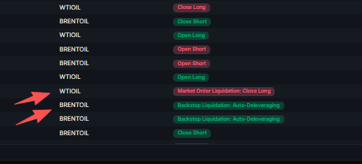
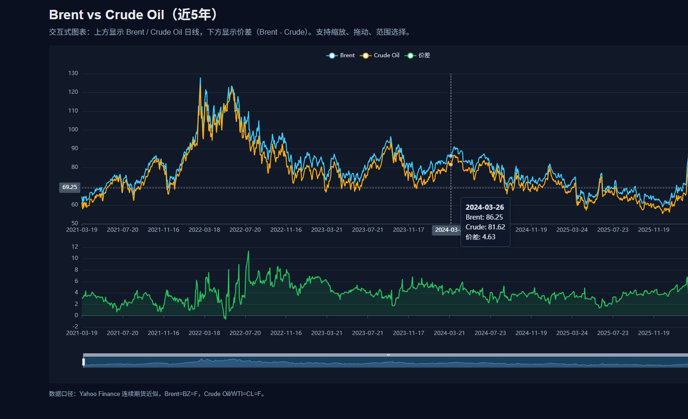
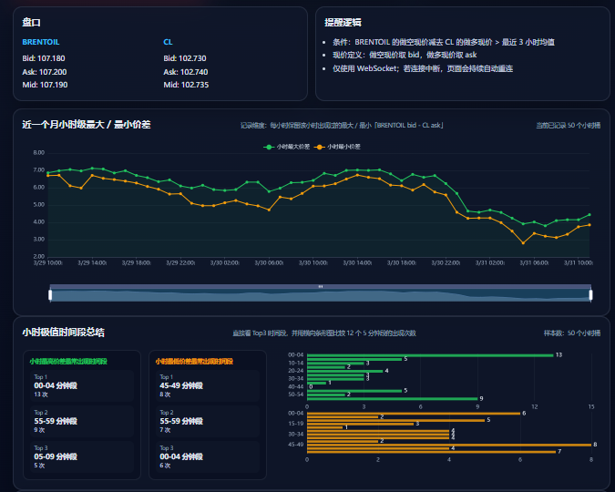
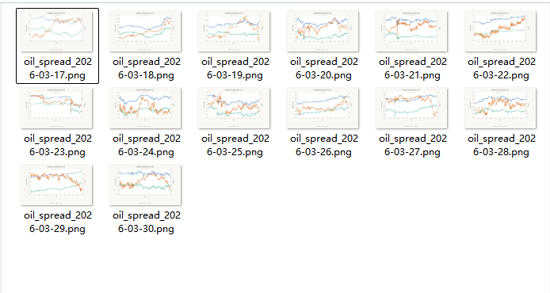

# WTI-Brent价差套利复盘：判断逻辑与应对策略

## 原文附图

- 作者：`@sanmishen`
- 原文链接：`https://x.com/sanmishen/status/2038843954477887612?s=20`
- 发布时间：`2026-03-31 13:00`
- 说明：这条是普通推文，不是 X Article；正文附带 4 张图，已保存到本地。

### 图 1


### 图 2


### 图 3


### 图 4


## 主题
这条帖子的主题是：**围绕 WTI 和 Brent 原油之间的价差，做一轮双向套利交易，并复盘如何判断价差偏离、如何切换方向、如何管理杠杆和止盈。**

作者不是在赌原油单边涨跌，而是在做 `Brent-WTI` 的相对价值交易：

- 价差太低时，做 `Brent 强于 WTI`
- 价差太高时，做 `Brent 弱于 WTI`
- 核心逻辑是 `均值回归`

## 作者的判断方法

### 1. 先看价差是否明显偏离历史均值
作者提到：

- `3 月 14 日`，`Brent-WTI` 价差在 `2-2.5`
- 这个水平低于最近五年的平均价差
- 也低于 `tradexyz` 上线 Brent 后的平均价差

作者的第一步判断就是：

**当前价差是否低得不合理，或者高得不合理。**

如果偏离过大，就有交易机会。

### 2. 再看两种原油的驱动差异
作者认为：

- `Brent` 更受中东局势影响
- `WTI` 更多是跟着 `Brent` 走

这意味着：

- 地缘风险上来时，`Brent` 往往更强
- 同样是涨原油，`Brent` 的弹性可能更大

所以在价差很低的时候，作者认为 `Brent` 有更大概率跑赢 `WTI`。

### 3. 再看市场结构是否会放大错位
作者还观察到：

- 市场普遍认为 `WTI` 会被压在 `100` 以下
- `Brent` 刚上线 `tradexyz` 不久
- `Brent` 的知名度和交易量不如 `WTI（原 CL）`

这其实是在看交易结构：

- 哪个品种更热门
- 哪个品种更容易被情绪带偏
- 哪个品种因为流动性或关注度问题，更容易出现定价失真

### 4. 最后看盘中均值波动，决定是否做波段
作者提到一个经验：

- 价差每天会围绕一个均值 `±0.5` 波动

所以他的思路不是只拿方向仓，而是：

- 主方向仓位负责吃大级别回归
- 日内波动则可以拿来做波段，增厚收益

### 一句话总结判断方法
**先判断价差是否偏离历史均值，再结合 Brent / WTI 的驱动差异和市场结构，决定是做价差扩大还是做价差收敛。**

## 作者的交易过程

### 第一阶段：价差太低，做多 Brent、做空 WTI
作者在 `3 月 14 日` 左右看到 `Brent-WTI` 价差只有 `2-2.5`，判断偏低，于是：

- 做多 `Brent`
- 做空 `WTI`

他的目标是等周一开市后，价差拉到 `6` 左右。

实际情况是：

- 周一白天价差大多在 `3` 附近
- 后来开始拉开
- 但他在 `3.5` 附近就先平仓
- 这一段只拿到不到 `10%` 的利润

### 第二阶段：价差拉太大，反手做空 Brent、做多 WTI
之后价差继续扩大：

- 拉过 `6`
- 从 `17 号` 一直拉到 `19 号`
- 最高到 `14`

这时作者判断市场已经从低估走到高估，于是反手：

- 做空 `Brent`
- 做多 `WTI`

也就是说，作者的交易逻辑始终没变：

- 价差太低，做扩大
- 价差太高，做收敛

本质一直都是 `均值回归`

## 作者的应对策略

### 策略 1：根据价差区间切换方向
作者不是固定一个方向死拿，而是：

- `低估区`：做 `Brent-WTI` 扩大
- `高估区`：做 `Brent-WTI` 收敛

核心不是猜新闻，而是判断当前价差所在区间。

### 策略 2：趋势中加仓，但前提是相信最终会回归均值
作者提到：

- 价差一路拉到 `14`
- 自己一路加单
- 仓位价差被拉到 `7.5+`，后面甚至到 `8.5+`

这说明他的加仓逻辑是：

- 偏离越大，越接近未来回归的位置
- 所以会在极端偏离时不断提高均值回归仓位

但这类加仓也意味着：

- 对资金要求高
- 对情绪承受力要求高
- 如果偏离继续扩大，会很难受

### 策略 3：主仓吃大趋势，波段仓吃日内波动
作者说：

- 后面下降趋势里，每天都围绕均值 `±0.5` 波动
- 会做波段
- 但做波段不等于减掉核心仓

这说明他的执行方式是：

- 核心仓吃价差回归的大趋势
- 交易仓利用短线来回波动增厚收益

### 策略 4：用 10 倍杠杆，但动态调保证金
作者明确说自己用的是 `10 倍杠杆`，并且给了具体做法：

- 白天在电脑前，可以撤出部分保证金
- 睡前再补足亏损方的保证金

目的就是：

- 不让太多资金长期占着不动
- 提高套利资金利用率

### 策略 5：把止盈挂在对手盘爆仓价附近，利用黑天鹅吃利润
这是作者这篇复盘里最有特点的一点。

作者的思路是：

- 黑天鹅来时，某一边可能会出现瞬间大跌
- 那就提前把止盈挂在对手盘可能爆仓的位置附近

他举的例子：

- 如果做单价差是 `8.5`
- 那就把 `做空 Brent` 的止盈价设置到 `WTI` 的爆仓价附近
- 如果极端行情突然出现，可能一次性吃到接近 `85%` 的完整利润

如果不想那么激进，也可以：

- 设置成 `WTI 爆仓价 + 自己想要的利润`

### 一句话总结应对策略
**作者的策略是：价差低就做扩大，价差高就做收敛；主仓吃回归，短仓做波段；用高杠杆配合动态保证金和爆仓位止盈，去提高资金效率和黑天鹅收益。**

## 这次复盘最关键的结果
作者给出的结果大致是：

- `3.14` 开始做单
- 到发帖当天全部清仓
- 整体收益 `100%+`
- 中间经历了价差从 `2-2.5` 拉到 `14`，又回落到 `3.6`
- 最终这一轮套利结束

作者还特别提到：

- `23 号` 晚饭时间，遇到了他口中的 `川普 Taco` 事件
- 仓位同时触发爆仓和止盈
- 利润直接落袋
- 之后价差又回到 `10`，继续开单

这段的意思是：

**他不只是靠判断赚钱，也靠提前设计好的执行机制，把突发行情变成利润兑现点。**

## 实战理解示例
可以把作者的整套思路理解成下面这条链：

```text
Brent-WTI 价差很低
= 低于历史均值
= 判断 Brent 相对被低估
= 做多 Brent，做空 WTI

Brent-WTI 价差被拉得很高
= 高于合理区间
= 判断市场过度扩张
= 做空 Brent，做多 WTI

主趋势确定后
= 保留核心仓吃回归
= 利用日内 ±0.5 波动做波段
= 动态调保证金提高资金利用率
= 止盈挂到对手盘爆仓位附近，等极端行情兑现利润
```

## 这篇帖子的本质
这篇帖子真正讲的，不是“某次交易赚了多少”，而是下面这套方法：

- 用历史均值判断价差是否失真
- 用基本面和交易结构解释为什么会失真
- 用双向仓位去押注价差回归
- 用波段、杠杆、保证金管理和止盈设计，把收益做厚

换句话说，作者不是在做方向投机，而是在做：

**一套带有强执行属性的价差套利体系。**

## 一句话结论
**作者的核心方法是：先判断 `Brent-WTI` 价差是否偏离历史均值，再根据偏离方向去做价差扩大或收敛；执行上用双向仓位、波段、动态保证金和爆仓位止盈，把均值回归交易做成一套可放大利润的套利策略。**
