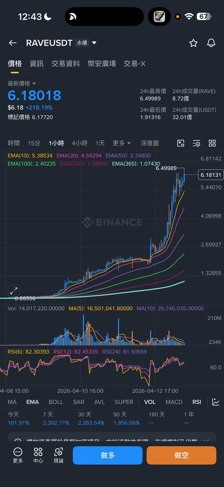

# 庄币数据分析的信号失真与后视镜陷阱

- Author: @0xBanez (Bane💤)
- Published: 2026-04-13 12:54
- URL: https://x.com/0xbanez/status/2043553312247808335?s=52
- Source Type: X Tweet
- Capture Tool: twitter-cli
- Capture Note: 主帖带 1 张配图。全文是对“拿 CoinGlass 指标研究庄币”这条路线的系统降温。

## 配图

## 主帖正文

作者说自己从 `2020` 年开始就是较早一批拿着 `CoinGlass` 数据试图分析庄币的人，过去也发过很多类似内容。

但后来发现事情没那么简单。每个币的模式都很不同，在高度控盘且资金准备相对充足的情况下，庄家对盘面有很多种获利方式。

可以被利用的指标组合很多：

- 资金费率
- 价差
- 爆仓
- 吸引对手盘
- 甚至假的合约数据

如果现货控盘程度极高，你就算拿着可观资金去对打，也不一定有意义。很多大户甚至基金都在庄币上亏过钱。

作者特别强调，很多事后看起来言之凿凿的“定论”，其实只是后视镜效应。因为主力如果想转向另一个方向做，一样能获利，很多看上去很美的分析并没有稳定意义。

作者还点名提到，前几天很多人在分析 `RAVE`，说得很笃定，但结果可能完全相反，甚至亏钱。很多指标组合看上去有效，实际上只是庄家把场子做热的一种行为。

最后作者给出风险态度：

- 这种博弈只能拿小钱玩，彩票仓
- 拿大钱去玩，和去 `Polymarket` 吃尾盘很像
- 你可以赢很多次，但输一次就可能把前面都吐回去

## 补充说明

### 1. 这条内容的重点不是否认数据，而是否认“稳定公式化”

- 作者不是说 `OI / funding / basis / liquidation` 都没用
- 而是说在高度控盘盘面里，它们都可能被反向利用

### 2. 作者把“做热场子”看成最容易误导人的阶段

- 很多看似有效的组合，其实只是为了把更多对手盘吸进来
- 这意味着你看到的信号，未必是“答案”，可能只是“舞台布景”

### 3. 真正保命的不是看懂一次，而是承认赔率分布很差

- 只拿彩票仓，本质上是在承认单次尾部伤害极大
- 这是对策略分布而不是对方向判断的敬畏
