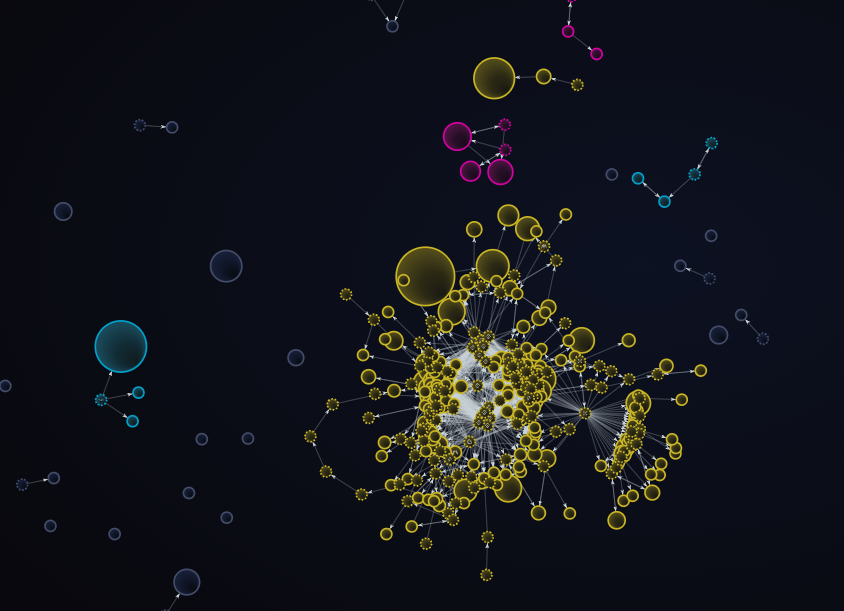
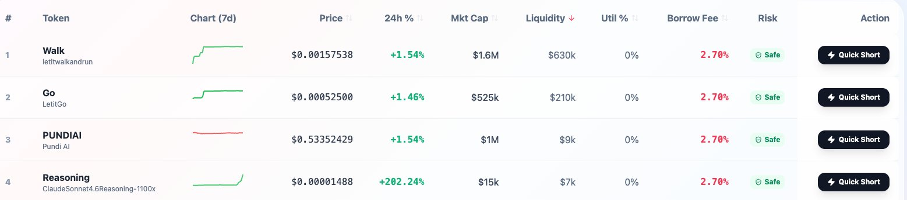
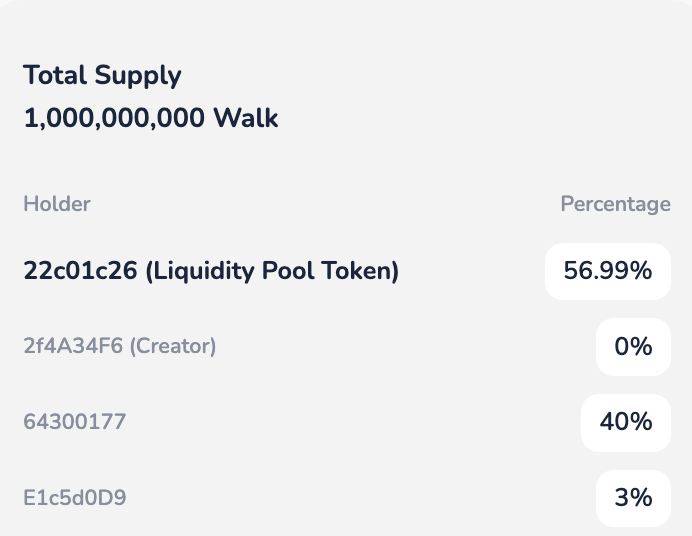
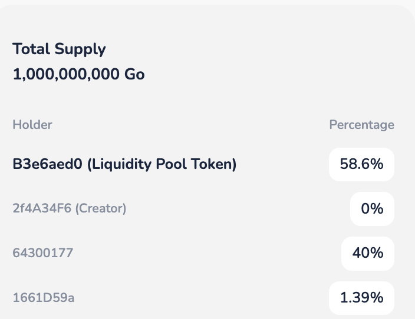

# 普通人如何用10分钟识别一个Token背后有庄？

- Author: @agintender (danny)

- Published: 2026-04-08 19:17

- URL: https://x.com/agintender/status/2041837904255971403

- Source Type: X Article

很多人研究链上数据，是想找出"这个币有没有庄"，然后想方设法地避开、拥抱、跟随它。 但真相是——没有庄的币，根本不会涨。 所以真正有用的问题不是"有没有庄"，而是"庄正在哪个阶段"——吸筹、拉升、出货，还是已经跑了？

先说结论：你一定能找到庄，因为庄无处不在。

这篇文章给你一套链上+链外的信号框架。不是让你当侦探抓庄家，而是让你快速判断：此刻这个盘，是不是一个对散户友好的阶段。

## 一、链上信号：筹码和资金在说什么

记住：这个版本不缺资金、数据，缺的是愿意下场的资金。与所有的游戏一样，一切都是围绕着怎么让你“付费充值”展开的。只要你持续关注，千meme千面，总有一款适合你。

1：筹码集中度——关联钱包合并计算 ，集中不重要，集中到什么程度很重要

不要只看"Top 10 Holders占比"，这个数字谁都会看，而且容易被伪装——庄家把币拆到50个钱包，每个只持有1%，Top 10看起来很"健康"。 正确的做法是打开专业的追踪软件看气泡图，把有连线的地址（存在直接转账关系）合并计算。三个各持2%的钱包如果互相转过账，那就是一个人持有6%。再看这些关联地址的买入时间——如果集中在同一天甚至同一小时内建仓，就问你，你相信巧合吗？

资金来源溯源（funding wallet analysis）——这些钱包的初始 ETH/BNB 是从哪来的？如果 50 个钱包的 gas 费都来自同一个 CEX 提款地址或同一个 funding wallet，即使彼此之间没有直接转账，也大概率是同一个人。

如果有人花钱在收，你觉得他们想干什么？

2：成交量真实度——Vol / Holder (OI) 数

24小时成交量 ÷ Holder总数 = 每个持有人平均贡献的交易额。如果一个只有800个Holder的币，24小时成交量200万美金，平均每人2500u——这大概率是少数几个地址在疯狂对倒刷量，或者是机器人在跑。有人花钱去刷交易量是为了什么？

然后，你再计算全网的vol/holder，以及top3 trending token的vol/holder比。

3: DEX 流动性池监控

观察 LP（流动性池）的增减——庄家撤 LP / 加厚LP 是跑路/整活儿的信号。如果 LP 没有锁定（unlocked），或者锁定即将到期，风险极高。同时观察 LP 的深度变化，如果价格在涨但 LP 深度在变薄，说明庄家可能在悄悄抽流动性，准备跑路时减少自己的损失，反之亦然。

你再对比top 5 trending token的LP情况和厚度。

4：换手合理性——24h Vol / 市值

衡量"每天有多少比例的市值被交易了一遍"。按小时拆开看，如果某几个小时的成交量突然飙到远超其他时段，说明有人在集中刷量。正常散户交易时间分布相对平滑，突然的尖峰大概率是搞事儿的前奏。另外，更有价值的是看净买入量（net buy volume）而不是总成交量

然后，你再计算全网的vol/holder，以及top3 trending token的vol/holder比。

5：交易笔数 vs 成交量——大单占比

看24小时内平均每笔交易的金额。如果top10%的大交易占了总成交量的60%以上，这个盘面就是被少数地址驱动的，价格走势完全取决于这几个地址。（更好的方法是用基尼系数来量化交易额的集中度，0 到 1 之间，越接近 1 说明越集中）。这几个地址什么时候不动，比动更重要。

然后，你再计算全网的vol/holder，以及top3 trending token的vol/holder比。

6: 地址/账户/oi增长率 vs 价格变化率——判断庄在哪个阶段

结合前5个指标的计算（务必要加工、筛查和计算），你再结合数据分析出该标的目前身处哪个阶段？

- 吸筹阶段： 价格低位横盘甚至微跌，链上大地址缓慢买入，钱包/账户数量变化不大。庄在悄悄收集筹码。（那种关联的地址数不算哈～ ）

- 拉升阶段： 举个例子：比如价格涨30%，钱包/账户数只涨了5% → 筹码没散出去，少数人自拉自演。

- 出货阶段（最危险）： 价格横盘甚至微跌，但钱包/账户数涨（有时候也体现在long/short ratio）了20% → 庄在高位慢慢出货给散户，看起来"社区在壮大"，其实是庄在撤退。

- 已跑阶段： 价格跌了，钱包/账户数不减少 → 散户被套死，庄已出完。

## 二、看完之后呢？

好，你花了时间，确认了有庄，还在xxx阶段。然后呢？换一个？再换一个还是有庄。因为——

## 三、庄不是Bug，庄是这个游戏的底层结构

一个Token凭什么涨？拉盘需要两样东西：筹码 + 资金。 这两样东西合在一起，叫做定价权。 筹码不够集中，权益不足，就没有人有动力去拉盘。

筹码集中不是阴谋，是拉盘的前提条件。没有庄就没有行情。

## 四、庄在用什么赢你

定价权只是入场券。真正让庄稳赢的，是他们做交易的方式和你完全不同。你在凭感觉，庄在用体系。

- 庄的成本意识： 计算拉盘出货的收益，EV为正就做。散户凭截图冲。

- 庄的概率思维： 持续修正概率和仓位。散户反复押注。

- 庄对心理的利用： 制造FOMO、利用沉没成本让你死扛。

- 庄的工具优势： 能对冲、有成本/信息优势，操作维度和容错空间碾压散户。

## 五、那散户凭什么赢？

在庄的主场，用庄的规则，散户赢不了。信息、工具、心理全面不对称。但这里面有一个不对称是可以被打破的。

## 六、散户最大的结构性缺陷：只能做多

在没有perp（永续合约）的时候，庄家确实也只能做多，但他不需要做空。 原因在于成本。

庄家的筹码成本低到接近于零（gas费或早期极低价）。哪怕跌了90%，他依然是赚的，只是"少赚"。超低成本给了他极大的容错空间。

但散户是在FOMO阶段追高的，成本可能是庄家的50倍。你的成本结构决定了你承受不了回撤。 散户既没有做空工具，也没有低成本安全垫。唯一能赚钱的场景是：买了之后涨了，并在跌之前卖了。

一个方向，一个窗口，容错率几乎为零。这是结构性的不公平。

## 七、如果散户也能做空呢？这就是 youcanshortit.com 存在的意义

当信号指向出货阶段、虚假繁荣时——你不只是"赶紧跑"，你可以开空，让庄的出货变成你的利润。真相回归的时候，你能站在赚钱的一边。你的分析能力终于不再被浪费了。

## 八、机制透视：有了做空权，散户就能掌握定价权吗？

直接说结论：不能。

定价权的公式永远是：筹码 + 资金。散户的本质就是资金分散、各自为战的群体。机制再精妙，也无法把一盘散沙变成一尊大炮。 但是，引入 youcanshortit.com 这样的去中心化现货杠杆和借贷协议，并不是为了让散户“当庄”，而是为了打破庄家对定价权的“绝对垄断”。

从机制上拆解，这重塑了三个维度的结构：

1. 凭空创造“卖盘”，剥夺单边控盘权

在纯现货市场，庄家不卖就没有抛压，左手倒右手就能拉盘。但做空机制介入后，散户通过超额抵押借出代币砸向市场，原本“被锁定”的死筹码变成了活跃卖盘。这强制给庄家的拉升增加了真实的资金成本。庄家想继续拉，就必须真金白银吃下被做空砸出来的单子。

2. 价格发现的对称性：刺破“虚假叙事”

以前发现庄家出货或叙事证伪，散户只能“不买”，坏消息无法体现在下跌上。做空机制允许散户将“利空信息”转化为实质性的卖单，让价格走势不再是庄家单向画线的游戏，而是多空博弈的真实结果。

3. 从“肉鸡”到“猎手”的转变

做空平台实际上在加速Meme币的生命周期。这种机制无法让你变成制定规则的庄家，但它把散户从“只能挨打的接盘侠”变成了“手里有枪的猎手”。

## 九、但做空不是万能药——你必须知道的风险

做空Meme币的风险极高，亏损理论上没有上限。 庄家最擅长的事就是轧空（Short Squeeze）。故意拉高触发空头爆仓，用你的爆仓资金进一步推高价格。时机错了，方向对了也是亏。而且流动性差、滑点大，做空成本也很高。

做空不是"看懂了就能赚"，是给你多了一个方向的选择权。你依然需要控制仓位、设好止损。做空把你从"筹码"变成了"玩家"，玩家也会输——只是输得更有尊严。

## 最后

这篇文章教你的不是"如何避开庄"，而是让你理解：

1. 庄无处不在，别找"没庄的币"，关键是判断庄在哪个阶段。

1. 散户最大的劣势是方向单一。庄有低成本做安全垫，你没有。看懂了涨能赚，看懂了跌却只能跑——这不合理。

1. 做空权是散户从"被收割"到"上牌桌"的最后一块拼图。

它是武器，不是护身符。哪怕这把枪有炸膛的风险，有枪和没枪，是两个完全不同级别的博弈级别。我们要做的是“对等武装”，让散户也能做空。

## One more thing

如果你看到这里想跃跃欲试，youcanshortit.com 可能有适合你拿来练手的标的。

举个例子： （在Bnbchain  Pancake swap上）

WALK (ca:0x9234e981e395dA3BE7b00B035163571698f8f756)

目前的mc是1.6m

筹码结构：

57% Pancake liquidity pool (v3)

0% Creator （Dev）

40% 在 youcanshortit.com的vault （供大家借空）

3% Pancake liquidity pool (v2)

注意：交易有风险，交易需要谨慎。DYOR。

Go (ca:0x0a5D8c6D776A5903Bc568f41aADEeb4c71D2FFba)

目前的mc是550k

筹码结构：

58.6% Pancake liquidity pool (v3)

0% Creator （Dev）

40% 在 youcanshortit.com的vault （供大家借空）

1.4% Pancake liquidity pool (v2)

不管你是想抢夺定价权、体验收割庄家、还是扮演庄家、还是想参与一次不一样的社区实验，这次让我们一起体验从“肉鸡”到“猎手”的攻防轮换体验吧～

给大家72h的时间准备好～

注意：交易有风险，交易需要谨慎。DYOR。
