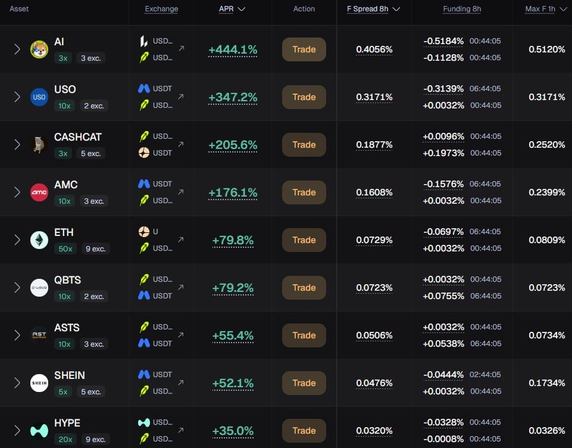

# Full guide to farming funding arbitrage

作者：Alekzz（@AIexey_Stark）

原文：https://x.com/AIexey_Stark/status/2099927177630507422

发布：2026-09-15T18:23:48+00:00

归档：2026-09-18。正文为来源材料，作者的收益、规则及推广表述未作独立认证；无关推荐和广告不纳入整理，原始详情 JSON 原样保留。

Full guide to farming funding arbitrage

this is a very underrated thing, especially for low-capital traders, let’s break it down in details.

funding is a fixed payment made at certain intervals, where either shorts pay longs or longs pay shorts.

sometimes this can be very profitable if you select the right asset wisely.

the idea is to choose two DEXs/CEXs where funding is opposite: positive on one and negative on the other.

after that, you have to calculate the execution costs, consider the spread, monitor funding changes, etc.

sometimes it can be really difficult, but that’s why trading desks exist - they show all the information you need.

I’ve used a lot of terminals, and I can confidently say that @vooi_io is the greatest one.

join via link: https://ultra.vooi.io/i/JH5K5JJU

the best option is to arbitrage between two DEXs, because the fees are often significantly lower.

right now, the platform has 7 DEXes and 3 CEXes available, and you can trade directly via the terminal.

current best arb opportunities:

- long $STONK on aster and short on Lighter Core: +1149% APR.
- long $LSK on Aster and short on Bybit: +863% APR.
- short $USO on Lighter RH and long on Mexc: +329% APR.

very often, crazy APRs come with very low volumes and low liquidity, so watch this closely.

however, it’s worth saying that you won’t be able to farm 500%+ APR for long, funding usually stabilizes after about an hour.

in my opinion, the best way to farm funding is on highly liquid pairs, profit is small, but it’s stable and there’s almost no risks.

for example, right now you can farm 75.5% APR on $ETH by opening a long on Aster and a short on Extended.

just imagine farming funding between @Lighter_xyz Robinhood and @variational_io

you get points on Lighter + points on Variational + money. pure jackpot, lol.

if you’re still not farming Lighter: https://robinhoodchain.lighter.xyz/?referral=ALEKZZZ

experiment, try various strategies, and choose the best one for yourself.

you have plenty to choose from - Vooi offers 818 strategies ranging from 1% to 2000% APR.

farm smarter. perp dex season is here.

## 可见相关回复

本次接口仅提供部分可见回复；未将推荐流中作者的其他帖子误认作本帖补充。

### @AIexey_Stark · 2026-09-15T18:24:27+00:00

https://x.com/AIexey_Stark/status/2099927340188840376

Register on Lighter:
https://t.co/tzOZe4aZwP

### @Zeus00nn · 2026-09-15T18:39:59+00:00

https://x.com/Zeus00nn/status/2099931250236801205

@AIexey_Stark @givenoxbt @Lighter_xyz @variational_io Nice breakdown bro

Vooi looks interesting

### @AIexey_Stark · 2026-09-15T18:41:43+00:00

https://x.com/AIexey_Stark/status/2099931687656317100

@Zeus00nn @givenoxbt @Lighter_xyz @variational_io 🤝

### @cryppimagic · 2026-09-15T20:10:22+00:00

https://x.com/cryppimagic/status/2099953995154649278

@AIexey_Stark @Lighter_xyz @variational_io PERP
DEX
LIST

### @AIexey_Stark · 2026-09-15T20:24:32+00:00

https://x.com/AIexey_Stark/status/2099957561155830138

@cryppimagic @Lighter_xyz @variational_io Great product as well

### @givenoxbt · 2026-09-15T18:40:47+00:00

https://x.com/givenoxbt/status/2099931450170601916

@AIexey_Stark @Lighter_xyz @variational_io well detailed breakdown ser

### @AIexey_Stark · 2026-09-15T18:41:21+00:00

https://x.com/AIexey_Stark/status/2099931591921312245

@givenoxbt @Lighter_xyz @variational_io Appreciate the support, g

### @vooi_io · 2026-09-16T08:02:35+00:00

https://x.com/vooi_io/status/2100133230418489739

@AIexey_Stark @Lighter_xyz @variational_io appreciate the shout out!

### @magsimich · 2026-09-16T07:14:27+00:00

https://x.com/magsimich/status/2100121118980071588

@AIexey_Stark @Lighter_xyz @variational_io funding arbitrage is pretty underrated

### @Ronin9x · 2026-09-16T06:43:38+00:00

https://x.com/Ronin9x/status/2100113360750862424

@AIexey_Stark @Lighter_xyz @variational_io Extremely detailed

### @Vannok1 · 2026-09-15T20:45:27+00:00

https://x.com/Vannok1/status/2099962822675558410

@AIexey_Stark @Lighter_xyz @variational_io Why do we need lending protocols if we can earn a hundred times bigger APR like this?

### @NOJOBNOPLANER · 2026-09-16T03:55:45+00:00

https://x.com/NOJOBNOPLANER/status/2100071113179209945

@AIexey_Stark @Lighter_xyz @variational_io nice

### @me_cool_off · 2026-09-15T19:17:37+00:00

https://x.com/me_cool_off/status/2099940720580653241

@AIexey_Stark @Lighter_xyz @variational_io so many inefficiencies to profit from, gotta act now

### @PolyDekos · 2026-09-15T18:45:41+00:00

https://x.com/PolyDekos/status/2099932685191860604

@AIexey_Stark @Lighter_xyz @variational_io Good guide

### @Gyokeres_eth · 2026-09-16T03:27:44+00:00

https://x.com/Gyokeres_eth/status/2100064061262115293

@AIexey_Stark @Lighter_xyz @variational_io tell them

Vooi looking good
