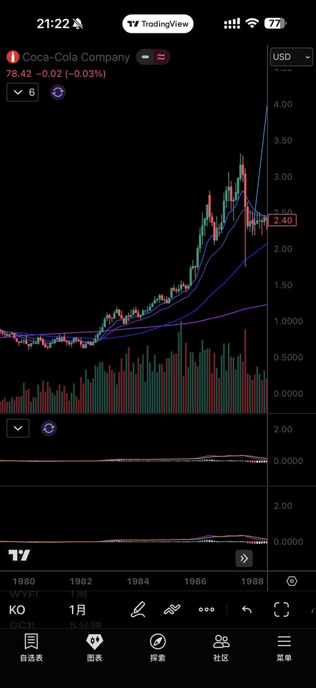

# 真正学习巴菲特，不是抄13F，而是理解自己时代的护城河

- Author: @AntonLaVay (Manchurius Hao — Greeks.live首席赌狗)
- Published: 2026-05-11 03:33
- URL: https://x.com/antonlavay/status/2053559073145311675?s=52
- Source Type: X Tweet
- Capture Tool: twitter-cli
- Capture Note: 主帖正文完整，带 1 张配图。内容是在回应一条“AI不是泡沫，巴菲特才是泡沫”的推文，并借题发挥讨论如何真正学习巴菲特。

## 配图

## 引用上下文

主帖引用的原推文核心是：

`AI不是泡沫，巴菲特才是泡沫。`

原推作者的意思大致是：

- 有人因为巴菲特卖苹果、持有大量现金，就清空股票等一场世纪暴跌
- 但更可能发生的是：股票先从 `100` 涨到 `300`，再跌到 `180`
- 你之后在 `180` 买入，自以为等到了暴跌，其实仍然错过了大段主升浪

## 主帖正文

真正学习巴菲特，不是买他买过的股票，是学其神而非仿其形，是阴用其言而显弃其身。

真正的投资者，不应该成为偶像崇拜者。

巴菲特也好，或是别的什么人。我们要学的是他们能够对你自身有益的一些框架。如果只是抄 `13F`，你丫就一跟单的。更重要的是，年轻人首先应该气盛，一定要相信自己是会比老登更强的，而不是成为偶像崇拜者，这是人类社会进步的根本原因。

巴菲特讲能力圈，讲护城河，讲长期竞争优势。他的能力圈是什么？我们的能力圈又是什么？能源、消费、保险、铁路、金融这些老登产业是你能力圈吗？你丫到底在学啥？

如果你真的理解“护城河”，那你在 `2025` 年就应该意识到：

- `HBM`
- 先进封装
- 存储
- 关键电力设备
- `AI` 数据中心的瓶颈环节

本身就可能是这个时代的护城河。

真正的护城河，不一定长得像可口可乐或是 `$oxy`。

更重要的是，你如果把年轻时候的巴菲特拉到现在来，他会做什么？

巴菲特建仓可口可乐的时候，难道是在买一个“上一代价值投资老登最喜欢的低估烟蒂股”吗？

不是。

可口可乐当时已经是全球知名品牌，不是无人问津的破烂资产。巴菲特真正做的，是在一个已经优秀的公司里，看到了市场还没有充分理解的长期复利能力。

你巴 `88` 年买 `$KO` 的时候，`$KO` 是一个从底部已经涨了五倍的股票。这是用护城河框架，识别一个时代正在形成的利润池。

你巴丫狗日的 `88` 年追 `$KO` 的行为，更像是前几个月 `600` 追 `$SNDK`，而不是看什么 `$OXY`。

你巴和芒格是铁哥们，芒格的性格你们知道的。

我觉得甚至巴菲特本人都无法理解拿着他的理论在那抄持仓尬经的神奇群众。

理解自己时代的护城河。  
这是年轻巴菲特成就伟业的方式，他不是更早老登的偶像崇拜者。

以下是你巴 `88` 年追 `$KO` 时代的 `K` 线。
