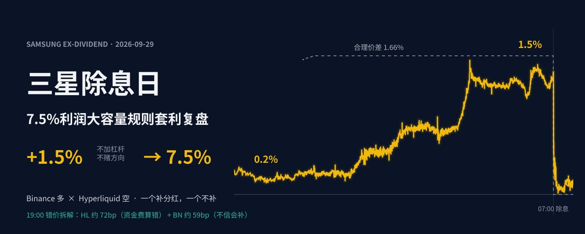
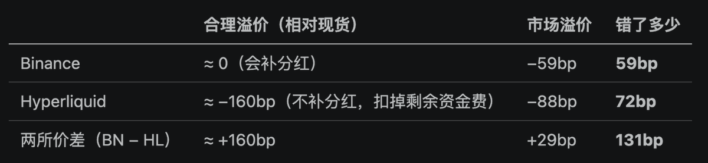
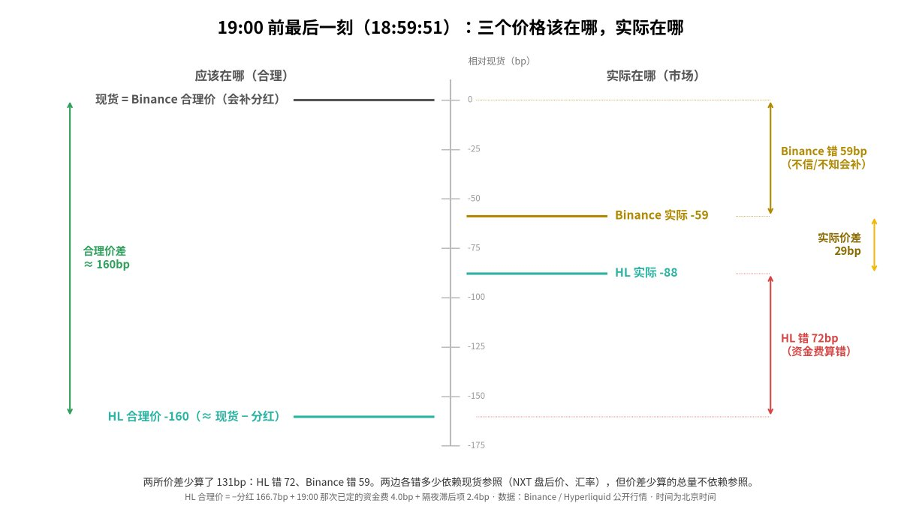
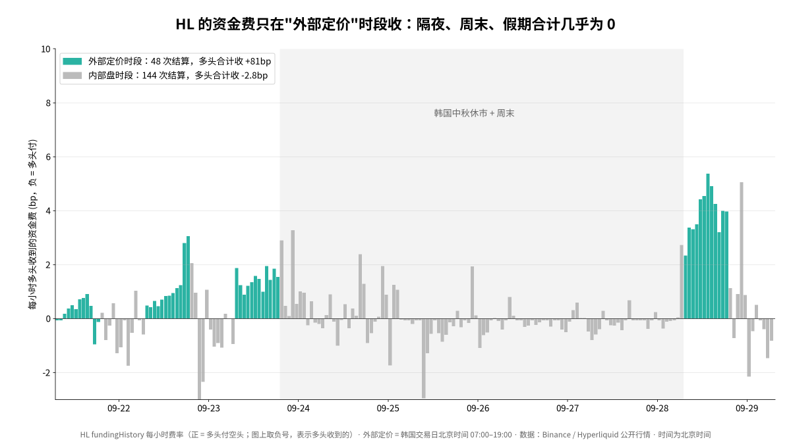
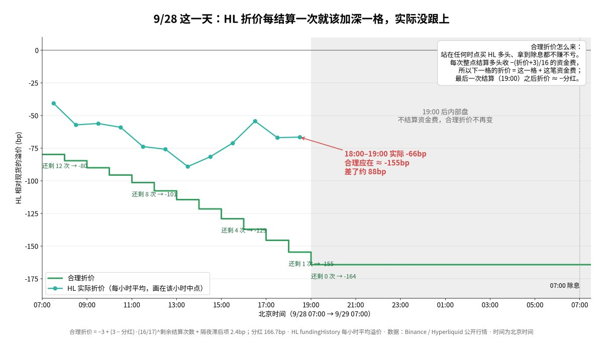
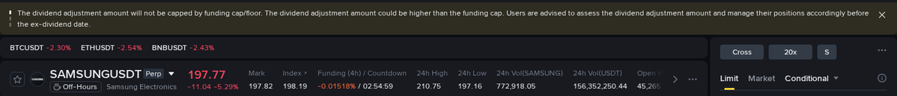
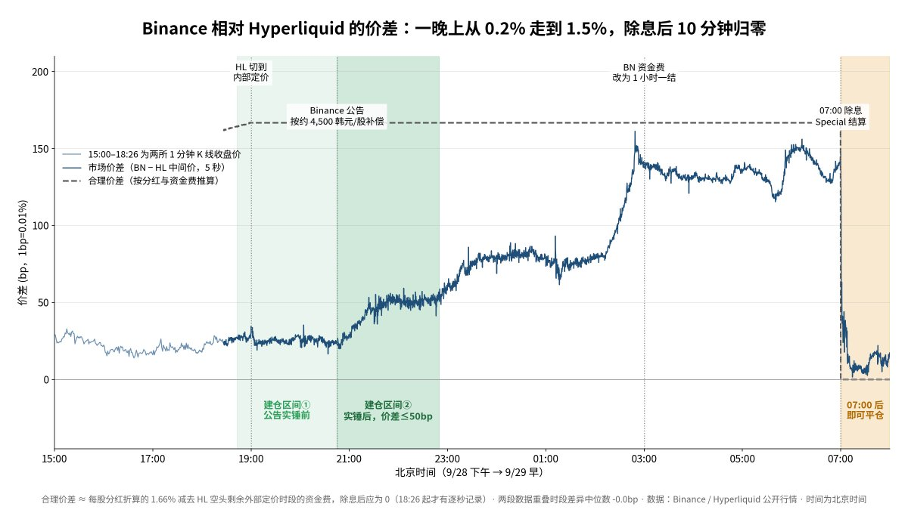
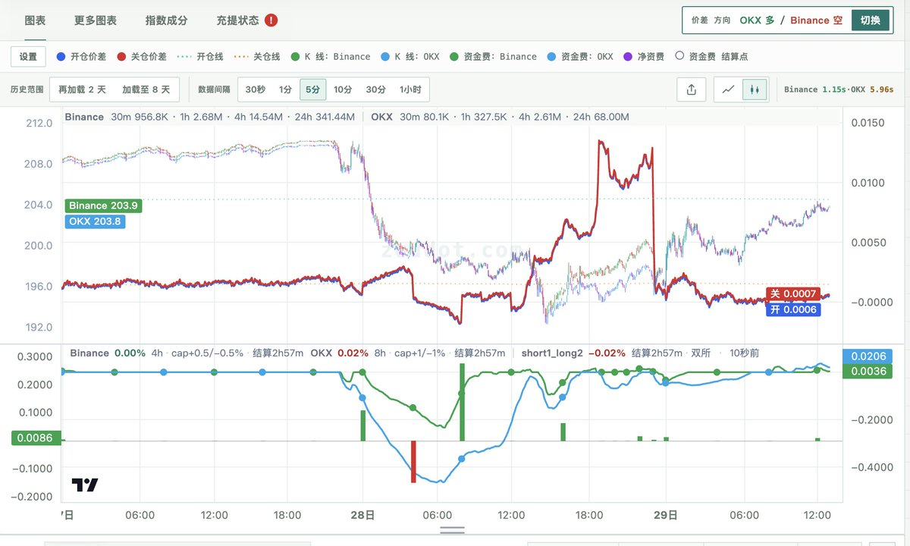
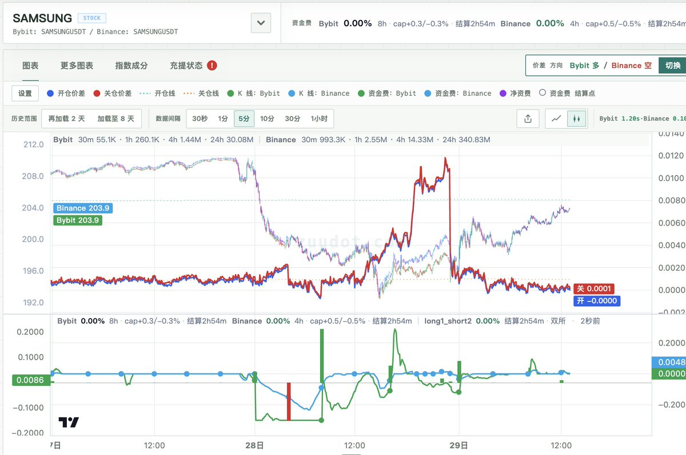

# 三星除息日——7.5%利润大容量无风险规则套利复盘

作者：0xBilly (@Billy0xFF)

原帖：https://x.com/Billy0xFF/status/2104795363140096270

发布时间：2026-09-29 12:48:14（北京时间）；文章修改时间：12:56:52。

> 以下为来源正文及本次可见回复快照；保留原文主张，不代表已独立证实。抓取不能保证覆盖全部回复。

9 月 29 日三星除息。Binance 用一笔特殊资金费把分红补给永续多头，Hyperliquid 不补。然而，两所对除息信息产生不同原因的定价错误。我们在 BN 做多、HL 做空，持有约 12 小时，最终不加杠杆利润率 1.5%，两所10倍杠杆利润率7.5%。

## 一、背景：三星1.7%大额特殊分红

三星平时每季度股息率 0.1% 出头，没人在意。

8 月，三星公告 Q3 派息总额约 30 万亿韩元，折合约 4,500–4,600 韩元/股，约占股价 1.67%。除息时点是固定的：北京时间 9 月 29 日早上 7 点，韩国 NXT 盘前开盘那一刻。

## 二、两家交易所的规则不一样

现货股东除息时，股价掉 1.7%，账户里多出 1.7% 的应收股息，两者抵消。永续合约没有股息，如果交易所什么都不做，多头就白亏这 1.7%。

- Binance：TradFi 永续有专门的 Special 资金费。除息那一刻额外结算一次，费率 = −每股分红 / 价格，由空头付给多头。

- Hyperliquid：文档写明持仓者不获得分红。除息时价格跟着现货下跳，多头吃下跌幅。

所以理论上：Binance 永续的合理价格 ≈ 现货；HL 永续的合理价格 ≈ 现货 − 分红。

## 三、错价拆解：谁错了，错了多少

要把错价拆开，需要一个两边共同的参照，也就是三星现货本身。我们取北京时间 9 月 28 日 19:00 前最后一刻：这时韩国 NXT 盘后还在交易、现货有实时价格，下一秒 HL 就要切到内部盘。

131bp 的错价里，HL 占 72bp（约 55%），BN 占 59bp（约 45%）。两边都错了，HL 错得更多。

## 四、HL 为什么错：资金费算错了

4.1 HL 的资金费怎么收

 xyz的RWA永续每小时整点结算一次资金费，每 8 小时的费率是：

> F₈ = 0.5 × [P + clamp(0.01% − P, ±0.03%)]

永续深度折价时，公式简化成：每小时多头收 −(P + 3bp)/16

4.2 逐小时倒推合理折价

"完全定价"的意思是：无论在哪个时点买入 HL 多头、持有到除息，都既不赚也不亏。 每小时都要满足这个条件，所以折价不是恒定的，而是越接近除息越深。经过公式推导，还剩 n 次结算时，合理折价是：

> P(n) = −3 + (3 − d) × (16/17)ⁿ

其中，关键在于 n 该数几次。

4.3 为什么盘后是"内部盘"

xyz的参考价在传统市场开盘的时候来自外部成交。而北京时间 19:00 韩国 NXT 收盘后，到次日 07:00 盘前开盘，中间没有任何外部成交价。这 12 小时里，参考价改用 HL 自己盘口中间价的 30 分钟指数均线。

参考价追着合约自己的价格走，合约折价多少参考价就跟多少，假设价格变化是0，溢价 P 的数学期望是0，隔夜的资金费可以当成0。

所以19:00时，理论上−160bp的折价就应该完全price in，因为之后的资金费期望是0。

4.4 市场错在哪

市场给的 −88bp，相当于以为切换前还有约 11 次结算，和"把隔夜也当成收费时间"的错误算法（−77bp）很接近。也就是说，市场默认 HL 会像普通 24 小时永续一样整晚收资金费，以为"折价 88bp 加一晚资金费"就能补回分红。实际上 19:00 之后是内部盘，一晚上只收到个位数 bp，这 88bp 的折价只补偿了分红的一半多。

## 五、Binance 为什么错：不知道、或者不信它会补

Binance 的合理溢价约等于 0。它会补分红，除息那一刻多头不亏，所以 Binance 永续应该跟现货持平；当晚 Binance 的常规资金费也基本为 0。市场却给了 −59bp 的折价，相当于只相信 Binance 会补约 65%。原因有三个：

1. 很多人不知道 Binance 会补。大家对永续的默认认知是"没有分红"。

1. 知道的人也不确定补多少。三星公告只有总额，精确的具体每股金额 10 月底才定；

1. 大额特别分红没有先例。

我们为什么一开始就认为 Binance 会补：

1. 金额好估，不确定性小。 30 万亿 ÷ 流通股数 ≈ 4,570 韩元/股；就算按 28 万亿保守算，也有 1.5% 以上。"每股金额没定"并不妨碍 Binance 先按估算值补，最多事后补差。

1. Binance 已经在为大额补偿做准备。 SAMSUNGUSDT 交易页挂着一条三星专属提示："分红补偿不受资金费上限约束，可能高于上限"，同期其他韩股页面没有。如果只是补 370 韩元的常规季息，根本碰不到上限，没必要挂这条。

1. ETF 已经有"按预估先补"的先例。 Binance 规则写明，ETF 的分红本来就是按预估金额在除息时结算。三星"只有总额、每股待定"本质上是同一种情况，套用同一套做法就行。

9/28 20:45，Binance 发公告：按约 4,500 韩元/股补偿，最终金额确定后一周内补差。所有不确定性就此消掉。

## 六、过程：价差是怎么被修正的

07:00:01，Binance 结算 Special 资金费，费率 −1.663%，反推约 4,508 韩元/股，和公告一致。之后两所价差回到接近 0。

回头看，有两个建仓区间：

- ① 公告实锤前（20:45前）：价差只有 +0.2% 到 +0.3%，赌的是 Binance 会补、而且补得足额，这是这笔交易唯一的不确定性。

- ② 实锤后（20:45 到 23:00 前）：Binance 公告已经给出补偿金额，最大的不确定性没了，但价差还停在 +0.5% 左右。这时候进场，风险更小，剩下的空间仍有约 1.1%，是整晚性价比最高的一段。

- 平仓：07:00:01 补偿到账后随时可以平，价差迅速回到 0 附近。

## 七、结果：不加杠杆 1.5%，两所各 10 倍 7.5%

我们在价差 +0.3% 附近建仓，持有过除息，07:00 之后平仓：

- Special 资金费：+1.66%

- 进出场价差变化：约 −0.14%

- 两边常规资金费合计：约 −0.01%

合计约 +1.51%（名义本金，未扣手续费），持仓约 12 小时。

## 本次可见相关回复（按接口顺序）

### @lifecrashsss4 · 2026-09-29T11:06:23+00:00

https://x.com/lifecrashsss4/status/2104890528274002201

@Billy0xFF 细啊

### @SteinAmour · 2026-09-29T10:34:22+00:00

https://x.com/SteinAmour/status/2104882469753483706

@Billy0xFF 感谢分享！保存下来，逐帧学习🧐

### @Billy0xFF · 2026-09-29T10:48:56+00:00

https://x.com/Billy0xFF/status/2104886134920950132

@SteinAmour 哈哈 也是上回咱一块搞原油的经验

### @0xanonnnn · 2026-09-29T09:46:23+00:00

https://x.com/0xanonnnn/status/2104870396952715302

@Billy0xFF 跟着billy学套利 ❤️

### @Billy0xFF · 2026-09-29T09:49:30+00:00

https://x.com/Billy0xFF/status/2104871181195395226

@0xanonnnn 跟北大哥学链上😁

### @ZLiao3 · 2026-09-29T09:36:49+00:00

https://x.com/ZLiao3/status/2104867989736820847

@Billy0xFF 其实不是第一次发分红了，只是这次特别大额。

### @Billy0xFF · 2026-09-29T09:47:11+00:00

https://x.com/Billy0xFF/status/2104870594651263238

@ZLiao3 对，但之前是常规分红，这次是需要特殊处理的。我在公告前主要是怕bn草台了，没看到这次的特殊情况，按常规的处理了

### @ZhTomz76000 · 2026-09-29T09:44:04+00:00

https://x.com/ZhTomz76000/status/2104869810358428030

@Billy0xFF 明天的strc也分红，也一样能做吧

### @Billy0xFF · 2026-09-29T09:48:34+00:00

https://x.com/Billy0xFF/status/2104870946847027316

@ZhTomz76000 容量太小，三星几百M，strc一两M日交易量

### @shilei · 2026-09-29T11:17:35+00:00

https://x.com/shilei/status/2104893344812036110

@Billy0xFF hl这机制设计不多头白亏了么？🥹

### @Billy0xFF · 2026-09-29T11:29:19+00:00

https://x.com/Billy0xFF/status/2104896299980194270

@shilei 如果定价正确，hl会提前折价，资金费=股息。文章有推导理论价格

### @chooseLBY · 2026-09-29T07:20:44+00:00

https://x.com/chooseLBY/status/2104833739436278243

@Billy0xFF 这次吃到三星的都是高手

### @Billy0xFF · 2026-09-29T09:15:43+00:00

https://x.com/Billy0xFF/status/2104862679877955868

@chooseLBY 小农一波

### @youchengyu0324 · 2026-09-29T09:22:13+00:00

https://x.com/youchengyu0324/status/2104864314452767001

@Billy0xFF 刪了吧😭

### @Billy0xFF · 2026-09-29T09:50:09+00:00

https://x.com/Billy0xFF/status/2104871343229632801

@youchengyu0324 开源精神

### @lyy_1996 · 2026-09-29T06:48:12+00:00

https://x.com/lyy_1996/status/2104825555812294934

@Billy0xFF 其实binance的做法很离谱，头一天晚上才突然说补。但正是这种规则差异化，让套利机会出现

### @Billy0xFF · 2026-09-29T06:56:43+00:00

https://x.com/Billy0xFF/status/2104827697302274241

@lyy_1996 会提前说其实还可以了 有些所不说的

### @0xDC_MA · 2026-09-29T13:05:55+00:00

https://x.com/0xDC_MA/status/2104920609658671609

@Billy0xFF 精彩的分析，在如果观察合约数据，Binance 和OKX，Bybit之间的合约价差也是实时反映的 https://t.co/BF8SF7XwJL

### @aezaumi · 2026-09-29T11:10:02+00:00

https://x.com/aezaumi/status/2104891444850983247

@Billy0xFF 难怪突然监控到龙王开仓三星了

### @huojichuanqi · 2026-09-29T10:44:51+00:00

https://x.com/huojichuanqi/status/2104885108591505645

@Billy0xFF 厉害

### @lo2cin4 · 2026-09-29T09:25:21+00:00

https://x.com/lo2cin4/status/2104865101304238565

@Billy0xFF 漂亮

### @qbnrc · 2026-09-29T11:19:46+00:00

https://x.com/qbnrc/status/2104893895566131702

@Billy0xFF @CryptoRounder

### @bitram · 2026-09-29T09:28:03+00:00

https://x.com/bitram/status/2104865782035349710

@Billy0xFF 竟然能从这个角度切入
牛逼

### @_maomao_zw · 2026-09-29T11:41:56+00:00

https://x.com/_maomao_zw/status/2104899474946744820

@Billy0xFF 学习

### @PhyrexNi · 2026-09-29T09:24:14+00:00

https://x.com/PhyrexNi/status/2104864822135570738

@Billy0xFF 厉害了

### @jingzhong634 · 2026-09-29T10:29:59+00:00

https://x.com/jingzhong634/status/2104881368081817849

@Billy0xFF 优雅 https://t.co/69jYE2pzRO

归档范围说明：接口返回的两条广告不纳入正文；装饰性动图不下载，媒体链接保留于原始 JSON。图片保持文章相对位置，富文本样式简化。
