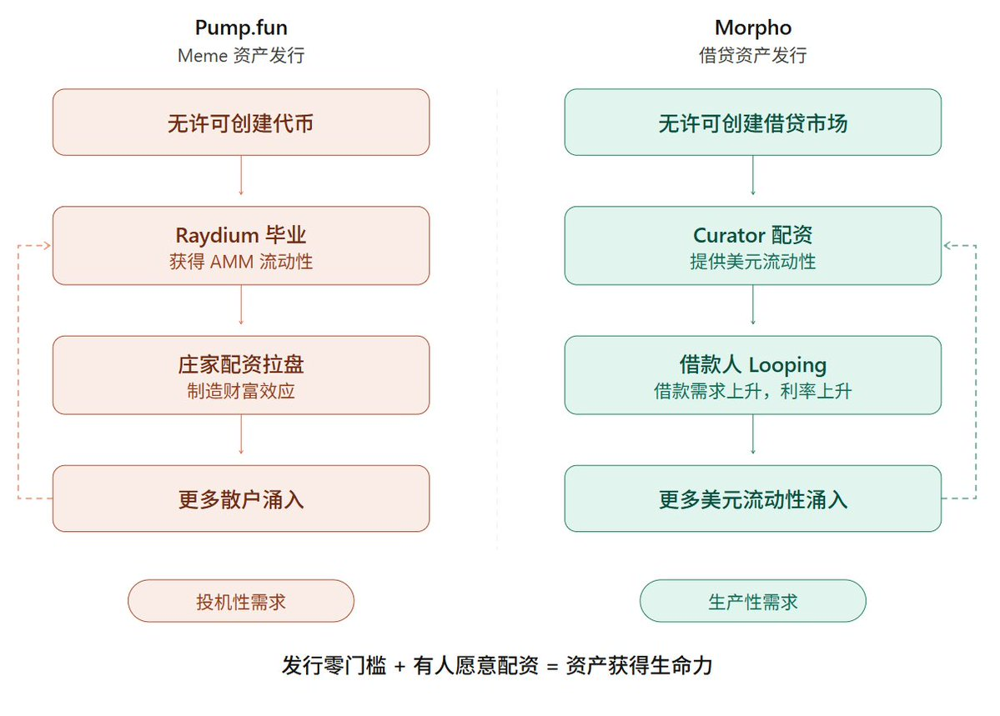

# Morpho 作为借贷资产发行协议

- Author: @bonnazhu (Bonna | U酪乳)
- Published: 2026-04-17 22:29
- URL: https://x.com/bonnazhu/status/2045147615344611570
- Source Type: X Tweet
- Capture Tool: twitter-cli
- Capture Note: 主帖为长文推文，包含 1 张配图和 1 条引用推文；评论区主要保留作者回复与有信息量的风险补充。

## 配图

## 引用推文

- Author: @PaulFrambot (Paul Frambot)
- Tweet ID: 2044304119670710442

Paul Frambot 表示 `Morpho Midnight` 是其做过最难、最有野心的事情，团队已经迭代一年半以上；他认为这是 DeFi 协议设计多年未见的 `0-to-1` 创新，尤其对机构而言可能是一次基础性解锁，等待审计完成后披露更多。

## 主帖正文

关于 @Morpho ，特别想聊点不一样的东西
以及为什么固定利率会进一步强化其叙事飞轮

TLDR：

很多人对 Morpho 的理解，可能还停留在它是一个比较独特的借贷市场，协议只负责记账和清结算，不参与资产筛选、利率定价与风控参数。按照团队的说法，这叫做风控外部化（Externalized Risk Management) 。

但这种视角，在我看来却忽视了其作为一个借贷资产发行协议，以及每一个链上资产冷启动必经之路的价值。

而这种无许可创建借贷资产、Curator 配资、组建 DeFi 乐高以进行扩张的体验，其意义与本轮周期 @Pumpfun 之于 Memecoin 是近似的，属于 Game Changing 级别

从这个角度，Morpho 的未来就要比 Aave 性感得多。

干货警告

-----------------------

一个链上资产的扩张其实跟上币是类似的，也是打怪升级、从小所上到大所的过程。在不同阶段，需要接入不同的 DeFi Primitive，以捕获不同风险偏好的用户群体，来完成规模上的扩张。一个目前典型的升级路径是：

- 在 DEX 建立基础流动性（锚定peg，多见于Curve）
- 在 Morpho 创建借贷市场（上链资产抵押加杠杆）
- 在 Pendle 上线 PT/YT （进一步引爆投机需求）
- 在 Morpho 创建 PT 借贷市场（PT资产抵押加杠杆）
- 接入Aggregator平台（进一步分销，进行 Looping）
- 在 Aave 上架（体量级放大，成为蓝筹资产的标志）

@ethena 的 sUSDe 走的就是这条路。而这在DeFi早期年代是不敢想象的，古早时期，一个新资产要在链上生根发芽和扩张，其交易、借贷、收益等等环节基本都需要自己做的，而现在，这些环节逐步解耦了，可即插即用，发行方要做的事情，变成了只要专注资产本身的运营就可以。

而在这一众解耦的环节中，Morpho 可能是唯一贯穿早期（原始资产的借贷市场）和中后期（PT 资产的借贷市场）、且发行方可以低成本接入的 DeFi Primitive，基本是绕不开的存在。

@CurveFinance 建池需要补贴 LP 收益，也会产生贿赂投票成本；@pendle_fi 的飞轮依赖于新币空投预期驱动 YT 投机；@aave 则是只有蓝筹资产才考虑，还要走治理投票才上架；相比较而言，Morpho更即开即用。

-------------------------

而对于很多有合格投资者门槛、KYC地域限制的 RWA 来说，交易环节很难放到链上来进行，同时因为 Pendle 目前也还没有上线 KYC-Gated 的支持。在这种情况下，Morpho 因为其 Vault V2 的无许可市场创建机制和可加白名单的权限控制，实际意义上变成了代币化发行（通过 @Securitize、@MidasRWA、@centrifuge 这样的平台）后链上的第一站，甚至是唯一一站。

Midas 代币化的 @FasanaraDigital 的 mF-ONE，只靠 Morpho Market + @SteakhouseFi Curator Vault，零 Token 激励，从 0 最高曾做到约 $1.68 亿。没有 Curve DEX，没有 Pendle PT/YT，Morpho 就是全部。

抽象出来，这其实就是一种新的 RWA 思路。

过去大家追求的是彻底上链，把 RWA 的门槛打下来，让所有人都能买到，本质是一种分销逻辑，即把加密市场当作新的客户渠道，为 RWA 资产寻找更多买家。这种思路下成功的只能是一小部分硬资产：美股、美债，很好理解，需求足够大、受众足够广，链上用户求之不得。而其他小受众的资产，则 not so much 了，在传统领域都没什么人玩，会因为拿到链上就突然有用户和需求了吗？

而新的思路，不再侧重于让更多的人买到，而是让有资格持有、以及本身在传统金融里就已经持有这些资产的机构，能通过链上的可组合基础设施获得新的能力，本质是一种产品体验升级的逻辑。而这种逻辑下，每个人获得更多的敞口、能做更多的事，从而把 RWA 的成功案例，从美股、美债等硬资产，拓展到一些小范围受众资产。

而这种新逻辑正是对"为什么区块链对于传统资产和资金有吸引力"的回答，即不是所谓的更透明、更有效率那些虚头巴脑的伪需求，而是可以实实在在享受到例如：

- 不卖出资产即可获得流动性
- 循环杠杆，放大敞口和收益

这些传统金融中只有 Prime Brokerage 的优质机构客户才能获得的好处。人无我有，人有我优，这就是链上对传统的差异化竞争，也是资产上链真正的经济意义。

且妙就妙在，获得这些好处并不要求机构把全部业务搬上链。合规审查、申购赎回依然在链下，链上只承接借贷和杠杆这一个最有差异化价值的环节。这意味着即便在资产上链的监管框架尚未完全清晰的情况下，机构也可以通过一个非常实用主义的路径，先从最痛点的环节开始融入到链上，而不需要被迫一步到位、一口气吃成胖子。

Perfect Angle for Growth！

-----------------------------

而这种新思路，也造就了一种新的金融关系。

之前提到，传统金融里，由于私募信贷类资产不是标准化证券，没有很活跃的二级市场，进不了常规的保证金借贷体系，所以针对这类资产的配资基本都是高盛等大投行的 Prime Brokerage 业务部门用自己的资产负债表在做，门槛很高，而在链上版本里，这套关系被重构了。

参与者变成了：

- 资产管理方（Apollo、Fasanara 等）
- 合规发行方（Securitize、Midas、Centrifuge）
- 合格投资者
- 风险策展人（Steakhouse、Gauntlet、Sentora）
- 链上美元流动性

其中，卖方是资产管理方和合规发行方，

他们的客户需要杠杆和流动性。资产管理方负责底层策略，做实际的信贷业务、承销和投资决策，不碰链上；合规发行方负责把基金份额代币化、做投资者 KYC、管理白名单和转让限制，充当链下资产进入链上的合规网关。

买方是风险策展人以及链上美元流动性持有者

风险策展人通过 Vault 聚合全球美元稳定币，向这些 RWA 市场配资，获取管理费和绩效收益。而全球美元稳定币持有人通过存入 Vault，成为资金提供方，间接获得链下私募信贷的收益敞口，获得利息收益。

而买卖双方都是围绕合格投资者在服务的。

但 Curator 在这个关系里扮演的角色最为核心，串联了买卖侧。对卖方（资产端），它评估抵押品、设定 LTV 和 风控参数、决定向哪些 RWA 市场配多少资。对买方（资金端），它聚合全球美元稳定币、提供机构级的收益策略。因此这不只是一个固定收益基金经理那样帮客户做资产配置的角色，它同时也做了传统 Prime Broker 做的事，是民主化 Prime Brokerage 的具象化。

-------------------------------

而如果不去对标传统，而是用一个 Crypto Primitive 去做类比的话，或许一个不完全恰当的比喻：

Pumpfun 之于 Meme
Morpho 之于 Credit Asset

Pumpfun 民主化了代币发行，让任何人都能一键发币，然后通过 Bonding Curve 获得交易流动性。Morpho 则是民主化了借贷资产发行，让任何人都能开一个借贷市场，然后通过 Curator Vault 获得借贷流动性。

他们在飞轮机制上也是类似的：

Pumpfun 无许可创建代币 → Bonding Curve 毕业获得 AMM 流动性 → 庄家配资拉盘制造财富效应 → 产生代币购买的需求 → 更多散户进来

Morpho 无许可创建借贷市场 → Curator 配资提供美元流动性 → 借款人进来做 Looping，产生借款需求，利率上升 → 更多美元流动性进来赚收益。

区别在于，Pumpfun 的配资方是庄家，赚的是拉盘出货的差价，Morpho 的配资方是 Curator 和其背后的美元流动性，赚的是管理费和绩效收益。

一个投机性，一个生产性。

-------------------------------

所以这些又跟固定利率什么关系呢？

是，Morpho Blue + Curator/Vault 已经证明了其PMF，

但假设机构化叙事成立，资产上链浪潮继续，

机构固然会感激有 Morpho Vault V2 能把资金隔离且可设置合规权限的基础设施，也感激有 Curator 这样的 Facilitator 来提供流动性，从而能够让他们把链上这套杠杆机制跑起来，但如果想要更上一层楼，把规模真正做上去，他们还需要利率端的可预测性，因为你不能指望一个机构拿着千万上亿美金的仓位，去接受一个每天都变动的利率，尤其是资产端利率是固定的。

从这个角度看，

固定利率市场似乎从未像现在这样重要。

固定利率市场后期的加入会让 Morpho 的飞轮得到强化：无许可创建市场（吸引资产端）→ Curator Vault 配资（解决流动性端）→ 固定利率撮合（满足机构端的可预测性需求）→ 更多机构资产愿意放钱进来，已经进来的机构愿意放更多钱 → 更多 Curator 愿意配资，从而意味着更多的流动性。

---------------------------------

而至此，Morpho 其整个产品拼图也基本成型。

- Morpho Blue 做开放式变动利率市场
- Morpho Midnight 做固定利率机构市场
- Vaults V2 ，做资产管理层，可接 Blue 和 Midnight

回到开头 Morpho的定位，大部分人还在用"Aave 的竞品"去理解 Morpho，但这两个东西的叙事方向已经完全分叉了。Aave 本质上只是一家链上银行，自己吸储、自己定价贷款、自己风控；Morpho 走的是另一条路，它既是一个借贷资产的发行协议，也是一个各个银行（借贷市场）之间的清算和配资网络。

如果你相信这一轮周期的增量来自机构和资产上链，那 Morpho 就是接住这个增量的基础设施。

cc： @PaulFrambot @MerlinEgalite @kugusha

## 评论区与补充

### 作者回复

- @bocaibocai_：写得太好了
- @bonnazhu：谢谢！
- @hoidya_：或许可以看看 @UnifiedLabs_
- @bonnazhu：对，我看到了菠菜大哥的这个，已经在关注了

### 有信息量的评论

- @ronniew32276793：最大问题是安全。Morpho 的灵活性和可组合性是 Aave 比不了的优势，但如果策展商出事、误操作、被黑或处理不及时，用户没有太多办法；策展商类似 A 股基金经理，基金经理也可能买很多垃圾股票。
- @wavaneth：Morpho 流动性太分裂，几百个池子里大部分深度极浅，利率浮动过大，体验糟糕；Aave v4 统一流动性的方向，长期看可能更好。
- @Till_okb：Aave 是链上银行（B2C），而 Morpho 是金融基建的操作系统（PaaS）。
