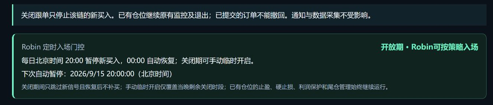
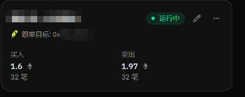
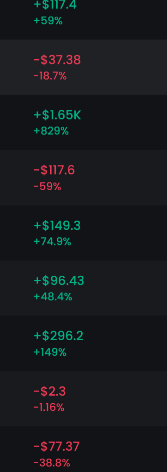

# “fomo地址跟单”打法--自动矿机

作者：东之伊甸丶（@canhua1023）

原文：https://x.com/canhua1023/status/2099664034157203772

发布：2026-09-15T00:58:10+00:00

归档：2026-09-18。正文为来源材料，作者的收益、规则及推广表述未作独立认证；无关推荐和广告不纳入整理，原始详情 JSON 原样保留。

robin其实晚上的流动性非常好，最危险的时间段是晚上8点到凌晨12点左右，我都是动态关闭bot开关的这个时间段。（是数千笔交易和完整24小时K线的回测数据，请相信它）

每天睡醒几个账号基本都能收菜小几千刀，只要再配合自己人工打狗的账号，ai买了什么你再去人工看下，好的就跟着买点转专用钱包，然后放那不动就好了。

不管未来出了什么，arc也好，其他也罢，核心就是

“fomo地址跟单”打法。

当然这套打法纯适合懒人了，我是懒得扫链的，我只想躺着刷抖音顺便把钱赚了，顺便搜集更多数据，建立高倍暴击跟单账号，就完美了。

#fomo

## 可见相关回复

本次接口仅提供部分可见回复；未将推荐流中作者的其他帖子误认作本帖补充。

### @kang77157661 · 2026-09-15T06:19:47+00:00

https://x.com/kang77157661/status/2099744974288146468

@canhua1023 目前只扒了100多个fomo聪明钱，你是跟了多少地址哇

### @canhua1023 · 2026-09-15T06:31:08+00:00

https://x.com/canhua1023/status/2099747828730114271

@kang77157661 1000多个，再加门槛判断自动买入。

### @dodoBeyond · 2026-09-15T01:31:46+00:00

https://x.com/dodoBeyond/status/2099672489291043288

@canhua1023 可以出一个，网页，按月收费配置吗？

### @A9A9A9GO · 2026-09-15T14:33:21+00:00

https://x.com/A9A9A9GO/status/2099869181374296145

@canhua1023 HI 你买入卖出是接入哪个 API的

### @JohnnnnHn · 2026-09-15T02:08:47+00:00

https://x.com/JohnnnnHn/status/2099681808334156033

@canhua1023 wok 对哦，把PM的跟单bot挪到Fomo去改一改就能用了

### @yeyeyeyeyee_ · 2026-09-15T01:20:22+00:00

https://x.com/yeyeyeyeyee_/status/2099669623906111942

@canhua1023 带带弟弟
