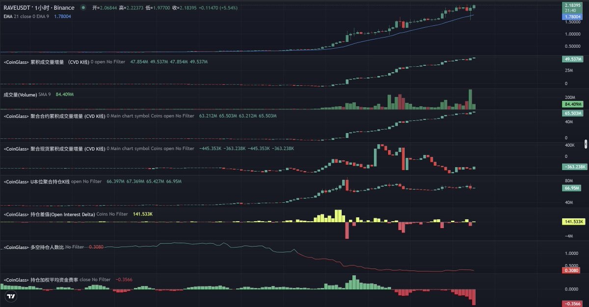

# RAVE 的合约主导逼空盘判断

- Author: @CryKaka (Kaka)
- Published: 2026-04-11 18:49
- URL: https://x.com/crykaka/status/2042918035057709178?s=52
- Source Type: X Tweet + replies
- Capture Tool: twitter-cli
- Capture Note: 主帖带 1 张配图。抓取结果中混入少量无关时间线推文，本文仅保留和 `RAVE` 结构判断直接相关的内容。

## 配图

## 主帖正文

记录一下当下对 `$RAVE` 的看法。

当前主要是一个合约主导的逼空盘。

`K` 线走得很强势，沿着 `EMA21` 一直走，虽然不断创新高，但是现货没有同步扫货。

主要动力来自合约的主动买入、回补、逼空。

`OI` 在高位横住，持仓差值正负交替，没有持续放大。

说明这波后半段，更多是“空头继续被挤以及高位换手”，不是全新多头源源不断接力。

费率为负，多空比 `0.3`，说明现在做空的人非常多。

所以整体来说，我觉得大概率还有一段逼空行情，空头不投降，是不会跌的，有源源不断的上涨动力。

如果空头投降，那砸盘大概率也是非常猛的。

耐心等待一下，看看后面会不会有这几个迹象，有的话就可以考虑分批进场做空了：

- 价格新高站不住
- 合约 `CVD` 转弱
- `OI` 往下走
- 或者费率极负，但价格不再往上走

## 评论区与补充

### 1. 作者承认这种走法本身就容易让人不舒服

- 时间：2026-04-12 11:21
- 内容：这种结构情绪驱动很强，现货没有跟上，所以只能轻仓分批，不能把它当成普通顺趋势盘去重仓。

### 2. 与 `STO` 的对比，突出“现货有没有配合”

- 时间：2026-04-13 22:49
- 内容：作者认为 `STO` 也有相似处，但 `STO` 有现货配合，`RAVE` 更像是纯靠合约往上堆，没燃料就横盘等下一波空头进场。

### 3. 做空时点不看感觉，要等结构衰减

- 时间：2026-04-11 23:28
- 内容：作者不建议因为费率负、多空比偏空就立刻做空；在 `OI` 高位横住但合约 `CVD` 仍在往上走时，继续硬空的胜率并不好。

### 4. 评论区里还有一条很实战的补充

- 时间：2026-04-11 22:17
- 内容：如果费率快速走到极负且价格开始下跌，往往更像庄家自己开始转身；如果费率缓慢极负但价格还在慢拉，反而更要警惕是做空过度拥挤。
