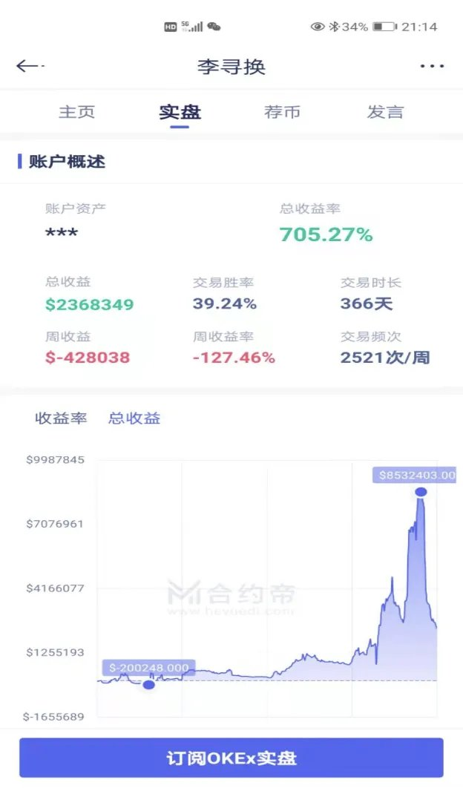
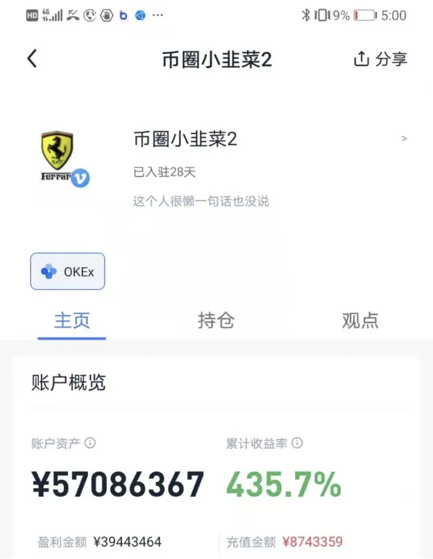
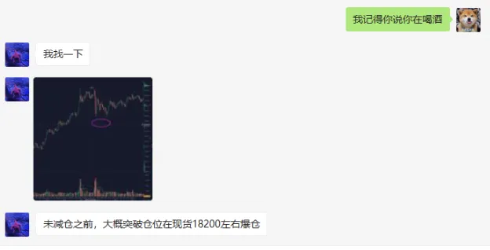
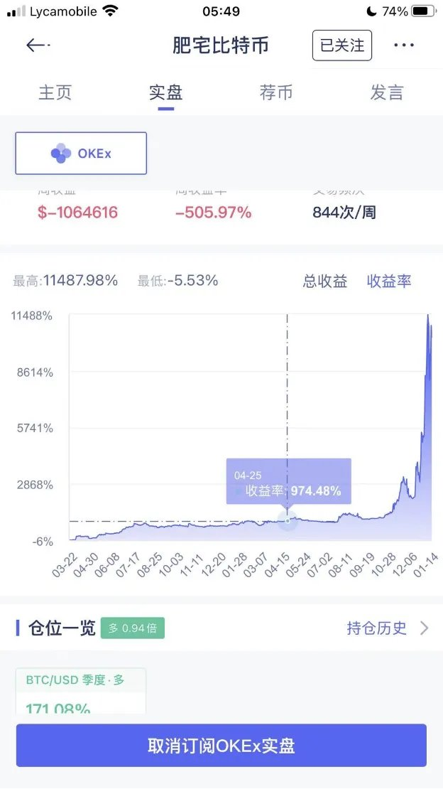

# 《博弈之道》转发版：期货的真谛是顺势、加仓、提现与承认运气

- Author: @CryptoApprenti1 (Dr.Hash“Wesley”)
- Published: 2024-05-16 11:18
- URL: https://x.com/CryptoApprenti1/status/1790944828282531889
- Source Type: X Tweet + images
- Capture Tool: twitter-cli
- Capture Note: 这条推文在 2024 年转发了作者自己更早写于 `2021-01-15` 的长文《博弈之道》。正文已经完整出现在推文文本中，配图则是原文截图。

## 原文附图

## 主帖正文

《博弈之道》是 `25` 岁写的文章，写于 `21` 年牛初。这一年也是最区块链路途中最精彩的一年。

价值投资是有的，仅仅适用于现货，基本逻辑就是基于 `MMT`（`Modern Monetary Theory`），货币必然超发，选择好的资产持有即可。但是要你有足够的本金和耐心，在绝对低位建仓，然后持有很长时间，就像 `2020-03-12` 买入 `4000` 美金左右的比特币，以及复权后 `60+` 美金的特斯拉，`50+` 美金的苹果，或者说你在很多年前买入的 `10` 美金的苹果和 `100` 美金的亚马逊。

但很多人并没有这种认知或者耐心去长时间持有一种资产，经常在踏空过去的懊恼中度过。最典型的就是“我曾经可以买 `3000` 美金的比特币，但现在 `1w` 了我还是不买了吧”，然后眼看着比特币涨到四万多美金，又反复懊恼。其实不如放眼于未来，何必纠结过去呢。

我们今天讲的是期货，是以小博大。什么是期货，一言以蔽之：追涨杀跌。

追涨杀跌是十分反人性的一件事情。从心理学的角度来讲，人在盈利的时候都想赶紧落袋，而在亏损的时候却很能抗，这往往酿成大悲剧。赚一点就想跑了止盈，但一亏却很能抗得住单，越抗越上头，上头就贷款梭哈或者一直冲保证金直到爆仓。而期货的真谛不是这样的，在于顺势，既然趋势一直，注意是一直，跟你不在同一个方向，你该做的就是止损。

期货不在意绝对的建仓价格，只在意趋势是否能继续。从总的时间长河里看，趋势其实只占 `5%` 的交易时间。举个例子，比特币从 `3500` 到一万用了快一年，从一万到两万用了四个月，从两万到三万用了 `17` 天，从三万到四万用了 `7` 天。其实从这一波赚钱最多的主升浪不是 `4000` 抄底的人，而是从 `1.2w` 一路滚仓到最后 `4w`，特别是最后这几天的利润才是最多的。小钱玩家需要在贪婪的时候更贪婪，滚仓到最后你才能发大财。因为你有杠杆，你不能做时间的朋友，你是时间的敌人。涨得越高，越敢追，涨到别人害怕恐惧了，你反而要加仓。这样的话，可能别人在比特币涨 `100%` 才能赚到的钱，你只用 `5%` 就能赚到了。

现货和期货本质上都是赌，不过赌的方法不一样。现货是用时间换空间，而期货相反，用空间换时间。长期看得准不重要，因为杠杆不允许你看这么远，只能走一步看一步，短中期追寻趋势的延续即可。

期货市场赚钱最多的不是看得准的人，而是敢赌的人。你看得再准有什么用，你敢重仓赌么？很多人喜欢在意自己好看的收益率，可那点仓位又有什么用呢，赚不了大钱，杠杆、收益率都不重要，总仓位才是赚钱的根本。

胆子大加上命硬才能赚到钱，低倍复利对于大部分期货玩家来说是个骗局。因为期货市场黑天鹅太多，再低倍都有可能一波归零。所以作者认为，期货的目的在于以小博大，用小资金去博高收益，这必然承担高风险。杠杆一定不能低，一定得浮盈加仓，因为你是用空间换时间。在最短的时间赚最多的钱，断头就是死，但你不能怕不能怂，就是赌趋势继续，就是赌自己的命够硬。你怕输怎么会赚得到钱呢？

作者举例说，实盘账户飞哥（李寻欢）在短短两个月从 `20w` 赚到 `5000` 多万，靠的就是浮盈加仓一把梭。飞哥亲口说根本不会技术分析，就是靠感觉。这就是期货的精髓。你不能怕，你怕了你就输了。为什么会怕，因为盈利不够多，所以你亏不起；但盈利够多的时候把本金提了，就可以放心赌了。敢赌还有个原因是盈利以后定时提现，然后继续盈利梭哈。

对于一个想进入期货市场完成暴富阶级跨越的人来说，最重要的不是技术分析、基本面分析、庄家内幕消息，而是运气，因为没有人能够战胜市场，“庄家”也不行。能做的无非只是顺势而为罢了。

作者又举了一个有趣例子：很多技术分析讲得天花乱坠的老师，画图给点位精确到小数点后一位，但一看仓位资金量，却还没有自己大。作者采访后发现，一位赚了上亿的大神，到 `2019-05` 才进场买第一个比特币，到 `2020-10-03` 才正式开始玩合约，到作者写文章前刚好三个月多一点。

作者讲这些是想说，对于期货来讲，运气和心态远比技术更重要。需要修炼的是心境：命要够硬，心态要够好。不怕输，你才可能赢。

有人问飞哥之后不也爆了 `2000` 多万。作者说是的，但他还有两千多万已经提现了。所以你会输，也会赢，但你赢了以后提现才是真的赢了。肥宅 `2017` 年赚了上亿，`2018` 年几乎亏光，也是靠着提现活下来并且越活越好。期货市场就是这样，但要保持理智，保持提现，然后像鳄鱼一样蛰伏数年等待属于你的那一拨机会，然后功成身退。如果认识到自己命不够硬，那还是趁早退出期货市场比较好。认输并不耻辱，你来这里唯一想做的是赚钱。要认识到人是不可能战胜市场的，以及随机性是不可预测的。

作者并非倡导赌局，而是想让大家认识到市场的不确定性根本无法预测。所以低倍复利就是扯淡的，不如一把梭哈一波大的。早早认识到自己命不够硬，也就能早早离场。这也和“炒币加场内杠杆玩合约期货 = 吸毒”的观点一致，因为大部分人是注定失败的。要认识到人是不可能战胜市场的，以及随机性是不可预测的。

这些看法针对的是期货市场。你可以玩现货，一点杠杆都不要碰，因为只要碰了杠杆，就有爆仓归零的可能性，大部分人大亏就是从一个小抗单开始的，无法战胜人性，无法止损，从而满盘皆输。因为交易实在太反人性了。

其他也暂时没有很多想说了，在生日这天快凌晨六点写下这篇文章，希望对大家有帮助。

—— Wesley @CryptoApprenti1 01/15/2021

## 评论区与补充

### 1. 作者自己给了最短版本的浓缩

- 时间：2024-05-16 15:33
- 内容：`不要和趋势作对`

### 2. 评论区里最值得保留的一个反向提醒

- 有读者总结成“轻仓顺势止损是新手生存法则，重仓逆势抄底不止损是发财法则”。
- 作者没有顺着这句话展开，只回复了“不要和趋势作对”，说明在他自己的框架里，重点仍然是顺势，而不是单纯鼓吹逆势重仓。
