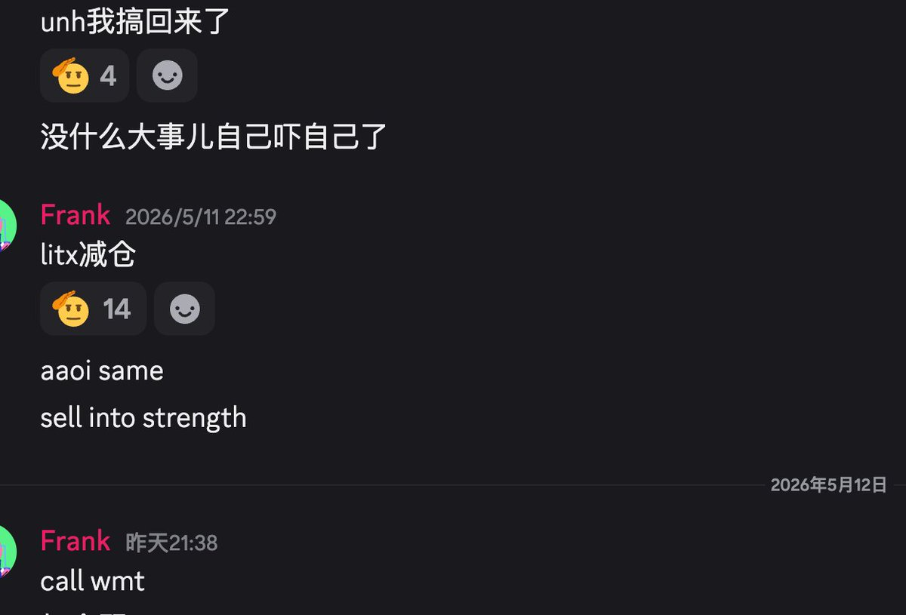

# 分散投资不是买很多 ticker，而是做相关性矩阵上的分散

- Author: @Franktradinglog (摩卡星冰乐)
- Published: 2026-05-13 03:14
- URL: https://x.com/franktradinglog/status/2054279125825970605?s=52
- Source Type: X Tweet + image
- Capture Tool: twitter-cli
- Capture Note: 主帖正文完整，带 1 张配图。内容围绕半导体 crowded trade、组合相关性、波动拖累、再平衡溢价和风险预算。

## 配图



## 主帖正文整理

作者说，当天半导体集体下跌，但自己没有亏钱。原因不是完全看空半导体，而是在合适位置减仓，并加入其他板块股票，让整个仓位成为有机整体，而不是一个动量炸弹。

作者认为现在半导体股票上有太多动量策略，整体仓位非常 crowded。全仓半导体需要极强心脏，他宁可少赚，也不想亏钱。

### 真正的分散不是 ticker 数量

作者反对把“买很多只半导体”叫分散投资。

- `NVDA / AVGO / AMD / MU / MRVL / INTC` 看起来是六只票
- 实际上是同一个 trade
- 本质是做多 `AI capex cycle + semiconductor beta`

一旦有不利 catalyst，全仓会一起死。涨的时候看似多元化，跌的时候相关性会在 risk-off 状态下直接跳到 `0.9`。

作者认为真正保护账户的不是有多少只股票，而是有多少个真正不相关的收益来源。

### 组合方差和 volatility drag

作者写出两资产组合方差：

```text
σ_p² = w₁²σ₁² + w₂²σ₂² + 2w₁w₂ρσ₁σ₂
```

- `ρ = 1` 时，没有分散收益
- `ρ = 0` 时，组合波动显著低于成分平均
- `ρ < 0` 时，第三项为负，组合波动超线性下降

组合波动下降后，带来的不只是更好的 Sharpe，还有更好的复合收益。

作者引用几何均值与算术均值关系：

```text
g ≈ μ - σ²/2
```

`σ²/2` 就是 volatility drag。同样 `10%` expected return 的资产，`vol 30%` 长期年化复合约 `5.5%`，`vol 20%` 约 `8%`。没有多生成 alpha，只是波动变小，长期复合就多出来。

### 作者自己的组合动作

作者说，去年 `11` 月半导体持续回撤，但账户还在新高，原因不仅是看准了顶，更是仓位结构不该暴露在单边风险里。

当时他减了很大一部分半导体，并开始：

- 在 `staples`
- `utilities`
- 能源
- long-duration treasury

中做组合配置。

从 forward return expectation 看，这套组合预期收益肯定不如全仓半导体，牛市中会跑输 momentum chaser。但 unwind 来的时候，其他 sleeve 反而上涨，组合没有被单一 narrative 绑架。

### 再平衡溢价

作者引用 `Claude Shannon` 的思想实验：

- 一个 expected return 为零但波动大的资产
- 配上现金机械再平衡
- long run 可能做出正收益

机制是再平衡强迫你涨了减、跌了加，从 cross-sectional vol 里挤价值。

减半导体、加其他板块，不只是择时，也是一种 rebalancing。纪律性再平衡可以成为长期账户里的稳定 alpha source。

### 风险预算和 optionality

如果整体组合波动从 `30%` 降到 `18%`，风险预算就释放出来：

- 可以在低相关 sleeve 上加仓
- 可以用期权做 convexity 多头
- 可以保留更多现金等真正 fat pitch

全仓 momentum 的人没有这个 optionality，因为风险预算每天被现有 position 占满。

### 结构性 trade-off

这套打法的代价是牛市里会跑输纯 momentum。作者说四月全仓只赚了 `60%`，连 `DRAM` 这种 ETF 都跑不赢。

但他认为这是结构性 trade-off，而不是 bug。回报曲线是 path-dependent 的复合过程，要看的不是 peak portfolio value，而是一次真正 unwind 后剩下多少。

### crowded momentum 的退出门风险

Momentum crowded trade 的本质是所有人退出的门是同一扇。liquidation cascade 来的时候 bid 会瞬间消失，浮盈如果没有及时 trim，回吐速度会比涨上去快得多。

作者最后强调：

- 半导体没有卖光
- `AI capex cycle` 也没结束
- 结构性 long 逻辑还在

只是要把权重降下来，配上其他低相关 sleeve，让整个组合不被一个 narrative 绑架。

## 评论区与补充

### 1. 作者强调这是板块轮动问题

- 有评论说自己仓位管理可以，但板块方面没做好。
- 作者回复：板块轮动啊轮动。

### 2. 评论区有人补充半导体内部也要分层看

- 有评论指出：半导体整体 crowded，但 `HBM` 只有三家能做，产能紧、定价权在供给端，和消费级存储动量逻辑不同。
- 这补充了一个重要点：相关性分析不能粗糙到把所有半导体完全等同。

### 3. 有评论追问再平衡时机

- 有读者问如何判断组合再平衡时机。
- 主帖没有给出具体规则，但全文暗示核心不是绝对择时，而是当某一 narrative 占用过高风险预算时，主动降低集中度。
