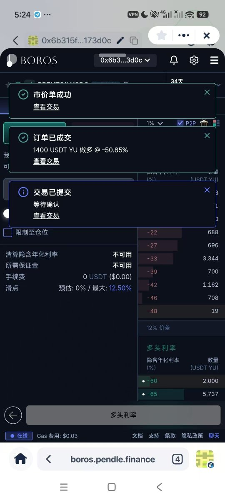
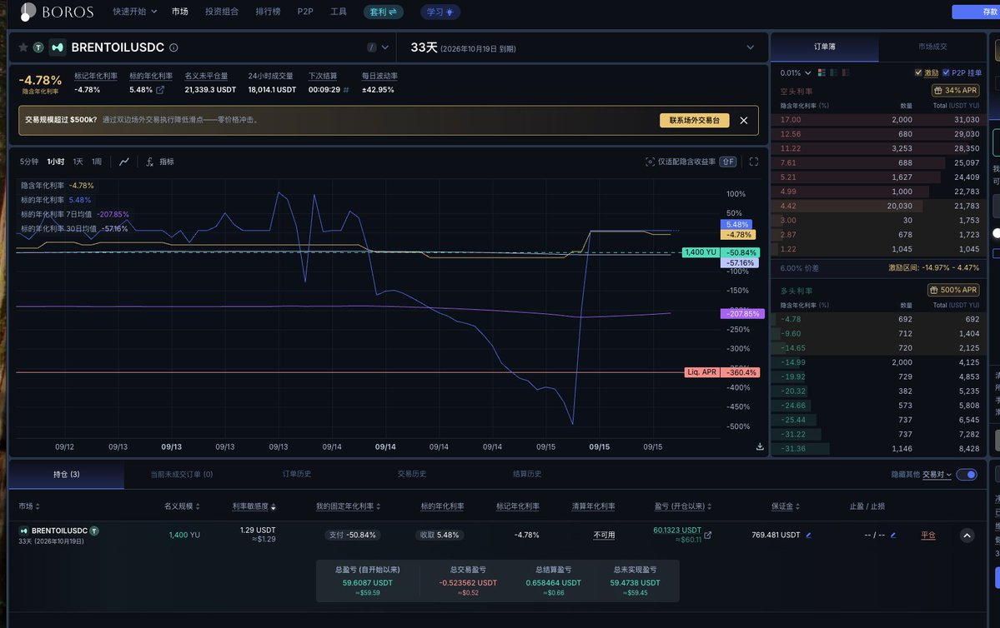
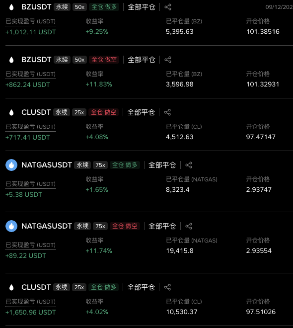
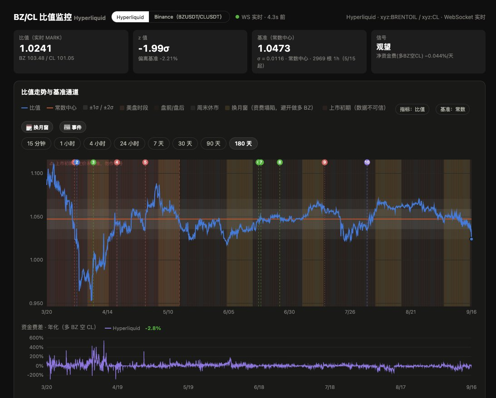
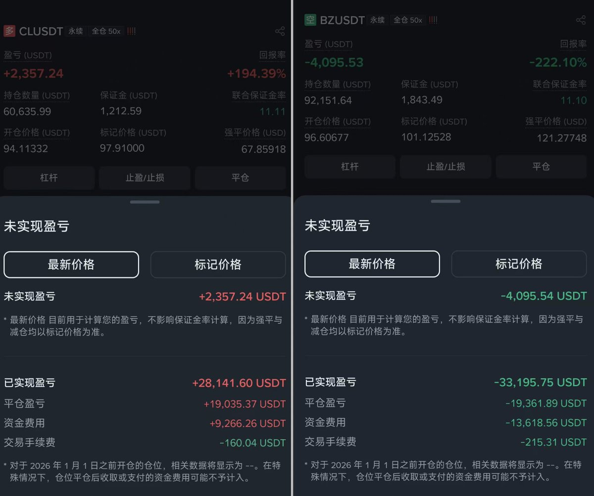
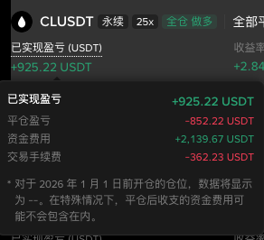

# 原油换月，狂赚 13000u

作者：0xJA | Whale.Dance 🐳（@JXiaoLoong）

来源：https://x.com/JXiaoLoong/status/2099983057306751279

发布：2026-09-15 22:05:51 UTC；北京时间 2026-09-16 06:05:51。

文章修改：2026-09-16T06:54:18.000Z

归档说明：以下为来源原文，保留作者收益表述和推广内容，不代表归档者认可。文章正文通过 twitter-cli 获取，以 FxTwitter 的结构化数据补回图片位置和嵌入链接；无实体的 #131,889 占位块省略，原始 JSON 保留。

上次换月时候我做了一个复盘：

[原文嵌入推文](https://x.com/i/status/2087904386387501314)

> 1. 提前在 @boros_fi 做好布局（紧密关注 @0xanonnnn 大佬的推文）
> 2. 另外，将资金拆分到不同的账户里做不同的套利策略，避免策略仓位冲突

## 事实证明，这是一个价值 1 万 3 千刀的复盘。

这次原油换月我做了三件事：

1. 将原油价差套利的仓位转移到子账户，花了 200 多 u 的手续费，并且在合适的时间逐步减仓

1. 密切关注 Boros 上的原油市场，在合适时机果断买入和卖出

1. 在 OpenWhale启动原油资费套利

第一个没什么好讲的，我们重点说说第二个和第三个。

# 在 Boros 用 500u 本金打出 300u 收益

## Part 1 换月之前

上个月在 Boros 上交的学费这次终于起作用了 —— 在原油换月开始之前（9.4），资费已经出现了不少的波动，Implied APY 从 -15% 干到接近 -100%。

当时我还以为这次会又错过入场机会了，但在看了 @0xanonnnn 大佬的推文后，其实当时换月还没开始 —— 正确的换月时间是 北京时间 9.9 5:30AM ~ 9.15 5:30 AM。

而且这个月的近月远月价差比上个月更高，同时地缘政治形势也不容乐观，几个 BUFF 叠加下来，因此我判断这个月的原油资费大概率会比上个月来得更猛烈！

但是接近 -100% 的 Implied APY 显然不适合进场，刚好在换月开始前撞上了周末（9.5 ~ 9.6），周末原油是几乎没有资费的，因此那些低位持有 YU 空头的人就会连续亏损 48 小时：

比如在 -100% 价格持有 1000 YU 的人，在周末就会按照 1000u 的 100% 左右的 APY 持续亏钱 48 小时，大概亏 5.5u，但要注意 1000 YU 的本金可能就只需 50 ~ 60u（相当于直接亏了 10%），这个亏损还是很恐怖的。

所以受不了亏损的人就会主动平仓离场，把 Implied APY 拉回合理价格 —— 这时候就是做空 YU 的建仓窗口期了！

## Part 2 换月中

于是我在周末结束之后的凌晨（9.7），看到 Implied APY 在 -60% 左右就果断入场，买了 11000 的 YU 做空。事实证明，这个价格差不多就是整个换月期的顶部了（当然，如果能在更早 Implied APY -15% 时候入场就更牛逼了）

[原文嵌入推文](https://x.com/i/status/2096849945022308736)

不过换月期间也跨越了一个周末（9.12 ~ 9.13），周五的最后一次结算之后忘记把仓位平掉，换月期间每小时稳定赚 1 ~ 5u，而到了周末变成了稳定亏 1u，回撤了一点利润。后面重新挂了个单，在周一 早上 Implied APY 回到 -80% 时候自动吃单平掉了，比较可惜的就是没有把最后一天的换月资费收益完整套到，但总体来说还算不错，这波把学费差不多赚回来了！

最后，这 11000 YU 的空头仓位本金只有 500u 左右，产生了 245u 的收益（图中亏损的钱就是我的学费哈哈哈）

## Part 3 换月后

这其实还没结束

Boros 上，下个月的原油市场也已经上线了，在昨天（9.15）凌晨最后一次结算完（5 点的时候）之后，本来已经上床了的我突然想起来：换月结束就得做多 YU 了！

于是在床上的我马上拿出手机切换到下个月的原油市场，看到还有 -50% 的 Implied APY，果断买入做多 YU！起床之后看 Implied APY 已经升到 -4%（现在已经到 -1% 了），凌晨这波操作直接浮盈 60u

其实这个操作在上个月已经分享过，就是在换月结束市场还没反应过来的时候低位做多 YU，就能在之后的在非换月期间赚取为期三周以上的固定 APY 收益：

[原文嵌入推文](https://x.com/i/status/2088637780473851933)

## 总结一下 Boros 换月套利方法论

上面用实际操作分享了我是如何在换月期间通过 Boros 赚钱的。可惜的是目前原油市场流动性太低，没法上很大仓位，但操作得好赚个一个月生活费还是可以的。

不过！接下来我想尝试把这套操作复刻到 OpenWhale 上，实现全自动运行，因此我有必要总结成一个方法论。不过事先声明，这个方法论遵循下面三个重要前提：

1. 非换月期，原油资费长期几乎为 0（允许偶尔有波动）

1. 换月期由于原油期货近月远月价格差异，形成 Backwardation 结构，且越极端越好（我们可以在 https://www.barchart.com/futures/quotes/CB*0/futures-prices 这里看到近月和远月的原油期货价格。一般来说，当他们价差越大，Backwardation 结构就会越极端，对应的换月期间资费就会越高）

1. 有足够的深度支撑你开仓

在这三个前提下，我们整个 Boros 换月套利方法论如下：

1. 提前埋伏：在一个换月期开始之前（大概是每个月的第 5/6 个交易日左右？），提前在合适的高位买入做空 YU，如果你认为这次换月资费来的足够猛烈（通过评估前提 2），甚至可以无视滑点市价买入。

1. 补票上车：每次周末都是一个做空 YU 的窗口期，特别是在周末结束的那个凌晨。如果错过了提前埋伏机会，就趁周末挂单/市价买入，补票上车

1. 平仓时机：换月期原油资费一般是从 8 点开始涨，然后到第二天凌晨 5 点到达峰值，接下来的 6，7 点是一个回落的过程，然后 8 点到底，第二天重新开始涨。因此，如果你想在换月期间平仓 YU 空头，最好是在凌晨 5 点结算完毕之后尽快执行（比如第二天是周末，或者到了换月最后一天想要平仓）。当然，如果入场 Implied APY 足够高，可以不平仓直接等市场到期结算。

1. 反向套利：Boros 的原油市场一般会在换月结束的 3 天后到期，因此每次到了换月的最后一两天，Boros 就会上线下一个月的原油市场，这个市场也会因为处于换月期，会有较低的 Implied APY。因此我们可以在这个月换月期刚结束（一般是换月最后一天的凌晨 5 点），趁市场还没反应过来，马上到下个月的市场低位做多 YU，这样你可以吃到为期三周以上的固定 APY 收益。这个仓位要在下次换月开始之前找个高点平掉，然后重新回到第一步

注意：上面 4 点操作都基于前面的三个前提，如果前提是不成立的，那么这些操作都可能会无效。

# 原油资费套利狂赚 1.3wu

重点来了，Boros 上原油池子太小，可以稳稳地赚点生活费，但如果有更高的风险偏好，想财富自由，还是得在大市场里做套利，其中一个就是原油资费套利

一般来说，资费套利都是通过跨所进行的，一个所收资费另一个做对冲。但这样需要的资金量非常大，而且跨所之间的价差不好把握，也容易爆仓。虽然有 Gate 的 CrossEx 这种跨所共享保证金产品，但鉴于 Gate 前段时间的负面新闻，实在不敢放太多钱进去。

所以比起跨所，我认为单所资费套利对我这种小资金更友好，虽然套利失败的概率也高，但几乎没有爆仓风险

单所套利其实就是指在邻近资费收取时候做快进快出，我在很早之前就尝到了甜头，并且后续依靠这个策略在三个月内赚到接近 7wu 的收益（差点就够买 1 个 BTC 了）

[原文嵌入推文](https://x.com/i/status/2032944172794261692)

虽然这个策略失败概率也很高，而且能承载的资金量非常有限，平时其实很难赚钱

但原油不一样。原油在各个交易所都有极大的深度，一旦这种庞然巨物出现了高资费，套利空间是巨大的，甚至手动套利都能赚钱

于是，就有赚 1 wu 的空间了：

当然，这里赚 1wu 只是我资金上限（本金只有 8wu），如果资金足够，套利发挥的好，光靠这个策略在这波赚个 3~5 wu 也是有可能的

上个月的换月其实也产生了高资费，但由于我的原油价差套利策略和资费套利策略没有拆分账号，就没法放开来做资费套利，这次终于能套爽了

## 好吧，说完赚钱的，也说说亏钱的

由于油价一直飙升，虽然我的原油价差套利本身已经回本甚至赚钱了，而且现在的价差也正和我一开始预判那样往反向走了：

[原文嵌入推文](https://x.com/i/status/2095627915748925685)

但是，和很多做空原油的小伙伴一样，我当时留下的 10wu BZ 空单敞口目前还是产生了很大的亏损，换月期间也陆续平掉了一部分，真的也亏了不少

而且由于这次换月一直是 BZ 资费低于 CL（之前以为会反过来，但还是想多了），因此之前的 做多 CL 做空 BZ 组合一直在持续支付资费，更何况我还留了个 BZ 空单敞口，要付的资费更多了，目前已经产生了 4ku 资费亏损…… 所以这波属于是自己套自己利了

换月过了，希望原油能跌下来我能回回血。以后还是乖乖研究套利吧，做套利赚的钱都因为做交易亏掉了

另外，现在资费下去了，然后反向价差也扩大了，差不多是时候可以开始做反向的价差套利了~

PS. @whaledotdance 上的 Oil Master 准备开机啦，赶紧来跟单吧！

最后，补充一下我总结的几个原油的套利策略和其底层原理：

[原文嵌入推文](https://x.com/i/status/2085312671398932678)

[原文嵌入推文](https://x.com/i/status/2085724783388614696)

希望能赚🙏

## 主帖可见回复

以下仅包含本次详情接口返回的相关回复，未声称覆盖所有折叠、删除或后续回复。无关推荐与广告仅留在原始接口快照中。

### @vck2f2etqd97hnx · 2026-09-16T04:35:24+00:00

https://x.com/vck2f2etqd97hnx/status/2100081091004784772

@JXiaoLoong 老师你这单所快进快出有操作图吗？一般在资费结算之后，价差就会亏回去，你这图资费也赚了，价差也赚了似乎不太对啊😲

### @JXiaoLoong · 2026-09-16T04:52:44+00:00

https://x.com/JXiaoLoong/status/2100085452435075392

@vck2f2etqd97hnx 价差其实没赚哈哈，不过如你所说，这个策略确实是存在风险的，搞得不好也会亏很多 https://t.co/FWaG2pBcEs

### @Northfieldxme · 2026-09-16T03:55:55+00:00

https://x.com/Northfieldxme/status/2100071156493763044

@JXiaoLoong 没看懂你这个原油的资费套利是什么机制 ，是靠 CL 和 BZ 的资费差吗？ CL 多 BZ 空？ 跨所吗 另外不同交易所本身还有一定的价差以及结算周期不一致 这怎么解决

### @JXiaoLoong · 2026-09-16T04:24:55+00:00

https://x.com/JXiaoLoong/status/2100078451562868864

@Northfieldxme 临近结算快进快出

### @Darkhorse1027 · 2026-09-16T00:00:20+00:00

https://x.com/Darkhorse1027/status/2100011867188170941

@JXiaoLoong 现在bz和cl高价差 没资费

### @JXiaoLoong · 2026-09-16T06:46:35+00:00

https://x.com/JXiaoLoong/status/2100114103666897009

@Darkhorse1027 是的，现在可以做价差套利，赌价差回归

### @pendle_grandma · 2026-09-16T06:50:13+00:00

https://x.com/pendle_grandma/status/2100115017567735901

@JXiaoLoong 必須轉發！Boros恭喜你發財！

### @JXiaoLoong · 2026-09-16T06:51:14+00:00

https://x.com/JXiaoLoong/status/2100115274066469094

@pendle_grandma 感谢老师！！

### @bitfarmer888 · 2026-09-15T23:55:04+00:00

https://x.com/bitfarmer888/status/2100010541414830224

@JXiaoLoong 好总结

### @VKong90141 · 2026-09-16T03:44:44+00:00

https://x.com/VKong90141/status/2100068339351752777

@JXiaoLoong 已跟单Oil Master~😎

### @Boiledwater22 · 2026-09-16T05:36:56+00:00

https://x.com/Boiledwater22/status/2100096576941170956

@JXiaoLoong 牛逼牛逼👍
