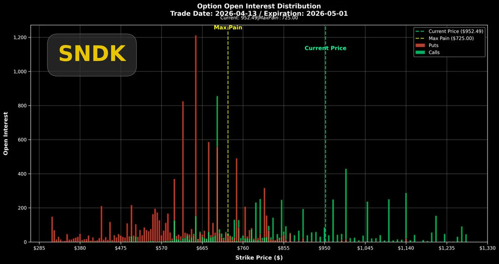
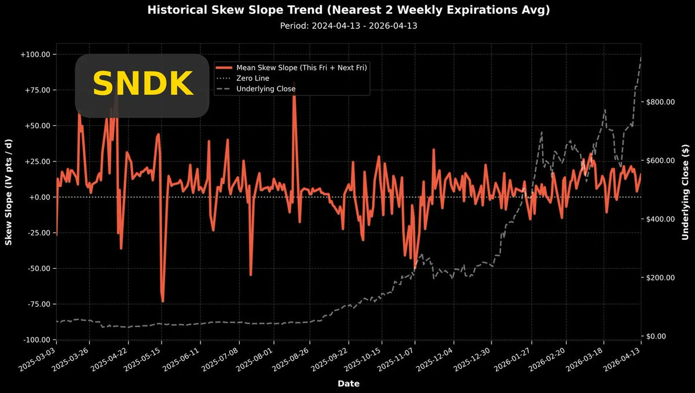
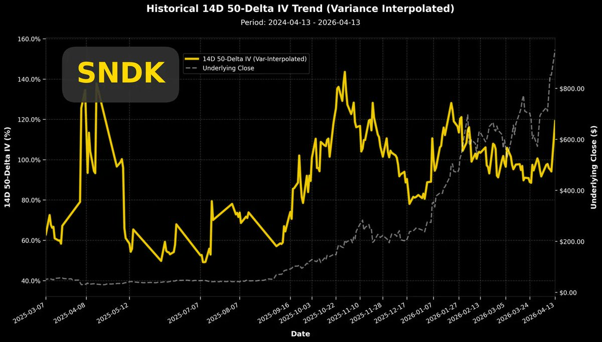
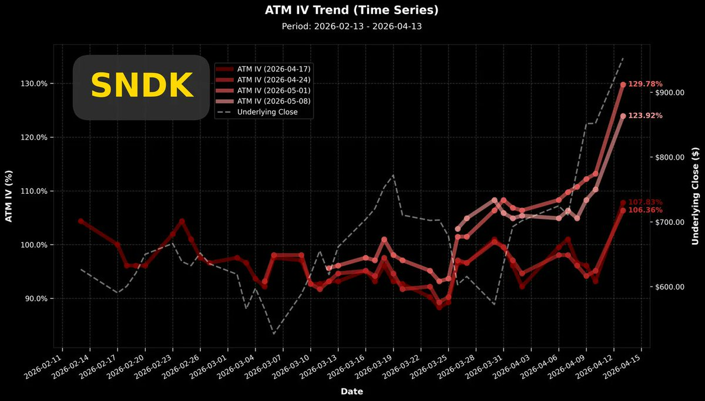

# SNDK SanDisk 隐含波动率与 Covered Call 讨论

- Author: @KotlinerBTC (Curry_TW)
- Published: 2026-04-15 10:34
- URL: https://x.com/kotlinerbtc/status/2044242835822756347
- Source Type: X Tweet
- Capture Tool: twitter-cli
- Capture Note: twitter-cli 输出中混入了若干无关推荐 / 广告推文，本归档仅保留主帖及围绕该帖的相关回复。

## 主帖

$SNDK SanDisk 大家來觀摩一下，SanDisk現在的隱含波動率已經衝到129%，這是什麼概念? 就是統計來說，市場交易者認為，市場交易者認為，有約 68.2% 的機率，該標的在未來一年的價格會落在「下跌 72.5%」到「上漲 263.3%」。

從左下角黃線圖表可以看到，過去一年來它的隱含波動率超過120%的時間並不多。對應右上角的磚紅色圖表，Put/Call波動率差並沒有創新高，顯示這麼誇張的波動率數值主要貢獻來自於對看漲期權(Call)的追價購買。

再看右下角的四條紅色曲線，這是近期到期期權各別波動率，五月一號到期的期權波動率最高，觸及129%。

這是什麼概念，即便比特幣妖股 $MSTR 能到這麼高的波動率也很少見(一年約一次)。

對於這種盤面，我怎麼建議?

如果你手中持有大量SanDisk現股，現在就是以一部分倉位搭配賣出深價外Covered Call的好時機。要注意，必須一定價外，因為對照股價與波動率關係，波動率達到頂點並未意味著股價立刻反轉下跌，這是SanDisk獨特的股性。

此時賣出OTM Covered Call可以收割市場過熱情緒的溢價，收入的權利金也可以作為下跌虧損彌補。

最後我們看左上圖，五月一日到期的期權倉位分佈。這張圖相當驚悚! 因為最大痛點價格還停留在725，但股價已經來到950附近。

最大痛點價格對股價的牽制力，隨著到期日逼近會越來越強，這次 $SNDK 期權造市商是不是要迎來超痛虧損? 我們後續得密切關注最大痛點的變化。

## 原文配图

## 评论区与作者补充

### 关于 Covered Call 的执行风险

@YuxianShii:

卖过cover call的不建议，SNDK回涨得让人怀疑人生。我已经被迫平仓了两次，还是找机会下调的时候才逃掉的。 太远OTM也没什么利润，为了两三千块，很可能让你少赚或者亏损大七八千

@KotlinerBTC:

賣期權，賺取的是溢價（波動率），而不是想著還要再漲跌中佔到便宜，那就不叫波動率交易了。

白話的說，股票因為賣得不夠價外被call走了怎麼辦？

賣put買回來呀！！

### 关于卖期权与波动率交易

@sslaziozh:

这些标的对于我们这种日常卖期权的投资者简直太香了，做好保护每周都是净赚。希望sndk,lite也有三日期权。

@KotlinerBTC:

對，波動率交易需要波動！擁抱波動。

### 关于财报后的 IV crush

@fdimag:

Your thoughts on IV crush for earnings? The 5/15 calls and how they would react to a 15-20% move up? Current IV is 114%

@KotlinerBTC:

It really depends on the strike. Since IV is over 100%, the premium is heavily inflated. If the option remains OTM after earnings, the Vega bleed from the IV crush will eat up your Delta profits. Holding deep ITM calls is a much more stable play.

However, this is a great opportunity for option writers. As long as the strikes remain OTM, sellers can easily bank the premium.

### 其他相关互动

@ussolarus:

昨天开盘后把20%的MU持仓换成SNDK和TSM了 不知道是不是个明智的选择

@KotlinerBTC:

現在這個局勢中，TSM應該是相對安穩的選擇了。

@swh16888:

分析一下intc? 也是個最近超買的標的 😂

@KotlinerBTC:

好，今天晚上開盤前做給你。

@Jiaxun5269:

波動率比我的血壓還高
SNDK 真的狠 ⚡️ 坐穩了各位
要噴（崩）了

@Ztomyx:

$SNDK太妖了，我已经卖掉1个多月了，波动太大不碰，散户热情高涨，配合下半年推出的HBF，很多多半导体技术不了解的还是坚定看多，我围观就好了😂

@Pui52277431:

護城河 低，買Mu安全👍

@CainRuby73843:

小m在‌线​等调
