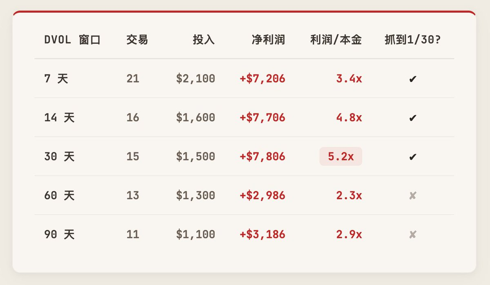

# 不要卖 Put 了：DVOL 高分位买 BTC Put 的回测与更正

- Author: @leifuchen (leifu _/)
- Published: 2026-02-24 22:47
- URL: https://x.com/leifuchen/status/2026308024604770507
- Article URL: http://x.com/i/article/2026292682885091329
- Source Type: X Article
- Capture Tool: twitter-cli
- Capture Note: 主帖正文只有文章链接，真正正文来自 X Article；评论区中作者次日发布了关键的回测 bug 更正，已一并归档。

## 文章标题

不要卖Put了，我在龙王的话中发现了买Put的秘籍，一年6倍，拿走不谢

## 正文

# 卖Put的问题

卖Put是币圈期权最热门的策略。逻辑简单：卖波动率赚时间价值，大部分时候稳稳收权利金。

但正如龙王 @dotyyds1234 说的：这是一个牛短熊长、时常暴跌的市场。双币赢和不带判断地卖Put，本质上都是负期望策略。胜率极高，但收益极小、回撤极大。

卖Put需要择时和风控，专业做市商有数据和对冲工具，但散户呢？龙王在随后的回复中给出了答案：牛市涨不动了就买Put，中奖就是10倍。

这给了启发。我们来认真回测一下。

## 数据来源

感谢 @Blank_TX 开源的 vol-pulse 项目，提供了2025年1月到2026年2月完整的BTC小时级波动率和价格数据。没有这份数据就没有这篇文章。他的数据和方法本身是支撑卖Put策略的，但拿来给买Put做回测，也完全可以。

## 策略一：无脑每周买

- 周五 08:00 UTC，花 **$100** 买一张BTC看跌期权（10 delta，比现价低约7-9%）
- 持有到下周五到期，**现金结算**（到期价低于行权价就赚差价，否则归零）
- 到期当天自动滚仓：旧的结算完，立刻买新的
- 每周都买，不做任何判断

赚钱，但体验极差。连续29周每周亏$100，需要极强的心理承受能力。

## 策略二：追高才是真抄底

能不能优化？

@Blank_TX 的 vol-pulse 做的是插针力竭回归：等波动率飙完了再卖Put，赌它回落。

我们反过来：波动率飙升时买Put，把它当下跌中继，赌崩盘还没结束。

同样每周五 08:00 UTC 检查，只在当前 DVOL 处于过去90天中前30%的高位时出手（即90天滚动分位数 > 70%），不到就不买。

花了$1,400，赚了$7,906。三次大级别暴跌，都被波动率条件提前捕捉到了。

- 10月10日：BTC $121K → $105K，赚 $2,348
- 11月14日：BTC $97K → $84K，赚 $1,738
- 1月30日：BTC $83K → $65K，赚 $4,920（50倍）

这个策略不需要盯盘，不需要对冲工具。规则就两条：

1. 每周五 08:00 UTC 看一眼 DVOL 90天分位数，超过70%就花$100买一张10 delta Put（7天到期，下周五结算）
2. 没超过就不买，什么都不做

固定投入（$100），无限可能（数十倍盈利）。

这个策略最难的部分是如何保持平常心，毕竟连续6次不中、连续30周不出手，如何还能坚持？

- 回测数据来源：@Blank_TX 的 vol-pulse
- 使用 BS 模型 + DVOL 定价，忽略了波动率微笑，实际虚值 Put 比模型更贵
- 只有一年数据，样本有限
- 过去表现不代表未来，DYOR

## 作者更正

作者于 2026-02-25 在评论区补充更正：

更正：回测数据源从 25 年 8 月起从小时级变成 5 分钟级，导致“90天窗口”实际只看了 7.5 天。感谢 @xiaopuba 让我去查了原始数据。

修正后用统一的小时数据，测了不同窗口长度，30 天窗口是最优解，5.2 倍。60 天以上会错过 1/30 那笔暴击。因为 DVOL 43.53 在 90 天看不算高，但在 30 天内是顶部。短窗口捕捉恐慌尖峰，比长期均值更灵敏，当然大家也可以看出来，策略很健壮，不同时间窗口下均有盈利。

## 评论区与补充

### 作者回复

- @dotyyds1234：你把 CTA 运用到期权了，这确实是个思路，但毕竟是回测，买点不一定触发，卖一点也不一定触发。而且，CTA 最难受的就是，坚持了几个月没赚到趋势的钱，放弃的时候，趋势来了。
- @leifuchen：本质就是 CTA 思路，不过买卖点其实都是确定的：买点定在每周五结算，策略二加了 DVOL 分位过滤，持有到期不管卖点。回测确实占了便宜，使用 BS 定价，实际 OTM put 会更贵。这个确实需要钢铁般的意志和真理在握的自信，策略一连亏 29 把，策略二 30 周不动，动手先亏了 4 把。

- @imxiaosha：DVOL 极高的时候买 put 似乎太贵了，卖出 call 感觉更有性价比。
- @leifuchen：如果坚持币本位的话，熊市卖 call 也是个好策略。本文的策略本质是拿 DVOL 当标的做趋势交易，赌一个主升浪。

- @xujiajun69：DOVL 是什么意思？
- @leifuchen：DVOL 是 Deribit Implied Volatility Index，Deribit 交易所发布的加密期权隐含波动率指数，类似于美股的 VIX。

- @fun835034524391：在哪个平台买 put 最好？
- @leifuchen：成交滑点省一点是一点，可以使用 https://rfq.greeks.live/ 在 Deribit 或 OKX 的大宗报价之间比比价。

### 有信息量的评论

- @lo2cin4：样本太短，有 overfit 嫌疑；逻辑倒没什么问题；更好的方法可能是波动率上升时卖双边，赌波动率降低，但有爆仓风险。
- @H5D43：如果从 2023 年开始回测，这个策略可能会归零，历史不够久是致命点。
- @mizorewww：建议至少回测 3 年，因为 Deribit 数据可以追溯更久；作者同意一个健壮策略需要覆盖不同时间周期。
- @BTC__options：期权是一个胜率和赔率互换的游戏，个人觉得买期权更好做；作者回应“操心的事少了很多”。
