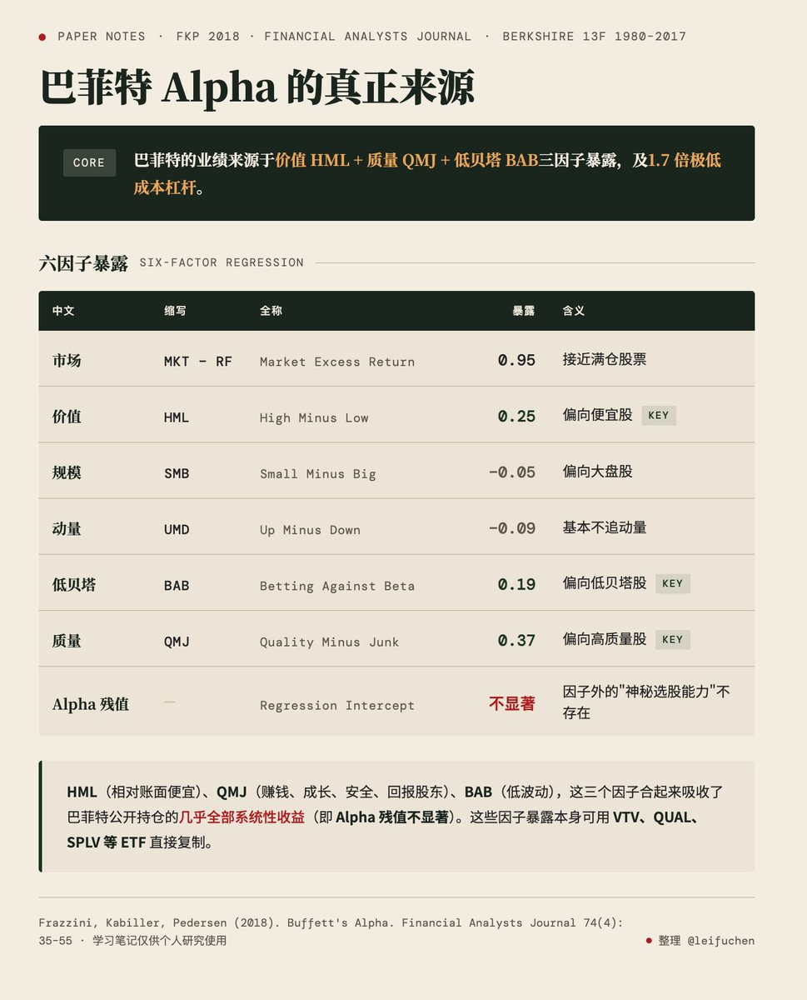

# 巴菲特的 Alpha 到底来自哪里？

- Author: @leifuchen (leifu _/)
- Published: 2026-04-20 15:32
- URL: https://x.com/leifuchen/status/2046129848762982783
- Source Type: X Tweet
- Capture Tool: twitter-cli
- Capture Note: 主帖为长文推文，含 1 张配图；作者在回复中补充了论文链接和一句关键总结：资金来源本身也是 alpha。

## 配图

## 论文链接

- Frazzini, A., Kabiller, D., & Pedersen, L. H. (2018). *Buffett's alpha*. Financial Analysts Journal, 74(4), 35–55.
- SSRN: https://papers.ssrn.com/sol3/papers.cfm?abstract_id=3197185

## 主帖正文

巴菲特的 Alpha 到底来自哪里？
2013 年 AQR 三位研究员 Frazzini、Kabiller、Pedersen（后面简称 FKP）写了一篇《巴菲特的 Alpha》（论文在 2018 年更新了数据，本文以 2018 版为准)，把伯克希尔 13F 公开持仓 1980 - 2017 年的月度收益做多因子回归，得出的结论为：

巴菲特的业绩 ≈ 1.7 倍极低成本杠杆 × 由 [价值 HML + 质量 QMJ + 低贝塔 BAB] 三因子驱动的多头股票组合

HML 价值因子
HML 对应因子研究里的“价值投资”。

巴菲特的公开持仓里 HML 暴露是 0.25，说明他长期持续偏向“相对账面便宜”的股票。这和他公开宣称的价值投资哲学完全一致。我们可以用 VTV（Vanguard Value ETF）做近似复制，追踪 CRSP 大盘价值指数。

QMJ 质量因子
这个因子蕴含的思路是市场确实给了优质股更高的 P/B，但给得不够多，扣掉合理估值溢价之后，优质股仍然有超额收益。质量因子用四个维度（盈利、成长、安全、股东回报）的量化指标给每只股票打分，可以看做巴菲特的“护城河”概念的量化版。

巴菲特的公开持仓里 QMJ 暴露是 0.37，意味着他持续性地买入“合理价格的好公司”。我们可以用 QUAL（iShares MSCI USA Quality Factor ETF）做近似复制，按 ROE、盈利稳定性、低杠杆三个指标选股。

BAB 低贝塔因子
这个因子的逻辑是高贝塔（对市场敏感度高）的股票长期跑不赢它们承担的系统风险，低贝塔股票定价偏低。

巴菲特的公开持仓里 BAB 暴露是 0.19，意味着他持续性地偏向低贝塔的稳定公司。我们可以用 SPLV（Invesco S&P 500 Low Volatility ETF）做近似复制，追踪 S&P 500 里过去 12 个月波动率最低的 100 只股票（严格讲 SPLV 筛的是低波动率而不是低贝塔，但实证研究表明两者相关性约 0.9，所以实务上可以替代）。

样本外验证
FKP 框架其实也隐含了一个可证伪的预测：价值、质量、低贝塔因子表现不佳时，巴菲特的投资表现也应该不佳。

那我们也确实看到，2015-2020 年，价值因子陷入低谷，伯克希尔同期跑输标普 500 约 50 个百分点。巴菲特的业绩周期和他本人的状态无关（业绩一差就有人说他老了），和因子周期有关。

巴菲特的业绩为何难以被复制？
上面说的是巴菲特选股（13F 公开持仓），不含杠杆。但伯克希尔整体股票收益还要叠加 1.7 倍杠杆。FKP 估算伯克希尔 1976-2017 年化超额收益 19%（超出国债收益的部分），拆分来看:
- 纯市场收益（简单持有标普 500）：7.5%
- 伯克希尔 13F 公开持仓（无杠杆）年化 12%，其中超出市场的 4.5%, 几乎全部来自 HML + QMJ + BAB 三因子暴露
- 伯克希尔全资子公司（无杠杆）年化 9.3%。全资子公司常年占伯克希尔股权约65%、公开持仓占 35%，加权的无杠杆收益约 10.25%（0.65 × 9.3 + 0.35 × 12.0 = 10.25%）
- 1.7 倍杠杆（FKP 估算同期伯克希尔扣除现金后的资产/权益 ≈ 1.7）再把加权的无杠杆收益 10.25% 放大，总贡献约 1.7 × 10.25% ≈ 17%，剩下的 1.5-2% 来自融资成本低于国债即杠杆本身贡献了正收益

纯数字上讲，杠杆贡献（7%）是选股贡献（4.5%）的近两倍。

巴菲特杠杆的核心来源是保险浮存金，浮存金本质上是一笔非赎回、无保证金追缴的永续负债。FKP 估算浮存金年均成本约 1.72%，比同期美国短端国债利率低 3 个百分点以上；承保盈利的年份成本甚至为负。更重要的是这笔钱的供给稳定性和投资组合波动脱钩，只要承保业务本身正常运行，浮存金就持续存在。

但要把浮存金真正变成股票投资的弹药，还要跨过监管这一关。美国保险业的风险资本（RBC）规则对股票的资本占用远高于债券（财险公司每持有 1 块钱股票需要备 15% 的法定资本，每持有 1 块钱投资级债券只要 0.3%，差 50 倍），大多数保险公司的法定净资本和浮存金的比例大约是 0.3-0.5，刚够支撑业务和债券组合，一次熊市就可能打穿净资本，触发监管介入。头部财险公司股票持仓通常个位数。伯克希尔特殊在于它的保险子公司法定资本极大（2025 年末美国保险子公司法定净资本 3330 亿美元），接近浮存金（1760 亿）的 2 倍，远超行业平均水平，这是巴菲特主动选择把保险业务当低成本长期资本来源的结果，再加上控股公司可以直接持股（这部分不受保险监管约束），伯克希尔因此能在保险子公司内和控股公司两个层面同时大比例持股，保险业务投资组合中股票占比接近一半。

1998-2000 年是最典型的例子：伯克希尔市值下跌 44%，同期市场上涨 32%，相对跑输 76 个百分点，投资端血流成河，但保险业务没有受到太多影响。巴菲特没有客户赎回的压力，得以坚持不参与互联网泡沫，熬到 2000 年 3 月泡沫破裂后的大反转。如果这 1.7 倍杠杆换成靠银行贷款或券商融资，那 1999 年大概率一代传奇就此落幕了。

时至今日，这个结构本质上还在，但杠杆倍数有所下降：2025 Q4 伯克希尔总资产 1.22 万亿、股东权益 7174 亿、浮存金 1760 亿，现金及短端国债约 3700 亿。按 FKP 定义的杠杆当前大概是 1.2 倍。杠杆下降源自近年来苹果减仓和营运现金积累，类现金资产占比从 2017 年的 17% 升到 30%。这是巴菲特晚年风格的一个变化，也是阿贝尔接班后继承的保守姿态。

其实像巴菲特这样保险公司做投资业务的并不稀奇，但是两个业务都做得这么好的，绝无仅有。通常保险业务好的公司投资受限于资本金约束，投资做得好的机构融资成本不低。那我们学巴菲特，如果只学选股那肯定是不够的，大家还是得学他多搞搞其他主业，而且这个主业的收入最好和投资表现无关。

## 评论区与补充

### 作者回复

- @leifuchen：这篇应该是巴菲特最权威的论文了，估计写过的人不少。
- @leifuchen：对 的，资金来源是非常重要的 alpha。

### 有信息量的评论

- @ehkluo：资金来源也是一个重要的 alpha。
- @lo2cin4：这篇论文自己也写过，是讨论巴菲特最经典的一篇来源研究。
