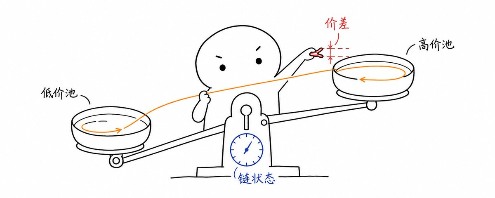

# 原始推文


作者：青十五（@mev15_eth）

原文：https://x.com/mev15_eth/status/2095030663057444887

发布时间（UTC）：Wed Sep 02 06:06:48 +0000 2026

获取日期：2026-09-14；主帖/长文先由FxTwitter公开镜像取得，随后使用用户授权的已登录twitter-cli核对主帖并补抓回复。回复计数为5，本次筛出5条相关可见回复，见[回复归档](replies.md)；不承诺完整评论树。原始CLI返回混有广告和推荐，未将其视为正文。


来自 @zholme7 对早期MEV套利经历的总结，包括一些改善时延的经验。
作者目前在https://bombora.build，后者是以太坊验证客户端lighthouse所在组织 @sigp_io 的block builder项目，上线时间不长，目前是Top5的builder https://x.com/i/article/2095024543815655424





# 套利：乐趣与利润【译文】


> 原文标题：Arbitrage for Fun and Profit （副标题：现代套利机器人详解）

> 作者：Zac @zholme7

> 发布日期：2025 年 1 月 20 日

> 原文链接：[Thinking Thoughts](https://www.thinkingthoughts.dev/blog/arbitrage)

> ⚠️ 这篇文章已经过时。MEV 领域发展迅速，下面的许多内容已经无法反映当前的基础设施、工具或策略。本文保留在这里，是为了记录我早期的探索历程，不应被视作最新指南。

我的 2024 年，是在 MEV（Maximal Extractable Value，最大可提取价值）的兔子洞里不断深入的一年。刚开始时，我对它的运作方式一无所知，但它那种隐秘的 PVP 属性立刻吸引了我。经过大量研究，我决定尝试编写一个[套利机器人](https://github.com/Zacholme7/BaseBuster)——这是最常见的 MEV 机器人之一。只要随便看一眼任何区块的顶部，几乎肯定都能发现几笔套利交易。

在这篇文章中，我会讲述自己的整个历程：从一个彻底的新手，到拥有一个能在当今残酷的 MEV 生态中成功打包交易的机器人。

## 背景

套利并不是什么新鲜事物——它已经在传统金融领域存在了几十年，通常由大型对冲基金主导。这些基金甚至会开凿隧道，只为了把延迟再缩短几毫秒。对于刚接触这个概念的人来说，套利指的就是捕捉不同金融交易场所之间的价格差异。举个具体的例子：假设 Uniswap 上 ETH/USD 的兑换比例是 1/100，而 SushiSwap 上的兑换比例是 1/150。

在这种情况下，我们可以先在 SushiSwap 上用 1 ETH 换得 150 USD，然后立刻到 Uniswap 把这 150 USD 换回 1.5 ETH，从中赚取 0.5 ETH！更妙的是，借助闪电贷，我们只需很少的本金，就能以原子方式完成整套操作。

## 套利机器人的核心组件

具体实现虽然各不相同，但套利机器人都包含几个基本组件：

1. 路径发现（Path Discovery）：你需要一组可以执行套利的路径。它们可以被组织成图，也可以提前计算好。

1. 机会检测（Opportunity Detection）：你需要一个处理这些路径、识别有利可图的套利机会的系统。它通常会把图遍历算法与输出金额模拟或链下计算结合起来。

1. 执行合约（Execution Contract）：找到有效路径后，你需要一个能够执行套利交易的智能合约。

BaseBuster 架构

BaseBuster 是我的 L2 套利机器人。它吞掉了我六个月的生命和数不清的开发时间。虽然我的套利生涯已经（暂时）告一段落，而且我也没有赚到什么可观的利润，但我从中学到了极多东西，还加入了一个人数相对不多的开发者群体——那些真正成功让套利交易上链的人。

链状态管理

任何套利机器人的基础，都是准确的链状态管理。这里所说的链状态，是指特定区块高度下各个流动性池的当前状态。这一点很少有人讨论，却至关重要：如果不知道目标池的确切状态，你就不可能找到套利机会。

最初，我和大多数开发者一样，打算使用 [amms-rs](https://github.com/darkforestry/amms-rs)。但它没能成功编译，于是我做了件很合理的事，把它修……不，我花了五个月构建自己的解决方案：[PoolSync](https://github.com/Zacholme7/PoolSync)。这个经受过实战考验的应用能够准确同步 DeFi 流动性池的状态，并且已经证明自己在生产环境中极其可靠。

流动性池选择策略

我通过惨痛教训认识到，流动性池的选择至关重要。你必须在交易活跃的池和流动性充足的池之间找到完美平衡。搜索那些既没有交易量、也没有流动性的死池毫无意义。

我的筛选流程分为多层：

1. 通过 Birdeye 查询交易量最高的代币（假设交易量与波动性相关）。

1. 将这些代币与原始流动性池集合进行匹配，找出基础代币和报价代币都属于高交易量代币的池。

1. 使用 REVM 进行模拟，再根据滑点指标过滤。

滑点计算尤其棘手。简单的输出金额计算无法考虑流动性池的约束——你必须实际执行 swap 并测量输出。这就要求找出合约中正确的余额存储槽，而不同流动性池并没有统一的存储方式。我把访问列表检查器与余额调用结合起来，用它们推断正确的槽位。

```rust
let mut insp = AccessListInspector::default();

// 通过 transact 填充检查器
let mut evm = Evm::builder()
    .with_db(&mut nodedb)
    .with_external_context(&mut insp)
    .modify_tx_env(|tx| {
        tx.caller = account;
        tx.transact_to = TransactTo::Call(token);
        tx.data = calldata.clone().into();
    })
    .append_handler_register(inspector_handle_register)
    .build();
let _ = evm.transact();
drop(evm);
let access_list = insp.access_list().0;

// 处理访问列表，寻找余额存储槽
for item in &access_list {
    if item.address == token {
        // 情况 1：只有一个存储键，而且不是实现槽
        if item.storage_keys.len() == 1 && !item.storage_keys.contains(&implementation_slot) {
            slot_map.insert(token, item.storage_keys[0]);
            break;
        }

        // 情况 2：存在多个存储键——先查找已知槽位
        for &known_slot in &known_slots {
            if item.storage_keys.contains(&known_slot) {
                slot_map.insert(token, known_slot);
                break;
            }
        }

        // 情况 3：如果没有找到已知槽位，就选择第一个非实现槽
        if !slot_map.contains_key(&token) {
            for &slot in &item.storage_keys {
                if slot != implementation_slot {
                    slot_map.insert(token, slot);
                    break;
                }
            }
        }
    }
}
```

完成这些工作后，你就可以执行完整的循环兑换，只保留滑点处于指定阈值以内的流动性池。

路径搜索与选择

在路径发现上，你可以选择：

1. 每个区块都在图上执行一次 DFS（深度优先搜索）。

1. 搜索预先计算好的路径。

我选择了第二种方法。确定流动性池集合后，我们会计算出给定深度下所有可能的套利路径。这里最关键的优化，是只检查那些包含了“在最新区块中被触碰过的池”的路径——没有必要在未被触碰的池里寻找套利机会，因为它们的价格没有发生变化。

为了实现这一点，我们会取得每个区块的状态差异追踪，以识别哪些合约被触碰过；然后把它们与已建立索引的路径进行匹配，快速找出需要检查的相关路径。

```rust
pub async fn debug_trace_block<T: Transport + Clone, N: Network, P: Provider<T, N>>(
    client: Arc<P>,
    block_tag: BlockNumberOrTag,
    diff_mode: bool,
) -> Vec<BTreeMap<Address, AccountState>> {
    let tracer_opts = GethDebugTracingOptions {
        config: GethDefaultTracingOptions::default(),
        ..GethDebugTracingOptions::default()
    }
    .with_tracer(BuiltInTracer(PreStateTracer))
    .with_prestate_config(PreStateConfig {
        diff_mode: Some(diff_mode),
        disable_code: Some(false),
        disable_storage: Some(false),
    });
    let results = client
        .debug_trace_block_by_number(block_tag, tracer_opts)
        .await
        .unwrap();
    let mut post: Vec<BTreeMap<Address, AccountState>> = Vec::new();

    for trace_result in results.into_iter() {
        if let TraceResult::Success { result, .. } = trace_result {
            match result {
                GethTrace::PreStateTracer(PreStateFrame::Diff(diff_frame)) => {
                    post.push(diff_frame.post)
                }
                _ => warn!("Invalid trace"),
            }
        }
    }
    post
}
```

盈利能力计算

你当然可以在链上模拟路径，但链下计算通常更快、更高效。难点在于如何兼顾速度与准确性。我们采用的是一种混合方法：

1. 计算标准输入金额对应的兑换率。

1. 通过简单乘法，用这些兑换率估算盈利能力。

1. 再用更精确的模拟验证那些看起来有希望的路径。

举例来说，如果我们看到某条路径上 1 ETH = 150 USD，而反向路径上 1 USD = 0.01 ETH，那么将两个兑换率相乘（150 × 0.01 = 1.5）就能看出潜在利润，因为结果大于 1。

高级模拟技术

我们的模拟策略经历了多轮迭代：

1. 最初的方法：使用 debug_traceCall，但由于 RPC 瓶颈，速度太慢。

1. 集成 REVM：在本地进行模拟，但读取状态仍然依赖 RPC。

1. 直接集成数据库：开发 [NodeDB](https://github.com/Zacholme7/NodeDB)，让 REVM 直接与 RethDB 交互。

1. 自定义状态管理：构建一个只包含相关存储槽的专用数据库。

最终方案只维护特定套利计算所需的必要状态信息，从而把 RPC 调用降到最低。

合约

我们的执行合约经过优化，尽可能减少状态读取。我没有使用那些会访问大量非必要状态的高层 swap 函数，而是直接实现了底层 swap 逻辑。这样一来，我们就能精确控制会访问哪些存储槽，使模拟更快、更可靠。

这个合约使用 Aave 闪电贷来提高资本效率，同时包含安全检查：如果套利机会在执行过程中变得无利可图，交易就会回滚。

## 结论

虽然我的套利之旅没有带来巨额利润，但它让我获得了关于 MEV、区块链架构和高性能系统设计的宝贵见解。这篇文章只是对我的系统所做的一次相对简短、高层次的概览。机器人每个部分的背后，都有许多没有讨论到的设计决策与复杂问题。

如果你想进一步理解这个系统，代码是最好的参考资料；如果仍有问题，也欢迎直接联系我！这个生态仍在持续演进，我希望分享这些经验，能够帮助其他刚刚进入这个领域的人。

```console
$ echo "built with purpose"
```


## 链接原文核验

[作者英文原文](https://www.thinkingthoughts.dev/blog/arbitrage)已读取，并保存为[HTML](linked-original.html)。作者标注文章过时、回顾2024年开发经历；原文发布日期为2025-01-20。
