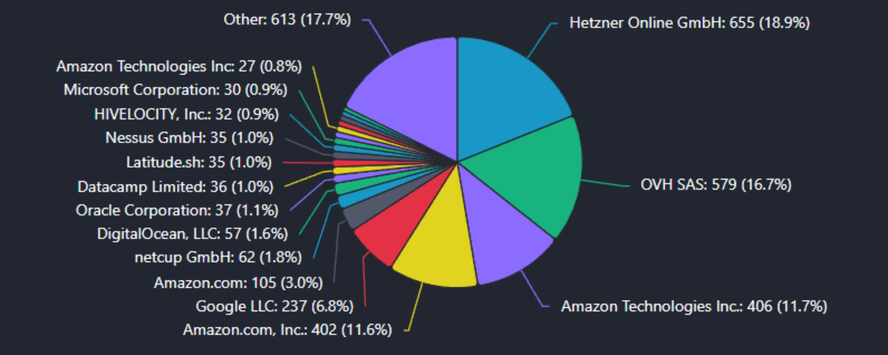
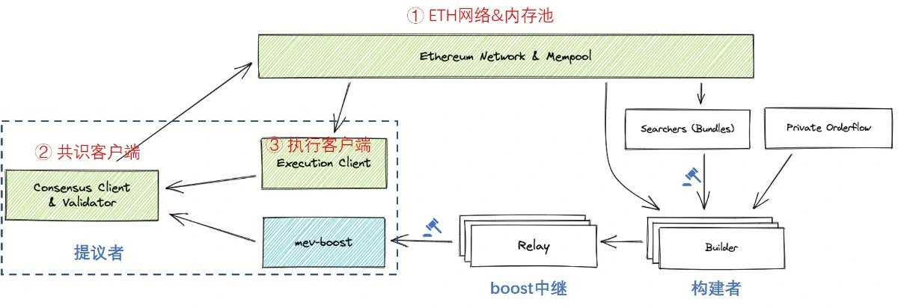
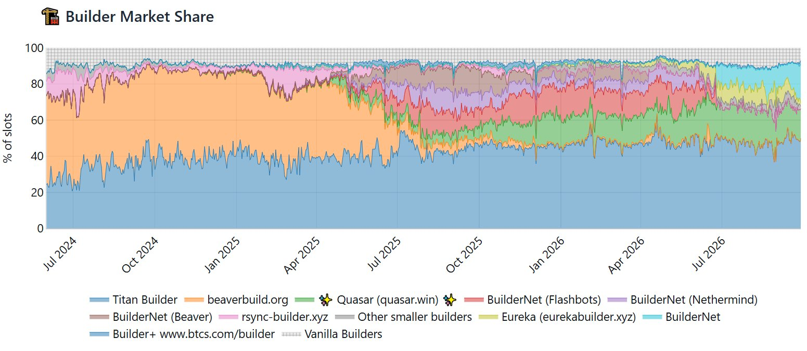
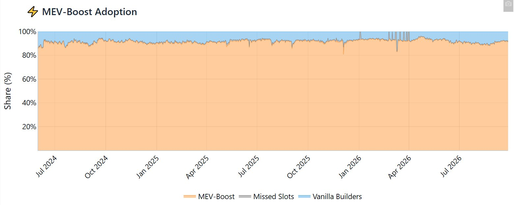
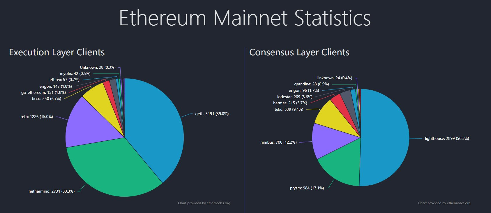
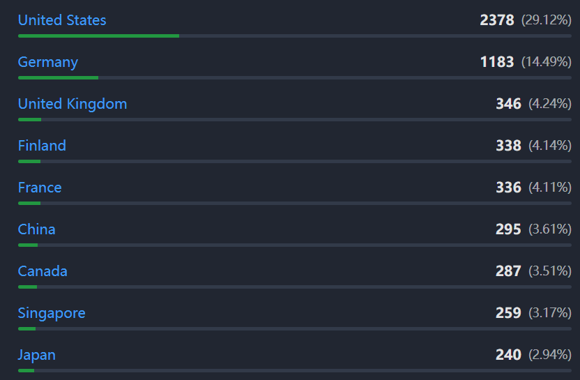
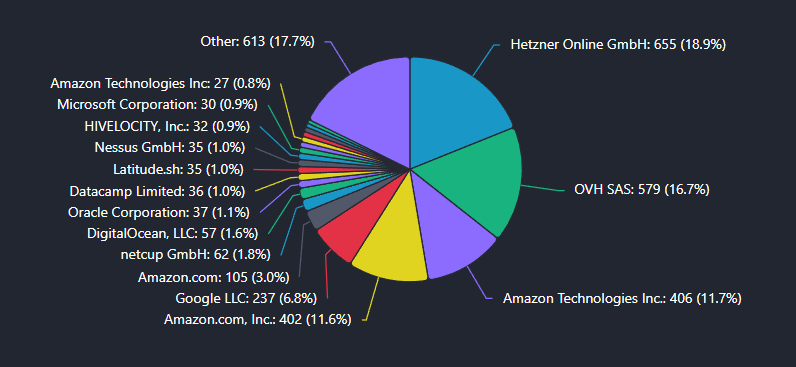
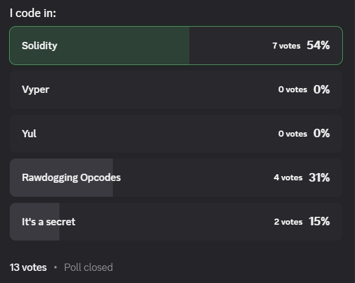
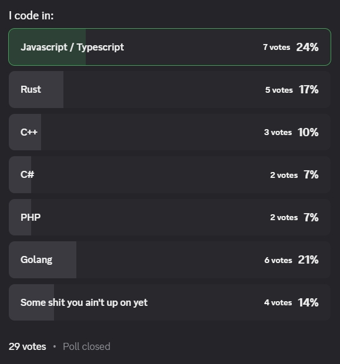

# 以太坊MEV基础设施新人选型指南

作者：青十五（@mev15_eth）

原帖：https://x.com/mev15_eth/status/2105924978935800148

文章：https://x.com/i/article/2105876070415441920

发布时间：2026-10-02 15:36:55（北京时间）。

> 抓取范围：公开接口返回的主帖与完整文章；twitter-cli 认证检查失败，未取得评论正文，不能据此判断没有作者补充。以下保留作者原文主张。

## 主帖

这篇文章主要从个人经验出发，介绍以太坊主网MEV需要的基础设施选型，包括：
- 节点客户端：执行客户端EL、共识客户端CL
- 硬件：服务器配置、Location、云服务商
- 开发语言：链下代码及第三方库、链上代码及测试框架

赶紧把答应读者的一些文章写完，不然都要过时了…… https://x.com/i/article/2105876070415441920

## 文章

这篇文章主要从个人经验出发，介绍以太坊主网MEV需要的基础设施选型，包括：

- 节点客户端：执行客户端EL、共识客户端CL

- 硬件：服务器配置、Location、云服务商

- 开发语言：链下代码及第三方库、链上代码及测试框架

以太坊主网MEV经历了最早的PGA时代、Flashbots+矿工时代(1)、转Pos初期的混乱时代，以及当前趋于稳定的PBS时代(2)，下一个版本会过度到ePBS时代。

在PBS时代，MEV Searcher会把套利交易打包后发给构建者（Builder），Builder负责将交易排序并组建一个区块，然后通过一个或多个boost中继（Relay）发送给提议者（Proposer）。

通常Searcher会在套利交易中通过coinbase transfer把大部分利润转给builder（贿赂bribe），builder会在区块末尾把大部分利润转账给proposer，后者从众多builder提交过来的区块中，选择让自己收入最多的区块发布即可。

截止目前（2026年9月），builder市场格局(3)如下：

经builder构建的区块稳定占据90%以上的市场份额。

另一方面，以太坊主网现在是PoS机制，固定每12s出一个区块（后面升级会缩减到6s），出块的proposer也是提前定好的，分布在全球各地。

出块机制和市场格局，决定了以太坊主网MEV的几个特点：

1. 速度不是决定因素：不像其他L2那样动不动就几百ms的出块间隔，以太坊的12s有充足的时间让bot计算套利路径；同时以太坊的分布式出块，也不需要像其他L2那样绞尽脑汁找Sequencer的Location，在以太坊做MEV可以在全球范围内找便宜的机器做节点。

1. Gas效率也不是决定因素：由于proposer会选择让自己收入最多的区块，倒推到builder这里就会以绝对利润为排序规则，而不是综合GasPrice。所以相比其他按GasPrice排序的链，Gas效率提升5%就能带来5%的毛利率提升，以太坊由于builder构建的区块占据了90%+，以绝对利润为排序成为主导，加上最近一年来低迷的BaseFee，Gas效率优化提升的利润微乎其微。

1. 策略和贿赂是决定因素：最终在以太坊主网MEV中，策略和贿赂成为了决定因素，这也决定了以太坊上的MEV并非赢家通吃，是少有的拥有长尾策略空间和串谋空间的链，不过这些内容和本文无关，就不展开了，以后会在我的其他文章中看到。

这些特定，又决定了以太坊主网MEV基础设施的选型思路。

## 1、节点客户端

首先排除第三方RPC客户端（如alchemy等），因为这些服务商免费的plan不会提供mempool和区块模拟的端口，而付费的plan算下来其实跟自建节点省不了多少，甚至更贵。

自建的话，根据ethernodes的数据(4)，目前执行和共识客户端的市占率情况如下：

对以太坊MEV Searcher来说，执行客户端主要在Go系的Geth/Erigon和Rust系的reth中选择（C#系的nethermind市占率高主要是企业如Coinbase在用，属于历史原因）。

在早期基本没有什么选择余地，基本都是用Go系的Geth/Erigon，那时候甚至Geth官方还不支持CallBundle RPC，大家还是用的MEV社区一位大哥开源的带CallBundle的版本，直到官方合入；Erigon好一点，很早就自带CallMany RPC。

随着2024年Reth发布，经过两年的发展，已经基本覆盖了绝大多数的RPC（包括Geth的CallBundle和Erigon的CallMany，以及后来的simulate）；

更重要的是，Reth最新版本2.5+支持minimal类型的节点，支持上面所有这些rpc在链头调用，同时硬盘占用小到只需要250GB！给硬件方面多了很多选择空间。

性能方面相比12s的出块间隔，差异不明显，但肯定还是Rust系的Reth最优。

所以执行客户端基本上没有什么悬念，基本都是推荐的Reth（minimal或archive，根据策略需要或者数据分析需求选择后者）。

共识客户端方面，直接用市占率最大的lighthouse即可，这也是Reth推荐的搭配。

## 2、硬件

按Reth minimal + lighthouse独立部署

- 硬盘方面，目前至少需要300GB，因为同步过程是先加载后删除，同时考虑链增长，要留一些冗余，建议1TB起，由于节点是IO密集型，硬盘必须是NVMe；

- 内存 32GB起，CPU 4core起，单核性能优先，同级别CPU的话AMD优先。

Location和云服务商的选择也很简单，看其他以太坊节点都在哪，离他们近一点就可以了。

以太坊节点主要集中在美国和欧盟，在美区和德区选择节点即可，如果需要的话第三个节点可以放在亚区的新加坡或日本东京

使用的主流服务商是Hetzner、OVH和AWS，其中前两家是独服（流量在包月计费中），AWS是云服（流量单独计费，需要特别注意）。

如前面所述，以太坊MEV并不需要像L2那样离Sequencer很近，所以通常Searcher都会选择AWS之外的独服。

两家独服在过去是性价比代名词，但今年都经历了离谱的翻倍涨价（Hetzner 6月，OVH 8月），说多了都是泪。

目前满足上述硬件需求的，Hetzner是AX41，OVH是RISE-S，都是60欧/月上下，应该已经算是当下搭建节点的性价比之选了。

至于AWS，考虑到流量要单独计费，共识层和执行层都有大量数据要分发，基本不太会考虑了。

## 3、开发语言

如果说以前选开发语言，还要考虑自己过去的技术栈和难度曲线，那么现在vibe时代选开发语言，看的就是AI大人的喜好了，尽量选择成熟的、泛用的、安全的编译型语言即可。

链上语言方面，即合约语言，选最成熟的Solidity即可，最多再加上Yul；

不考虑Huff，前面提到，Gas效率不是以太坊MEV的决定因素，极限优化反而容易失去安全性；

不考虑Vyper，那是当初给Python技术栈过来的开发人员的选择，AI写合约不用考虑它的理解门槛，何况2023年Vyper还出过重入锁的漏洞导致Curve多个池子被盗的安全事件。

开发测试框架则选择当下主流的Claude啊不是，Foundry，Rust实现，速度快支持全，虽然我现在也很少手动使用了，比较多的是安装好foundry和forge/cast等全部工具链之后，在Claude.md等处引导AI自己去调用了。

链下语言方面，可以选择的就比较多了，总的来说两个方向：

之前是Python/JS/TS技术栈的，同时希望自己能看懂或快速上手，或者涉及交易不完全放心vibe coding的，建议优先选择TypeScript。

Python的问题是性能差，且第三方库没有那么成熟，更新慢，顶多拿来做离线分析，但离线分析现在其实也不需要自己做了，交给Claude/CodeX就好了。我是从Python技术栈过来的，第一笔上链盈利的交易系统也是Python写的，很快就放弃了并切换到了NodeJS。

NodeJS的话，注意一个小问题，就是类型转换。

我之前快糙猛上线，所以写的都是CommonJS，和Python一样是解释型语言，写了一个搞笑的低级错误：在和竞争对手竞价的时候，处理对方的GasPrice+1wei的逻辑，没注意写成了GasPrice（字符串）+1（数字），在CommonJS中是合法的写法，但逻辑就变成GasPrice字符串后面拼接数字1，结果就是高频竞价的过程每次竞价都翻十倍，竞争对手都看傻了，还好我发现早，才只是怒亏了几百u。

这个问题，后续vibe coding的时候也遇到过，以及还有很多运行时才会发现的bug，所以在vibe coding时代，还是建议优先选择编译型的TypeSript。

TypeScript/NodeJS这一系的第三方库，建议选择viem，包小性能好，其次ethersjs，或者两者混搭。

之前是Go/Rust/C或其他技术栈的，或者完全信赖vibe coding的，建议开发语言直接选Rust。

在MEV的PGA时代，由于Geth独大Reth还未出现，有些alpha必须要改造Geth节点实现，并且Go的并发写起来更容易上手，刚好也适配PGA策略，所以Searcher会选择用Go直接把策略代码写到Geth里。

但随着Reth的上线，以及alloy、revm、ExEx、Foundry、Artemis等Rust组件的完善，类型安全、内存安全、没有GC的Rust已经成为了MEV Searcher的首选（不仅限于以太坊L1）甚至是唯一选择。

唯一的缺点是学习曲线比较陡，这个短板也被AI补上了。除非是做极致的性能优化，仍然需要经验丰富的Rust开发介入，像以太坊这种12s出一个块的，AI写的代码在速度上绰绰有余，只需要在业务和策略上用测试覆盖确保正确性就好。

目前我的交易系统部分策略已经完全交给AI用Rust实现了，实现利润保守6位数u，即便我压根不会写Rust，曾经不停地入门多次。

目前想到的就是这些，有其他的后面再补充。

我们链上见。

(1) 黑暗森林02 - 先导篇之MEV的市场（上）

(2) 黑暗森林03 - 先导篇之MEV的市场（下）

(3) MEV-Boost Dashboard

(4) ethernodes.org

## 原文外链

- https://xiaobot.net/post/5689c539-43b0-4bdc-a133-db2786d36f32
- https://xiaobot.net/post/724d55c1-8f5b-4cf4-847d-3a2e127fc0ab
- https://mevboost.pics/
- https://www.ethernodes.org/

## 归档限制

仅恢复正文、标题、列表、配图位置及外链；部分富文本样式简化。未展开小报童前文，未抓到回复正文。原始结构见 fxtwitter.raw.json。
