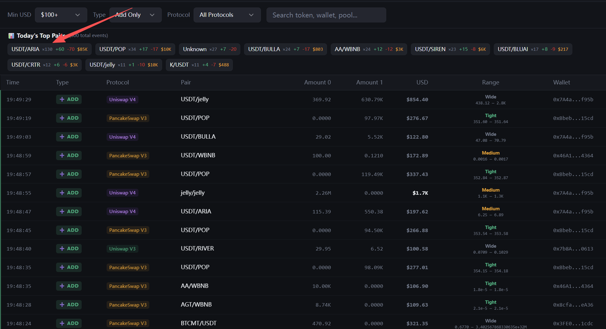

# 链上 LP 加减实时监控工具构想

- Author: @MonkeyJcck (叠马仔🍁)
- Published: 2026-04-11 02:51
- URL: https://x.com/monkeyjcck/status/2042676817832874083?s=52
- Source Type: X Tweet + author replies
- Capture Tool: twitter-cli
- Capture Note: 主帖带 1 张配图。抓取结果中混入了少量无关时间线内容，本文只保留主帖和作者自己与主题直接相关的回复。

## 配图

## 主帖正文

这个东西我从去年就开始想做了。

是一个链上 `LP` 加减实时抓取，并且呈现出来滚动，然后可以看到当前哪些热门在加，通过短时间计数即可看到。

能看到 `LP` 科学家、顶级策略者、成交量巨大的币的第一时间动向，结合自己的实际行动去做判断。

短时间内出现一个新的币多次加减 `LP` 情况，能及时马上呈现出来。

这东西说简单也简单，说难也难。目前我做了一个热门交易对计数，和能看到别人 `LP` 范围。池子我选取 `Uniswap V3 / V4` 加上“博饼”的 `V3`，主流的就这些了，其余的也没什么用。后续打算更新：

- 池子费率是多少
- 更精准的 `USDT` 本位币价区间范围
- 优化数据

因为目前 `Uniswap V4` 上有时候会抓取到一些非 `LP` 的动向，需要改进。

简单地说，分析动向的话已经实现了，热门标马上能通过加减计数呈现，这两天也确实轻松不少，后续加上大额和次数警报。

有时候别人有的你没有，你就必须去学，不一定要一天会，但是可以每天进步一点点，直到实现。

在币圈能稳定做到月收益曲线持续向上的不多。

还在持续完善，未公开。

仅此鞭策自己持续前进，有兄弟可以分享策略和经验交流欢迎，私聊我。

## 评论区与补充

### 1. 这不是机械跟单工具，而是“判断热点”的上游雷达

- 时间：2026-04-11 18:27
- 内容：作者明确回复，不是“看到谁在加 `LP` 就跟、谁在减就走”，而是用来判断热点。

### 2. 作者最看重的是丝滑程度和数据字段是否真的服务 LP 实战

- 时间：2026-04-11 02:54
- 内容：作者说自己本身就在做 `LP`，知道哪些数据重要，所以会持续优化，直到接近非常完美。

### 3. 范围展示本身就是核心功能之一

- 时间：2026-04-11 21:32
- 内容：面对“每个人区间都不一样，怎么展示”的提问，作者回应这恰恰是工具的重点之一，要能清晰看到每个人的区间和对应池子信息。

### 4. 作者暂时没有公开和开源计划

- 时间：2026-04-11 18:28
- 内容：目前还不适合公开，因为还在持续优化。

### 5. 作者希望最终能加入警报系统

- 主帖里已经点明后续要加“大额”和“次数”警报。
- 这意味着工具目标不是只做回看面板，而是做实时监控与提醒。
