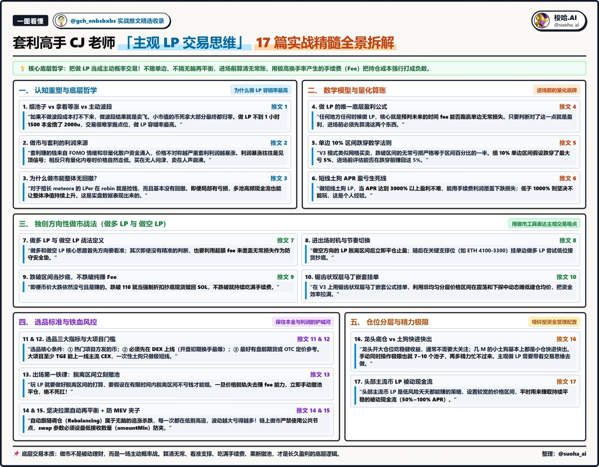
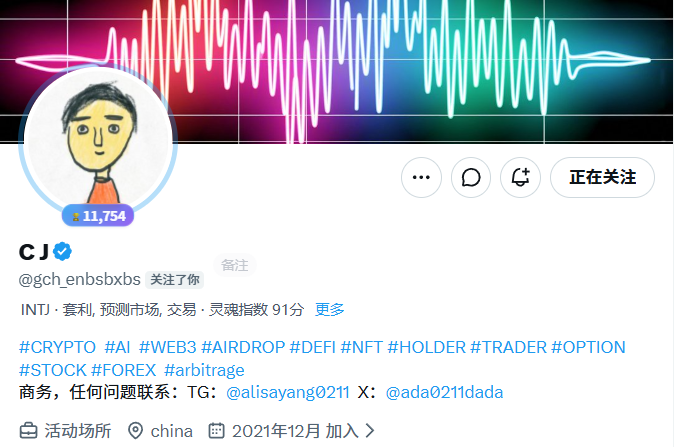

# 梭哈.AI：CJ 主观 LP 交易思维 17 篇合集

- Author: @SUOHA_AI (梭哈.AI)
- Published: 2026-09-02 12:09
- Status URL: https://x.com/suoha_ai/status/2095001169793814891?s=52
- Source Type: X collection post
- Capture Tool: twitter-cli
- Capture Note: 主帖为 17 条 CJ 历史推文的二次整理，含一张合集长图；另有作者补充回复和一张 CJ 主页截图。17 条链接内容已单独保存到 linked_tweets/originals.md，结构化原始数据保存到 linked_tweets/raw/*.json。

## 主图

## 作者补充图

## 主帖正文

【收藏贴】套利高手CJ老师 @gch_enbsbxbs「主观 LP 交易思维」17 篇干货 文章收录

现在做 LP 和链上套利，绝对是全网最暴利、现金流最猛的印钞机，套利交易员是如何做 LP 的？ 不赌单边、不搞无脑再平衡，进场前算清无常账，用极高换手率把成本打成负数，把做 LP 当成主动概率交易

我收藏了 CJ 老师在套利逻辑、无常数学算法、做多/做空挂单、选品标准与撤池风控上的 17 篇内容，绝对干货，分享给大家学习👇

一、 为什么做 LP 容错率最高？

【推文 1：组池子 vs 死拿 vs 主动波段】
• 可以学到：为什么小币死拿归零、纯波段卖飞，而做 LP 容错率最高。
“有人说，组池子不如拿着币等涨。逻辑不是这样的。如果你不波段的话，成本就打不下来；如果你波段的话，结果就是卖飞。小市值的币死拿最终大部分都归零。很多时候赚 fee 的时间窗口就那几十分钟。早上这个很猛，不到 1 个小时本金 1500 撸了 2000u，币价其实也没涨多少，刚好差不多翻倍吧。但是交易的话很难掌握点位，LP 容错率就高了。”
🔗 原推文：https://t.co/ey3gXyIPPu

───

二、 套利与做市的利润来源

【推文 2：赚的是市场 FOMO 的钱】
• 可以学到：做市利润来自散户情绪，利润暴涨往往是见顶信号。
“套利赚的钱来自于 fomo 情绪，各路资金疯狂涌入。来自非量化的资金越多，价格不对称就越严重，套利的利润就会暴涨。而这个时候通常就是见顶信号了。相反如果场内只有量化在互相内卷，利润就会一直下降，价格自然走低。所以套利和建仓的逻辑就是相反的，买在无人问津，卖在人声鼎沸。”
🔗 原推文：https://t.co/3DmzPHsDG2

───

三、 为什么做市能做到整体无回撤？

【推文 3：集中流动性多池现金流覆盖】
• 可以学到：多池组合如何用持续手续费现金流抹平局部单边无常。
“对于擅长 meteora 的 LPer，在 robin 就是捡钱，而且基本没有回撤。即便局部有亏损，整体净值仍然能持续上升。这不是我自己胡扯，这是实盘数据表现出来的。”

🔗 原推文：https://t.co/Hx2cHfMtnJ

───

四、 做 LP 的唯一底层盈利公式

【推文 4：Fee 跑赢无常损失】
• 可以学到：进场前唯一要算的数学题。
“先不聊脚本，简单说下 LP，任何地方任何时候核心就是预判未来的时间 fee 能跑赢无常。只要判断对了这一点，那么就是盈利了。你需要做的就是去计算和估算这 2 个东西。”
🔗 原推文：https://t.co/JZKo8TjH75

───

五、 单边 10% 区间跌穿数学法则

【推文 5：跌穿区间本金最大亏损严格等于一半】
• 可以学到：集中流动性挂单的精确亏损测算。
“v3 模式的 LP 分布类似网格买卖，跌破区间的无常亏损很容易计算：就是区间百分比的一半。例如你组了一个单边 LP 区间是 10%，假设跌穿了，那么你亏 5%。你需要评估的是这 10% 的区间能扛多久、能否在跌穿前赚回这 5% 的手续费。”
🔗 原推文：https://t.co/j2e3vQcDCe

───

六、 短线土狗 APR 盈亏生死线

【推文 6：APR > 3000% 才能打，< 1000% 禁区】
• 可以学到：不同收益率下的做市安全边际。
“按照以往玩土狗 LP 的思路，当 apr 达到 3000 以上，做短线 LP 基本上盈利是不难的。（低于 1000 则不能玩，这是个人经验）。apr 能维持在 3000 以上就能打，利用利润覆盖下跌带来的损失。不做长线，合适的位置平仓即可。”
🔗 原推文：https://t.co/xcQReO8qHn

───

七、 独创方向性战法：做多 LP 与 做空 LP
【推文 7：方向判断结合手续费安全垫】
• 可以学到：如何利用做市工具表达主观方向观点。
“什么叫 做多 和 做空的 LP：核心思路首先方向要看准；其次如果没有精准的判断，那么利用 fee 来覆盖无常损失。”
🔗 原推文：https://t.co/LVhY7KCEpw

───

八、 进出场时机节奏切换
【推文 8：做空止盈 ➔ 单边做多接货】
• 可以学到：实战中如何顺应走势切换多空区间。
“这次下跌之快有点超出预期。之前是组的做空方向的 LP，已脱离区间了只能平仓了。目前我觉得当前价格可以开始组单边 LP 试试看能不能接到货，挂 ETH 4100-3300。”
🔗 原推文：https://t.co/rFmbceRH8N

───

九、 跌破区间当抄底，不跌破纯赚 Fee
【推文 9：单边接货的兜底容错逻辑】
• 可以学到：如何把被迫接货转化为计划内的均价抄底。
“也许这就是 LP 的魅力了吧，即便跌成这样依然没亏钱且还是赚的。目前计划是依然不平仓，如果跌破 110 就当强制抄底了，赎回 SOL；不跌破就赚 fee。”
🔗 原推文：https://t.co/JElbNbbJKj

───

十、 锯齿状双层马丁嵌套挂单法
【推文 10：非均匀区间提升资金效率】
• 可以学到：高阶网格马丁挂单逻辑。
“锯齿状的双层马丁嵌套公式，你丢给 AI 他就知道你要干什么了。（实际的使用场景就是用这套公式去 Uniswap V3 组池子）。”
🔗 原推文：https://t.co/W8Hms6H1pf

───

十一、 选品三大硬性指标（第一版）
【推文 11：DEX 首发 + 高热度 + 盘前定价锚】
• 可以学到：挑选高胜率爆款池子的黄金三要素。
“没有拿到空投，如何靠 LP 也一样赚到高收益。核心点：1/ 相对比较热门的项目方发的币；2/ 先在 DEX 上线；3/ 最好是有盘前期货价或者场外 otc 价作为参考。”
🔗 原推文：https://t.co/o1MhjOuuCq

───

十二、 选品补充标准：什么叫大项目？
【推文 12：TGE 至少能上 1 线 CEX】
• 可以学到：如何区分一次性土狗与值得重仓的大项目。
“不是所有的币都能够采用 LP 的玩法。撸毛的一次性项目就当撸毛玩就好。什么叫大项目？至少 TGE 你得能上 1 线的 CEX。”
🔗 原推文：https://t.co/MgJAaymn1q

───

十三、 出场第一铁律：脱离区间立刻撤池
【推文 13：绝不死扛脱轨头寸】
• 可以学到：进场前必须设定退出机制，脱离区间果断平仓。
“我自己是不玩收益太低的币的，因为脱离区间就会亏。玩 LP 就要做好脱离区间的打算，要假设在有限的时间内脱离区间不亏钱才能组。例如当前的 fee 赚 1 个小时脱离区间不亏钱就能玩；如果不能，就不能玩。”
🔗 原推文：https://t.co/e4Bgbkf1Nz

───

十四、 绝对禁忌：坚决拉黑自动再平衡
【推文 14：自动调仓等同于追涨杀跌】
• 可以学到：为什么第三方自动调仓工具会加速本金亏损。
“在 v3 模式下自动跟随价格波动调整 LP 区间，说实话这种策略属于无脑的追涨杀跌。每一次的 rebalancing 就是在追涨杀跌，长期跑下来可能是亏的，波动越大亏得越多。”
🔗 原推文：https://t.co/AvgrGGgObt

───

十五、 链上防 MEV 夹子与滑点实操
【推文 15：私有节点与最低接收数量保护】
• 可以学到：链上交易如何避免被机器人夹走利润。
“要想躲过 mev 机器人：不能使用公共节点，swap 的参数必须设置最低接收数量（amountMin）调到你认为合理的数值。”
🔗 原推文：https://t.co/qXKAgZ3wza

───

十六、 仓位分层管理与精力极限
【推文 16：大仓吃稳息 vs 小土狗快进快出】
• 可以学到：单人手动盯盘上限 7~10 个池子。
“我通常手动会同时操作七八个土狗，极限也就 10 来个，再多就忙不过来了。龙头开的仓位会大些，通常不需要太关注；几 M 的土狗基本上都是快进快出。主观做 LP 需要带着交易思维去做，进出的时机比较重要。”
🔗 原推文：https://t.co/n2nzxVFti8

───

十七、 头部主流币 LP 策略（第二版）
【推文 17：低风险获取持续被动现金流】
• 可以学到：主流币稳定吃费的压舱石配置。
“LP 玩法第二版：如何组头部币的 LP。今天说个低风险天天都能赚的策略，这是我平时用来赚点被动收入的方法。”
🔗 原推文：https://t.co/AfpXOPe58X

───
有些推文是一年前的，也许已经不太适合现在的版本。但思路仍然十分值得学习。CJ老师@gch_enbsbxbs 是我关注很久的套利高手了，感谢分享🫡

## 引用推文

- Author: @gch_enbsbxbs (C J)
- Tweet ID: 2094662841404194947

你们要感谢我 我还愿意 给你们分享。
这东西 有些人已经偷着搞了一段时间了。
我也是最近perp套利收益不行了 才转过来玩玩。
而这个正好也是我比较擅长的赛道。
