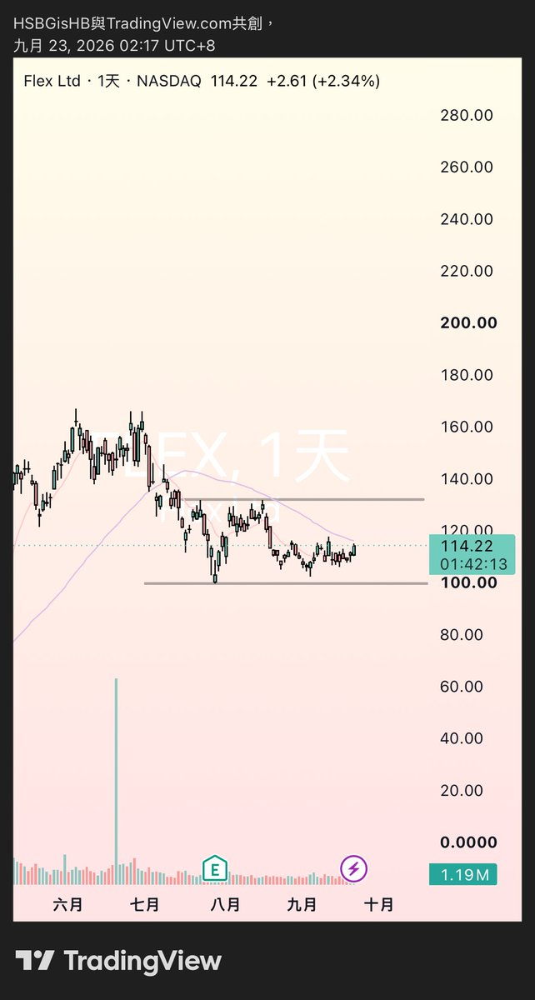
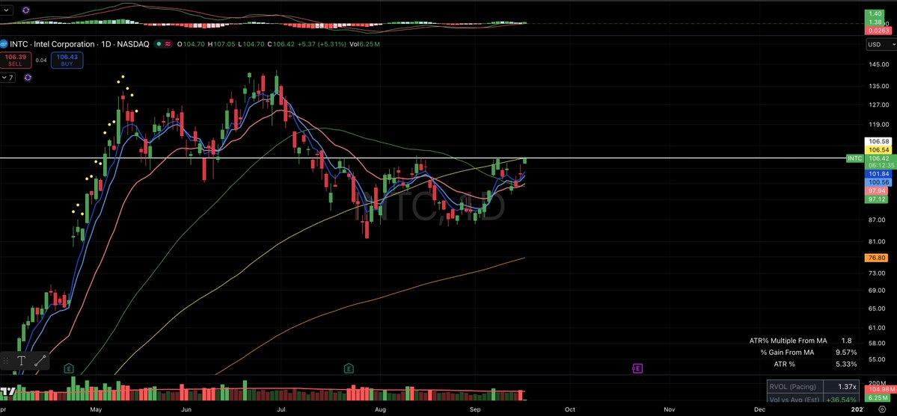
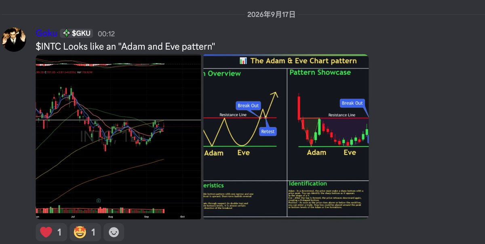

# 原始推文归档

作者：TraderGoku（@tradergoku）

发布：2026-09-22T02:12:42+00:00

来源：https://x.com/tradergoku/status/2102219507129332019

归档于 2026-09-25。以下正文与回复是来源材料，观点、价格和交易建议不代表归档者认可。广告与无关推荐仅保留在原始 JSON 中。

"Adam & Eve" 是我很喜欢的一个反转技术形态。

1. Adam：先出现一个快速的 V 型底，往往是恐慌下杀后迅速反弹。
2. 股价反弹，但还没有真正反转成功。
3. Eve：第二次下跌时速度更慢，形成一个圆弧底，波动通常比第一次收敛。
4. 最后突破两个底之间的 neckline，形态确认。

第一次代表市场砸不动了，第二次代表卖压慢慢耗尽。 $INTC

## 本次可见相关回复

详情接口并非完整评论区，本次未返回的折叠、删除或后续回复不在覆盖范围内。

### @elinor512 · 2026-09-22T18:18:52+00:00

https://x.com/elinor512/status/2102462651045658935

@tradergoku 老師，這個是不是也是類似Adam$Eve的走法 https://t.co/fVvLM4mbgs

### @tradergoku · 2026-09-22T18:42:38+00:00

https://x.com/tradergoku/status/2102468631363989759

@elinor512 像，需要先把圆弧底走出来。

### @ya78756632 · 2026-09-22T10:47:01+00:00

https://x.com/ya78756632/status/2102348938841829706

@tradergoku 你看一下rocketlab 看起来也像adam eve

### @tradergoku · 2026-09-22T14:47:36+00:00

https://x.com/tradergoku/status/2102409483075109249

@ya78756632 很像，需要看到圆弧底的形成进行确认。

### @XiaoqunYan · 2026-09-22T02:16:06+00:00

https://x.com/XiaoqunYan/status/2102220362520183257

@tradergoku 等回调，$110附近再入。

### @davidxffan2 · 2026-09-22T03:44:12+00:00

https://x.com/davidxffan2/status/2102242533070029222

@tradergoku 昨晚看好像很多都是这个形态，这个名字还是第一次听

### @CaseyVSilver · 2026-09-22T03:57:21+00:00

https://x.com/CaseyVSilver/status/2102245843076079643

@tradergoku I learned something new today, great share.

### @TheInvisib13 · 2026-09-22T02:30:53+00:00

https://x.com/TheInvisib13/status/2102224083534651902

@tradergoku 谢谢 老师

## 主帖引用的前帖

https://x.com/tradergoku/status/2100582559696461955

2026-09-17T13:48:03+00:00

$INTC “Adam and Eve” 形态测试压力位 https://t.co/fpL6fvCOjM

