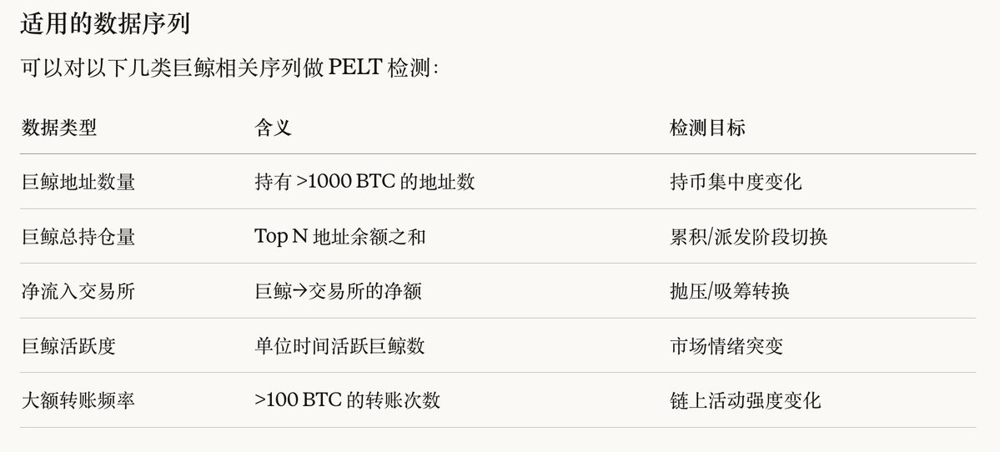

# 用 PELT 变点检测识别 regime 切换与巨鲸结构突变

- Author: @viviennaBTC (vivienna.btc)
- Published: 2026-04-11 18:50
- URL: https://x.com/viviennabtc/status/2042918322803740757?s=52
- Source Type: X Tweet
- Capture Tool: twitter-cli
- Capture Note: 目标推文带 1 张配图。抓取结果里混入了后续时间线内容，本文只保留目标推文本身。

## 配图

## 主帖正文

这种观察太有价值了。这种“变点”往往是 `regime` 切换的节点，是“调仓”的好时机。

刚好也补充一个在此场景下的应用理论: `PELT` 变点检测模型。

`PELT`（`Pruned Exact Linear Time`）是由 `Killick`、`Fearnhead` 和 `Eckley` 在 `2012` 年提出的一种变点检测算法。它能够在时间序列中精确地找到统计特性（如均值、方差、分布）发生显著变化的点。

`PELT` 在金融量化里主要用来自动识别市场状态的转折点，常见应用有：

- 市场状态切换识别：找出牛熊转换、震荡转趋势的时间点
- 波动率突变检测：发现风险水平突然升高或降低的时刻，用于风控和仓位调整
- 策略失效预警：监测策略收益曲线，当出现变点时提示模型可能需要重新训练
- 结构性断点分析：检测资产相关性、协整关系等是否发生改变，避免套利策略失灵
- 事件影响评估：量化重大事件对价格行为的实际冲击点

一句话概括：`PELT` 帮量化研究者把连续的行情数据客观地切成“不同阶段”，让每个阶段内的统计规律更稳定，从而让模型和策略更可靠。

巨鲸地址变动是 `PELT` 在链上数据分析中一个很自然的应用场景。巨鲸地址的余额、净流入流出、活跃度等都是典型的时间序列数据，常常存在结构性突变（如大规模建仓、派发、交易所迁移等），非常适合用变点检测来识别。

在用 `PELT` 对巨鲸地址变动进行分析期间需要注意：

- 巨鲸数据常有明显趋势，建议先做差分或去趋势，否则 `PELT` 容易被长期趋势主导
- 大额转账等离散事件可先做滚动求和，平滑成连续序列
- 注意交易所地址、矿工地址、托管地址（如 `Grayscale`、`MicroStrategy`）的影响，这些往往造成“假”的巨鲸变动

## 补充说明

- 这条推文本身更像是对“盘面变点”观察的量化化补充，不是在单独讲某个币。
- 它的价值不在于直接给交易方向，而在于给“什么时候要承认市场进入新阶段”提供了一个更客观的工具。
