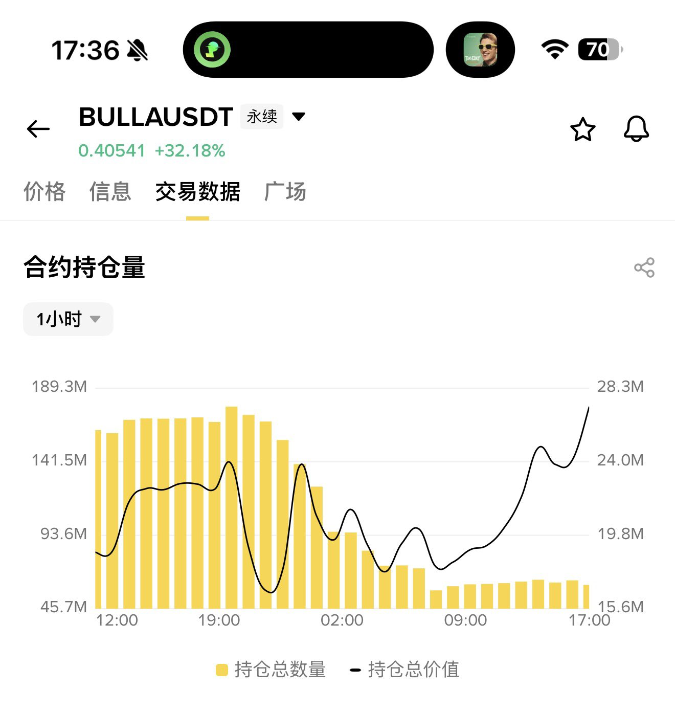
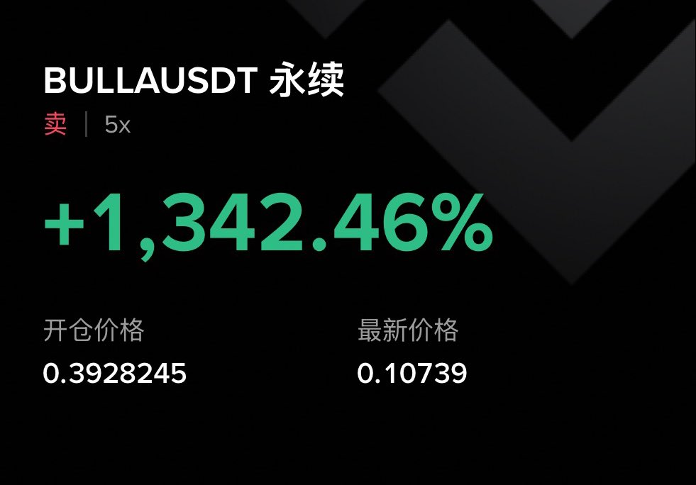

# 典型的崩盘模型解读

- Author: @wuk_Bitcoin (Donato)
- Published: 2026-02-02 01:43
- URL: https://x.com/wuk_Bitcoin/status/2018017280685469758?s=20
- Source Type: Tweet + author replies

典型的崩盘模型解读

1.价格涨，OI不断降低，这里有个细节，需要看1H的交易数据，级别太小不能够确定主力意图。

2.价格被托着往上走，合约持仓量几小时连续降低，这是崩盘前的预谋行为。

3.主力在高位平掉所有的多单，然后托住价格继续找对手盘，让散户或者电子盘进来做多套利，有了对手盘就可以悄悄叠加空单。等空单布局完成，撤掉托价订单，顺势砸盘，一边砸一边继续叠加空单，直到最后彻底崩盘。

其实这种一般收割对象的并不是散户，而是机构的电子盘，散户只是被误伤的一种。

我自己开的空单并不大，只是用来验证学习和总结。把个人总结发在 X 上，当做交易笔记，也供大家学习参考。

欢迎大家补充 #Bulla

## 作者评论区补充

### 回复 1
- 时间：2026-02-02 01:54
- 内容：事后复盘应该是为了把追多的多头清理掉，不然后面拉不动。

### 回复 2
- 时间：2026-02-02 02:51
- 内容：正常来讲，这种妖币做空最后守住都能赚钱的，可是一般人没法守得住。无论多么猛烈的涨幅都是在为下跌蓄力。

### 回复 3
- 时间：2026-02-02 12:15
- 内容：真不能盲目空，得参考交易数据。

### 回复 4
- 时间：2026-02-02 12:19
- 内容：这个还好，我们做了数据统计，后面资金费率已经很低了。不过跌到 0.1 开始明显感觉到空单的价值一直在缩水，对手盘越来越少了。

### 回复 5
- 时间：2026-02-02 12:45
- 内容：很简单，主力撤了，市场在抄底抢反弹。但实际 OI 并没有比价格最高点还要高。最高的时候 30M 多，现在才 7M。
