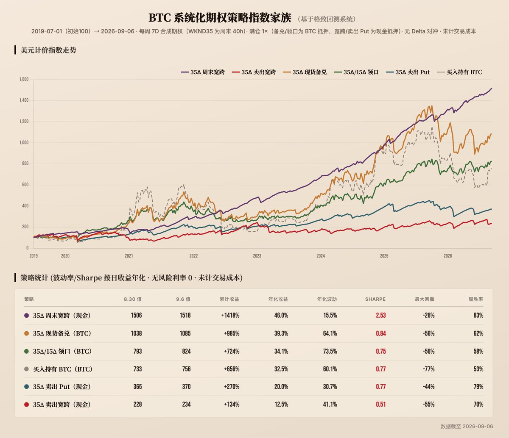
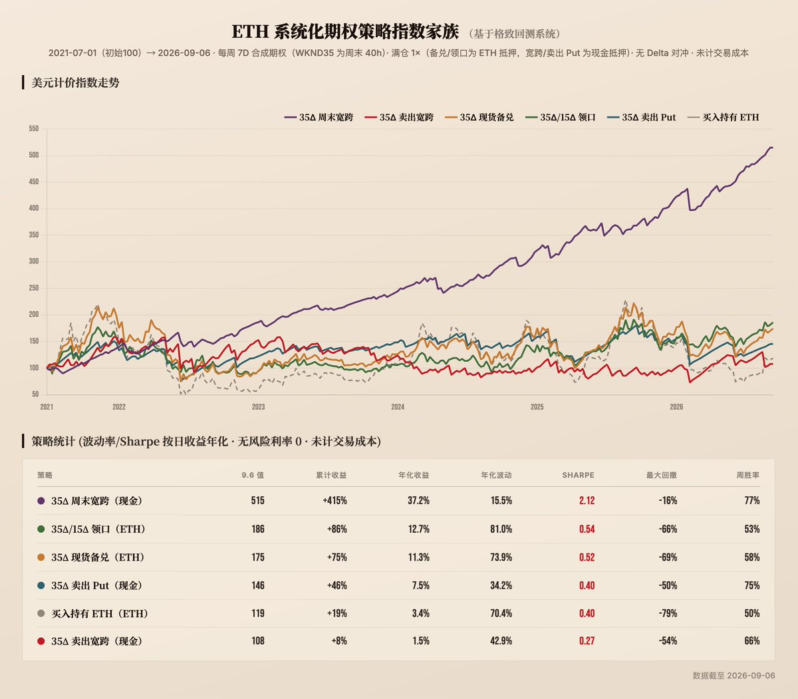

# 作者引用的两个前帖

范围：保留两个前帖主文与图片，原始接口快照另存；更早的引用和评论未递归整理。

## 2096956007918219583

https://x.com/leifuchen/status/2096956007918219583

2026-09-07T13:37:26+00:00

BTC 系统化期权策略指数（9.7）

过去一周 BTC 先跌后涨，HODL（持币策略）从 733 涨到 756，一周上涨 3.15%。周中一度跌到 7 万 6，周四反弹到周五收于 8万 1 附近，整个周末也在 8 万上下徘徊。这一周所有的期权策略表现都很不错，不论是卖 call 的、卖 put 的、周频的、周末的都是权利金全收，所有指数全线上涨！下面我们看下各条策略指数的表现。

CC35（现货备兑）
1038 → 1085（+4.52%）
本周卖 call 的行权价是 8万 2，现货周五凌晨险些冲破，但下午结算时回落到 8 万 1，完美收关。现货涨幅加上全额权利金，备兑这周比单纯持币多赚了一份权利金，是备兑能遇到的最好剧本，正好是上期“结算前涨、结算后跌”的镜像。

过去 7 年 374 个周期里，call 到期未被行权的概率有 71%，但在现货上涨的 204 周里只有 48% 的概率未被行权，所以上周的运气算很不错。

CLL（领口）
793 → 824（+4.03%）
call 这边和备兑一样全收，多买的那张 put 保险行权价 7 万 5，白付保费，所以比备兑少赚了半个百分点。

STG35（周频卖宽跨）
228 → 234（+2.73%）
call 行权价 8 万 2、put 行权价 7 万 8，现货周三最低 跌破过 put，但结算时回到 8 万 1，所以也是两条腿权利金全收。

CSP35（现金担保卖 put）
365 → 370（+1.41%）
结算价 8 万 1 远在 put 行权价 7万 8 之上，权利金全收。

WKND35（周末宽跨）
1506 → 1518（+0.77%）
call 行权价在 8 万、put 行权价 7 万 9，周末现货一度冲过 call 行权价但是结算时再次回落，稳稳落于区间，两条腿权利金全收。

=====

以上报告数据来源为 https://t.co/DavBhD0uFp ，本周新增了 ETH 的回测，欢迎大家也来回测自己设想的策略！

## 2097136840251990157

https://x.com/leifuchen/status/2097136840251990157

2026-09-08T01:36:00+00:00

ETH 系统化期权策略指数家族发布！

格致回测系统上周开始支持 ETH 数据，因此我们把 BTC 的策略指数原样复制到 ETH 上看看它们的表现究竟如何。

策略设置同样还是每周五换仓的 7 天合成期权，行权价取 35Δ，不做 Delta 对冲，不计交易成本。

唯一的区别是 ETH 的期权上线比 BTC 要晚一些，所以我们把策略指数的起始日期定在 2021 年 7 月 1 日（起始值为100），当天 ETH 价格在 2100 附近，5 年多过去了，经历两轮牛熊的 ETH 还在 2400- 2,500 区间震荡，只涨了不到 20%。

ETH 六大策略指数终值和夏普：

WKND35（周末宽跨）
终值 515，夏普 2.12，最大回撤 −16%

CLL（领口）
终值 186，夏普 0.54

CC35（现货备兑）
终值 175，夏普 0.52

CSP35（现金担保卖 put）
终值 146，夏普 0.40

HODL（持币）
终值 119，夏普 0.40，最大回撤 −79%

STG35（周频双卖）
终值 108，夏普 0.27

周末宽跨在 ETH 和 BTC 都位列第一，而且也是断层领先。当然也出现过尾部风险，2022 年 6 月曾创下一个周末亏损 12%的记录。

周频双卖在 ETH 和 BTC 上都位列倒一，虽然 271 周里 66% 是赚钱的，但 2023 和 2024 两年分别亏了 19% 和 20%，主要是因为 ETH 在牛市中的暴涨非常猛烈。指数样本期内，ETH 单周涨跌超过 10% 的周占 27%，而 BTC 只有 14%（2026 年至今这个数字分别为 14% 和 8%，所以大家都觉得今年市场平静了不少），而市场给 ETH 的权利金溢价并不足以覆盖这个差距，所以周频双卖在 ETH 上更难做。

ETH 除了暴涨多之外，暴跌也多，所以 ETH 的领口策略还跑赢了备兑，这主要得益于 ETH 在 2022 年和今年的表现：
- 2022 年 ETH 价格从最高 4800 跌到 900，put 赔付了 6 次，领口策略全年收益 −43%，备兑收益 −55%，领口追平前一年和备兑的差异。
- 2026 年 ETH 在年初下跌 31%，备兑策略下跌 24%，而领口策略仅仅下跌 2.5%，凭借在暴跌中的卓越表现，今年至今领口涨了 25%，而备兑刚刚填完坑目前只涨了 5%。

最后我们把 BTC 的策略指数也重设到 2021 年 7 月 1 日和 ETH 做个对照：

- 周末宽跨：
ETH 515 vs BTC 721，比例系数 0.71

- 领口：
ETH 186 vs BTC 309，比例系数 0.60

- 现金担保卖 put：
ETH 146 vs BTC 266，比例系数 0.55

- 持币：
ETH 119 vs BTC  239，比例系数 0.50

- 现货备兑：
ETH 175 vs BTC 407，比例系数 0.43

- 周频双卖：
ETH 108 vs BTC 282，比例系数 0.38

可以看到 ETH 在每一个不择时的系统化策略上表现都远不如 BTC，说明 ETH 的策略更加依赖择时。

=====

以上报告数据来源为 https://t.co/DavBhD12uX ，本周新增了 ETH 的回测，欢迎大家也来回测自己的策略！

