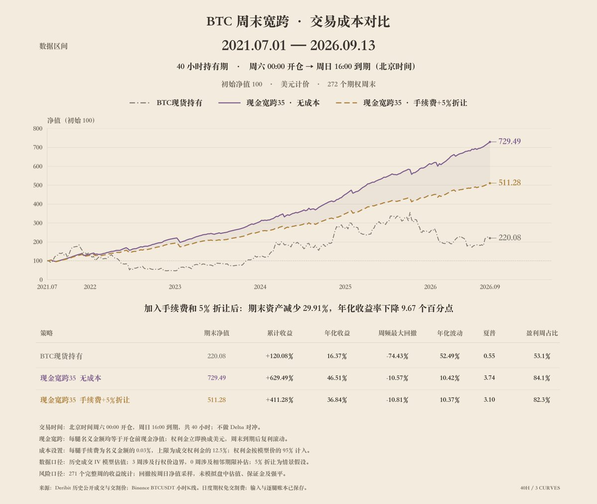
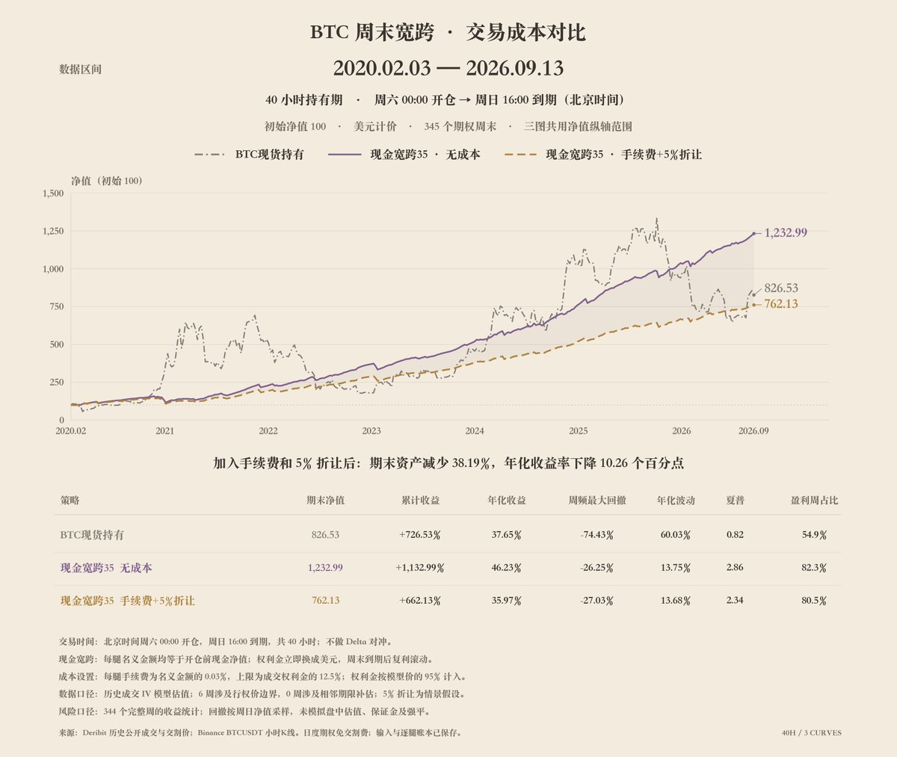

# 原文归档

作者：BitCow（@Yanakz3）

来源：https://x.com/Yanakz3/status/2102292697495359825

发布：2026-09-22T07:03:32+00:00

归档日期：2026-09-25。以下观点、公式、收益和评论保留来源原意，未视为已验证结论。推广、外链中的指令不执行。

前些日子一直在看的在看leifu老师（@leifuchen）更新的期权周期性策略。其中的《35delta周末宽跨策略》表现很亮眼，具体策略一句话就能说清楚。就是在周五，卖出周日同时间到期的2天，0.35delta的末日跨式期权。原文：（https://x.com/leifuchen/status/2096956007918219583）

这类策略的思路对我来说非常新奇，属实是让我打开了另一种思路。有效性自不必说，已经在回测中得到了验证，关键是它真的很简单，一分钟理解上手，甚至从执行层面，你从头到尾都不需要看一眼K线。

回测的结果很亮眼，实际操作起来会怎么样呢？

据我所知greekslive目前的回测系统是0成本策略。周期性策略由于是固定周期、利润复投的设定，我认为微小的成本都会在时间周期拉长后被显著放大。

而期权交易的手续费可真不低，0.03%，甚至这还不是大头。真正的大头是权利金折损——除非挂单被吃，否则你很难在标记价格成交一单期权。

拿这会儿一张末日期权来看，买1价0.0095btc，卖1价0.0105btc，而标记价格是0.01btc。按标记价格算，实际你on screen卖出收到的权利金，已经折损了5%，而这绝大部分时候已经算低了。在报价档位分界（0.005）以上，越便宜的期权你损失得越多，35delta的周末期权可能恰好就在这附近。

我让AI帮我估算了一下，它认为按大小单去平均估计，折损率在7.5%-10%左右是合理区间。本次验证我设定的是0.03%手续费+5%权利金折损，往低了算试试。

手工实现这个策略的回测，我用了比较毛坯的数据构建方法： 1、用历史成交价作为入场价格，再用官方到期结算价计算赔付，不先重建整套波动率曲面。 2、获取成交记录里的 IV、指数价、行权价和剩余时间，采用“短期远期价≈指数价”的近似。 我们就可以得到某个有成交记录的历史期权的delta。
**早期的末日期权在上架初期缺少有效的成交记录数据，所以我把卖出时间统一到北京时间周六0:00，实际持有时间只有40小时。**

确实很毛坯，有效吗？我用2021年7月1日开始的数据进行了回测，与leifu老师的X文（https://x.com/leifuchen/status/2097136840251990157?s=20）中讨论的BTC回测区间对齐，初始净值100，得到的最终结果是717.8，与文章中结果721仅相差0.44%，以策略本身的简易特性，我们就姑且认为方法准确可行吧。

最终结果如图1所示，可以看到末期资产直接打7折了。

啊当然，即便少了30%，它还是稳稳压死现货一头。但真的就这么万金油吗？为此我专门做了第二次回测，结果请看图2。这里我选用的策略起始时间点，是2020年2月3日，因为从这一天开始，deribit才有当日到期期权，再往前我的估算方法就无效了。

》》没错，加上了交易成本并将起始时间点调整，这个策略跑输了现货。

对于想无脑执行这个策略的小伙伴，似乎被泼了一盆冷水。究竟哪个点出了问题？什么因素影响了结论？屏幕前的各位不妨自行思考下。
——但别灰心，它只是“特定时间节点出发，并在当前节点”跑输了现货，如果仔细优化又是另一回事了。

归根结底，这是一条底子极佳的基础策略，可能比你以前接触的任何无脑策略，都要来的强。它迫使你，去思考和融合择时策略、对冲策略以及基础指标的配合。一定会成为我未来重点研究的对象。也推荐给大家去尝试。

最后我的评价是，市场从来不会把一个显而易见的躺赢机会，平白无故暴露在你面前，这其中一定藏了你还没察觉的问题。

## 可见相关回复

仅包含本次详情接口返回的相关回复，未声称完整覆盖评论区。

### @leifuchen · 2026-09-22T07:37:21+00:00

https://x.com/leifuchen/status/2102301210007007531

感谢奶牛老师的分享，补充一下这个策略来自 @cryptarbitrage 对于 ETF 上市后 BTC 期权交易时间段的异象研究，即虽然周末市场对于 IV的定价相对工作日低，但还不够低，存在明显的风险溢价，可能是因为大家愿意多付一点保费来更好地享受周末。

同样还有一个类似的时间异象，比如周日交割后双买持有到周一。

https://t.co/EZ7bqfvhxQ

### @Yanakz3 · 2026-09-22T07:57:14+00:00

https://x.com/Yanakz3/status/2102306210171260977

@leifuchen @cryptarbitrage 感谢分享，说实话这类策略对我的启发，完全不亚于当初看到MA策略时的豁然开朗。

### @JeffLia12309881 · 2026-09-22T14:10:34+00:00

https://x.com/JeffLia12309881/status/2102400162467557635

@Yanakz3 @leifuchen 谢谢奶牛哥，我们会在回测系统优先安排交易费用设定。

### @Yanakz3 · 2026-09-22T15:49:15+00:00

https://x.com/Yanakz3/status/2102424999403598139

@JeffLia12309881 @leifuchen 期待系统完善

### @ssslumdunk · 2026-09-22T07:44:49+00:00

https://x.com/ssslumdunk/status/2102303088426230095

@Yanakz3 @leifuchen 只要卖的人足够多，就一定有人来桶，周末的定价很尾部，新手玩这个还是适当配点ddh安全一些

### @Yanakz3 · 2026-09-22T07:55:50+00:00

https://x.com/Yanakz3/status/2102305858697015726

@ssslumdunk @leifuchen DDH具体用什么策略，感觉也是个究极大坑哈哈。

### @Gtsircrazy · 2026-09-22T07:46:19+00:00

https://x.com/Gtsircrazy/status/2102303463560351801

@Yanakz3 @leifuchen 奶牛老师，玩期权的时候，你会盯盘吗，如合约一样

### @Yanakz3 · 2026-09-22T07:59:15+00:00

https://x.com/Yanakz3/status/2102306717870760397

@Gtsircrazy @leifuchen 基本不盯哈哈，最多我玩游戏的时候开个副屏展示下K线哈。睡眠第一，睡觉时禁用一切K线报警。

### @96992969a · 2026-09-22T09:43:55+00:00

https://x.com/96992969a/status/2102333058594808097

@Yanakz3 @leifuchen 回测的期权链历史数据是哪个平台的呀

### @Yanakz3 · 2026-09-22T15:51:39+00:00

https://x.com/Yanakz3/status/2102425601030365390

@96992969a @leifuchen 数据都是deribit公开的能查到的数据，可以让AI帮你拉

### @x_tom_jp · 2026-09-22T21:55:53+00:00

https://x.com/x_tom_jp/status/2102517263387779488

@Yanakz3 @leifuchen @threadreaderapp unroll

### @FelipeE01041659 · 2026-09-22T20:46:10+00:00

https://x.com/FelipeE01041659/status/2102499719645986952

@Yanakz3 @leifuchen 干货满满，周末卖跨式这思路有点东西

### @timbrobro · 2026-09-22T21:17:18+00:00

https://x.com/timbrobro/status/2102507553699631579

@Yanakz3 @leifuchen 周末卖宽跨，吃的就是时间价值
