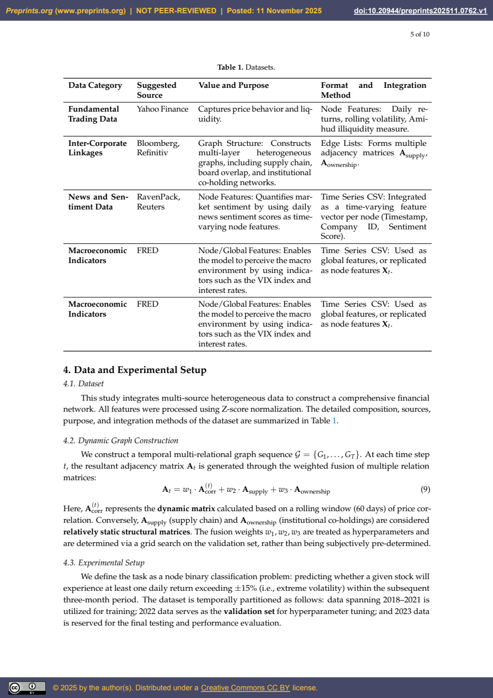
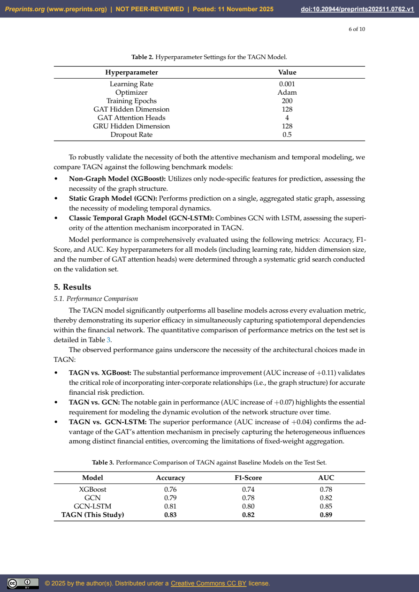
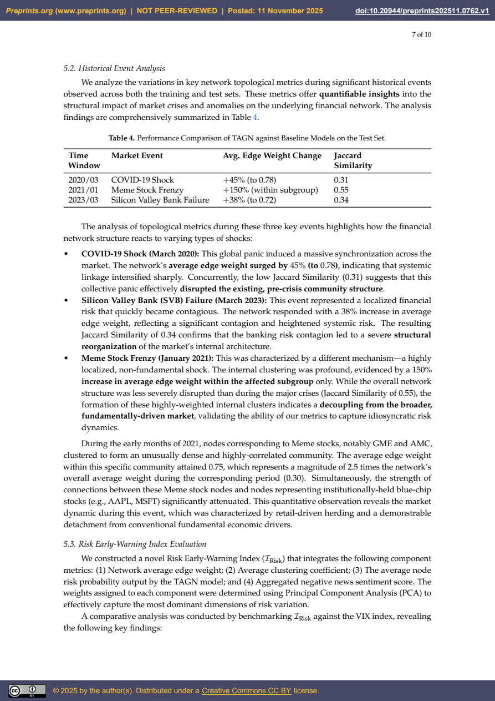
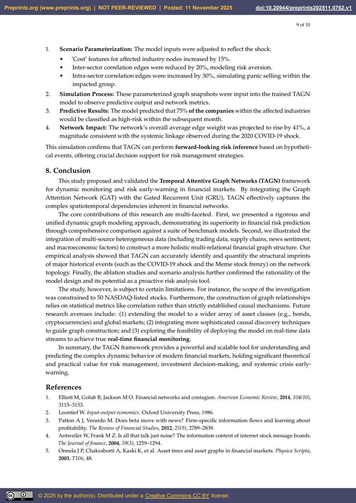

# Temporal Attentive Graph Networks for Financial Surveillance: An Incremental Multi-Scale Framework

- 作者：Wei Zhang、Yimin Shen、Hang Zhou、Bo Zhou、Xianju Zheng、Xiang Chen。
- Preprints.org，2025-11-11，v1，文件标注尚未同行评审。
- DOI：10.20944/preprints202511.0762.v1
- 许可：CC BY 4.0（据文件封面）。
- [原始 PDF](original.pdf) · [元信息](meta.json)

以下为逐页自动提取正文，保留原始表述；公式、表格和字符间距可能错位，引用以 PDF 为准。PDF第1页是封面，第2页起对应论文正文第1页。关键图表页以整页图保留上下文。

## PDF 第 1 页

Article Not peer-reviewed version
Tem poral Attentive Graph Networks for
Financial Surveillance: An Increm ental
M ulti-Scale Fram ework
W ei Zhang , Yim in Shen * , Hang Zhou , Bo Zhou , Xianju Zheng , Xiang Chen
Posted Date: 11 Novem b er 2025
doi: 10.20944/preprints202511.0762.v1
Keywords: financial m onitoring; tem poral graph networks; dynam ic network analysis; risk m anagem ent;
system ic risk
Preprints.org is a free m ultidisciplinary platform  providing preprint service
that is dedicated to m aking early versions of research outputs perm anently
availab le and citab le. Preprints posted at Preprints.org appear in W eb  of
Science, Crossref, Google Scholar, Scilit, Europe PM C.
Copyright: This open access article is pub lished under a Creative Com m ons CC BY 4.0
license, which perm it the free download, distrib ution, and reuse, provided that the author
and preprint are cited in any reuse.

## PDF 第 2 页

Article
Temporal Attentive Graph Networks for Financial
Surveillance: An Incremental Multi-Scale Framework
Wei Zhang 1, Yimin Shen 1,*, Hang Zhou 1, Bo Zhou 1, Xianju Zheng 1 and Xiang Chen 2
1 Department of Computer Science and Engineering, Chengdu Technological University, Chengdu 611730, China
2 School of Electronics and Information Technology, Sun Yat-sen University, Guangzhou 510275, China
* Correspondence: symin1@cdtu.edu.cn
Abstract
Addressing the limitations of conventional financial time series models in capturing modern market
dynamics, this study introduces a novel financial monitoring framework based on Temporal Attentive
Graph Networks (TAGN). The TAGN model integrates Graph Attention Networks (GAT) and Gated
Recurrent Units (GRU) to simultaneously capture spatial dependencies among financial entities and
the dynamic evolution of network structure. The framework uses a multi-relational dynamic graph
of 50 NASDAQ stocks. Node features fuse multi-scale information (micro, meso, macro), and the
graph structure integrates price correlation, supply chain, and institutional co-holdings. Compared
to benchmarks (Logistic Regression, GCN, GCN-LSTM), TAGN demonstrates superior performance
(AUC: 0.89) in predicting stocks likely to experience extreme volatility (> ±15%) within three months.
Empirical analysis (2018–2023) effectively quantifies network imprints of major events (e.g., 45%
average edge weight surge during COVID-19; community stability Jaccard similarity drop to 0.34
following the SVB incident). An ablation study confirms the critical contribution of the attention and
temporal components. Finally, by generating a risk early-warning index integrating network topology
and model output, this research offers a new tool for systemic risk quantification and proactive
anticipation.
Keywords: financial monitoring; temporal graph networks; dynamic network analysis; risk
management; systemic risk
1. Introduction
Modern financial markets have evolved into highly complex, adaptive systems where financial
entities form dynamic, multi-layered networks through channels such as supply chains, capital flows,
and information diffusion [ 1]. Conventional econometric models, such as ARIMA and GARCH,
typically rely on assumptions of independent and identically distributed (i.i.d.) data and static
correlation. This foundation presents significant limitations when attempting to explain market
behaviors driven by non-linear, time-varying interactions.
Market participants’ actions are not isolated but are profoundly influenced by network effects. For
instance, price adjustments in upstream firms (e.g., semiconductor manufacturers) can propagate to
downstream industries through the supply chain network [2]. Concurrently, overlapping holdings by
common funds lead to liquidity co-movements among individual stocks [3]. More recently, the social-
media-driven "Meme stock" phenomenon has underscored how retail investor behavior, facilitated by
information diffusion networks, forms small-world imitation effects [4]. Furthermore, the market’s
macroeconomic structure is itself dynamically evolving. During financial crises, market correlation
generally intensifies, and the network topology shifts from a random network toward a scale-free
network, significantly accelerating risk propagation [5].
In the face of this dynamic complexity, Dynamic Graph Neural Networks (DGNNs), which are
capable of concurrently processing both graph-structured data and time series information, exhibit
Preprints.org (www.preprints.org)  |  NOT PEER-REVIEWED  |  Posted: 11 November 2025 doi:10.20944/preprints202511.0762.v1
Disclaimer/Publisher’s Note: The statements, opinions, and data contained in all publications are solely those of the individual author(s) and
contributor(s) and not of MDPI and/or the editor(s). MDPI and/or the editor(s) disclaim responsibility for any injury to people or property resulting
from any ideas, methods, instructions, or products referred to in the content.
© 2025 by the author(s). Distributed under a Creative Commons CC BY license.

## PDF 第 3 页

2 of 10
immense potential. Early research (e.g., [6]) has already demonstrated the feasibility of this path by
combining GCN with RNN for cryptocurrency volatility prediction. However, a unified framework
that can effectively capture heterogeneous influences (i.e., varying importance among neighboring
nodes) within the financial network and model the evolution of the network structure remains to be
fully developed.
To this end, this study proposes the Temporal Attentive Graph Networks (TAGN). This model
innovatively integrates the GAT and the GRU: GAT is employed at each time step to capture the
heterogeneous influences among financial entities, while GRU is utilized to model the temporal
evolution of the node states. We construct a dynamic financial network driven by multi-source data
and conduct comprehensive empirical analysis based on this network. The main contributions of this
paper are summarized as follows:
• We propose a rigorous TAGN model capable of simultaneously modeling spatial dependencies
and temporal dynamics within the financial network;
• We construct a multi-relational graph structure that fuses multi-dimensional information, includ-
ing price, supply chain, news sentiment, and macroeconomic indicators;
• We systematically validate the superiority of TAGN in the financial risk prediction task through
comparison with a comprehensive set of benchmark models;
• We develop and evaluate a risk early-warning index, demonstrating the model’s potential for
application in real-world financial monitoring.
The remainder of this paper is structured as follows: Section 2 reviews related work; Section 3
details the methodology of the TAGN model; Section 4 introduces the data sources and experimental
setup; Section 5 presents and analyzes the empirical results; Section 6 conducts the ablation study;
Section 7 performs scenario analysis; and finally, Section 8 provides the conclusion.
2. Related Work
This study builds upon two major fields: financial network analysis and Dynamic Graph Neural
Networks.
2.1. Financial Network Analysis
Since Mantegna (1999) first utilized the Minimum Spanning Tree (MST) to reveal the hierarchical
structure of the stock market, the application of network science to the financial domain has grown
significantly. Researchers have constructed financial networks using various methodologies, such such
as those based on stock price correlations [6], industry linkages [7], or institutional co-holdings [8].
The majority of these studies, however, focus on static network analysis. While they are effective at
revealing certain structural features of the market, they struggle to capture its dynamic evolutionary
process.
2.2. Dynamic Graph Neural Networks
To effectively model time-varying graph-structured data, researchers have proposed various
Dynamic Graph Neural Network models. A major category of these approaches involves Recurrent
Neural Network (RNN)-based Graph Snapshot Models. These models treat the dynamic graph as
a sequence of static graph snapshots, where a Graph Neural Network (GNN) is used at each time
step to extract spatial features, and subsequently, a Recurrent Neural Network (RNN) is employed to
capture temporal dependencies. For instance, the GCN-LSTM model directly combines GCN with
LSTM [9]. However, the fixed weights of GCN limit its ability to express heterogeneous influences.
Other models, such as T-GCN [10], follow a similar framework. The TAGN model proposed in this
study also belongs to this category, but by introducing the GAT, it aims to more accurately capture the
time-varying and heterogeneous inter-node influence within the financial network.
Preprints.org (www.preprints.org)  |  NOT PEER-REVIEWED  |  Posted: 11 November 2025 doi:10.20944/preprints202511.0762.v1
© 2025 by the author(s). Distributed under a Creative Commons CC BY license.

## PDF 第 4 页

3 of 10
3. Methodology
This section details the definition of the proposed Temporal Attentive Graph Networks
(TAGN) model. The model is designed to operate on and model the dynamic graph sequence
G = {G1, G2, . . ., GT}, where Gt = ( V, Et, Xt) represents the graph snapshot at time step t. Here, V is
the set of nodes, Et is the set of edges (or the adjacency matrix), and Xt is the node feature matrix.
3.1. TAGN Model Architecture
The TAGN model employs a two-layered architecture to cooperatively process information across
both spatial and temporal dimensions.
Spatial Dependency Module: At each time step t, a GAT module is responsible for learning the
node representations within the graph snapshot Gt. It effectively captures the heterogeneous influence
among financial entities by assigning distinct weights to each neighbor via an attention mechanism.
Temporal Dependency Module: A GRU module is tasked with updating the hidden state of each
node. It integrates the node representation generated by the GAT at the current time step t with the
historical information from the previous time step t − 1, thereby capturing the dynamic evolution of
the network structure.
Dynamic Graph
Inputs
𝐺t = (𝒱, 𝐄𝑡, 𝐗𝑡)
GAT
GRU …
MLP
Softmax
Prediction
Space
Time
Figure 1. The Proposed TAGN Model Architecture. At each time step t, the GAT encodes the current graph
snapshot, and the GRU updates the node states along the temporal axis.
3.2. Mathematical Formulation of Model Components
3.2.1. Graph Attention Network (GAT) Module
The purpose of the GAT module is to learn how each node aggregates information from its neigh-
bors within a single time step t. Unlike GCN with fixed weights or GraphSAGE with fixed aggregation,
GAT dynamically computes the importance of neighbor nodes via a self-attention mechanism. This
is crucial in financial networks, where the influence of different firms (e.g., supply chain partners,
varying market sizes) on a target firm is heterogeneous and time-varying.
For any arbitrary node i, its input feature at time step t is h(t)
i ∈ RF. The GAT first projects all
node features into a higher dimension using a shared linear transformation W ∈ RF′×F. Subsequently,
the attention coefficient eij between node i and its neighbor j ∈ N i is computed:
eij = LeakyReLU(a⊺[Wh(t)
i || Wh(t)
j ]) (1)
where a ∈ R2F′
is a learnable weight vector, || denotes vector concatenation, and LeakyReLU is the
non-linear activation function.
To make the coefficients comparable across different neighbors, we apply thesoftmax function
for normalization to obtain the final attention weight αij:
αij = softmaxj(eij ) = exp(eij )
∑k∈Ni exp(eik) (2)
Preprints.org (www.preprints.org)  |  NOT PEER-REVIEWED  |  Posted: 11 November 2025 doi:10.20944/preprints202511.0762.v1
© 2025 by the author(s). Distributed under a Creative Commons CC BY license.

## PDF 第 5 页

4 of 10
Finally, the new representationf(t)
i for node i at this layer is obtained by a weighted sum of neighbor
features, followed by a non-linear activation function σ (e.g., ELU):
f(t)
i = σ

∑
j∈Ni
αijWh(t)
j
!
(3)
This output f(t)
i captures the spatial dependency information within the graph snapshot at time t and
serves as the input to the GRU module.
3.2.2. Gated Recurrent Unit (GRU) Module
The GRU module is integrated to capture the dynamic evolutionary patterns of the financial
network over time. The adoption of GRU, as opposed to LSTM, is justified by its reduced parameter
count, which ensures higher training efficiency and mitigates the risk of model overfitting, while
retaining robust capability for capturing long-term temporal dependencies in financial time series
data.
The GRU updates the hidden state z(t)
i for each node i at every time step t. This process utilizes
the spatially encoded feature vector f(t)
i (the output of the GAT module at time t) and the historical
hidden state z(t−1)
i as inputs.
The update mechanism is governed by the following equations:
1. Reset Gate (r(t)
i ): This gate determines the degree to which the information from the previous
hidden state (z(t−1)
i ) is incorporated.
2. Update Gate (u(t)
i ): This gate controls the balance between retaining the existing hidden state
and incorporating the new candidate hidden state.
The gate activations and the subsequent hidden state computation are mathematically defined as:
r(t)
i = σ(Wr[f(t)
i , z(t−1)
i ]) (4)
u(t)
i = σ(Wu[f(t)
i , z(t−1)
i ]) (5)
˜z(t)
i = tanh(Wz[f(t)
i , r(t)
i ⊙ z(t−1)
i ]) (6)
z(t)
i = (1 − u(t)
i ) ⊙ z(t−1)
i + u(t)
i ⊙ ˜z(t)
i (7)
where Wr, Wu, and Wz are learnable weight matrices, and ⊙ denotes the Hadamard product (element-
wise product). The final hidden state z(t)
i encapsulates the spatiotemporal information of node i up to
time t.
3.2.3. Prediction Layer and Loss Function
For the specific task of node classification (i.e., predicting extreme volatility), the final hidden
state z(T)
i , which encapsulates the full spatiotemporal history, is passed through one or more fully
connected layers (Multilayer Perceptron, MLP). The final output layer utilizes a softmax activation
function to generate the predicted probability distribution over C target classes for each node.
The model parameters are optimized end-to-end by minimizing the cross-entropy loss ( LCE),
mathematically expressed as:
LCE = − 1
|V | ∑
i∈V
C
∑
c=1
yi,c log( ˆyi,c) (8)
where |V | is the total number of nodes, C denotes the number of classes, yi,c is the ground-truth binary
indicator for node i belonging to class c, and ˆyi,c is the corresponding predicted probability. Training is
performed using the adam optimization algorithm.
Preprints.org (www.preprints.org)  |  NOT PEER-REVIEWED  |  Posted: 11 November 2025 doi:10.20944/preprints202511.0762.v1
© 2025 by the author(s). Distributed under a Creative Commons CC BY license.

## PDF 第 6 页

5 of 10
Table 1. Datasets.
Data Category Suggested
Source
Value and Purpose Format and Integration
Method
Fundamental
Trading Data
Yahoo Finance Captures price behavior and liq-
uidity.
Node Features: Daily re-
turns, rolling volatility, Ami-
hud illiquidity measure.
Inter-Corporate
Linkages
Bloomberg,
Refinitiv
Graph Structure: Constructs
multi-layer heterogeneous
graphs, including supply chain,
board overlap, and institutional
co-holding networks.
Edge Lists: Forms multiple
adjacency matrices Asupply,
Aownership.
News and Sen-
timent Data
RavenPack,
Reuters
Node Features: Quantifies mar-
ket sentiment by using daily
news sentiment scores as time-
varying node features.
Time Series CSV: Integrated
as a time-varying feature
vector per node (Timestamp,
Company ID, Sentiment
Score).
Macroeconomic
Indicators
FRED Node/Global Features: Enables
the model to perceive the macro
environment by using indica-
tors such as the VIX index and
interest rates.
Time Series CSV: Used as
global features, or replicated
as node features Xt.
Macroeconomic
Indicators
FRED Node/Global Features: Enables
the model to perceive the macro
environment by using indica-
tors such as the VIX index and
interest rates.
Time Series CSV: Used as
global features, or replicated
as node features Xt.
4. Data and Experimental Setup
4.1. Dataset
This study integrates multi-source heterogeneous data to construct a comprehensive financial
network. All features were processed using Z-score normalization. The detailed composition, sources,
purpose, and integration methods of the dataset are summarized in Table 1.
4.2. Dynamic Graph Construction
We construct a temporal multi-relational graph sequence G = {G1, . . ., GT}. At each time step
t, the resultant adjacency matrix At is generated through the weighted fusion of multiple relation
matrices:
At = w1 · A(t)
corr + w2 · Asupply + w3 · Aownership (9)
Here, A(t)
corr represents the dynamic matrix calculated based on a rolling window (60 days) of price cor-
relation. Conversely, Asupply (supply chain) and Aownership (institutional co-holdings) are considered
relatively static structural matrices. The fusion weights w1, w2, w3 are treated as hyperparameters and
are determined via a grid search on the validation set, rather than being subjectively pre-determined.
4.3. Experimental Setup
We define the task as a node binary classification problem: predicting whether a given stock will
experience at least one daily return exceeding ±15% (i.e., extreme volatility) within the subsequent
three-month period. The dataset is temporally partitioned as follows: data spanning 2018–2021 is
utilized for training; 2022 data serves as the validation set for hyperparameter tuning; and 2023 data
is reserved for the final testing and performance evaluation.
Preprints.org (www.preprints.org)  |  NOT PEER-REVIEWED  |  Posted: 11 November 2025 doi:10.20944/preprints202511.0762.v1
© 2025 by the author(s). Distributed under a Creative Commons CC BY license.

## PDF 第 7 页

6 of 10
Table 2. Hyperparameter Settings for the TAGN Model.
Hyperparameter Value
Learning Rate 0.001
Optimizer Adam
Training Epochs 200
GAT Hidden Dimension 128
GAT Attention Heads 4
GRU Hidden Dimension 128
Dropout Rate 0.5
To robustly validate the necessity of both the attentive mechanism and temporal modeling, we
compare TAGN against the following benchmark models:
• Non-Graph Model (XGBoost): Utilizes only node-specific features for prediction, assessing the
necessity of the graph structure.
• Static Graph Model (GCN): Performs prediction on a single, aggregated static graph, assessing
the necessity of modeling temporal dynamics.
• Classic Temporal Graph Model (GCN-LSTM): Combines GCN with LSTM, assessing the superi-
ority of the attention mechanism incorporated in TAGN.
Model performance is comprehensively evaluated using the following metrics: Accuracy, F1-
Score, and AUC. Key hyperparameters for all models (including learning rate, hidden dimension size,
and the number of GAT attention heads) were determined through a systematic grid search conducted
on the validation set.
5. Results
5.1. Performance Comparison
The TAGN model significantly outperforms all baseline models across every evaluation metric,
thereby demonstrating its superior efficacy in simultaneously capturing spatiotemporal dependencies
within the financial network. The quantitative comparison of performance metrics on the test set is
detailed in Table 3.
The observed performance gains underscore the necessity of the architectural choices made in
TAGN:
• TAGN vs. XGBoost: The substantial performance improvement (AUC increase of+0.11) validates
the critical role of incorporating inter-corporate relationships (i.e., the graph structure) for accurate
financial risk prediction.
• TAGN vs. GCN: The notable gain in performance (AUC increase of+0.07) highlights the essential
requirement for modeling the dynamic evolution of the network structure over time.
• TAGN vs. GCN-LSTM: The superior performance (AUC increase of +0.04) confirms the ad-
vantage of the GAT’s attention mechanism in precisely capturing the heterogeneous influences
among distinct financial entities, overcoming the limitations of fixed-weight aggregation.
Table 3. Performance Comparison of TAGN against Baseline Models on the Test Set.
Model Accuracy F1-Score AUC
XGBoost 0.76 0.74 0.78
GCN 0.79 0.78 0.82
GCN-LSTM 0.81 0.80 0.85
TAGN (This Study) 0.83 0.82 0.89
Preprints.org (www.preprints.org)  |  NOT PEER-REVIEWED  |  Posted: 11 November 2025 doi:10.20944/preprints202511.0762.v1
© 2025 by the author(s). Distributed under a Creative Commons CC BY license.

## PDF 第 8 页

7 of 10
5.2. Historical Event Analysis
We analyze the variations in key network topological metrics during significant historical events
observed across both the training and test sets. These metrics offer quantifiable insights into the
structural impact of market crises and anomalies on the underlying financial network. The analysis
findings are comprehensively summarized in Table 4.
Table 4. Performance Comparison of TAGN against Baseline Models on the Test Set.
Time
Window
Market Event Avg. Edge Weight Change Jaccard
Similarity
2020/03 COVID-19 Shock +45% (to 0.78) 0.31
2021/01 Meme Stock Frenzy +150% (within subgroup) 0.55
2023/03 Silicon Valley Bank Failure +38% (to 0.72) 0.34
The analysis of topological metrics during these three key events highlights how the financial
network structure reacts to varying types of shocks:
• COVID-19 Shock (March 2020): This global panic induced a massive synchronization across the
market. The network’saverage edge weight surged by 45% (to 0.78), indicating that systemic
linkage intensified sharply. Concurrently, the low Jaccard Similarity ( 0.31) suggests that this
collective panic effectively disrupted the existing, pre-crisis community structure.
• Silicon Valley Bank (SVB) Failure (March 2023): This event represented a localized financial
risk that quickly became contagious. The network responded with a 38% increase in average
edge weight, reflecting a significant contagion and heightened systemic risk. The resulting
Jaccard Similarity of 0.34 confirms that the banking risk contagion led to a severe structural
reorganization of the market’s internal architecture.
• Meme Stock Frenzy (January 2021): This was characterized by a different mechanism—a highly
localized, non-fundamental shock. The internal clustering was profound, evidenced by a 150%
increase in average edge weight within the affected subgroup only. While the overall network
structure was less severely disrupted than during the major crises (Jaccard Similarity of 0.55), the
formation of these highly-weighted internal clusters indicates a decoupling from the broader,
fundamentally-driven market, validating the ability of our metrics to capture idiosyncratic risk
dynamics.
During the early months of 2021, nodes corresponding to Meme stocks, notably GME and AMC,
clustered to form an unusually dense and highly-correlated community. The average edge weight
within this specific community attained 0.75, which represents a magnitude of 2.5 times the network’s
overall average weight during the corresponding period ( 0.30). Simultaneously, the strength of
connections between these Meme stock nodes and nodes representing institutionally-held blue-chip
stocks (e.g., AAPL, MSFT) significantly attenuated. This quantitative observation reveals the market
dynamic during this event, which was characterized by retail-driven herding and a demonstrable
detachment from conventional fundamental economic drivers.
5.3. Risk Early-Warning Index Evaluation
We constructed a novel Risk Early-Warning Index (IRisk) that integrates the following component
metrics: (1) Network average edge weight; (2) Average clustering coefficient; (3) The average node
risk probability output by the TAGN model; and (4) Aggregated negative news sentiment score. The
weights assigned to each component were determined using Principal Component Analysis (PCA) to
effectively capture the most dominant dimensions of risk variation.
A comparative analysis was conducted by benchmarking IRisk against the VIX index, revealing
the following key findings:
Preprints.org (www.preprints.org)  |  NOT PEER-REVIEWED  |  Posted: 11 November 2025 doi:10.20944/preprints202511.0762.v1
© 2025 by the author(s). Distributed under a Creative Commons CC BY license.

## PDF 第 9 页

8 of 10
• Both indices exhibited clear peaks during periods of major crisis (e.g., March 2020 and March
2023), demonstrating a strong correlation coefficient of 0.78.
• Critically, IRisk demonstrated a 1–2 week leading indication compared to the VIX index during
specific events. This leading performance was particularly pronounced during risk accumulation
phases driven primarily by internal changes in network structure, rather than by pure volatility
alone.
6. Ablation Studies
To validate the individual effectiveness and contribution of each key component within the TAGN
model, we conducted a series of ablation experiments. All subsequent experiments were evaluated
using the AUC metric on the test set.
6.1. Discussion of Ablation Results
The results detailed in Table 5 strongly confirm the necessity and contribution of every designed
component:
• Effect of Attention Mechanism (Variant 1): Replacing the GAT with a standard GCN (Variant 1)
led to a notable performance decline of0.038 in AUC (from0.890 to 0.852). This result confirms that
the attention mechanism is crucial for capturing the heterogeneous and time-varying influences
among financial entities, surpassing the limitations of fixed-weight aggregation.
• Effect of Temporal Modeling (Variant 2): Removing the GRU module entirely (Variant 2),
resulting in a static graph approach, incurred the largest performance penalty, with a significant
AUC drop of 0.059 (to 0.831). This outcome underscores that temporal modeling is indispensable
for accurately capturing the dynamic evolutionary patterns of the network structure over time.
• Effect of Multi-Source Features (Variant 3): The removal of unstructured news sentiment
features (Variant 3) resulted in a minor yet distinct AUC reduction of0.015. This suggests that
external, non-structural sentiment data provides valuable supplementary information for risk
assessment.
• Effect of Multi-Relational Structure (Variant 4): The exclusion of the supply chain relational
layer (Variant 4) caused an AUC drop of 0.022. This validates that the multi-relational graph
structure offers a more comprehensive representation of market interconnectedness than relying
solely on single-source (e.g., co-holding) relationships.
The synthesis of these findings proves the architectural choices of the TAGN model are well-justified
for achieving superior risk prediction performance.
Table 5. Results of the Ablation Study on Key Components of the TAGN Model.
Model Variant Description AUC Performance
Drop
TAGN (Full Model) - 0.890 -
Variant 1: w/o Attention GAT is replaced by GCN 0.852 -0.038
Variant 2: w/o Temporal GRU is removed; prediction uses static GAT
output
0.831 -0.059
Variant 3: w/o News News sentiment node features are removed 0.875 -0.015
Variant 4: w/o Supply The supply chain relational graph layer is
removed
0.868 -0.022
7. Scenario Analysis
To assess the model’s proactive risk early-warning capability, this section presents a hypothetical
scenario analysis (stress test). We simulated the 2025 tariff shock, a sudden geopolitical event resulting
in high tariffs on specific technology and manufacturing products. The scenario’s structure and results
are summarized as follows:
Preprints.org (www.preprints.org)  |  NOT PEER-REVIEWED  |  Posted: 11 November 2025 doi:10.20944/preprints202511.0762.v1
© 2025 by the author(s). Distributed under a Creative Commons CC BY license.

## PDF 第 10 页

9 of 10
1. Scenario Parameterization: The model inputs were adjusted to reflect the shock:
• ’Cost’ features for affected industry nodes increased by 15%.
• Inter-sector correlation edges were reduced by 20%, modeling risk aversion.
• Intra-sector correlation edges were increased by 30%, simulating panic selling within the
impacted group.
2. Simulation Process: These parameterized graph snapshots were input into the trained TAGN
model to observe predictive output and network metrics.
3. Predictive Results: The model predicted that75% of the companies within the affected industries
would be classified as high-risk within the subsequent month.
4. Network Impact: The network’s overall average edge weight was projected to rise by 41%, a
magnitude consistent with the systemic linkage observed during the 2020 COVID-19 shock.
This simulation confirms that TAGN can perform forward-looking risk inference based on hypotheti-
cal events, offering crucial decision support for risk management strategies.
8. Conclusion
This study proposed and validated the Temporal Attentive Graph Networks (TAGN)framework
for dynamic monitoring and risk early-warning in financial markets. By integrating the Graph
Attention Network (GAT) with the Gated Recurrent Unit (GRU), TAGN effectively captures the
complex spatiotemporal dependencies inherent in financial networks.
The core contributions of this research are multi-faceted. First, we presented a rigorous and
unified dynamic graph modeling approach, demonstrating its superiority in financial risk prediction
through comprehensive comparison against a suite of benchmark models. Second, we illustrated the
integration of multi-source heterogeneous data (including trading data, supply chains, news sentiment,
and macroeconomic factors) to construct a more holistic multi-relational financial graph structure. Our
empirical analysis showed that TAGN can accurately identify and quantify the structural imprints
of major historical events (such as the COVID-19 shock and the Meme stock frenzy) on the network
topology. Finally, the ablation studies and scenario analysis further confirmed the rationality of the
model design and its potential as a proactive risk analysis tool.
The study, however, is subject to certain limitations. For instance, the scope of the investigation
was constrained to 50 NASDAQ-listed stocks. Furthermore, the construction of graph relationships
relies on statistical metrics like correlation rather than strictly established causal mechanisms. Future
research avenues include: (1) extending the model to a wider array of asset classes (e.g., bonds,
cryptocurrencies) and global markets; (2) integrating more sophisticated causal discovery techniques
to guide graph construction; and (3) exploring the feasibility of deploying the model on real-time data
streams to achieve true real-time financial monitoring.
In summary, the TAGN framework provides a powerful and scalable tool for understanding and
predicting the complex dynamic behavior of modern financial markets, holding significant theoretical
and practical value for risk management, investment decision-making, and systemic crisis early-
warning.
References
1. Elliott M, Golub B, Jackson M O. Financial networks and contagion. American Economic Review, 2014, 104(10),
3115–3153.
2. Leontief W. Input-output economics. Oxford University Press, 1986.
3. Patton A J, Verardo M. Does beta move with news? Firm-specific information flows and learning about
profitability. The Review of Financial Studies, 2012, 25(9), 2789–2839.
4. Antweiler W, Frank M Z. Is all that talk just noise? The information content of internet stock message boards.
The Journal of finance, 2004, 59(3), 1259–1294.
5. Onnela J P , Chakraborti A, Kaski K, et al. Asset trees and asset graphs in financial markets.Physica Scripta,
2003, T106, 48.
Preprints.org (www.preprints.org)  |  NOT PEER-REVIEWED  |  Posted: 11 November 2025 doi:10.20944/preprints202511.0762.v1
© 2025 by the author(s). Distributed under a Creative Commons CC BY license.

## PDF 第 11 页

10 of 10
6. Li Z, Zhang Y, Wang Q, et al. Transactional network analysis and money laundering behavior identification
of central bank digital currency of china. Journal of Social Computing, 2022, 3(3), 219–230.
7. Acs Z J, Audretsch D B, Braunerhjelm P , et al. Growth and entrepreneurship.Small Business Economics , 2012,
39(2), 289–300.
8. Glattfelder J, Battiston S. The backbone of complex networks of corporations: Who is controlling whom,
2009.
9. Seo Y, Defferrard M, Vandergheynst P , et al. Structured sequence modeling with graph convolutional
recurrent networks, International conference on neural information processing. Siem Reap, Cambodia, Dec .
2018, 362–373.
10. Zhao L, Song Y, Zhang C, et al. T-GCN: A temporal graph convolutional network for traffic prediction. IEEE
transactions on intelligent transportation systems, 2019, 21(9), 3848–3858.
Disclaimer/Publisher’s Note:The statements, opinions and data contained in all publications are solely those
of the individual author(s) and contributor(s) and not of MDPI and/or the editor(s). MDPI and/or the editor(s)
disclaim responsibility for any injury to people or property resulting from any ideas, methods, instructions or
products referred to in the content.
Preprints.org (www.preprints.org)  |  NOT PEER-REVIEWED  |  Posted: 11 November 2025 doi:10.20944/preprints202511.0762.v1
© 2025 by the author(s). Distributed under a Creative Commons CC BY license.
