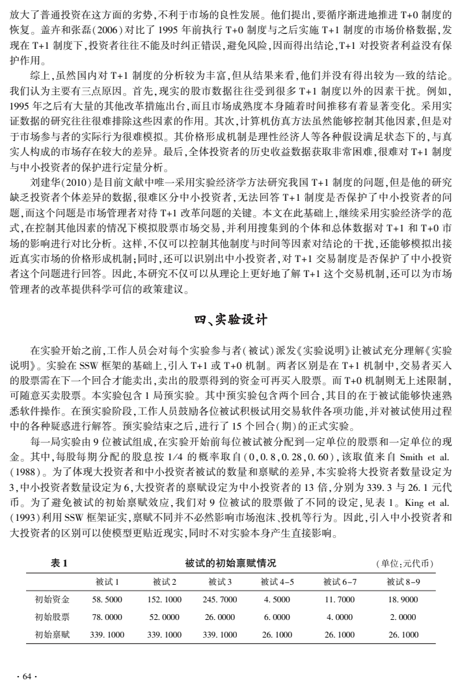
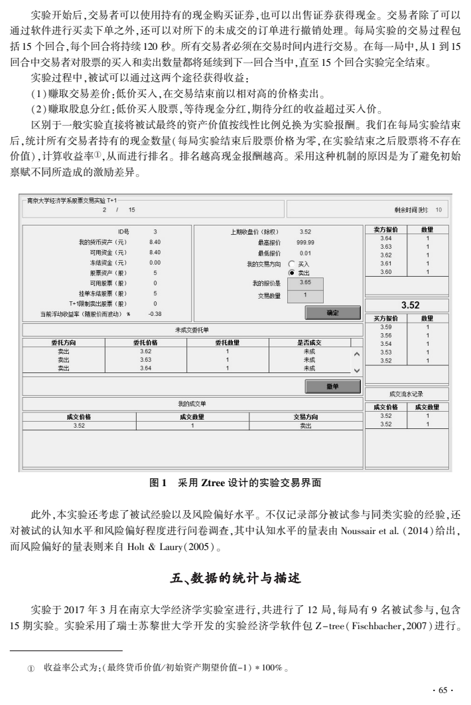
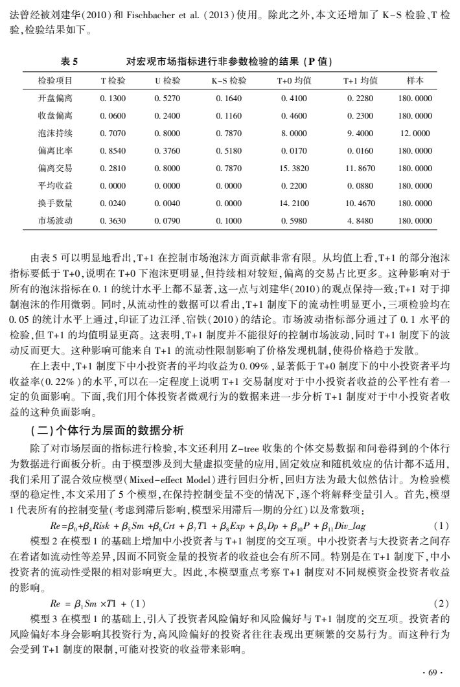
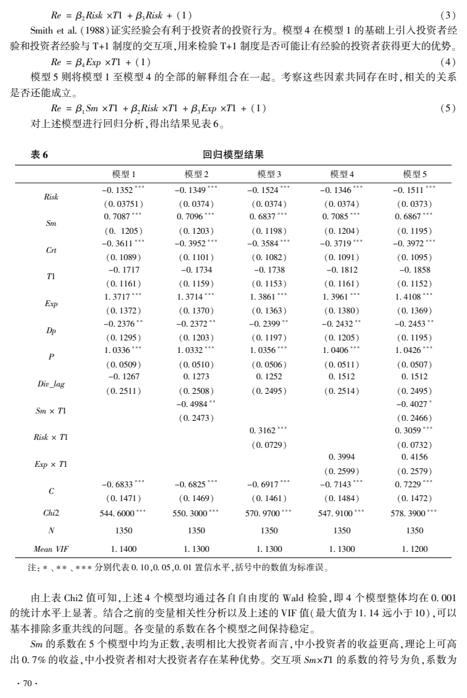
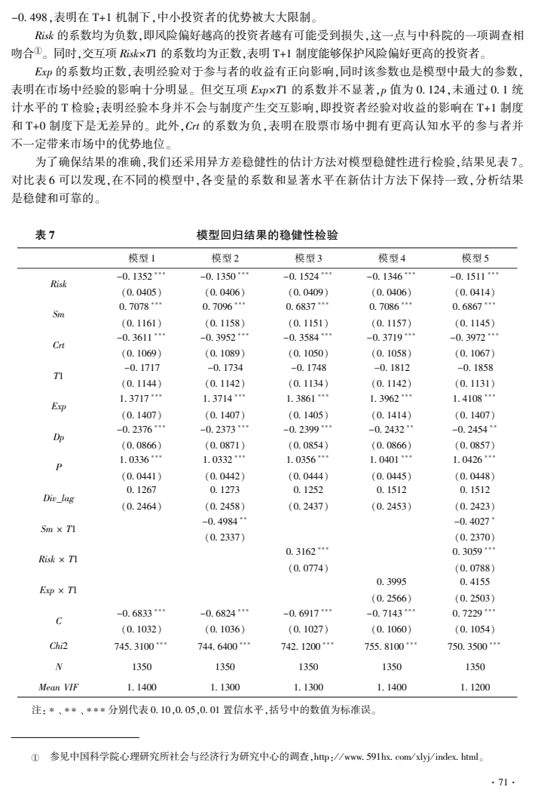

# T+1制度对中小投资者保护效果的实验研究

作者：周耿、姜雨潇、范从来、王宇伟。

《中国经济问题》2018年第6期（总第311期），第60–75页。

[完整原始 PDF](original.pdf)

以下为逐页自动提取文本，未经逐字校订；原文件中的小数点、引号、公式及表格可能提取错位，引用以 PDF 为准。关键图表页在相应位置附原页图。

## PDF 第 1 页（期刊第 60 页）

2018 年 11 月
第 6 期( 总第 311 期)
 China Economic Studies
November 2018
No郾 6
收稿日期:2017-07-24
基金项目:本文获教育部 “ 创新团队发展计划冶 滚动支持项目 ( IRT _17R52) 和中央高校基本科研业务费专项资金
(010414380001) ,以及国家自然科学基金面上项目(71673132) 的资助。
作者简介:周耿,南京大学经济学系,博士,副教授;姜雨潇,南京大学经济学系,硕士研究生;范从来,南京大学经济学
系,博士,教授,博士生导师,教育部长江学者特聘教授;王宇伟,南京大学经济学系,博士,副教授。
淤摇 证券日报 2013 年 11 月 28 日 A3 版,http: / / zqrb郾 ccstock郾 cn / html / 2013-11 / 28 / content_388032郾 htm,被人民网
等各大权威媒体广泛转载。
T+1 制度对中小投资者保护效果的实验研究
周摇 耿摇 姜雨潇摇 范从来摇 王宇伟
内容提要:为了保护中小投资者,我国股票市场于 1995 年开始执行与国外主要市场有着显著
差异的 T+1 交易制度。 20 多年以来,该制度的有效性一直饱受争议。 本文利用实验经济学的方法
构建了 T+0 和 T+1 制度的股票市场,并利用收集到的市场层面和个体行为层面的数据对这两种制
度进行了对比分析。 研究发现,相对于 T+0 制度,T+1 制度保护的并不是中小投资者,而是大投资
者。 而且,T+1 制度显著减少了市场的成交量,不但不能明显地降低市场泡沫,还加剧了市场价格
的波动。 研究还进一步发现,T+1 制度还保护了具有较高风险偏好水平的投资者,避免了这类投资
者的频繁交易。
关键词:T+0;交易制度;股票市场;实验经济学;Ztree
DOI:10郾 19365 / j郾 issn1000-4181郾 2018郾 06郾 06
一、引言
出于保护中小投资者的目的,我国股票市场于 1995 年将 T+0 交易制度改为 T+1 交易制度( 在连
续双向拍卖制度的基础上加入 1 个工作日卖出限制) 至今。 鉴于国外绝大多数国家的股票市场执行
的是 T+0 交易制度,对于我国市场是否要与国外接轨,改回 T+0 交易制度一直存在较大的争议。 每
当市场处于低迷阶段时,实施 T+0 制度的呼声尤其强烈。 在 2013 年光大证券“816冶 事件中,大机构利
用 T+1 制度进行套利,让广大中小投资者损失的事实浮出水面。 针对该事件,上交所等监管部门首次
表态有必要进一步抓紧研究论证股票 T+0 交易制度。
同样基于保护投资者利益的目的,T+1 与 T+0 似乎都能找到各自的理由淤。 支持前者的观点认
为 T+1 交易制度可以防止投资者频繁交易,抑制泡沫,鼓励投资者长期投资。 而支持后者的观点认
为,T+0 交易制度可以活跃市场,加快市场流动和价格发现,让投资者对错误的决策及时纠错,有利于
中小投资者公平地参与交易。 对此,证监会发言人回应称,虽然 T+0 交易制度具有一定的好处,但是
·06·

## PDF 第 2 页（期刊第 61 页）

它可能增加市场炒作和大幅波动的风险,并导致中小投资者处于劣势,造成事实上的不公平淤。 随后,
在 2014 年 3 月 5 日,时任证监会主席肖刚在全国人民代表大会上接受媒体采访表示:“ 支持和反对 T+
0 的两派意见依然存在,没有达成共识。冶 可见,在 T+1 交易制度是否能保护中小投资者的问题上,市
场管理者没有形成一致意见,交易制度的改革难以继续推进。
一方面,迄今为止并没有理论上的证据证明 T+1 制度能够有效地保护中小投资者。 而另一方面,
我国证券市场的 T+1 与美国为首的绝大多数成熟市场的 T+0 交易制度存在较大的差异。 本研究将
在对比中美交易制度的基础上,采用 Smith et al郾 (1988) 构建的资本市场交易环境,对 T+1 制度下中小
投资者保护的情况,通过实验经济学研究方法来探讨 T+1 与 T+0 交易制度对中小投资者的公平性这
个受到广泛关注和争议的问题。
二、中美 T+0 / 1 交易制度比较
为了保护中小投资者,美国证监会对不同资金存量的投资者设置了 T+0 和 T+3 等多种不同的交
易制度。 其中,低于 2000 美元的为现金账户( cash account) 执行 T+3 交易制度,高于 2000 美元的可以
申请为普通融资融券账户( margin account) ,执行有限定的 T+0 的交易制度。 而高于 25000 美元的可
以申请为即日冲销账户( day trading account) 执行 T+0 交易制度。
虽然我国股票市场独特的 T+1 交易制度也是从保护投资者的出发点逐渐发展而来的,但同美国
股票市场的交易制度相比,仍然存在三个主要的差异:
首先,交割时间不同。 交易双方的资金和股票的交割并不是瞬间完成的,需要一定的交割时
间,未完成交割的股票和资金的交易将会受到限制。 交割时间取决于历史、技术等各种复杂的因
素。 我国股票市场 1 个工作日可完成交割,而美国市场由于受到历史遗留问题的限制一般需要 3
个工作日。
其次,交割完成前,交易的限制存在差异。 我国对于未完成交割的资金( 通过卖出股票所获得) 再
进行买入的行为不受限制,买入的股票既可以与卖出的相同,也可以不同。 但对于未交割的股票( 资
金买入所得) ,则不允许再次交易。 而在美国市场上的现金账户交割完成前,不管是买入还是卖出,都
不允许进行交易。
再次,对于交易制度的公平性的实施存在差异。 我国市场中,T + 1 制度对所有参与者完全相
同,是通过规则的同一性来实现公平性。 而美国证券市场则是通过差异化的交易限制来保证制度
的公平性:不同体量的资金受到不同程度的限制。 例如,美国股票市场的融资融券账户虽然可以在
资金或股票交割前进行任意多次交易,但规定在任意 5 个交易日内不得超过 3 次 T+0 卖出。 而对
于即日账户虽然没有当日 T + 0 卖 出 的 限 制,但 存 在 买 入 额 度 和 90 天 内 至 少 做 一 笔 T + 0 卖 出 的
限制。
最后,对于违规的中小交易者保护和教育的方式不同。 在我国市场,市场通过计算机系统来强制
实施规则,没有额外的保护和教育。 而在美国,市场则通过冻结账户或转换账户类型来进行教育和保
护。 例如,对于违反交易限制的现金账户的中小交易者,一般通过禁用账户 90 天进行处罚;对于违反
卖出规则的普通融资融券账户,低于 25000 美元的账户一般通过降级为现金账户( 只能进行 T+3 交
易) 进行处罚;普通融资融券账户和当日冲销账户也会在一定条件下相互自动转换。
·16·
淤 2013 年 10 月 25 日证监会记者招待会纪要( 参见《 第一财经日报》 ,2013 年 10 月 26 日财商版的报导) 。 在上
海证券交易所召开上交所第十六次媒体通气会上,发言人也表达了类似观点。

## PDF 第 3 页（期刊第 62 页）

三、文献回顾
( 一) 股票市场的实验经济学研究
实验经济学方法的引入不仅可以剔除市场中其他因素的扰动,还可以模拟市场上观察不到的信
息。 Smith et al郾 (1988) 开创了股票市场的实验经济学方法,建立了 SSW 实验框架。 在他的实验设计
中,有 9-12 人参与实验,实验的成交机制为连续双向拍卖机制,具体方法为买方从低往高出价,卖方
则从高到低要价,在出价等于要价时,买卖双方成交。 交易报价最低差价为 1 美分或 1 股,无交易成
本。 实验中只涉及一种股票资产,共有 15 个交易期,每个交易期的每股股息以均等的概率取 0、0郾 08
美元、0郾 28 美元和 0郾 60 美元,期望值为 0郾 24 美元。 股票的基础价值为余下期数乘以 0郾 24 美元,作为
判断市场泡沫的依据。
通过实验室构建股票市场,Smith et al郾 (1988) 发现,泡沫在股票市场上始终是存在的。 随后,大
量学者通过 SSW 框架,不仅重现了 Smith et al郾 (1988) 实验中的泡沫现象,还发现参与者的市场经验
( King,1991;Haruvy et al郾, 2007) ,股息机制( Kirchler et al郾, 2012;Cheung & Coleman,2014) 以及信息
不对称程度等( Sutter et al郾, 2012;Ghosh et al郾, 2015) 对泡沫有重要的影响。 近十年来,一些学者将
SSW 框架的市场结构进行了拓展,探讨了以下问题:
1郾 融资与融券( 卖空)
由于借贷行为在金融市场实践中扮演了极为重要的角色,一些学者将融券( 卖空) 机制加入到
SSW 框架中。 他们发现允许卖空显著降低了泡沫,使得市场价格接近基础价值( Haruvy & Noussair,
2006) 。 F俟llbrunn & Neugebauer(2012) 在此基础上加入了融资的机制,并比较两种效应的相对大小,
他们发现同时允许融资和融券交易时,融资带来的泡沫效应要比融券去除泡沫的效应更强。 而国内
学者武志伟等(2017) 也采用了同样的扩展框架对中国市场的融资融券问题进行了研究,发现融资融
券制度虽然有效,但对于过度自信水平高的市场作用是有限的。
2郾 IPO 与企业干预
这类研究将 IPO、增发新股与回购等涉及企业层面的策略引入到 SSW 框架中。 例如,F俟llbrunn &
Haruvy(2014) 研究了 IPO 一级市场的折价问题。 他们通过对 SSW 框架增加一个初始股票分配的环
节,比较了三种分配的拍卖机制。 他们发现 IPO 价格始终都会出现相对基本价值和二级市场的折价。
随着经验的增加,折价虽然会有所减少,但不会消失。 而 Haruvy et al郾 (2014) 研究并对比了股票市场
的增发新股与回购问题。 他们发现这种类型的企业干预对股票市场价格有着显著影响,回购显著地
增加了市场的泡沫,而发行新股则会减少泡沫,但两种效应是非对称的。
3郾 政府的市场政策
这类研究主要考察政府的政策对股票市场的影响,研究政府如何通过相关政策工具来消除泡沫,
提高市场效率。 例如,杨晓兰和洪涛(2011) 将政府平准基金引入到 SSW 框架中。 他们发现,平准基
金的存在能显著降低市场价格对基础价值的偏离程度,提高市场效率。 而且,透明平准基金在降低市
场价格偏离的效应显著高于不透明的平准基金。 此外,Fischbacher et al郾 (2013) 则首次在 SSW 框架中
同时引入了利率和存款准备金率,通过实施相机抉择的利率和存款准备金率政策,考察货币政策改变
对市场的影响。 他们发现加息政策对泡沫有较小的影响,而提高存款准备金率带来的流动性限制对
降低泡沫有着强烈的影响。
( 二) 限制或延期交易的相关研究
由于 T+1 制度在境外成熟市场没有案例,相关英文文献对 T+1 或 T+0 等问题鲜有涉及,只有“ 熔
·26·

## PDF 第 4 页（期刊第 63 页）

断机制冶 与之最为接近淤。 它与 T+1 机制的共同点在于,通过限制或者延期释放市场的流动性来防止
价格的大幅波动。 一部分学者认同该限制或延期机制的积极作用,认为当市场面对突如其来的大量
交易时,往往存 在 缺 陷, 交 易 限 制 机 制 能 够 帮 助 市 场 应 对 过 大 交 易 量 的 冲 击 ( Greenwald & Stein,
1991) 。 交易限制不仅能够让市场参与者能够重新评估信息,也能够阻止市场操纵行为( Kim & Park,
2010) 。 而另外一些学者认为,限制交易也可能存在消极的作用。 如 Cho et al郾 (2003) 认为,交易者可
能惧怕交易限制,使得熔断分界线具有“ 磁吸效应冶 ,可能会加剧市场的波动;交易限制不仅不能降低
成交量,反而有可能将成交量放大( Farag,2014) 。
也有一些研 究 采 用 了 实 验 经 济 学 方 法 对 资 产 持 有 限 制 进 行 了 研 究。 例 如, 国 内 学 者 刘 建 华
(2010) 对中国的 T+1 制度进行了研究,发现 T+1 交易制度抑制泡沫的作用并不明显。 而 Lugovskyy et
al郾 (2014) 发现类似中国房产限购等需求端的资产持有限制能够显著降低泡沫:长期的持有限制虽然
能够消除泡沫,但也导致了中后期价格在基本价值之下,仍然存在缺乏效率的错误定价;相反,临时性
的持有限制并不会出现错误定价,而且市场效率会更高。
( 三) T+1 相关的实证研究
与美国等市场主流交易限制相关的制度相比,我国证券市场的 T+1 交易制度是非常独特的:一方
面,在理论上,T+1 是通过剥夺买方当期卖出的权力来限制流动性的,并不存在某个具体的“ 熔断点冶 。
另一方面,在实践中,T+1 制度并没有专门针对中小投资者的举措。 因此,对我国 T+1 交易制度是否
保护了中小投资者这一问题的研究在国内显得非常具有实践意义和紧迫性。 国内已经有了一些相关
文献,这些文献的主要研究思路有四类:
1郾 T+1 制度的有效性
通过市场真实的交易数据对 T + 1 的有效性加 以 分 析。 这 方 面 的 研 究 主 要 有, 陈 雯 和 屈 文 洲
(2004) 利用 1994 年 1 月 1 日至 1995 年 12 月 31 日深圳股市的数据进行时间序列检验,发现 T+1 并
未降低股市波动。 同时,葛勇和叶德磊(2009) 利用 1992 -2008 年的 A 股与 B 股数据,发现 T+1 制度
可以降低市场波动。 孔庆洋等(2009) 利用股份权证的短期价格波动分析 T+1 制度对流动性的影响,
但结果证实 T+1 制度并未起到降低市场波动的效果。 因而,T+1 制度是否真的可以降低市场波动,仍
然有待探讨。
2郾 T+1 对股票价格的影响
分析 T+1 带来的流动性限制是否会促进证券的溢价,进而对市场和投资者产生影响。 这方面的
主要研究有:胡章宏和王晓坤(2008) 比对了 51 家在 A 股与 H 股同时上市的公司股价差值,利用数据
实证分析证实流动性假说的有效性,即流动性的区别会对股票定价产生影响。 边江泽和宿铁(2010)
则证实了 T+1 制度会影响市场的流动性,而流动性对股票价格的影响是十分显著的。 因此,他们建议
逐步取消 T+1 制度恢复市场的稳定。
3郾 T+1 的仿真分析
利用计算机仿真的方法对 T+1 制度进行分析。 成微等(2011) 利用计算机仿真市场模拟交易,发
现相对稳定的 T+0 制度可以稳定市场,促进市场正确定价。 相反,在不稳定的市场中,则会加剧市场
波动。 得出的结论是市场状态决定采用什么样的制度。
4郾 T+1 的投资者保护
对于投资者保护的问题,也有少数文献对其进行了定性分析。 例如,张志伟(2015) 等学者从制度
与现实层面对 T+1 制度的利弊加以分析,认为 T+1 在理论上可以对投资者起到保护作用。 但是,现
实交易中往往存在大量理论尚未涉及的问题,例如庄家控制、信息不对称问题,而 T+1 制度无形之中
·36·
淤 熔断机制是当股指或股票波幅达到规定的熔断点时,交易所为控制风险采取的暂停交易措施。 该机制在美
国 1987 年股灾后在美国股票市场上首次推出。

## PDF 第 5 页（期刊第 64 页）

放大了普通投资在这方面的劣势,不利于市场的良性发展。 他们提出,要循序渐进地推进 T+0 制度的
恢复。 盖卉和张磊(2006) 对比了 1995 年前执行 T+0 制度与之后实施 T+1 制度的市场价格数据,发
现在 T+1 制度下,投资者往往不能及时纠正错误,避免风险,因而得出结论,T+1 对投资者利益没有保
护作用。
综上,虽然国内对 T+1 制度的分析较为丰富,但从结果来看,他们并没有得出较为一致的结论。
我们认为主要有三点原因。 首先,现实的股市数据往往受到很多 T+1 制度以外的因素干扰。 例如,
1995 年之后有大量的其他改革措施出台,而且市场成熟度本身随着时间推移有着显著变化。 采用实
证数据的研究往往很难排除这些因素的作用。 其次,计算机仿真方法虽然能够控制其他因素,但是对
于市场参与者的实际行为很难模拟。 其价格形成机制是理性经济人等各种假设满足状态下的,与真
实人构成的市场存在较大的差异。 最后,全体投资者的历史收益数据获取非常困难,很难对 T+1 制度
与中小投资者的保护进行定量分析。
刘建华(2010) 是目前文献中唯一采用实验经济学方法研究我国 T+1 制度的问题,但是他的研究
缺乏投资者个体差异的数据,很难区分中小投资者,无法回答 T+1 制度是否保护了中小投资者的问
题,而这个问题是市场管理者对待 T+1 改革问题的关键。 本文在此基础上,继续采用实验经济学的范
式,在控制其他因素的情况下模拟股票市场交易,并利用搜集到的个体和总体数据对 T+1 和 T+0 市
场的影响进行对比分析。 这样,不仅可以控制其他制度与时间等因素对结论的干扰,还能够模拟出接
近真实市场的价格形成机制;同时,还可以识别出中小投资者,对 T+1 交易制度是否保护了中小投资
者这个问题进行回答。 因此,本研究不仅可以从理论上更好地了解 T+1 这个交易机制,还可以为市场
管理者的改革提供科学可信的政策建议。
四、实验设计
在实验开始之前,工作人员会对每个实验参与者( 被试) 派发《 实验说明》 让被试充分理解《 实验
说明》 。 实验在 SSW 框架的基础上,引入 T+1 或 T+0 机制。 两者区别是在 T+1 机制中,交易者买入
的股票需在下一个回合才能卖出,卖出的股票得到的资金可再买入股票。 而 T+0 机制则无上述限制,
可随意买卖股票。 本实验包含 1 局预实验。 其中预实验包含两个回合,其目的在于被试能够快速熟
悉软件操作。 在预实验阶段,工作人员鼓励各位被试积极试用交易软件各项功能,并对被试使用过程
中的各种疑惑进行解答。 预实验结束之后,进行了 15 个回合( 期) 的正式实验。
每一局实验由 9 位被试组成,在实验开始前每位被试被分配到一定单位的股票和一定单位的现
金。 其中,每股每 期 分 配 的 股 息 按 1 / 4 的 概 率 取 自 ( 0,0郾 8,0郾 28,0郾 60 ) , 该 取 值 来 自 Smith et al郾
(1988) 。 为了体现大投资者和中小投资者被试的数量和禀赋的差异,本实验将大投资者数量设定为
3,中小投资者数量设定为 6,大投资者的禀赋设定为中小投资者的 13 倍,分别为 339郾 3 与 26郾 1 元代
币。 为了避免被试的初始禀赋效应,我们对 9 位被试的股票做了不同的设定,见表 1。 King et al郾
(1993) 利用 SSW 框架证实,禀赋不同并不必然影响市场泡沫、投机等行为。 因此,引入中小投资者和
大投资者的区别可以使模型更贴近现实,同时不对实验本身产生直接影响。
摇 摇 表 1 被试的初始禀赋情况 ( 单位:元代币) 摇 摇
被试 1 被试 2 被试 3 被试 4-5 被试 6-7 被试 8-9
初始资金 58郾 5000 152郾 1000 245郾 7000 4郾 5000 11郾 7000 18郾 9000
初始股票 78郾 0000 52郾 0000 26郾 0000 6郾 0000 4郾 0000 2郾 0000
初始禀赋 339郾 1000 339郾 1000 339郾 1000 26郾 1000 26郾 1000 26郾 1000
·46·

## PDF 第 6 页（期刊第 65 页）

实验开始后,交易者可以使用持有的现金购买证券,也可以出售证券获得现金。 交易者除了可以
通过软件进行买卖下单之外,还可以对所下的未成交的订单进行撤销处理。 每局实验的交易过程包
括 15 个回合,每个回合将持续 120 秒。 所有交易者必须在交易时间内进行交易。 在每一局中,从 1 到 15
回合中交易者对股票的买入和卖出数量都将延续到下一回合当中,直至 15 个回合实验完全结束。
实验过程中,被试可以通过这两个途径获得收益:
(1) 赚取交易差价:低价买入,在交易结束前以相对高的价格卖出。
(2) 赚取股息分红:低价买入股票,等待现金分红,期待分红的收益超过买入价。
区别于一般实验直接将被试最终的资产价值按线性比例兑换为实验报酬。 我们在每局实验结束
后,统计所有交易者持有的现金数量( 每局实验结束后股票价格为零,在实验结束之后股票将不存在
价值) ,计算收益率淤,从而进行排名。 排名越高现金报酬越高。 采用这种机制的原因是为了避免初始
禀赋不同所造成的激励差异。
图 1摇 采用 Ztree 设计的实验交易界面
此外,本实验还考虑了被试经验以及风险偏好水平。 不仅记录部分被试参与同类实验的经验,还
对被试的认知水平和风险偏好程度进行问卷调查,其中认知水平的量表由 Noussair et al郾 (2014) 给出,
而风险偏好的量表则来自 Holt & Laury(2005) 。
五、数据的统计与描述
实验于 2017 年 3 月在南京大学经济学实验室进行,共进行了 12 局,每局有 9 名被试参与,包含
15 期实验。 实验采用了瑞士苏黎世大学开发的实验经济学软件包 Z -tree( Fischbacher,2007) 进行。
·56·
淤 收益率公式为:( 最终货币价值 / 初始资产期望价值-1) *100% 。

## PDF 第 7 页（期刊第 66 页）

通过该软件,实验共得到了 180 期的交易数据,每期包含 9 名被试所有的交易明细数据,包括价格、成
交量、基本价值,被试个体信息、认知水平与风险偏好等淤。 通过这些数据不仅可以汇总计算市场层面
的均价、中位数价与被试的每期持仓与现金,还可以结合基本价值,汇总计算各种泡沫,波动和被试的
利润指标。 我们通过汇总计算,得到每期的市场层面的变量,见表 2。
( 一) 市场层面的数据
表 2 市场层面的变量说明和统计描述
变量名称 变量含义 最大值 最小值 均值 标准差 中位数
开盘偏离 股市开盘价格对基础价值的偏离 2郾 9300 -1郾 3600 0郾 3204 0郾 8693 0郾 0000
收盘偏离 股市收盘价格对基础机制的偏离 2郾 8900 -1郾 7200 0郾 3434 0郾 8643 0郾 0000
泡沫持续 股市出现泡沫的连续最大期数 14郾 0000 2郾 0000 8郾 7000 4郾 5473 9郾 5000
偏离比率 股市当前波动与总波动的比例 0郾 0890 0郾 0021 0郾 0207 0郾 0283 0郾 0087
偏离交易 股市当期偏离基础价值的交易占比 15郾 5500 3郾 6200 8郾 4800 4郾 1701 7郾 1130
平均收益 市场中小投资者平均收益率水平 1郾 0100 -0郾 1100 0郾 1553 0郾 2530 0郾 0400
换手数量 市场当期的换手量 53郾 0000 0郾 0000 12郾 3389 11郾 3143 10郾 0000
市场波动 当期成交的最大价差与开盘价之比 349郾 0000 -0郾 0164 5郾 0481 40郾 2086 0郾 0281
摇 摇 注:变量泡沫持续样本量为 12,其余变量样本量为 180。
上述变量中,衡量市场泡沫的指标主要有:开盘偏离与收盘偏离分别通过每期第一笔交易价格和
最后一笔交易价格与基本价值差的绝对值计算得到,是常见衡量泡沫的指标;泡沫持续期数代表本局
实验中,通过计算每期加权平均价格高于基础价值的最大连续期数,来自 Porter & Smith(1995) ;偏离
比率则通过当期股票每笔交易价格的标准差与整体标准差的比率,是 Palan(2009) 提出的泡沫指标;
偏离交易,通过当期偏离基础价值的成交量占当期总交易量的百分比计算得到,同样由 Palan(2009)
给出。
此外,我们还计算了其他指标,包括平均收益率:计算 6 名中小投资者平均的市场收益率( 股票按
照期望价值计算) ;换手数量:通过计算当期成交的股票数量得到,由于实验中只有一种资产且其总量
恒定,该指标可以衡量市场的流动性;市场波动:通过计算当期成交价格的最大价差与开盘价之比得
到,可以用来衡量市场的波动情况。 如表 2 所示,市场波动的方差较大,从某种程度上可以解释市场
的变化较为剧烈。 换手数量的方差也较为明显,表明市场交易非常活跃。 其他指标的方差并不大,用
这些指标衡量的泡沫波动较小。
利用每期市场的中位数对市场走势进行描述,可以得出下图 2 和图 3。 从图中可见,就总体市场
的走势而言,T+1 与 T+0 两种机制下不仅都在实验初期存在低于基础价值的交易,而且都会在实验中
后期出现明显的泡沫( 中位数价格高于基础价值) ,并且快速破裂。 通过对比,可以明显地看出,在 T+
1 环境下,有 3 局中较多交易期的价格甚至超过了分红的最大可能价值( 灰色阶梯线之上) ;而在 T+0
环境下,这个情况只出现在 2 局中的个别交易期。
·66·
淤 12 局实验中有 2 局被试未进行问卷测量,存在缺失值。 因此市场层面分析样本为 12 局伊15 期 = 180 例,而个
体层面分析的样本为 10 局伊9 被试伊15 期 = 1350 例。

## PDF 第 8 页（期刊第 67 页）

图 2摇 T+1 环境下的市场的中位数价格走势淤
图 3摇 T+0 环境下的市场的中位数价格走势
( 二) 个体层面的数据
除了市场层面选取了整体变量和制度变量的数据外,本实验还通过被试每期末持仓的数据计算
·76·
淤 黑色( 下方) 的阶梯线表示股票后期分红的期望价值( 之后所有期的每股派息按照期望 0郾 24 计算) ,而灰色
( 上方) 的阶梯线表示后期分红的最大可能价值( 下同) ,当市场价格超过灰色线表示按照最好的情况( 之后所有期每
股派息都按 0郾 6 计算) 也无法超过买入者购买的价值,表明市场出现了严重的泡沫。

## PDF 第 9 页（期刊第 68 页）

了被试收益数据( Re) ,通过问卷计算了个体认知水平( Crt) 和风险偏好数据( Risk) ;通过实验操纵的
变量得到了是否 T+1( T1) ,投资者经验( Exp) 以及是否为中小投资者( Sm) 三项数据;通过每期所有成
交明细数据和每期派息数据得到了市场价格走势( Dp) 、开盘价格( P) 和分红( Div) 的数据,见表 3。
摇 表 3 个体层面变量名称及含义
变量名 变量解释
投资者超额收益率( Re) 代表微观主体获得的收益率超过市场收益的部分,该收益率由基础价值进行计算
投资者风险偏好( Risk) 由问卷数据获得度量被试的风险偏好程度
投资者认知水平( Crt) 由问卷数据获得度量被试的认知水平
是否为中小投资者( Sm) 虚拟变量,1 = 初始资产 26郾 1 元,0 = 初始资产 339郾 3 元
投资者的经验( Exp) 数字 0 = 被试第 1 次参加实验,1 = 被试第 2 次参加实验,2 = 被试第 3 次参加实验
T+1 交易制度( T1) 虚拟变量,1 = 执行 T+1 制度,0 = 执行 T+0 制度
市场价格的走势( Dp) 上期股票的涨幅,单位为百分比
市场的开盘价格( P) 为本期市场的开盘价格,由上期收盘价除权( 减去上期分红) 得到,单位为元
市场的分红( Div) 为股票的分红金额,来自集合{0,0郾 08,0郾 28,0郾 6} 的均匀分布,单位为元
可以看出,变量主要为两类,一类为被试特质的变量( 前六项) ,另一类为市场特质的变量( 后三
项) 。 其中,被解释变量为超额收益率,反映出投资者在实验中获得的收益情况,体现本文所要关注问
题的核心。
摇 摇 表 4 收集变量之间的相关系数矩阵( N = 1350)
Re Risk Crt Sm Exp T1 Dp P Div
Re 1郾 0000
Risk -0郾 0800 1郾 0000
Crt -0郾 0642 -0郾 2076 1郾 0000
Sm 0郾 1413 -0郾 1067 0郾 0444 1郾 0000
Exp 0郾 0301 0郾 0000 0郾 0000 0郾 0000 1郾 0000
T1 -0郾 0230 0郾 0147 -0郾 0427 0郾 0000 0郾 0891 1郾 0000
Dp 0郾 1775 -0郾 0001 0郾 0002 0郾 0000 0郾 0136 0郾 0058 1郾 0000
P 0郾 4511 0郾 0069 -0郾 0201 0郾 0002 -0郾 3905 0郾 0259 0郾 3957 1郾 0000
Div 0郾 0688 -0郾 0013 0郾 0039 0郾 0006 0郾 0119 0郾 0643 -0郾 0284 0郾 1074 1郾 0000
表 4 展示了变量之间的相关系数,从中可以看出,本文选取变量之间的相关性合理,变量之间的
相关系数都在 0郾 5 以下。 而且,自变量的 VIF 系数最高为 1郾 14,远低于标准值 10。 可以基本排除自变
量之间的多重共线问题。
六、数据分析
( 一) 市场层面的数据分析
首先,我们采用 Mann-Whitney U 检验( 简称 U 检验) 对实验市场层面特征的差异进行分析,该方
·86·

## PDF 第 10 页（期刊第 69 页）

法曾经被刘建华(2010) 和 Fischbacher et al郾 (2013) 使用。 除此之外,本文还增加了 K -S 检验、T 检
验,检验结果如下。
摇 摇 摇 表 5 对宏观市场指标进行非参数检验的结果 ( P 值)
检验项目 T 检验 U 检验 K-S 检验 T+0 均值 T+1 均值 样本
开盘偏离 0郾 1300 0郾 5270 0郾 1640 0郾 4100 0郾 2280 180郾 0000
收盘偏离 0郾 0600 0郾 2400 0郾 1160 0郾 4600 0郾 2300 180郾 0000
泡沫持续 0郾 7070 0郾 8000 0郾 7870 8郾 0000 9郾 4000 12郾 0000
偏离比率 0郾 8540 0郾 3760 0郾 5180 0郾 0170 0郾 0160 180郾 0000
偏离交易 0郾 2810 0郾 8000 0郾 7870 15郾 3820 11郾 8670 180郾 0000
平均收益 0郾 0000 0郾 0000 0郾 0000 0郾 2200 0郾 0880 180郾 0000
换手数量 0郾 0240 0郾 0040 0郾 0000 14郾 2100 10郾 4670 180郾 0000
市场波动 0郾 3630 0郾 0790 0郾 1000 0郾 5980 4郾 8480 180郾 0000
由表 5 可以明显地看出,T+1 在控制市场泡沫方面贡献非常有限。 从均值上看,T+1 的部分泡沫
指标要低于 T+0,说明在 T+0 下泡沫更明显,但持续相对较短,偏离的交易占比更多。 这种影响对于
所有的泡沫指标在 0郾 1 的统计水平上都不显著,这一点与刘建华(2010) 的观点保持一致:T+1 对于抑
制泡沫的作用微弱。 同时,从流动性的数据可以看出,T+1 制度下的流动性明显更小,三项检验均在
0郾 05 的统计水平上通过,印证了边江泽、宿铁(2010) 的结论。 市场波动指标部分通过了 0郾 1 水平的
检验,但 T+1 的均值明显更高。 这表明,T+1 制度并不能很好的控制市场波动,同时 T+1 制度下的波
动反而更大。 这种影响可能来自 T+1 的流动性限制影响了价格发现机制,使得价格趋于发散。
在上表中,T+1 制度下中小投资者的平均收益为 0郾 09% ,显著低于 T+0 制度下的中小投资者平均
收益率(0郾 22% ) 的水平,可以在一定程度上说明 T+1 交易制度对于中小投资者收益的公平性有着一
定的负面影响。 下面,我们用个体投资者微观行为的数据来进一步分析 T+1 制度对于中小投资者收
益的这种负面影响。
( 二) 个体行为层面的数据分析
除了对市场层面的指标进行检验,本文还利用 Z-tree 收集的个体交易数据和问卷得到的个体行
为数据进行面板分析。 由于模型涉及到大量虚拟变量的应用,固定效应和随机效应的估计都不适用,
我们采用了混合效应模型( Mixed-effect Model) 进行回归分析,回归方法为最大似然估计。 为检验模
型的稳定性,本文采用了 5 个模型,在保持控制变量不变的情况下,逐个将解释变量引入。 首先,模型
1 代表所有的控制变量( 考虑到滞后影响,模型采用滞后一期的分红) 以及常数项:
摇 摇 Re = 茁0 +茁4 Risk + 茁5 Sm +茁6 Crt + 茁7 T1 + 茁8 Exp + 茁9 Dp + 茁10 P + 茁11 Div_lag (1)
模型 2 在模型 1 的基础上增加中小投资者与 T+1 制度的交互项。 中小投资者与大投资者之间存
在着诸如流动性等差异,因而不同资金量的投资者的收益也会有所不同。 特别是在 T+1 制度下,中小
投资者的流动性受限的相对影响更大。 因此,本模型重点考察 T+1 制度对不同规模资金投资者收益
的影响。
摇 摇 Re = 茁1 Sm 伊T1 + (1) (2)
模型 3 在模型 1 的基础上,引入了投资者风险偏好和风险偏好与 T+1 制度的交互项。 投资者的
风险偏好本身会影响其投资行为,高风险偏好的投资者往往表现出更频繁的交易行为。 而这种行为
会受到 T+1 制度的限制,可能对投资的收益带来影响。
·96·

## PDF 第 11 页（期刊第 70 页）

摇 摇 Re = 茁2 Risk 伊T1 + 茁3 Risk + (1) (3)
Smith et al郾 (1988)证实经验会有利于投资者的投资行为。 模型 4 在模型 1 的基础上引入投资者经
验和投资者经验与 T+1 制度的交互项,用来检验 T+1 制度是否可能让有经验的投资者获得更大的优势。
摇 摇 Re = 茁4 Exp 伊T1 + (1) (4)
模型 5 则将模型 1 至模型 4 的全部的解释组合在一起。 考察这些因素共同存在时,相关的关系
是否还能成立。
摇 摇 Re = 茁1 Sm 伊T1 + 茁2 Risk 伊T1 + 茁3 Exp 伊T1 + (1) (5)
对上述模型进行回归分析,得出结果见表 6。
表 6 回归模型结果
模型 1 模型 2 模型 3 模型 4 模型 5
Risk -0郾 1352 ***
(0郾 03751)
-0郾 1349 ***
(0郾 0374)
-0郾 1524 ***
(0郾 0374)
-0郾 1346 ***
(0郾 0374)
-0郾 1511 ***
(0郾 0373)
Sm 0郾 7087 ***
(0郾 1205)
0郾 7096 ***
(0郾 1203)
0郾 6837 ***
(0郾 1198)
0郾 7085 ***
(0郾 1204)
0郾 6867 ***
(0郾 1195)
Crt -0郾 3611 ***
(0郾 1089)
-0郾 3952 ***
(0郾 1101)
-0郾 3584 ***
(0郾 1082)
-0郾 3719 ***
(0郾 1091)
-0郾 3972 ***
(0郾 1095)
T1
-0郾 1717
(0郾 1161)
-0郾 1734
(0郾 1159)
-0郾 1738
(0郾 1153)
-0郾 1812
(0郾 1161)
-0郾 1858
(0郾 1152)
Exp 1郾 3717 ***
(0郾 1372)
1郾 3714 ***
(0郾 1370)
1郾 3861 ***
(0郾 1363)
1郾 3961 ***
(0郾 1380)
1郾 4108 ***
(0郾 1369)
Dp -0郾 2376 **
(0郾 1295)
-0郾 2372 **
(0郾 1203)
-0郾 2399 **
(0郾 1197)
-0郾 2432 **
(0郾 1205)
-0郾 2453 **
(0郾 1195)
P 1郾 0336 ***
(0郾 0509)
1郾 0332 ***
(0郾 0510)
1郾 0356 ***
(0郾 0506)
1郾 0406 ***
(0郾 0511)
1郾 0426 ***
(0郾 0507)
Div_lag
-0郾 1267
(0郾 2511)
0郾 1273
(0郾 2508)
0郾 1252
(0郾 2495)
0郾 1512
(0郾 2514)
0郾 1512
(0郾 2495)
Sm 伊 T1 -0郾 4984 **
(0郾 2473)
-0郾 4027 *
(0郾 2466)
Risk 伊 T1 0郾 3162 ***
(0郾 0729)
0郾 3059 ***
(0郾 0732)
Exp 伊 T1
0郾 3994
(0郾 2599)
0郾 4156
(0郾 2579)
C -0郾 6833 ***
(0郾 1471)
-0郾 6825 ***
(0郾 1469)
-0郾 6917 ***
(0郾 1461)
-0郾 7143 ***
(0郾 1484)
0郾 7229 ***
(0郾 1472)
Chi2 544郾 6000 *** 550郾 3000 *** 570郾 9700 *** 547郾 9100 *** 578郾 3900 ***
N 1350 1350 1350 1350 1350
Mean VIF 1郾 1400 1郾 1300 1郾 1300 1郾 1300 1郾 1200
摇 摇 注:*、**、***分别代表 0郾 10,0郾 05,0郾 01 置信水平,括号中的数值为标准误。
由上表 Chi2 值可知,上述 4 个模型均通过各自自由度的 Wald 检验,即 4 个模型整体均在 0郾 001
的统计水平上显著。 结合之前的变量相关性分析以及上述的 VIF 值( 最大值为 1郾 14 远小于 10) ,可以
基本排除多重共线的问题。 各变量的系数在各个模型之间保持稳定。
Sm 的系数在 5 个模型中均为正数,表明相比大投资者而言,中小投资者的收益更高,理论上可高
出 0郾 7% 的收益,中小投资者相对大投资者存在某种优势。 交互项 Sm伊T1 的系数的符号为负,系数为
·07·

## PDF 第 12 页（期刊第 71 页）

-0郾 498,表明在 T+1 机制下,中小投资者的优势被大大限制。
Risk 的系数均为负数,即风险偏好越高的投资者越有可能受到损失,这一点与中科院的一项调查相
吻合淤。 同时,交互项 Risk伊T1 的系数均为正数,表明 T+1 制度能够保护风险偏好更高的投资者。
Exp 的系数均正数,表明经验对于参与者的收益有正向影响,同时该参数也是模型中最大的参数,
表明在市场中经验的影响十分明显。 但交互项 Exp伊T1 的系数并不显著,p 值为 0郾 124,未通过 0郾 1 统
计水平的 T 检验;表明经验本身并不会与制度产生交互影响,即投资者经验对收益的影响在 T+1 制度
和 T+0 制度下是无差异的。 此外,Crt 的系数为负,表明在股票市场中拥有更高认知水平的参与者并
不一定带来市场中的优势地位。
为了确保结果的准确,我们还采用异方差稳健性的估计方法对模型稳健性进行检验,结果见表 7。
对比表 6 可以发现,在不同的模型中,各变量的系数和显著水平在新估计方法下保持一致,分析结果
是稳健和可靠的。
表 7 模型回归结果的稳健性检验
模型 1 模型 2 模型 3 模型 4 模型 5
Risk -0郾 1352 ***
(0郾 0405)
-0郾 1350 ***
(0郾 0406)
-0郾 1524 ***
(0郾 0409)
-0郾 1346 ***
(0郾 0406)
-0郾 1511 ***
(0郾 0414)
Sm 0郾 7078 ***
(0郾 1161)
0郾 7096 ***
(0郾 1158)
0郾 6837 ***
(0郾 1151)
0郾 7086 ***
(0郾 1157)
0郾 6867 ***
(0郾 1145)
Crt -0郾 3611 ***
(0郾 1069)
-0郾 3952 ***
(0郾 1089)
-0郾 3584 ***
(0郾 1050)
-0郾 3719 ***
(0郾 1058)
-0郾 3972 ***
(0郾 1067)
T1
-0郾 1717
(0郾 1144)
-0郾 1734
(0郾 1142)
-0郾 1748
(0郾 1134)
-0郾 1812
(0郾 1142)
-0郾 1858
(0郾 1131)
Exp 1郾 3717 ***
(0郾 1407)
1郾 3714 ***
(0郾 1407)
1郾 3861 ***
(0郾 1405)
1郾 3962 ***
(0郾 1414)
1郾 4108 ***
(0郾 1407)
Dp -0郾 2376 ***
(0郾 0866)
-0郾 2373 ***
(0郾 0871)
-0郾 2399 ***
(0郾 0854)
-0郾 2432 **
(0郾 0866)
-0郾 2454 **
(0郾 0857)
P 1郾 0336 ***
(0郾 0441)
1郾 0332 ***
(0郾 0442)
1郾 0356 ***
(0郾 0444)
1郾 0401 ***
(0郾 0445)
1郾 0426 ***
(0郾 0448)
Div_lag
0郾 1267
(0郾 2464)
0郾 1273
(0郾 2458)
0郾 1252
(0郾 2437)
0郾 1512
(0郾 2453)
0郾 1512
(0郾 2423)
Sm 伊 T1 -0郾 4984 **
(0郾 2337)
-0郾 4027 *
(0郾 2370)
Risk 伊 T1 0郾 3162 ***
(0郾 0774)
0郾 3059 ***
(0郾 0788)
Exp 伊 T1
0郾 3995
(0郾 2566)
0郾 4155
(0郾 2503)
C -0郾 6833 ***
(0郾 1032)
-0郾 6824 ***
(0郾 1036)
-0郾 6917 ***
(0郾 1027)
-0郾 7143 ***
(0郾 1060)
0郾 7229 ***
(0郾 1054)
Chi2 745郾 3100 *** 744郾 6400 *** 742郾 1200 *** 755郾 8100 *** 750郾 3500 ***
N 1350 1350 1350 1350 1350
Mean VIF 1郾 1400 1郾 1300 1郾 1300 1郾 1400 1郾 1200
摇 摇 注:*、**、***分别代表 0郾 10,0郾 05,0郾 01 置信水平,括号中的数值为标准误。
·17·
淤 参见中国科学院心理研究所社会与经济行为研究中心的调查,http: / / www郾 591hx郾 com / xlyj / index郾 html。

## PDF 第 13 页（期刊第 72 页）

七、流动性与收益率的进一步讨论
从市场层面的分析可以看出,尽管从泡沫指标来看,T+1 环境与 T+0 环境差别不大。 但是从流动
性和收益率来看,不仅 T+0 环境下的流动性比 T+1 环境的流动性高 35% ,而且 T+0 环境下的中小投
资者收益率也明显高于 T+1 环境下对应的收益率。 为了更形象地说明这一点,我们增加了一局实验
( 第 13 局) 。 在第 13 局实验中,从第 1 期开始执行 T+1 交易制度,而从第 6 期开始改为执行 T+0 交易
制度,通过同一批被试的交易观察各期收益率和成交量。
从收益率来看,6 名中小投资者第 4 -5 期平均每期持股总数为 30,平均收益率为 -8郾 28% ,领
先大投资者 1郾 29 个百分点;而到了第 6 -7 期,6 名中小投资者的平均收益率为 2郾 68% ,领先大投资
者 4郾 71 个百分点,领先优势明显扩大。 理论上而言,中小投资者在市场势力上有一定的劣势,很难
影响市场价格。 但根据 Amihud & Mendelson(1986) 的流动性偏好理论,流动性反映了交易一定量
股票所需要的时间成本。 在我们的实验中,当市场的成交量由 10 上升到 30 时,达到中小投资者总
持股数或资金量同样的量级。 这时,对于中小投资者而言,买入或卖出持有股票的套利订单很容易
匹配到交易对手,股票交易具有很低的时间成本。 相反,对于大投资者,他们的套利订单可能难以
在短时间内全部完成。 这样,同样的市场流动性对于不同体量的投资者存在不同的时间成本。 我
们不妨称中小投资者在时 间 成 本 上 的 相 对 优 势 为 “ 流 动 性 优 势冶 。 根 据 Brennan et al郾 ( 1998 ) 和
Amihud(2002) 对流动性偏好理论的进一步研究,流动性与股票收益之间存在着显著的负相关关
系。 因此,其他情况相同时,中小投资者由于存在这种“ 流动性优势冶 ,他们的整体投资收益率要高
于大投资者。
图 4摇 第 13 局实验各期的成交量( 股)
另外,从图 4 的成交量来看,第 13 局实验在前 5 期中,平均每期成交 12郾 8 股;而到后 10 期中,平
均每期成交 22郾 5 股。 特别是在刚转换到 T+0 交易制度的第 6-7 期,交易量比第 4-5 期呈现近 3 倍的
增长,而在之前的 12 局实验中,4-5 期和 6-7 期的交易量无显著变化。 在本局实验中,虽然之后的成
交量有所回落,但是整体上仍然明显高于前 5 期的成交水平。 T+0 带来成交量的放大有助于提升中
小投资者的“ 流动性优势冶 。 这个结论与个体层面的回归分析( 表 6) 是一致的:总体而言,T+0 能够将
中小投资者的这种“ 流动性优势冶 平均放大近 0郾 5 个百分点。
因此,T+1 交易制度对中小投资者的收益率影响作用机理在于,T+1 相对 T+0 制度降低了市场的流
动性,而流动性的降低对于中小投资者的影响更大,使得其套利行为得到较大程度的抑制。 由于中小投
资者的“流动性优势冶减弱,大资金反而获得了相对优势,使得 T+1 的实施不利于中小投资者。
·27·

## PDF 第 14 页（期刊第 73 页）

八、研究结论与启示
我们通过实验经济学方法,在实验室中构建了由被试组成的股票市场,对市场中的 T+1 制度和 T
+0 制度进行了对比分析。 得到以下结论:
( 一) T+1 制度对中小投资者有显著的不利影响
T+1 制度并未有效地保护中小投资者的利益。 相反,在 T+1 制度下,大投资者的收益水平有显著
的提高。 理论上,在 T+0 情况下中小投资者相比大投资者可以有 0郾 7% 的额外收益率,但该值在 T+1
制度下仅为 0郾 2% 。 因而,T+1 制度对中小投资者的保护作用是失效的。 不仅没有对其收益产生促进
作用,反而起到了抑制作用。 从第 13 局流动性和收益率的讨论可以看出,中小投资者原本拥有“ 流动
性优势冶 ,而简单的 T+1 制度让中小投资者的“ 流动性优势冶 几乎丧失,从而使得拥有大资金的大投资
者获得了相对优势。 从这一点看,放松对中小投资者的交易约束,使其流动性优势得到保持,会对市
场的公平性有所帮助。
( 二) T+1 制度并不能有效地降低市场泡沫,反而加剧了市场的波动
一般认为,T+1 制度能够抑制泡沫。 但我们的研究表明,T+1 环境下的泡沫水平和 T+0 环境下没
有显著的差异,市场的波动反而加剧。 这可能与流动性受到了限制有关,当流动性大幅降低时,股票
市场价格发现的功能在一定程度上丧失,价格趋向于发散而不是收敛。 因此,对于交易制度的改革要
从升级市场价格发现的职能入手。
( 三) T+1 制度保护了风险偏好程度更高的投资者
T+1 制度下,风险偏好程度更高参与者的投机行为可能会受到一定的抑制,避免了频繁的交易,
而这样的抑制对其收益起到了保护作用。 实验结果表明,其他条件相同时,对于同等风险偏好的投资
者,在 T+1 制度下的收益较 T+0 制度下平均高出 0郾 306% ,说明在 T+0 制度下,风险偏好水平更高的
投资者处于劣势,但 T+1 制度在某种程度上对其起到了保护作用。 在实际市场中,大资金专业性更
强,风险偏好往往相对较低。 事实也证明,风险偏好程度高的散户收益往往较低。 如果他们失去了 T
+1 的保护,那么市场不公平的现象可能在一定程度上加剧。 从这一点来看,T + 1 制度也有存在的
价值。
综上,为了达到更满意的公平性,完全废除 T+1 制度,用同样简单的 T+0 制度取而代之也不一定
能够达到理想的效果。 我们可以考虑借鉴美国市场的做法。 一方面,引入差异化的交易新规则,对不
同类型的账户进行差异化的限制。 这样既充分保障了市场的流动性,又对中小投资者进行了充分地
保护。 另外一方面,也需要建立差异化的处罚新规则,通过冻结账户或资金不同期限这一事后处罚的
方式进行教育,充分保护中小投资者的利益。 此外,由于各方面条件的限制,本研究也存在一些缺陷。
例如,实验设计中没有考虑大投资者往往占据一定的信息优势,可以在某种程度上影响公司的决策
等。 我们计划在未来的研究中引入这些因素,进行更深入的研究。
参考文献:
[ 1 ] Amihud Y郾, 2002, “ Illiquidity and Stock Returns: Cross - section and Time - series Effects,冶 Journal of Financial
Markets, 5(1) : 31-56.
[ 2 ] Amihud Y郾 and H郾 Mendelson, 1986, “ Asset Pricing and the Bid-ask Spread,冶 Journal of Financial Economics, 17
(2) : 223-249.
[ 3 ] Brennan M郾 J郾, T郾 Chordia and A郾 Subrahmanyam, 1998, “ Alternative Factor Specifications, Security Characteristics,
and the Cross-section of Expected Stock Returns,冶 Journal of Financial Economics, 49(3) : 345-373.
[ 4 ] Cheung S郾 L郾 and A郾 Coleman, 2014, “ Relative Performance Incentives and Price Bubbles in Experimental Asset
Markets,冶 Southern Economic Journal, 81(2) : 345-363郾
·37·

## PDF 第 15 页（期刊第 74 页）

[ 5 ] Cho D郾 D郾, R郾 Jeffrey and C郾 George, 2003, “ The Magnet Effect of Price Limits: Evidence from High-Frequency Data
on Taiwan Stock Exchange,冶 Journal of Empirical Finance, 10(1) : 133-168郾
[ 6 ] Farag H郾, 2014, “ The Effectiveness of Competing Regulatory Regimes and the Switching Effects: Evidence from an
Emerging Market,冶 Global Finance Journal, 25(2) : 136-147郾
[ 7 ] F俟llbrunn S郾 and E郾 Haruvy, 2014, “ The Takeover Game,冶 Journal of Behavioral and Experimental Finance, 1(1) :
85-98郾
[ 8 ] F俟llbrunn S郾 and T郾 Neugebauer, 2012, “ Margin Trading Bans in Experimental Asset Markets,冶 Jena Economic
Research Papers郾
[ 9 ] Fischbacher U郾, 2007, “ z-Tree: Zurich Toolbox for Ready-made Economic Experiments,冶 Experimental Economics, 10
(2) : 171-178郾
[10] Fischbacher U郾, T郾 Hens and S郾 Zeisberger, 2013, “ The Impact of Monetary Policy on Stock Market Bubbles and
Trading Behavior: Evidence from the Lab,冶 Journal of Economic Dynamics and Control, 37(10) : 2104-2122郾
[11] Ghosh S郾, S郾 Radhakrishnan, B郾 Srinidhi and L郾 N郾 Su, 2015, “ Recognition of Future News in Earnings and Price
Bubbles in Experimental Asset Markets,冶 Journal of Accounting Audit & Finance, 30(4) : 558-575郾
[12] Greenwald B郾 C郾 and J郾 C郾 Stein, 1991, “ Transactional Risk, Market Crashes, and the Role of Circuit Breakers,冶
Journal of Business, 64(4) : 443-462郾
[13] Haruvy E郾 and C郾 N郾 Noussair, 2006郾 “ The Effect of Short-selling on Bubbles and Crashes in Experimental Spot Asset
Markets,冶 Journal of Finance, 61(3) : 1119-1157郾
[14] Haruvy E郾, C郾 N郾 Noussair and O郾 Powell, 2014, “ The Impact of Asset Repurchases and Issues in an Experimental
Market,冶 Review of Finance, 18(2) : 681-713郾
[15] Haruvy E郾, Y郾 Lahav and C郾 N郾 Noussair, 2007, “ Traders蒺 Expectations in Asset Markets: Experimental Evidence,冶
American Economic Review, 97(5) : 1901-1920郾
[16] Holt C郾 A郾 and S郾 K郾 Laury, 2005, “ Risk Aversion and Incentive Effects: New Data without Order Effects,冶 American
Economic Review, 95(3) : 902-904郾
[17] Kim K郾 A郾 and J郾 Park, 2010, “ Why do Price Limits Exist in Stock Markets? A Manipulation-Based Explanation,冶
European Financial Management, 16(2) : 296-318郾
[18] King R郾 R郾, 1991, “ Private Information Acquisition in Experimental Markets Prone to Bubble and Crash,冶 Journal of
Financial Research, 14(3) : 197-206郾
[19] King R郾 R郾, V郾 L郾 Smith, A郾 W郾 Williams and M郾 V郾 Boening, 1993, “ The Robustness of Bubbles and Crashes in
Experimental Stock Markets,冶 In Richard H郾 Day & Ping Chen, eds郾, Nonlinear Dynamics and Evolutionary Economics,
Oxford: Oxford University Press郾
[20] Kirchler M郾, J郾 Huber and T郾 Stockl, 2012, “ Thar She Bursts - reducing Confusion Reduces Bubbles,冶 American
Economic Review, 102(2) : 865-883郾
[21] Lugovskyy V郾, D郾 Puzzello, S郾 Tucker and A郾 Williams, 2014, “ Asset-holdings Caps and Bubbles in Experimental
Asset Markets,冶 Journal of Economic Behavior & Organization, 107( B) : 781-797郾
[22] Noussair C郾 N郾, S郾 J郾 Tucker and Y郾 L郾 Xu, 2014, “ A Futures Market Reduces Bubbles But Allows Greater Profit for
More Sophisticated Traders,冶 CentER Discussion Paper Series, 2014-051郾
[23] Palan S郾, 2009, “ Bubbles and Crashes in Experimental Asset Markets,冶 Lecture Notes in Economics and Mathematical
Systems, Heidelberg: Springer郾
[24] Porter D郾 P郾 and V郾 L郾 Smith, 1995, “ Futures Contracting and Dividend Uncertainty in Experimental Asset Markets,冶
Journal of Business, 68(4) : 509-541郾
[25] Smith V郾 L郾, G郾 Suchanek and A郾 Williams, 1988, “ Bubbles, Crashes, and Endogenous Expectations in Experimental
Spot Asset Markets,冶 Econometrica, 56(5) : 1119-1151郾
[26] Sutter, M郾, J郾 Huber and M郾 Kirchler, 2012, “ Bubbles and Information: an Experiment,冶 Management Science, 58
(2) :384-393郾
[27] 边江泽、宿铁,2010,“ T+1 交易制度和中国权证市场溢价冶 ,《 金融研究》 ,第 6 期,第 143-161 页。
[28] 成微、刘善存、邱菀华,2011,“ 回转交易制度对股票市场质量的影响冶 ,《 系统工程理论与实践》 ,第 8 期,第 1409-
1418 页。
[29] 陈雯、屈文洲,2004,“ T+1 清算制度对深圳股票市场波动性的影响冶 ,《 统计与决策》 ,第 8 期,第 52-75 页。
[30] 盖卉、张磊,2006,“ T+0 和 T+1 制度下投资者交易风险对比冶 ,《 哈尔滨商业大学学报( 自然科学版) 》 ,第 5 期,第
122-125 页。
[31] 葛勇、叶德磊,2009, “ T+1 交易对中国股市波动性的影响———基于 1992 -2008 年时间序列数据的实证分析冶 ,
·47·

## PDF 第 16 页（期刊第 75 页）

《 经济论坛》 ,第 3 期,第 45-48 页。
[32] 孔庆洋、余妙志、刑哲,2009,“ 中国股市 T+1 有助于减小市场波动吗?冶 ,《 经济论坛》 ,第 4 期,第 109-110 页。
[33] 胡章宏、王晓坤,2008,“ 中国上市公司 A 股和 H 股价差的实证研究冶 ,《 经济研究》 ,第 4 期,第 119-131 页。
[34] 刘建华,2010,“ 资本市场 T +1 交易制度的实验研究冶 ,《 中国经济问题》 ,第 2 期,第 37-41 页。
[35] 武志伟、周耿、陈莹,2017, “ 中国股票市场融资融券制度有效性的实证检验———基于实验经济学视角的研究冶 ,
《 中国经济问题》 ,第 1 期,第 49-59 页。
[36] 杨晓兰、洪涛,2011,“ 证券市场平准基金是否有效: 来自实验室市场的证据冶 ,《 世界经济》 ,第 12 期,第 96 -
119 页。
[37] 张志伟,2015,“ 试析中国证券市场 T+1 交易制度改革冶 ,《 经济与管理研究》 ,第 12 期,第 62-65 页。
Experimental Research on the Protection Effect of
T+1 System to Minority Shareholder Protection
ZHOU Geng, JIANG Yuxiao, FAN Conglai, WANG Yuwei
Nanjing University, Nanjing, 210093
Abstract: In order to protect minority shareholder, China蒺s stock market began to implement the T+1 trading system from
1995, which has significant differences compared to major foreign markets郾 However, the effectiveness of this system has been
controversial over the nearly past two decades郾 In this paper, the authors used the method of experimental economics to
simulate the stock market of T+0 and T+1 trading system, and makes a comparative analysis of these two systems by using the
data collected from the market level and individual level郾 The study found that, compared to the T+0 system, T+1 system does
not protect minority shareholder, but provide the protection to majority shareholders郾 Surprisingly, the T+1 system drastically
reduces the liquidity of the market, but it does not reduce the market bubble significantly while exacerbates the market price
fluctuations郾 The study also found that the T + 1 system also protects shareholders with a high level of risk preference, by
avoiding frequent trading from such shareholders郾
Key Words:T+0; trading system; stock market; experimental economics; Ztree
﹝责任编辑:王艺明﹞﹝校对:焦音学﹞
·57·
