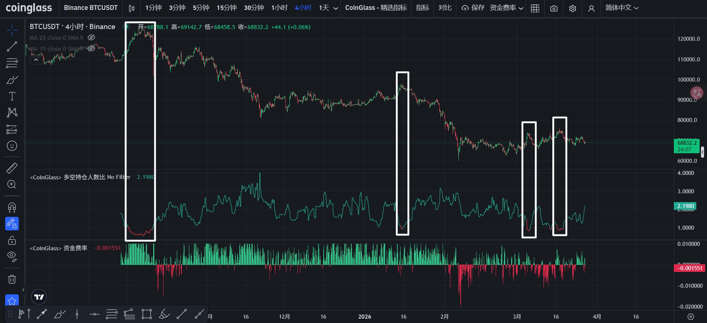
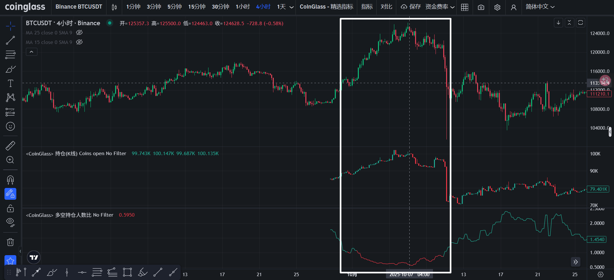
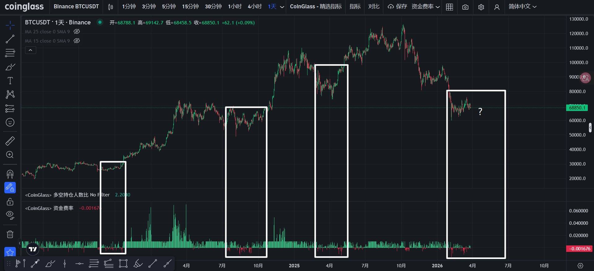

# 利用持仓人数比与资金费率识别 BTC 反转区间

## 原文附图

- 作者：`@CryptoRounder`
- 原文链接：`https://x.com/CryptoRounder/status/2037426051803206120`
- 说明：这篇长文正文里确实附带了 3 张图，之前 `twitter article --markdown` 没把它们渲染出来，但原始 article 数据里能解析到。

### 图 1：多空持仓人数比



### 图 2：牛市顶部与轧空反转



### 图 3：资金费率



## 主题
这篇文章的主题很明确：**不是预测短线涨跌，而是通过观察市场里“多数人站哪边”，判断 BTC 是否接近反转区间，并据此制定更稳健的应对策略。**

作者的核心观点是：

- 主力常常利用多数人的情绪和仓位，制造反向流动性。
- 当做空或做多的一方变得过于拥挤时，市场更容易朝相反方向走。
- 所以，真正有参考价值的，不只是价格本身，而是谁正在变成“市场的大多数”。

## 作者的判断方法
作者主要看两类指标：

1. `多空持仓人数比`
2. `资金费率`

这两个指标都不是用来精确预测哪一天涨、哪一天跌，而是用来判断：**当前市场是不是已经出现了“某一边过度拥挤”，从而进入潜在反转区间。**

---

## 方法一：看多空持仓人数比

### 作者怎么判断
作者给出的判断逻辑是：

- 观察 Binance 的 `BTCUSDT` 永续合约。
- 当 `多空持仓人数比跌破 1`，说明**做空人数已经多于做多人数**。
- 一旦做空的人越来越多，市场就更容易出现 `轧空`，也就是空头被迫平仓，价格被继续推高。

作者的结论是：

- **当持仓人数比跌破 1 时，往往意味着 BTC 更容易上涨，而不是继续下跌。**
- 因为这代表做空已经开始变成“多数人的方向”。

### 作者进一步怎么理解这个信号
作者不是把这个指标理解成“立刻无脑做多”，而是分成两个阶段：

#### 阶段 1：做空人数过多，容易先发生轧空上涨
也就是：

- 空头拥挤
- 市场向上拉升
- 空头止损
- 价格进一步上冲

#### 阶段 2：轧空完成后，容易转为较大下跌
作者提到，过去半年里，这类情况出现过多次，后面都伴随着不同程度的回落。

他的意思是：

- **当市场因为空头过多而被强行拉升时，这种上涨往往不一定能持续。**
- 一旦轧空结束，情绪转向，市场反而可能进入更大的下跌。

作者还提到，本轮牛市顶部早期就出现过类似过程：

- 做空人数持续上升
- 市场先轧空
- 随后反转
- 最终形成大周期顶部

### 这套判断法可以简化成一句话
**当做空人数明显变多时，先警惕轧空上涨；轧空结束后，再警惕价格反转下跌。**

### 作者对应的应对策略
作者更偏向用 `期权` 来应对，而不是直接上高杠杆合约。

原因很直接：

- 极端行情里，合约容易爆仓。
- 期权即使判断错了，损失也是有限的。
- 市场在轧空和反转阶段波动很剧烈，期权更适合这种不确定但波动很大的环境。

作者给出的策略重点是：

- **当市场经历轧空后，若判断价格可能转弱，可以分批配置不同期限的 `put`。**
- 也就是：不是去硬扛方向，而是提前埋伏市场回落的机会。

### 实战理解示例
可以把作者的思路理解成这样：

```text
多空持仓人数比 < 1
= 做空人数多于做多人数
= 空头开始拥挤
= 短线容易被轧空拉涨
= 轧空结束后，再留意反转下跌
= 更适合用 put 做风险有限的布局
```

---

## 方法二：看资金费率

### 作者怎么判断
作者给出的第二个判断方法是看 `资金费率`。

他重点看的不是某一次短暂波动，而是以下组合特征：

- `资金费率长期偏低`
- `期间反复出现负资金费率`

这代表什么？

- 市场里做空力量正在逐渐增强。
- 看空情绪不是偶发，而是在持续累积。
- 做空一方正在慢慢变成投机市场里的“大多数”。

作者的结论是：

- **当资金费率长期低迷、且不断出现负溢价时，说明做空正在拥挤。**
- **一旦看空成为多数派，反而是看多更有博弈优势的时候。**

### 这套判断法可以简化成一句话
**当资金费率持续偏弱，甚至多次转负，说明空头越来越拥挤，此时要开始站在“少数派”一边，准备偏多思路。**

### 作者对应的应对策略
这一部分，作者给的是一套更具体的组合策略：

#### 策略 1：卖出近期 `put`
适合现金较充足的时候。

作者的逻辑是：

- 既然判断市场处于偏底部或反转区间附近，
- 那么可以卖出近期 `put`，赚取权利金。

#### 策略 2：同时做现货定投
也就是不只做衍生品，而是开始逐步建立现货仓位。

#### 策略 3：把权利金再投入远期 `call`
作者建议：

- 用卖 `put` 收到的票息，去定投更远期的看涨 `call`。
- 这样做的好处是：
  - 近端有收息
  - 中间有现货累积
  - 远端保留上涨弹性

#### 策略 4：如果出现猎杀式暴跌，直接买现货长期持有
作者认为：

- 如果短时间内出现剧烈下砸，
- 这类走势反而可能是更好的长期买点，
- 可以更果断地买入现货，并以长期持有为主。

### 实战理解示例
可以把作者这部分策略理解成这样：

```text
资金费率长期偏低 + 多次转负
= 空头持续拥挤
= 市场可能接近反转区间
= 策略上不追空
= 可卖近月 put 收息
= 同时定投现货
= 用票息买远月 call
= 若出现暴跌，则加大现货配置
```

---

## 作者整套框架的本质
作者真正想表达的，其实不是“看到一个指标就立刻下单”，而是下面这套框架：

- 先判断市场里哪一边正在变成多数。
- 当空头变得拥挤时，不要轻易继续追空。
- 当拥挤空头触发轧空时，要警惕先涨后跌。
- 当资金费率长期显示空头主导时，要开始准备逆向布局。
- 在执行上，优先用 `期权 + 现货` 的组合，而不是单纯靠高杠杆赌方向。

换句话说，作者不是在教“追涨杀跌”，而是在教：

**当市场多数人越来越一致时，反而要开始寻找站在少数一边的机会。**

## 最直接的总结

### 作者的判断方法
- 看 `多空持仓人数比` 是否跌破 `1`
- 看 `资金费率` 是否长期偏低、并反复出现负值
- 如果这两个信号都在说明“做空越来越拥挤”，就说明市场可能正在接近反转区间

### 作者的应对策略
- 不盲目追空
- 提防先发生 `轧空上涨`
- 轧空之后，再留意市场反转下跌
- 用 `期权` 替代高杠杆合约控制风险
- 具体上可考虑：
  - 分批配置不同期限的 `put`
  - 卖近期 `put` 收息
  - 同时定投 BTC 现货
  - 用票息定投远期 `call`
  - 暴跌时加大现货长期配置

## 一句话结论
**作者的核心方法是：用“持仓人数比”和“资金费率”识别空头是否过度拥挤；一旦空头成为多数，就开始准备反向思路，并优先用期权和现货组合来应对市场的反转与大波动。**

## 来源
- 作者：`@CryptoRounder`
- 原文链接：`https://x.com/CryptoRounder/status/2037426051803206120`
- 发布时间：`2026-03-27`
