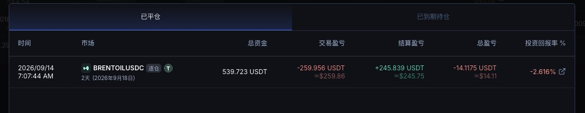
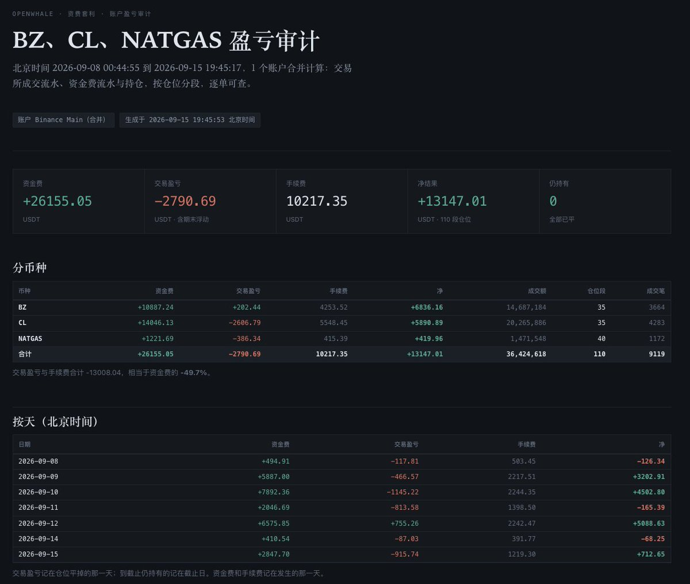

# 原油换月套利复盘：Boros费率择时、单所结算抢跑与收益口径

## 原文信息

- 作者：0xJA | Whale.Dance 🐳（@JXiaoLoong）。
- 原文：[《原油换月，狂赚 13000u》](https://x.com/JXiaoLoong/status/2099983057306751279)。
- 发布时间：北京时间 2026-09-16 06:05；文章数据标记最后修改于同日 14:54。
- 内容类型：套利 / 执行复盘，兼有工具推广。涉及 Boros、OpenWhale 与 WhaleDance 的 Oil Master。
- 归档：[正文、配图与可见回复](sources/jxiaoloong-2099983057306751279-oil-roll-funding/original.md)；[元数据](sources/jxiaoloong-2099983057306751279-oil-roll-funding/meta.json)；[文末两篇关联旧文的文字快照](sources/jxiaoloong-2099983057306751279-oil-roll-funding/linked-context.md)。保存封面、7 张正文图与 1 张作者回复图；其他历史嵌入推文保留链接。

## 主题

作者复盘了同一次原油换月中的三种不同仓位：Boros 上交易未来资金费率、单交易所临近资金费结算时快进快出，以及长期持有的 BZ / CL 价差组合和额外 BZ 空头。可迁移的经验是区分各策略的收益来源、隔离执行仓位，并把交易损益、资金费和手续费合并核算。

标题的约 1.3 万 USDT 对应一个账户的阶段性结算套利审计，包含天然气，并非所有原油相关仓位的整体净利润。正文明确披露，另有方向敞口亏损和约 4,000 USDT 的资金费损耗。

## 一、Boros：交易的是费率路径

按作者的解释，做多 YU 收取浮动费率、支付约定固定费率；做空 YU 则反向。因而在负费率环境中，做空 YU 是否盈利，取决于实际费率是否比建仓固定费率更负；“看到负费率就做空”缺少对入场价格的判断。

例如按原文的简单年化口径，空头锁定 -100%，实际费率在周末回到约 0，则 1,000 YU 两天的结算损耗约为 `1,000 × 100% × 2 / 365 ≈ 5.48 USDT`。若保证金仅 50—60 USDT，保证金回撤就接近一成。年化费率与保证金收益率不是同一个量，且截图使用 APR / 年化利率，原文多称 APY，不宜把这些数值直接当复利年收益。

### 作者这次的时序

| 阶段 | 作者观察与操作 | 收益机制及限制 |
|---|---|---|
| 换月前 | 9 月 4 日隐含年化从约 -15% 跌至接近 -100%，认为入场过贵；等待 9 月 5—6 日周末 | 周末实际费率趋近零，低固定费率的 YU 空头承担结算损耗；作者推断平空可能使隐含费率回升，未提供订单流验证 |
| 提前建空 | 9 月 7 日凌晨，约 -60% 建立 11,000 YU 空头，称本金约 500 USDT | 押注换月后的实际负费率更极端；按文中列出的换月窗口，此时仍是换月前，尽管该段标题写“换月中” |
| 换月中持有 | 工作日称每小时赚 1—5 USDT；忘记在第二个周末前退出，转为每小时亏约 1 USDT | 收益有显著日历依赖，跨周末持仓会付出成本 |
| 平空 | 9 月 14 日周一约 -80% 自动成交平仓 | 作者遗憾未吃满最后一天费率，但完整单笔净收益无法从汇总图分离 |
| 换月后建多 | 9 月 15 日凌晨结算后，在下个月市场约 -50% 做多；截图为 1,400 YU、成交约 -50.85% | 隐含年化升至约 -4% 时出现约 60 USDT 浮盈，主要是持仓重估，并非已收取三周现金收益 |

作者给出的本次换月窗口为北京时间 **9 月 9 日 05:30 至 9 月 15 日 05:30**。文中关于“每月第 5/6 个交易日”“凌晨 5 点结算后操作”“换月后三天到期”的描述是经验归纳，不能作为以后月份、不同平台的固定交易日历。

### 这套时序依赖什么

作者提出三个前提：非换月期费率大体接近零、近月高于远月的 Backwardation 足够明显，以及 YU 订单簿有可用深度。在此前提下，他尝试把“提前做空 → 周末择机补仓 → 换月结束平空 → 下一期低位做多”串成循环。

其关联旧文把机会解释为：永续参考指数逐渐从近月期货迁移到次月期货，价格跟随、提前布局和拥挤持仓共同影响永续溢价与资金费率。这是作者的机制解释；**期货期限价差大，不自动保证每个平台出现同方向、同幅度的资金费率**，还取决于具体指数和溢价计算方式。

### Boros 收益口径需要保留分歧

作者称约 500 USDT 的空头本金产生约 245 USDT 收益，并解释图中负数是此前交的“学费”。但这张图同一行实际显示：总资金 539.723 USDT、交易盈亏 **-259.956**、结算盈亏 **+245.839**、总盈亏 **-14.1175**、回报率 -2.616%。因此只能确认图中的结算盈利约 245.84，不能将它直接认定为这次空头的已核实净赚 245。

[换月后多头截图](sources/jxiaoloong-2099983057306751279-oil-roll-funding/assets/2099906466232803329.jpg)显示，平仓估算盈利约 60.13 USDT，总盈亏（日开始以来）约 59.61，其中未实现盈亏约 59.47、总结算盈亏约 0.66。它支持“约 60 USDT 浮盈”的说法，不能与已结算收入混称。因此原文“500u 本金打出 300u 收益”混合了作者自述的空头收益和另一笔多头浮盈，未形成可独立复核的统一收益率。

## 二、单所结算套利：净收入要覆盖进出场损耗

作者把原油价差仓位迁至子账户，称支付了 200 多 USDT 手续费，使长期价差策略不再与短时资金费策略冲突。后者是在同一交易所临近结算时进入收取资金费的一侧，结算后尽快退出；并非“多 CL、空 BZ 收费率差”，作者在回复中对此作了明确澄清。

这类交易的核算应是：

`净损益 = 实收资金费 + 开平仓价格损益 − 交易手续费 − 其他执行成本`

获得一次资金费不等于获得等额利润。结算后价格调整、盘口冲击和退出成本会消耗收入，极端时可超过资金费。

截图覆盖北京时间 2026-09-08 00:44:55 至 9 月 15 日 19:45:17，标记 Binance Main 单账户、110 段仓位、已全部平仓：

| 项目 | 截图金额（USDT） |
|---|---:|
| 资金费 | +26,155.05 |
| 交易盈亏 | -2,790.69 |
| 手续费 | -10,217.35 |
| 净结果 | +13,147.01 |
| 其中 BZ 净结果 | +6,836.16 |
| 其中 CL 净结果 | +5,890.89 |
| 其中 NATGAS 净结果 | +419.96 |

资金费、交易损益及手续费按显示精度相加为 13,147.01，原油 BZ 与 CL 合计为 12,727.05。交易亏损与手续费合计消耗约 **49.7%** 的资金费收入；这比只看盈利订单截图更能说明执行成本的分量。分币种数字有分位舍入差异，不能将截图当作原始流水重新审计。

作者称本金约 8 万 USDT、过去三个月类似策略赚近 7 万 USDT，并推测更大资金可赚 3—5 万。这些都是个人自述或容量推测，未附完整资金曲线、全部交易记录及相同条件下的扩容测试。

### 评论区的关键修正

读者质疑“结算后价差通常会亏回去，为什么图上资费和价差似乎都赚”。作者回答：**价差其实没赚，操作不好也会亏很多**，并附 CL 截图：

- 平仓盈亏 -852.22 USDT。
- 资金费用 +2,139.67 USDT。
- 交易手续费 -362.23 USDT。
- 已实现盈亏 +925.22 USDT。

这与账户审计中“主要靠资金费覆盖交易亏损和费用”的结构一致。原文“几乎没有爆仓风险”只能视为作者对自身操作的评价；短持仓仍可能遇到跳价、无法退出和保证金不足。

## 三、价差仓位与方向敞口：隔离账户不等于隔离经济风险

作者长期持有多 CL、空 BZ，并曾留下约 10 万 USDT 的 BZ 额外空头敞口。油价上涨令其出现大额亏损；他原以为两者资金费关系会反转，实际 BZ 费率持续低于 CL，组合仍付费。

[持仓及损益截图](sources/jxiaoloong-2099983057306751279-oil-roll-funding/assets/2099908355196350464.jpg)中，CL 累计资金费用 +9,266.26、BZ -13,618.56，合计 **-4,352.30 USDT**，与正文“约 4ku”相符。但这张图的统计区间并未与短时套利审计对齐，且还有已平与未平损益，不能简单从 13,147.01 减去此数就得出整轮净收益。

[比值面板](sources/jxiaoloong-2099983057306751279-oil-roll-funding/assets/2099907459867693056.jpg)显示 BZ / CL 为 1.0241、常数中心 1.0473、z 值约 -1.99，属于当时的相对价格观察。作者在回复中称反向价差交易是在“赌价差回归”，这承认了其统计交易性质。

其文末旧文曾从比值拟合转向绝对价差，并尝试用运费解释锚；该旧文也承认 3—6 美元运费区间只是价差经验值、没有直接证据。本次截图又采用比值与常数中心，不能假设前后使用相同模型，更不能把中心线当成必然兑现的交割价。

## 风险与限制

1. **费率回归不确定。** 换月节奏、休市安排、期限结构与平台规则变化，都可能改变实际费率路径。原文“非换月费率近零”和“周末建仓窗口”属于本次经验条件。
2. **锁定固定腿不等于锁定独立 YU 仓位收益。** 浮动腿、提前平仓价格、保证金和流动性仍变化。原文“赚三周固定 APY”隐含实际费率接近零等条件。
3. **容量来自退出深度。** 作者承认 Boros 流动性小；传统原油期货市场大，也不代表某个永续合约在结算附近有同等深度。加仓不能按利润线性放大，“无视滑点”尤其缺乏成本约束。
4. **缺少可复现执行参数。** 原文没有完整公开秒级进出场时机、费率阈值、失败率、杠杆管理和异常退出逻辑；它提供复盘思路，尚不是可直接复刻的系统。
5. **持仓冲突与总风险要分别管理。** 子账户能减少策略互相抵消或误平仓，但剩余方向敞口、重复保证金需求和同一平台风险仍要合并计算。
6. **证据范围有限。** 截图来自作者工具或平台界面，未取得交易流水核验；可见回复不等于完整评论区。推广语与收益陈述一并留存，不能据此认定工具具有稳定盈利能力。

## 扩散分析 / 延展思路

以下为基于材料的研究延展，不是作者已经实现或验证的功能。

更有用的自动化起点是把换月日历、目标市场、隐含费率、实际结算费率与可成交深度记录成事件日志，而不是只按日期触发开仓。每笔交易应能回答：当时预期拿多少资金费，进出场共消耗多少，是否真正跨过结算，以及失败来自预测还是执行。

资金费策略、YU 仓位和 BZ / CL 组合宜保留独立损益账，再汇总到同一时间窗口、同一计价单位。YU 单独列出结算损益与重估损益；永续单独列出方向、价差、资金费和手续费。这样才能区分“策略赚钱但组合亏钱”与“只是把亏损留在另一个账户”。

相关笔记：[原油展期套利变卷后：用Boros做多YU捕捉资金费率跳转](原油展期套利变卷后：用Boros做多YU捕捉资金费率跳转.md)、[WTI-Brent价差套利复盘](WTI-Brent价差套利复盘：判断逻辑与应对策略.md)。

## 一句话结论

这份复盘的核心是抓住换月费率的时序差异并隔离执行仓位，但真正应检验的是扣除交易磨损、费用和残余方向风险后的组合净收益。
