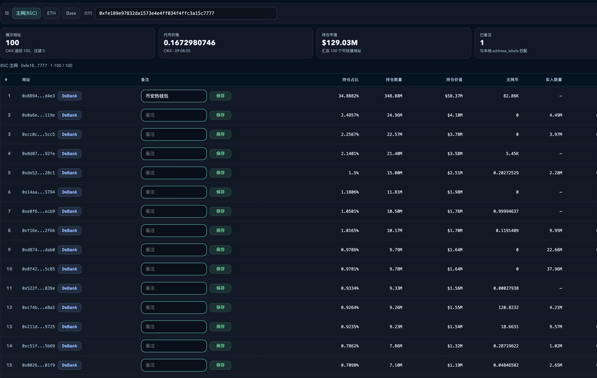

# 套利竞争分层：费率优势、价差区间与交易所执行风控

## 原文信息

- 作者：十年一梦（`@dan326714`）。
- [原推文](https://x.com/dan326714/status/2096771401558692230)：2026年9月7日01:23:52 UTC（北京时间09:23:52）。
- 类型：跨链上与交易所套利 / 从业经验 / 竞争与风控框架。
- 材料：完整长推、1张持仓地址查询面板截图、2个DeBank地址链接。
- [原文与配图](sources/dan326714-2096771401558692230-arbitrage-cost-capacity/original.md) · [元信息](sources/dan326714-2096771401558692230-arbitrage-cost-capacity/meta.json)。归档日期：2026年9月14日。

## 主题

作者认为，套利机会很多，但个人的资金、精力和执行能力有限；关键是选自己能承受且有比较优势的路径。手续费更低、成交更快、库存更足的对手可以长期占据一部分机会，普通参与者的空间往往来自对手容量不足、没配置某个币或临时离线。

这是一份经验观察，既没有完整成交样本，也没有统计验证。文中阈值应作为理解竞争层次的例子，不作为通用开仓参数。

## 费率如何改变竞争起跑线

作者称，低费率现货账户能在其他人的盈亏平衡线附近就执行；同等代码水平也可能打不过。文中的“万2～3”按通常数值含义是0.02%～0.03%，“万6”为0.06%，但没有完整说明费用是单边、双边还是包含其他返佣，不能据此计算确定净收益。

作者还列举合约开平仓滑点、交易所手续费及亏损退出成本。其重点是：看到的价差必须先补偿完成两腿和退出的全部成本，资金效率高也不代表成本低。

## 原文阈值分层

下表仅按原文数值重写。作者没有明确给出“阈值”的价格比方向、报价时点或公式；右列百分比是将其**假设为价格比R**后计算的 `R−1`，不代表可实现利润。原文没有覆盖全部连续区间，本表不补造缺口。

| 原文阈值 | 若为价格比，对应毛价差 | 作者对机会竞争的观察 |
|---|---:|---|
| 1.003–1.006 | 0.3%–0.6% | 部分普通脚本参与，作者称顶级参与者通常不做这一段 |
| 1.008–1.015 | 0.8%–1.5% | 高频机器人竞争强，普通参与者较难捕获 |
| 1.02–1.2 | 2%–20% | 顶级bot、其他参与者和预置库存者都可能参与；对手容量耗尽后会留下空间 |
| 1.2以上 | 20%以上 | 可能涉及强bot、预埋库存或异常事件，应优先检查价差来源 |

对于最后一档，作者另提出“价差大于30%不吃”的个人风控规则。20%是其分类起点，30%是另一个避险阈值，两者不能混为一谈；也不能反推30%以内就安全。

## 机会来自哪里，代价由谁承担

作者描述的优势可以拆成三类：成本优势让人能吃更薄的价差，速度优势让人先拿到新机会，库存优势让人在别人来不及转币时先成交。

库存预置并不免费。把币提前放在链上或交易所，意味着等待期内要承担价格变动、对冲、资金占用和资产可转移性风险。因提现时间不足而出现的价差，未必能等转币完成后仍然保留。

作者举“强对手满仓或离线”说明机会偶尔会向外溢出。这不能推导为只要等高手休息就能稳定赚钱，也没有证明大价差必然比小价差更好做。

## 配图与地址：可供观察，不是绩效证明



截图显示BSC/ETH/Base切换、合约查询、OKX返回的地址列表、持仓数量/占比/市值、本地备注和DeBank跳转。它对应作者所说的通过地址数据学习参与者行为；图中没有已实现净收益、双腿执行记录或代码，因此不能据截图验证机器人利润与风控能力。

作者列出的观察地址：

- [0x157a…498f9f](https://debank.com/profile/0x157a82eaa7ecd25328aeca1b901f82e886498f9f)
- [0xe047…8c448b3](https://debank.com/profile/0xe04723b83fc521a5bc5b707ca0f15e2108c448b3)

作者推测这些bot的交易所侧会拆单，并赞赏其风控和滑点管理。本次仅保存地址引用，未核验身份、交易所账户、双腿匹配或完整盈亏；“应该会拆”保留为推测。

## 作者回复与评论分歧

已通过twitter-cli补抓相关可见回复，原文见[回复归档](sources/dan326714-2096771401558692230-arbitrage-cost-capacity/replies.md)。

作者在[后续回复](https://x.com/dan326714/status/2096839614782951685)中说明，自己已经减少套利，转向新币和资源机会，自动化LP仍在进行中。这说明主帖是转移重心后的经验分享，不能把它当成其正在持续执行的策略说明或已完成LP系统的证明。

对高价差的分歧值得保留：[@0x0_zero](https://x.com/0x0_zero/status/2096807496929468489)认为，如果能快速判断是否为黑客抛售，大价差仍是重要利润来源；[@0xxiaoyuge](https://x.com/0xxiaoyuge/status/2096855554283217197)则表示，等追查筹码来源后机会往往已经消失。两者共同揭示了安全核查时间与机会寿命的冲突，但未验证任何固定阈值安全。

## 风险与限制

- **阈值定义不完整。** 不能确定报价方向、深度、成本和时间同步口径，无法直接复刻。
- **费率与状态依赖账户。** 文中的历史VIP/佣金经验不等于当前公开费率，也不能迁移到所有参与者。
- **两腿存在时间差。** 链上成交与交易所对冲不能默认原子完成；另一腿滑点、深度不足或失败会改变结果。
- **大价差可能反映资产异常。** 攻击抛售、转账限制、暂停充提、代币机制和标的错配都可能让表面收敛无法实现；原文并没有针对个案完成取证。
- **缺少可检验样本。** 对手行为、阈值区间和指定bot能力均属作者经验描述，不当成全市场统计规律。
- **评论范围有限。** 完整回复获取状态见元信息；没有拿到的作者补充不被视为不存在。

## 扩散分析 / 延展思路

以下是归档者延展，不是原文的收益公式。

可把候选路径按自己的全成本重新排序：

```text
估计净优势 = 可成交毛价差
           − 两腿手续费与滑点
           − gas、融资与等待成本
           − 失败或被迫退出的预期损失
```

计算时使用实际数量对应的可成交报价，并记录资金占用时间和单腿风险。这样才能把“对手没做”与“自己做得了”区分开，避免将他人放弃的高风险库存误认为免费机会。

研究机器人地址时，可以先做链上买卖时间、数量和池冲击的回放，再标明交易所腿不可见的部分；钱包余额、胜率截图或未配对的链上交易不足以还原净利润。

## 一句话结论

套利竞争取决于费率、速度、库存和双腿执行风控，价差大小只是入口，能否在自己的成本与风险约束下完成交易才决定机会是否可用。
