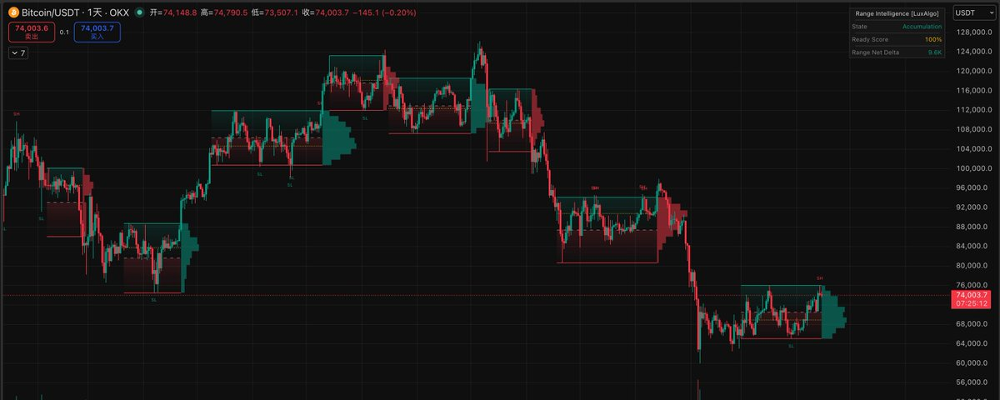
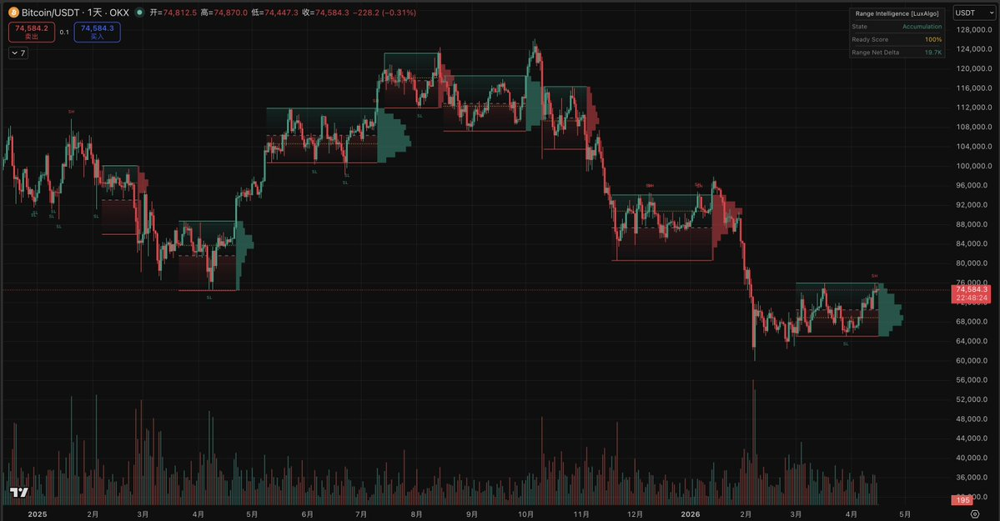
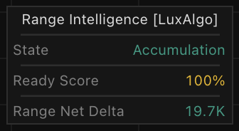
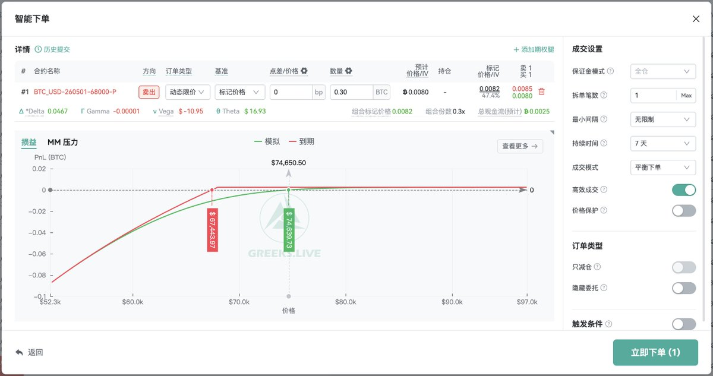
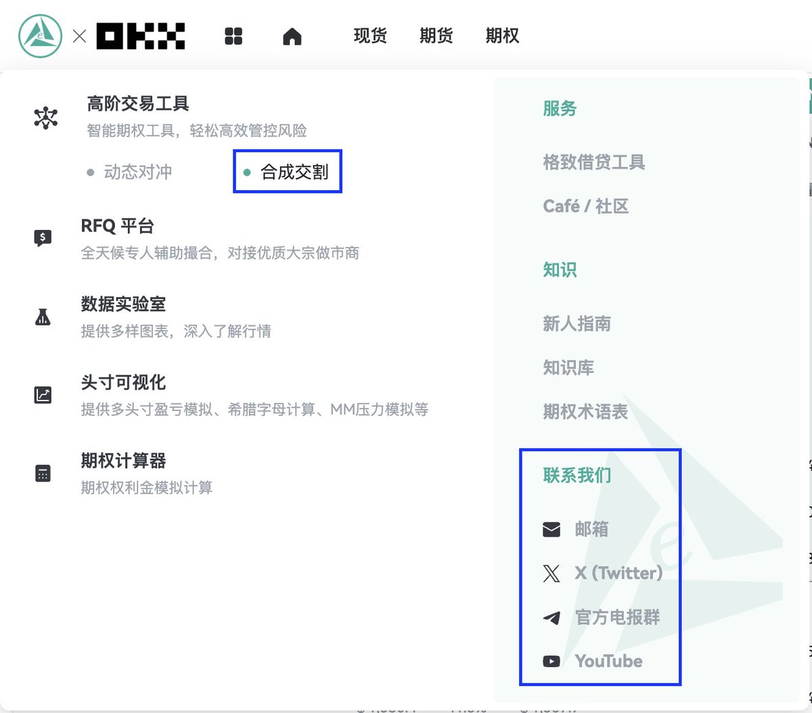
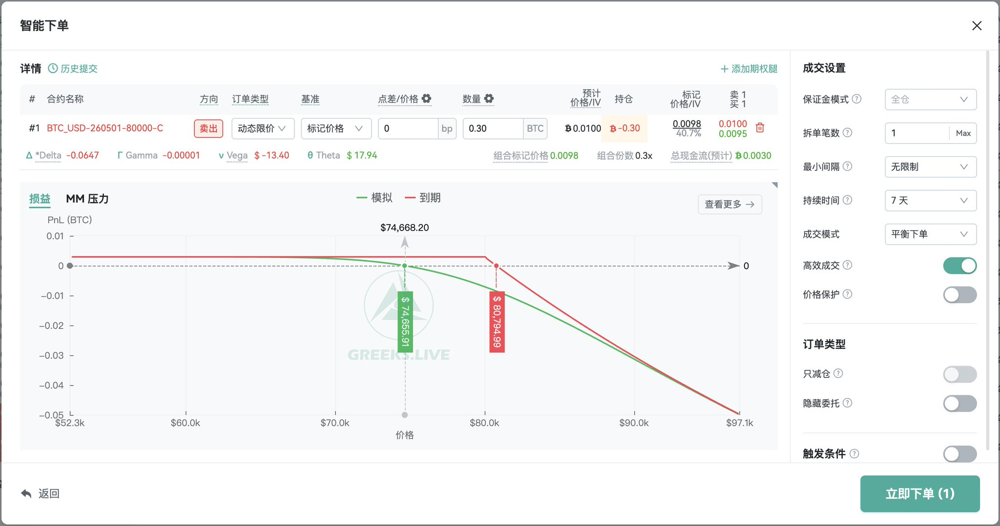
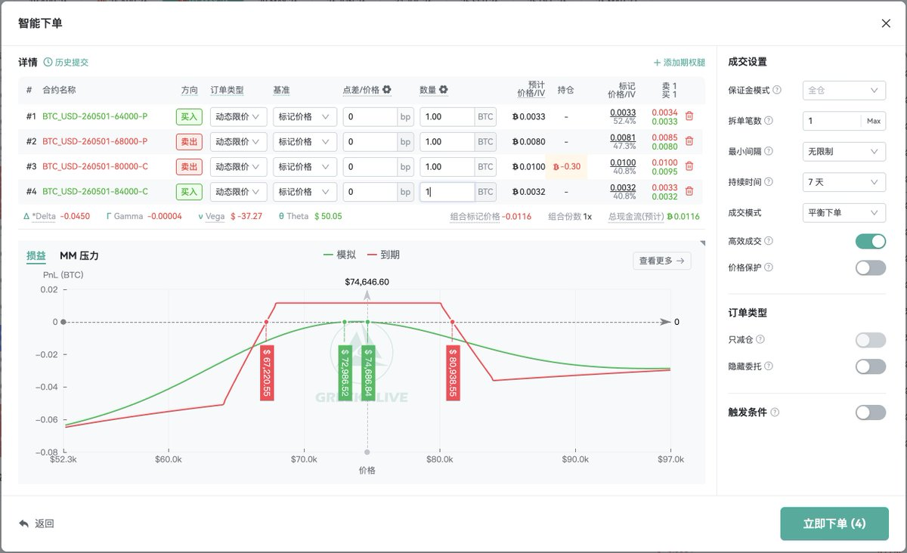

# 比特币震荡期权网格策略：用区间指标执行择时双币与铁鹰

## 原文信息

- 作者：`@CryptoRounder`（Rounder）
- 原文链接：`https://x.com/CryptoRounder/status/2044602594816102612`
- 文章链接：`http://x.com/i/article/2044452853654401024`
- 发布时间：`2026-04-16 10:23`
- 内容类型：X Article + 评论区作者补充
- 是否有配图：有，1 张封面图 + 6 张正文图，已保存到 `sources/cryptorounder-2044602594816102612-btc-options-grid/assets/`
- 原文归档：`sources/cryptorounder-2044602594816102612-btc-options-grid/original.md`

## 原文附图

### 封面图


### 图 1


### 图 2


### 图 3


### 图 4


### 图 5


### 图 6


## 主题

这篇文章在讲：**当比特币越来越成熟、单边趋势占比下降、震荡盘整变成更常见的市场状态时，交易者可以用区间识别指标辅助执行期权网格策略，通过卖 Put、卖 Call 或铁鹰策略赚取时间价值和区间波动的钱。**

作者真正想表达的不是“这个指标能预测 BTC 一定突破”，而是：

- 比特币越来越多时间处在震荡、积累、分配或修复性横盘中；
- 震荡行情下，单纯现货网格很难拿到理想的区间下沿；
- 期权策略可以把“价格在某个范围内停留”转化为收益来源；
- Range Intelligence Suite 可以作为判断区间、压力支撑和蓄势程度的参照；
- 但指标只是交易系统的一部分，仓位管理仍然是第一位。

主帖本身只有一个 X Article 链接，真正正文在文章里。评论区里作者补了两个关键执行点：第一，`Ready Score` 可以用于铁鹰策略的节奏判断，低分开仓，高分止盈或休息；第二，指标只是参考之一，必须结合合理的资金管理才算交易系统。

## 作者的判断方法

### 1. 先判断市场制度：BTC 已经进入“大震荡时代”

作者的出发点是市场制度变化。

他认为，比特币市值越来越大、市场逐渐成熟之后，整体波动率持续下降，行情不再总是早期那种大开大合的单边主升或主跌。

他用 TradingView 手工观察后给出一个估算：比特币震荡、盘整、筑底、分配或修复性横盘的时间比例大约在 `50%-70%`。明确的牛市主升浪或熊市主跌浪，只占较小比例。

这个判断是全文的基础：

**如果大部分时间不是单边趋势，那么只依赖追涨杀跌或方向判断，就会错过大量可以靠区间和时间价值赚钱的行情。**

### 2. 再用 Range Intelligence Suite 识别区间

作者推荐 TradingView 上 LuxAlgo 制作的开源指标 `Range Intelligence Suite`。

他把使用要点压缩成三类信号：

- 红线作为支撑；
- 绿线作为压力；
- 红线和绿线之间形成当前震荡区间。

这一步的作用是给期权策略提供执行边界。

如果没有区间参照，卖 Put、卖 Call 或铁鹰策略容易变成主观拍脑袋；有了区间参照，至少可以把行权价选择和风险边界放到一个可观察框架里。

### 3. 再看突破方向倾向：云朵颜色代表区间结束后的方向预期

作者还提到指标里的云朵：

- 绿色云朵：后续震荡结束后，区间大概率上破；
- 红色云朵：后续震荡结束后，区间大概率下破。

这个信号不是让人直接追突破，而是帮助决定期权网格哪一侧要更谨慎。

例如：

- 如果指标倾向上破，就不要在上方过度卖 Call；
- 如果指标倾向下破，就不要在下方过度卖 Put；
- 如果方向信号不强，才更适合做中性收租结构。

### 4. 最后看 Accumulation / Distribution 和 Ready Score

文章里作者说，右上角信息框会提示当前行情更像积累阶段还是分配阶段，并用百分比表示“蓄势待发”的程度。

评论区里有人问能否用这个指标判断铁鹰策略到期日，作者回答：

**可以参考右上角的 Ready Score，低分开仓，高分止盈 / 休息。**

这句话很关键，因为它把指标从“看图判断”转成了具体执行规则：

- `Ready Score` 低：说明区间可能还没到突破临界点，更适合开中性或收租型仓位；
- `Ready Score` 高：说明区间可能接近变盘，继续持有铁鹰或卖方仓位的性价比下降，应考虑止盈、减仓或休息。

### 一句话总结判断方法

作者的判断链条是：**先承认 BTC 大部分时间处于震荡或盘整，再用 Range Intelligence Suite 找支撑压力、方向云朵和 Ready Score，最后据此决定卖 Put、卖 Call、铁鹰策略是否适合开仓或止盈。**

## 作者的应对策略

### 策略 1：用“择时双币”替代盲目现货网格

作者认为，震荡区间形成后，当下价格未必适合直接做现货网格，因为很难刚好捕捉区间下沿。

他的替代思路是“双币理财式”的期权网格：

- 价格偏区间下沿：通过卖 Put 低买；
- 价格偏区间上沿：通过卖 Call 高卖；
- 如果指标提示某一侧可能突破，就暂停容易被突破的那一侧策略。

这套逻辑的核心不是预测每天涨跌，而是：

**用期权收权利金，把“愿意在低位买入 / 愿意在高位卖出”的意图提前变现。**

### 策略 2：用卖 Put 做低买

作者举例说，当前行情可以通过卖 Put 来进行低买。

这和现金担保卖 Put 类似：

- 如果到期 BTC 没跌破行权价，卖方收走权利金；
- 如果到期跌破行权价，卖方以约定价格接货；
- 如果平台支持“合成交割”，可以把这个过程变成类似低买交割。

这适合本来就愿意在低位接 BTC 的人，而不是适合所有人。

### 策略 3：行情来到压力位后，用卖 Call 做高卖

当行情后续来到压力位，作者建议可以通过卖 Call 做高卖，逻辑与卖 Put 类似。

这可以理解为：

- 如果你持有现货，卖 Call 类似 Covered Call；
- 如果没有现货，卖 Call 风险会明显更高，不应裸卖；
- 如果只想定义风险，可以用 Bear Call Spread，而不是裸卖 Call。

作者原文没有展开这些细节，但从风险结构上看，这是执行时必须补上的边界。

### 策略 4：震荡预期强时，用铁鹰策略收区间权利金

作者把铁鹰策略定义为中性、非方向性策略，适合震荡行情。

铁鹰本质是两个信用价差组合：

- 下方：卖一个 OTM Put，同时买更远 OTM Put；
- 上方：卖一个 OTM Call，同时买更远 OTM Call；
- 四条腿同标的、同到期日。

它的收益来源是净权利金，预期价格到期时留在两个短腿行权价之间。

作者强调，铁鹰最大亏损在建仓时已经锁定，不像裸卖期权那样风险无限。但他也指出，铁鹰是典型低盈亏比策略，所以必须尽可能提高胜率。

### 策略 5：可以先做一边，再补另一边

作者提到，可以只构建“下方”或“上方”，也可以先构建“一方”再构建“另一方”。

这意味着铁鹰不一定要一次性四条腿全部打满，也可以根据价格位置和区间边界分批搭建：

- 价格靠近下沿时，先做 Put Credit Spread；
- 价格反弹到上沿时，再做 Call Credit Spread；
- 如果价格已经接近变盘，则不急着补另一边。

这种方式比一次性开完整铁鹰更灵活，也更贴近期权网格的思想。

## 关键补充

### 1. Ready Score 的用途：低分开仓，高分止盈 / 休息

这条补充直接影响策略执行。

如果只看正文，会知道指标右上角有“蓄势待发”的百分比，但未必知道怎么用于铁鹰策略。评论区作者明确给出用法：

```text
Ready Score 低 = 更适合开仓
Ready Score 高 = 更适合止盈或休息
```

这说明作者不是把高分理解成“机会更大”，而是把高分理解成“变盘风险更接近”。对铁鹰这种短 Gamma、怕突破的结构来说，高分不是加仓信号，而是风险提示。

### 2. 指标只是参考，资金管理才构成系统

另一个评论问作者是不是只关注指标认为现在是积累阶段。作者回答：算是参考之一，结合合理资金管理就是不错的交易系统。

这句话的重点是：

**指标不能单独构成策略。**

它只能帮助判断市场状态，真正决定策略能否活下来的，是行权价、到期日、仓位比例、止盈止损、是否接受交割，以及遇到突破时如何处理。

## 风险与限制

### 1. 震荡占比高，不等于下一段一定震荡

作者估算 BTC 震荡期占比 `50%-70%`，这有助于解释期权网格为什么有市场基础。

但交易上不能把历史占比直接当作下一段行情判断。BTC 的趋势行情往往少而猛，一旦真正突破，卖方策略可能在很短时间里把此前多次收租收益吐回去。

### 2. Range Intelligence 是参照系，不是价格保护

红线、绿线、云朵和 Ready Score 都是指标输出，不是订单簿里真实存在的保护墙。

真正执行时还要结合：

- 隐含波动率是否足够高；
- 期权买卖价差是否可接受；
- 到期日是否覆盖事件风险；
- 永续资金费率、现货流动性、宏观事件是否支持震荡假设。

如果只看指标线位，不看期权定价，期权网格会变成“用复杂结构包装方向判断”。

### 3. 卖 Put 的风险是接货后继续下跌

卖 Put 看起来像低买，但真正风险在于：

- 到期跌破后必须接货；
- 接货后可能继续下跌；
- 权利金只能缓冲一小段亏损；
- 如果仓位过大，可能变成被动抄底。

所以卖 Put 应该只用于本来愿意持有 BTC、且有现金或保证金准备的人。

### 4. 卖 Call 的风险是错过上行或裸卖爆仓

如果卖 Call 是 Covered Call，主要风险是上行收益被封顶；如果是裸卖 Call，则 BTC 向上突破时风险极大。

在作者的框架里，如果绿色云朵和 Ready Score 都提示上破风险上升，就不应该继续在上方卖 Call。

### 5. 铁鹰策略亏损有限，但低盈亏比要求高胜率

铁鹰的优点是最大亏损在开仓时确定，但这不代表容易赚钱。

铁鹰通常是：

- 单次盈利较小；
- 单次亏损较大；
- 胜率必须足够高；
- 不能频繁在突破前开仓。

这也是为什么作者在评论区强调 Ready Score：高分时继续开铁鹰，等于在区间快要结束时去卖保险。

### 6. 平台与执行风险不能忽略

作者提到可以用 `glvs.ai` 连接 OKX 或 Deribit API，自动挂单、设置条件单。

这类自动化执行有便利性，但也带来额外风险：

- API 权限管理；
- 条件单触发失败；
- 极端行情下滑点扩大；
- 期权盘口流动性不足；
- 平台功能和交易所交割规则理解错误。

策略纸面结构清楚，不代表实盘执行没有摩擦。

## 扩散分析 / 延展思路

### 1. 更保守版本：只做现金担保卖 Put

如果投资者主要目标是低位接 BTC，可以只做卖 Put，不做卖 Call 和铁鹰。

执行逻辑是：

- 只在价格接近区间下沿、Ready Score 较低时卖 Put；
- 行权价选在自己愿意接货的位置；
- 每次只用一部分现金担保；
- 被行权后就把它当作低位买入，而不是急着修复亏损。

这个版本收益较低，但更适合长期愿意持有 BTC 的人。

### 2. 中性版本：用分层 Iron Condor 做期权网格

可以把铁鹰拆成多组小仓位，而不是一次性满仓：

- 第一组放在当前区间外沿；
- 第二组等价格靠近某一侧后再补；
- 每组到期日错开；
- Ready Score 上升时逐步减仓。

这更像“期权版网格”，收益来自多次收权利金，而不是单次重仓押一个区间。

### 3. 更激进版本：突破前停止卖方，转为买方价差

如果 Ready Score 很高、云朵方向明确，卖方策略可以暂停，转而用定义风险的买方价差参与突破：

- 倾向上破：Bull Call Spread；
- 倾向下破：Bear Put Spread；
- 不确定方向但预期波动扩大：Long Strangle 或 Long Straddle，但要注意 IV 是否过贵。

这不是作者原文策略，而是基于他“高分止盈/休息”逻辑的延展：当区间收租赔率下降时，不一定只能空仓，也可以换成有限风险的突破结构。

### 4. 加入期权 IV 过滤器

作者主要用价格区间指标做参照，但期权策略还需要看 IV。

一个更完整版本可以加入：

- IV Rank / IV Percentile；
- 近远月 IV 期限结构；
- 期权成交量和买卖价差；
- 实现波动率与隐含波动率差值。

只有当 IV 给出的权利金足够覆盖突破风险时，卖方网格才有更合理的赔率。

### 5. 迁移到 ETH 或高流动性山寨

这套框架可以迁移到 ETH，甚至部分期权流动性较好的高波动标的，但前提是：

- 期权市场有足够深度；
- 行权价和到期日选择足够丰富；
- 现货或永续对冲容易执行；
- 标的不会因单一事件突然失去流动性。

对流动性差的山寨币，不建议直接照搬铁鹰或卖方网格，因为盘口滑点和尾部跳空会吞掉模型收益。

## 一句话结论

这篇文章的核心是：**在 BTC 越来越常见的震荡环境里，用 Range Intelligence Suite 识别区间和变盘风险，再通过卖 Put、卖 Call 或铁鹰策略把“价格留在区间内”的时间价值变成收益，但真正决定成败的是 Ready Score 退出纪律和仓位管理，而不是指标本身。**
