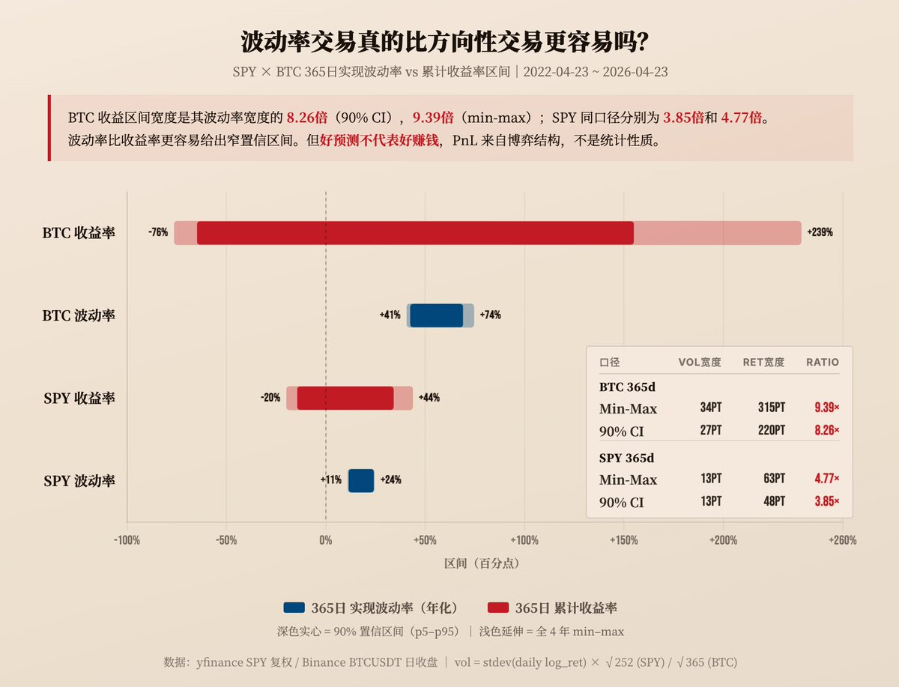

# 波动率交易比方向更容易吗：SPY与BTC的可预测性对比

## 原文信息

- 作者：`@leifuchen`（leifu _/）
- 原文链接：`https://x.com/leifuchen/status/2048394252632162353`
- 发布时间：`2026-04-26 21:30`
- 内容类型：普通 X 推文 + 评论区作者补充
- 是否有配图：有，1 张图，已保存到 `sources/leifuchen-2048394252632162353-vol-vs-direction/assets/`
- 原文归档：`sources/leifuchen-2048394252632162353-vol-vs-direction/original.md`

## 原文附图

### 图 1

## 主题

这篇内容在讲：**相对于方向性收益，波动率本身的变化区间更窄、更稳定，因此从统计上更容易判断；而这一点不只成立于 `SPY` 这类成熟市场，在波动更大的 `BTC` 上反而更明显。**

作者真正想表达的不是“做波动率天然比做方向更赚钱”，而是：

- 你在做方向交易时，面对的是一个极宽、极噪声化的结果分布；
- 你在看波动率时，面对的是一个更集中、更稳定的变量；
- 所以波动率更适合做仓位、风控和回撤约束；
- 但好判断不等于有 edge，因为如果全市场都知道它更好判断，价格里也会更快反映；
- 真正决定你能不能赚钱的，还要看对手是谁，也就是你在什么市场、什么桌子上玩。

作者最后借 `SPX` 与 `BTC` 期权市场的参与者结构，给出一个更实际的落点：

**统计上波动率比方向更容易判断，结构上 BTC 期权市场又没那么拥挤，所以它对非顶级机构玩家可能比 SPX 更友好。**

## 作者的判断方法

### 1. 先引用 Kris Abdelmessih 的核心命题：波动率比收益率更稳定

作者引用 `Kris Abdelmessih` 的原始观点：

- 波动率的变化范围比收益率窄得多；
- `90%` 置信区间也窄得多；
- 因此，如果你的目的是做风险预算、仓位控制、回撤管理，波动率比方向性收益更适合做决策输入。

这不是一个交易信号，而是一个统计分布上的比较。

换句话说，作者不是在说“波动率一定有 alpha”，而是在说：

**如果你只能选一个更稳定、误差更小、区间更可控的变量做决策，波动率通常比收益率更好。**

### 2. 再把这个命题搬到 BTC 上验证，而不是只停留在美股

作者真正扩展的地方，是把 `Kris` 的命题从 `SPY` 搬到了 `BTC`。

他用过去 `4 年` 的数据，同时计算了：

- `SPY` 的收益率区间和波动率区间；
- `BTC` 的收益率区间和波动率区间；
- 以及两者对应的 `90%` 历史落点范围。

这里的关键不是精确建模，而是比较两个变量的“可压缩程度”。

如果收益率的区间远宽于波动率区间，说明你在做方向判断时，面对的结果空间更散、更难控；反之，波动率变量更像一个边界清晰的对象。

### 3. 结果显示：在 SPY 上成立，在 BTC 上更成立

作者给出的核心结果有两组。

对于 `SPY`：

- 收益区间比波动率区间宽 `4.77` 倍；
- `90%` 置信区间为 `3.85` 倍。

对于 `BTC`：

- 收益区间比波动率区间宽 `9.39` 倍；
- `90%` 置信区间为 `8.26` 倍。

这意味着什么？

- 在 `SPY` 上，波动率比方向性收益更可控，这点成立；
- 在 `BTC` 上，这个差异不仅成立，而且放大了一倍左右。

所以作者的结论不是“BTC 更乱，所以波动率也更难判断”，而恰恰相反：

**BTC 虽然价格波动更大，但收益率这个变量变得更不稳定，于是相对而言，波动率的可判断性优势更明显。**

### 4. 绝对波动率更高，不代表波动率自身的相对不确定性更高

作者又拆了一层，避免一个常见误解：

- `BTC` 的波动率绝对水平确实远高于 `SPY`；
- 但这不代表 BTC 波动率本身比 SPY 的波动率更“飘”。

他给出的中位数与区间是：

- `BTC` 波动率中位数约 `50%`
- `SPY` 波动率中位数约 `13%`

但如果看波动率自身的高低比：

- `BTC` 在 `41%` 到 `74%` 之间，最高 / 最低约 `1.82` 倍；
- `SPY` 在 `11%` 到 `24%` 之间，最高 / 最低约 `2.20` 倍。

这说明：

- BTC 波动率确实贵；
- 但围绕它自身“正常水平”的波动，并没有夸张到比 SPY 更离谱；
- 它只是站在一个更高的平台上晃动。

所以作者得出的判断是：

**BTC 的波动率水平更高，但波动率作为一个对象，围绕自身中枢的可预测性并没有更差。**

### 5. 最后把统计可预测性和交易可盈利性分开

这是全文最重要的克制之处。

作者明确说：

- 波动率比收益率更容易判断，是统计层面的结论；
- 但 `Kris` 也强调过，好预测不等于好赚钱；
- 因为大家都知道波动率比方向更容易建模，交易对手也会围绕这个事实来定价。

换句话说，**可预测性本身会被市场内生地竞争掉。**

这一步非常重要，因为它避免了一个常见误读：

- “既然波动率更稳定，那我去做卖波就更容易赚钱。”

作者不是这么说的。

他真正想说的是：

- 统计更稳定的变量，更适合拿来做风控与仓位决策；
- 但如果你真拿它去交易，胜负还取决于市场结构和对手质量。

### 6. 市场结构的差异，可能让 BTC 期权比 SPX 期权更适合非顶级机构玩家

作者最后落到一个非常实际的层面：

- `SPX` 期权市场，是全球机构密度最高的股指期权市场；
- 既然所有人都知道波动率更好预测，那这个市场上的对手会非常强；
- 相比之下，`BTC` 期权市场还没有这么挤，留给散户和非顶级机构的空间更大。

评论区里有人把这个意思总结成一句话：**选一张好桌子。**

这句话非常准确，因为它把整条内容从抽象统计学拉回了交易实践：

- 不是哪个变量更好判断就一定好做；
- 而是哪张桌子上的对手更弱、定价更粗、结构更没那么有效。

### 一句话总结判断方法

作者的判断链条是：**先接受 Kris 关于“波动率比收益率更稳定”的统计命题，再用过去 4 年 `SPY` 与 `BTC` 数据验证这种区间差异，随后证明 BTC 虽然绝对波动率更高，但波动率自身并没有同比例更不稳定，最后把结论落到市场结构上：统计优势是否能转成收益，还要看你在什么桌子上跟谁交易。**

## 作者的应对策略

### 策略 1：用波动率做风控和仓位输入，而不是迷信方向预测

作者最明确的可执行启发是：

- 波动率变量更稳定；
- 所以更适合拿来估算回撤、预算风险、控制仓位；
- 尤其在 `BTC` 这种方向极易剧烈摆动的资产上，这个优势更大。

这意味着实战里，与其不断猜下一根 K 线怎么走，不如优先把：

- 预期波动率；
- 波动率分位数；
- 波动率 regime

当成更核心的风险管理输入。

### 策略 2：不要把“波动率更稳定”误解成“卖波一定更容易”

评论区有人直接点到风险：

- 做波动率经常是 10 次里赚 9 次；
- 但最后 1 次尾部行情会把前面都带走。

作者的回应也很清楚：

- 系统性卖出波动率虽然是正期望；
- 但一定要处理好尾部风险；
- 风险形态和双向网格很接近。

这意味着作者并不鼓励无脑裸卖波。

他隐含的策略是：

- 如果做卖波，要把尾部风险作为核心问题；
- 如果做买波，也可以，但前提是你得有靠谱的择时信号。

### 策略 3：方向交易也可以用波动率工具做辅助

作者还补了一句很有用的话：

**方向性交易，也可以配合波动率来控制风险。**

这其实是在说，方向和波动率并不是二选一。

更合理的做法可能是：

- 方向负责给出趋势判断；
- 波动率负责决定仓位大小、止损容忍度、期权保护或杠杆强度。

也就是说，波动率更稳定，不必然要求你变成纯 volatility trader；它同样能作为 directional trader 的风险中枢。

### 策略 4：挑市场结构更友好的桌子

作者最后最实战的一点，就是不只看“变量好不好预测”，而看市场里的人强不强。

如果同样是做波动率：

- `SPX` 上面对的是全球最强机构；
- `BTC` 上面对的是一个更年轻、更没那么完全有效的市场；

那么同样一套统计优势，在 BTC 上可能更容易转化成实际收益。

这就是“选一张好桌子”的含义。

## 关键补充

### 1. 评论区最值得保留的一句：选一张好桌子

这是整条最好的压缩总结之一。

它把作者整条的实战含义说透了：

- 变量更稳定，只是第一层；
- 交易对手强弱，才决定这个稳定性还剩多少可赚空间。

在强对手市场里，你知道的，别人也知道；在没那么拥挤的市场里，统计优势才更可能留下残差。

### 2. 卖波是正期望，不代表散户适合裸卖

作者明确承认系统性卖波是正期望，但马上补了“尾部风险”和“双向网格类似”的风险结构。

这一补充很重要，因为它把“波动率交易”从单一叙事拆成了两类：

- 一类是统计上占优但极怕尾部事件的卖方策略；
- 一类是需要更高信号质量、但凸性更好的买方策略。

这让“做波动率”这件事变得更完整，而不是一句口号。

### 3. 方向交易和波动率交易不是互斥的

作者最后一句提醒，也值得单独保留：

- 不是说你做了方向，就不需要看波动率；
- 恰恰相反，方向交易更应该借助波动率来做风险控制。

这让整条结论从“比较题”变成了“组合题”。

## 风险与限制

### 1. 统计区间更窄，不代表未来会继续稳定

作者用的是过去 `4 年` 的历史统计。

这类比较的局限在于：

- 它是回顾性的；
- 未来市场 regime 一变，区间结构也可能变化；
- 特别是在 `BTC` 这样仍在演化的市场里，参与者结构、ETF 化程度、机构占比变化，都可能改变波动率的行为模式。

所以这个结论更适合当“经验事实”，不适合被当成永恒定律。

### 2. 做波动率最怕的是尾部风险和误把稳定当安全

很多人看到波动率更稳定，就容易推导出：

- 那卖波更稳；
- 那就更容易赚。

但作者评论区自己已经提醒：

- 稳定不等于安全；
- 卖波的分布常常是小赚多次、大亏少次；
- 真正决定成败的是尾部风险处理。

### 3. 买波也不是天然更优，因为择时门槛高

作者给了另一边的限制：

- 如果选择做多波动率；
- 关键就变成信号质量和择时；
- 没有好的入场条件，时间价值和错误 timing 一样会把你磨死。

所以波动率交易不是万能钥匙，只是一个更适合建模和风控的对象。

### 4. BTC 期权市场的“更好桌子”会随着机构进入而变差

作者现在说 BTC 期权市场相对 SPX 更给散户留空间，这很合理；

但这件事本身是动态的：

- 越多人发现这桌子好打；
- 越多机构和专业做市进入；
- 定价越快收敛；
- 留下的 edge 就越薄。

因此这条结论本身也有时间敏感性。

## 扩散分析 / 延展思路

### 1. 更稳妥的理解方式：波动率是更好的控制变量，不一定是更好的盈利变量

如果把这条内容推远一点，最有启发性的理解不是“以后都做波动率”，而是：

- 波动率比方向更适合作为控制变量；
- 但盈利变量未必也要来自波动率本身。

例如：

- 方向交易可以用波动率定仓；
- 套利策略可以用波动率筛选风险预算；
- 组合管理可以用波动率决定保护买入时点。

### 2. 可以把“收益率区间 / 波动率区间”的比较，扩展到更多资产

作者这次比的是 `SPY` 和 `BTC`。

往前一步完全可以扩展到：

- `ETH`
- `MSTR`
- `IBIT`
- 商品期货
- 外汇

这样能更系统地回答：

- 哪些资产更适合做方向；
- 哪些资产更适合做波动率；
- 哪些市场虽然波动率可预测，但桌子已经太挤。

### 3. BTC 期权更友好，不等于一定该做卖方

评论区很容易把“BTC 期权桌子更好”理解成“卖方更好做”，但更好的外推其实是：

- 如果你有信号，买方和卖方都可能受益；
- 真正的关键不是做多还是做空波动率；
- 而是你有没有一套能处理 tail risk 或 timing risk 的系统。

### 4. 可以把作者前面关于 DVOL 和卖波的研究串起来看

这条和作者前面几篇内容其实可以形成一条线：

- `DVOL / RV / VRP` 那篇讲的是：卖波长期有风险溢价，但在压缩；
- `DVOL 高分位买 Put` 那篇讲的是：在特定 regime 里，可以反向做买方；
- 这篇则讲：从更基础的统计分布上看，波动率本身确实比方向更容易判断。

三篇连起来，可以组成一套更完整的波动率框架：

- 波动率是更稳的观察变量；
- 卖波通常有正期望，但越来越拥挤；
- 买波可以做，但得依赖 regime 和 timing。

### 5. 对普通交易者来说，最现实的升级可能不是“做 vol trader”，而是先用波动率管理风险

如果把这条内容降级成最容易执行的版本，未必是直接下场做期权。

更现实的是：

- 先拿波动率来决定方向仓位大小；
- 先学会用波动率做止损和回撤预算；
- 再慢慢决定是否需要期权、网格、卖波或买波结构。

这比一上来就做裸卖或复杂 vol structure 更靠谱。

## 一句话结论

作者真正的结论不是“做波动率一定比做方向赚钱”，而是：波动率比收益率更稳定、更适合作为决策和风控变量，这在 `BTC` 上甚至比 `SPY` 更明显；至于能不能把这种统计优势变成收益，还得看你是在和谁打牌，以及你能不能处理卖波的尾部风险或买波的择时难题。
