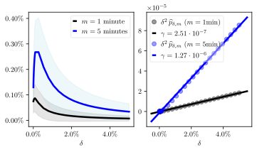
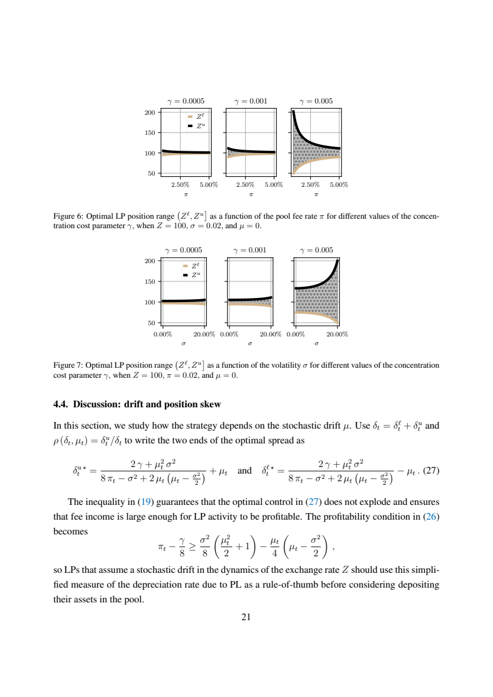

# 集中流动性LP最优区间：可预测损失、手续费覆盖与Gas资金门槛

## 原文信息

- 作者：Álvaro Cartea、Fayçal Drissi、Marcello Monga（Oxford-Man Institute等）。
- 原题：*Decentralised Finance and Automated Market Making: Predictable Loss and Optimal Liquidity Provision*。
- 版本：[arXiv:2309.08431v3](https://arxiv.org/html/2309.08431v3)，2024年6月13日；该版本题头标注将发表于 *SIAM Journal on Financial Mathematics*，本次未另查最终刊发版本。
- 内容类型：集中流动性做市 / 随机控制 / 策略研究。
- 材料：HTML全文、36页PDF、10幅图（11个SVG文件）、4张表及证明附录。HTML标注CC Zero许可。
- 归档日期：2026年9月14日；[原文与图表](sources/cartea-drissi-monga-2309.08431v3-optimal-cl-lp/original.md) · [PDF](sources/cartea-drissi-monga-2309.08431v3-optimal-cl-lp/original.pdf) · [元信息](sources/cartea-drissi-monga-2309.08431v3-optimal-cl-lp/meta.json)。

下文公式编号以用户指定的HTML版本为准；PDF部分公式编号不同。本次核对模型、图表及关键算术，未复现底层链上回测；历史费率、gas和市场结构不作为当前参数使用。

## 主题

论文解决的是：LP应当把流动性放得多窄、向哪个方向偏，以及什么情况下不该提供流动性。

区间收窄提高单位资金的手续费份额，但也放大可预测损失（Predictable Loss，PL），并增加价格出区间后停止赚费的风险。作者把这几项放入自融资财富模型，在对数效用和特定偏斜规则下求出闭式最优宽度。

最有用的结论是先检查手续费是否足以补偿损失，再讨论区间优化。回测的正收益还必须过gas和容量两道关，不能只看费率年化或数学上的最优区间。

## 先区分四个容易混用的概念

| 概念 | 在本文中的含义 | 容易误读的地方 |
|---|---|---|
| 交易费率 `τ` | 每笔swap按成交量收取的固定比例；研究池标注0.05% | 不是LP资金每天收到的收益率 |
| 池费收入率 `π` | 单位时间手续费收入相对于模型池规模的比例 | 会随流量、深度变化，不是固定费率档 |
| 可预测损失PL | 财富动态中随波动与区间宽度变化的负漂移项 | 不是每次交易确定亏损，也不等于全部持仓损益或常见IL数值 |
| 集中风险 | 离散调仓期间价格出区间，造成可赚手续费减少 | 是机会收入损失，模型里的惩罚项不是另付给协议的一笔费用 |

作者将PL与LVR联系起来：两者都关注LP承担的、不能简单靠对冲价格敞口消除的损失成分。但本文分析的是动态调整区间的财富过程，不应把PL、LVR和相对持币的无常损失直接当作同一个统计口径。[原文§3](https://arxiv.org/html/2309.08431v3#S3)

## 财富如何拆分

用 `X` 作为计价资产，`Y` 为风险资产，`Z` 表示一单位Y值多少X，`W` 表示LP投入财富。设总宽度 `δ = δᵘ + δˡ`，风险资产价值占比 `ρ = δᵘ/δ`。

作者在忽略用于简化推导的再平衡成本项时，将财富动态写为：

```text
dW/W = [ (4π − σ²/2)/δ + μρ − γ/δ² ] dt + σρ dB
```

各项分别对应：

- `4π/δ`：区间内的手续费收入率；窄区间提高流动性深度份额。
- `−σ²/(2δ)`：PL的损失率；波动越大、区间越窄，损失越大。
- `−γ/δ²`：对出区间收入损失的近似惩罚；区间过窄时增长更快。
- `μρ`与`σρ dB`：持有风险资产所带来的预期收益和价格风险。

这里的γ需要根据波动与调仓频率估计，不能跨池、跨链、跨频率固定照搬。原文用不同宽度下的历史实际手续费拟合γ；模型中的费收入近似式在极窄区间甚至可能给出负值，不能当成真实协议会收负手续费。[原文式9、13、19](https://arxiv.org/html/2309.08431v3#S3.SS2.SSS2)



图3显示，手续费随区间缩窄并非无限上升：窄到一定程度，出区间损失会抵消流动性集中带来的好处。1分钟和5分钟的调仓机制也对应不同拟合参数。

## 最优区间：宽度有闭式解，偏斜先有假设

### 无方向信号时

当 `μ = 0`、`ρ = 1/2`，总宽度的最优解为：

```text
δ* = 4γ / (8π − σ²)
δᵘ* = δˡ* = δ*/2
```

固定其他参数时，池的费收入率上升使区间收窄，波动或集中风险成本上升使区间变宽。当手续费优势接近消失，公式要求的宽度会越来越大。

`π > σ²/8`只是这一无漂移模型的基础覆盖门槛。再考虑总宽度不超过4的可实施极限，得到 `π − γ/8 ≥ σ²/8`；有限上边界还应避开全区间极限。即便满足这些约束，也不能据此保证实际净收益为正，因为还存在价格敞口、交易成本、gas和模型误差。

原文§4.3紧接式35的文字存在系数不一致：由 `4π−σ²/2 ≥ ε` 应得 `π ≥ σ²/8+ε/4`；宽度发散对应 `π`趋近`σ²/8`，不是该段文字中的`σ²/4`。本笔记按式34–36的代数关系整理。[原文§4.3](https://arxiv.org/html/2309.08431v3#S4.SS3)

### 有方向信号时

作者先规定偏斜规则 `ρ = 1/2 + μ/δ`，再优化宽度：

```text
δ* = (2γ + μ²σ²) / [4π − σ²/2 + μ(μ − σ²/2)]
δᵘ* = δ*/2 + μ
δˡ* = δ*/2 − μ
```

正漂移对应向更高价格方向延伸、增加Y的价值占比；负漂移则相反。这不是在所有可能的上下边界组合中无约束求出的全局方案，而是在指定偏斜函数、对数效用、盈利条件等假设下的解。主回测实际设 `μ=0`，并未展示可交易预测信号的样本外增益。[原文§3.2.3与定理1](https://arxiv.org/html/2309.08431v3#S4.SS2)

### 从模型宽度换成真实价格

```text
Z下界 = Z × (1 − δˡ/2)²
Z上界 = Z / (1 − δᵘ/2)²
```

δ是在平方根价格上定义的控制量。只有区间很窄时，它才近似为完整区间的相对价格宽度；不能把δ直接当成上下各自的百分比。上下边界还需要映射到实际tick并检查可实施性。σ、π和μ必须使用一致的时间尺度与小数单位。



图6、7分别固定其他参数，说明费收入率上升使区间收窄、波动上升使区间变宽；并不代表真实市场里流量、波动和竞争深度互相独立。

## 回测做了什么、没做什么

| 项目 | 原文设置 |
|---|---|
| 数据池 | Uniswap v3 ETH/USDC，正文与附录标注0.05%交易费率 |
| 全部历史描述 | 2021-05-05至2022-08-18 |
| 策略测试期 | 2022-01-01至2022-08-18 |
| 调仓方式 | 每分钟重新确定宽度，下一分钟保持区间固定 |
| 参数估计 | 使用之前1天数据；1分钟对数收益标准差乘√1440作为日波动率 |
| 费收入率 | 过去1天手续费除以当前活跃深度构造的模型规模 `2κ√Z`；不宜直接换成网页显示的总TVL |
| γ | 采用文中回归方法，测试设为 `5×10⁻⁷` |
| 信号 | `μ=0`，对称策略 |
| 模拟次数 | 331,858次一分钟LP操作 |
| 成本 | 计交易费和执行成本；主要结果不计gas |

下一分钟的仓位价值变化使用模型式9，手续费则按落在区间内的实际交易与流动性份额计算。它包含历史成交回放，但不等于完整复制每个区块、tick和执行失败的链上实盘。[原文§5.1](https://arxiv.org/html/2309.08431v3#S5.SS1)

### 表3：统一一分钟口径

| 策略 | 仓位价值变化均值 | 手续费收入均值 | 总表现均值 |
|---|---:|---:|---:|
| 最优策略 | −0.015% | +0.0197% | +0.0047% |
| 历史市场LP | −0.0024% | +0.0017% | −0.00067% |
| 持有资产 | — | — | −0.00016% |

原文报告最优策略每分钟总表现标准差为0.02%。表格中的分项存在四舍五入；最优策略的仓位损失比市场LP更大，但手续费提高更多，体现的是收益和损失同时放大的取舍。

表2另外报告5,156名LP匹配操作的平均总表现约−1.49%，其持有期不同且未按时间归一化；样本为同一LP先提供、后撤回相同深度的操作对，覆盖约66%的LP操作。不能将−1.49%直接和一分钟的+0.0047%作同尺度比较，也不能把历史均值推及全部池子。[原文§5.2–5.3](https://arxiv.org/html/2309.08431v3#S5)

### Gas与容量决定结果能否落地

论文估计历史平均gas：提供流动性30.7美元、撤回24.5美元、调整资产29.6美元，合计每轮84.8美元。用平均一分钟收益估算：

```text
盈亏平衡资金 ≈ 84.8 / 0.000047 ≈ 1,804,255美元
```

这解释了作者约180万美元的门槛，但它只是历史成本、固定频率和线性扩容假设下的平均收支估计，不是当前最低入场资金，更不是保本线。无限加大本金也行不通：LP份额接近上限后，不能赚取超过实际成交支付的手续费。

原文容量举例称平均每分钟成交477,275美元，即使吃下全部流动性份额，手续费也只有1,431美元。按文中0.05%费率计算应为238.6375美元，而1,431美元约对应0.30%；两种口径不一致，应在复现时核验池地址、费率档和成交数据。此处不能直接用1,431美元进行资金容量规划。[原文§5.3与附录A](https://arxiv.org/html/2309.08431v3#S5.SS3)

## 风险与限制

- **优化条件限制。** 对数效用、预设偏斜函数、盈利阈值约束以及连续调仓共同支撑闭式解；“最优”不覆盖任意目标和执行约束。
- **盈利条件是模型假设的一部分。** 池费收入率相对阈值按CIR型过程建模，保证解可用；现实中收入可能跌破阈值，需要明确不入池或退出的处理。
- **参数会一起变。** 常波动率及手续费过程独立性是简化。γ又依赖频率与波动，不能改变调仓频率而保持所有参数不变。
- **链上成本并非常数。** 延迟、队列、gas波动、失败交易、MEV和资产再平衡成本会影响净收益；闭式宽度并未联合优化固定gas与操作时机。
- **容量与反事实影响。** 假设自身活动不改变池的后续动态，可能在大资金集中做市时失效。
- **数据与验证边界。** 单池历史区间、模型估值及选样口径不等于跨市场稳健性；滚动估计有样本外成分，但γ校准窗口的隔离仍应在复现中明确。

## 扩散分析 / 延展思路

以下为归档者延展，不是作者已验证的策略。

最值得先做的是把“手续费能否覆盖损失”做成可回放的研究指标：记录每次入池前的π、σ、γ，随后分开结算实际手续费、持仓变化、交易成本、gas与停留在区间外的时间。这样能判断失败来自池本身、参数估计还是执行。

第二步才是把每分钟固定重置改成事件触发：只有新旧区间的预期收益差足以补偿迁移成本时才操作。这需要重新估计γ、测试等待的出区间代价，并设置最短持有期等约束，不能直接沿用论文的一分钟结果。

仓库中的[主观LP交易思维](主观LP交易思维：Fee覆盖无常、方向区间与撤池风控.md)强调先检查fee能否覆盖损失，这篇论文提供了对应的模型拆分；与[虚空Gamma与做市库存曲线](虚空Gamma与做市库存曲线：固定距离挂单、网格与期权做市.md)对读，则有助于区分区间形状、库存敞口和再平衡造成的损益。

## 一句话结论

集中流动性LP应先确认手续费足以覆盖PL、出区间损失和执行成本，再优化区间；本文的闭式解有研究价值，但回测优势仍受gas、容量及模型假设约束。
